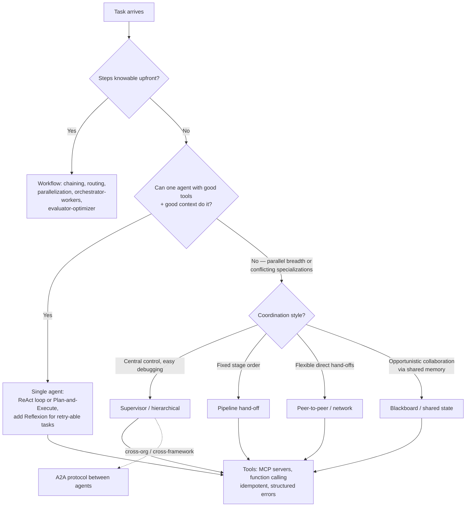

# Domain 1: Agent Architecture and Design (15%)

## 1. Why this matters (exam + real agents)

This is the highest-weighted domain (~9-10 questions) and the one everything else hangs off: before you can evaluate, secure, or deploy an agent, you have to *choose its shape*. The exam tests whether you can (a) name and distinguish the canonical reasoning patterns (ReAct, Reflexion, Plan-and-Execute, router/supervisor), (b) decide when one generalist agent beats a team of specialists — and pick the right multi-agent topology when a team wins, (c) map requirements onto orchestration frameworks (LangGraph, AutoGen/AG2, CrewAI, NeMo Agent Toolkit) and communication standards (MCP, A2A), and (d) design tools the model can actually use safely — schemas, idempotency, error contracts. Questions are scenario-shaped: "given these constraints, which pattern/topology/protocol?" In production, this is the difference between an agent that ships and a demo that loops forever burning tokens.

## 2. Mental model

**Analogy: staffing a construction project.** A *workflow* is a prefab house: every step is known upfront, so you script it — fastest, cheapest, most predictable. An *agent* is a skilled solo contractor: you give them a goal, tools, and a budget, and they figure out the steps (ReAct = work a bit, look at the result, decide the next move; Plan-and-Execute = draft the full blueprint first, then build; Reflexion = redo the wall after writing yourself a note about why it cracked). A *multi-agent system* is a general contractor with subcontractors: supervisor/worker = GC delegates and integrates; pipeline = framing → electrical → drywall in fixed order; peer-to-peer = partners who hand work directly to each other; blackboard = everyone reads/writes one shared whiteboard in the site office. MCP is the standardized power outlet every tool plugs into; A2A is the contract language between firms that never see each other's internal books. The cardinal rule (Anthropic): hire the *simplest* crew that can do the job.



The escalation ladder is the point: **prompt → workflow → single agent → multi-agent**, and every rung up buys capability at the price of latency, cost, and debuggability.

## 3. Core concepts

### 3.1 Workflows vs agents (the Anthropic framing)

- **Workflow:** "LLMs and tools orchestrated through *predefined code paths*." You own the control flow.
- **Agent:** "LLMs *dynamically direct their own processes and tool usage*," gaining "ground truth from the environment at each step" (tool results), with stopping conditions for control.

The five named workflow patterns (know all five — they show up as distractors):

| Pattern | Shape | Use when |
|---|---|---|
| **Prompt chaining** | Sequential LLM calls, each consumes the previous output; programmatic gates between steps | Task decomposes into fixed steps; trade latency for per-step accuracy |
| **Routing** | Classifier LLM directs input to a specialized handler/prompt/model | Distinct input categories handled better separately (also: cheap model for easy queries, big model for hard) |
| **Parallelization** | *Sectioning* (independent subtasks at once) or *voting* (same task N times, aggregate) | Speed, or confidence via diverse attempts |
| **Orchestrator-workers** | Central LLM dynamically decomposes the task and delegates to workers, then synthesizes | Subtasks can't be predicted in advance (vs parallelization's fixed splits) |
| **Evaluator-optimizer** | Generator LLM + critic LLM in a feedback loop | Clear evaluation criteria exist and iteration measurably helps |

It's a **spectrum of "agenticness," not a binary** (Harrison Chase) — production systems mix both: agentic steps inside workflow scaffolding.

### 3.2 Agent reasoning patterns

| Pattern | Loop | Strengths | Costs / failure modes |
|---|---|---|---|
| **ReAct** (Yao et al., 2022) | Interleave **Thought → Action → Observation** every step; next thought conditions on the latest tool result | Grounded in environment feedback; adapts mid-task; reduces hallucinated facts | One LLM call *per step* → latency & tokens compound; can thrash in loops (needs max-step budget) |
| **Plan-and-Execute** | Planner LLM writes the **whole multi-step plan upfront**; executor runs steps; optional **re-plan** on surprises | Fewer big-model calls (planner once, cheap executor); explicit inspectable plan | Plan goes stale if the environment changes mid-run; bad for exploratory tasks |
| **ReWOO** (Reasoning WithOut Observation, Xu et al., 2023) | Planner emits full plan with **placeholder variables** (#E1, #E2) wired between steps; worker fills them; solver synthesizes | Cuts token usage hard — no observation re-fed into planning each step; plan is verifiable before execution | Zero mid-course correction unless you add a re-planner |
| **Reflexion** (Shinn et al., 2023) | Actor attempts → evaluator scores → **self-reflection LLM writes a verbal critique** stored in an **episodic memory buffer** → retry conditioned on past critiques | "Verbal reinforcement learning" — improves across trials **without weight updates**; big gains on code (91% HumanEval pass@1 vs GPT-4's 80%) | Needs a resettable/retryable task + an evaluator signal; more passes = more cost/latency |
| **Autonomous loop** (AutoGPT lineage) | Open-ended goal → agent loops plan/act/observe until it declares done | Maximum autonomy, minimal scaffolding | Maximum risk: runaway cost, derailment; demands budgets, stop conditions, checkpoints, HITL gates |
| **Router** | One classification step dispatches to a specialist (then usually *done* — no return loop) | Cheap, fast, predictable | Single-shot: no iterative delegation or synthesis |
| **Supervisor** | An LLM agent **iteratively** delegates to sub-agents, reviews results, re-delegates, synthesizes | Central control + dynamic decomposition | Supervisor becomes bottleneck & token sink; hand-off games ("telephone") |

**Router vs supervisor** is a favorite trap: a router decides *once* and hands off; a supervisor *stays in the loop*, receiving results and deciding next steps repeatedly.

### 3.3 Single-agent vs multi-agent

Default to **one agent** until it demonstrably breaks. Decompose into specialists when:
- The task is **breadth-first / parallelizable** with independent subtasks (research across many sources) — Anthropic's orchestrator-worker research system beat single-agent Claude Opus 4 by **90.2%** on internal research evals.
- The toolset or instruction set is **too large/conflicting** for one context window (tool confusion, prompt bloat).
- Different steps need **different models/costs/permissions** (cheap drafter, expensive reviewer; sandboxed coder).
- Organizational/team boundaries: different teams own different agents (then think A2A).

Stay single-agent when subtasks are **tightly coupled** and every decision depends on shared evolving context — *most coding tasks* (Cognition's argument: parallel sub-agents make **conflicting implicit decisions**; "actions carry implicit decisions"). Also when the task is low-value: multi-agent systems burn **~15× the tokens of chat** (agents alone ~4×); token usage explained 80% of performance variance in Anthropic's evals — multi-agent must *earn* that spend.

### 3.4 Multi-agent topologies

| Topology | Control flow | Strengths | Weaknesses | Canonical example |
|---|---|---|---|---|
| **Supervisor / worker** (hierarchical when supervisors manage supervisors) | Central supervisor delegates, workers report back, supervisor synthesizes; star-shaped | Single point of control, easy to debug/trace, clear accountability; workers stay simple | Supervisor = bottleneck + single point of failure; context lost in hand-offs; extra hop latency | LangGraph supervisor, Anthropic research system (lead + parallel subagents + CitationAgent), CrewAI hierarchical process |
| **Peer-to-peer / network (swarm)** | Any agent can hand off directly to any other (full or sparse mesh); control travels *with* the hand-off | No central bottleneck; flexible, local decisions; natural for "transfer to the right specialist" | Hard to trace/predict; risk of ping-pong loops; N² communication paths | OpenAI Swarm-style handoffs, LangGraph network architecture, A2A meshes |
| **Blackboard / shared state** | Agents don't message each other; all read/write a **common workspace** and act opportunistically when they can contribute | Decouples agents (add/remove freely); good for ill-structured problems; full shared visibility | Needs concurrency control + a control component deciding who writes when; contention | Classic HEARSAY-II architecture; LangGraph shared-state graphs are a modern blackboard |
| **Pipeline (sequential hand-off)** | Fixed order: each agent transforms the artifact and passes it on | Simple, predictable, easy to test stage-by-stage; per-stage model choice | Rigid; errors compound downstream; no backtracking unless you add loops | Research → outline → draft → edit chains; CrewAI sequential process |

Memorize the **communication axis**: supervisor = hub-and-spoke messages; peer-to-peer = direct messages; blackboard = *no* messages, shared memory; pipeline = one-way baton pass.

**Fifth topology — competitive (judge/merger):** N agents independently produce an answer to the *same* query, then a **judge/merger agent** picks the best or fuses them. This is the multi-agent twin of the **voting** workflow (§3.1) and the **evaluator-optimizer** loop. Strength: higher quality on ambiguous/high-stakes decisions (diversity + adjudication). Weakness: **multiplies cost** (N full solves + a judge) — reserve it for decisions worth the spend. *Trap:* "several agents each answer and a judge selects" → competitive, not supervisor (the supervisor *delegates different* subtasks; competitive runs the *same* task in parallel).

**Multi-agent coordination failure modes (failure-diagnosis questions).** When you do go multi-agent, the exam tests whether you can name the pathology and its fix:

| Failure | Symptom | Fix |
|---|---|---|
| **Cascading failure** | A→B→C; C fails, so B fails, so A fails | **Circuit breakers + timeouts + fallback** at every agent boundary |
| **Infinite delegation loop** | A delegates to B, B delegates back to A, forever ("telephone") | **Max delegation depth counter**; loop detection via request/correlation IDs |
| **Conflicting outputs** | Two agents return contradictory answers | Explicit **conflict-resolution rule**: a judge agent, priority ranking, or domain-authority ("billing agent wins on billing") |
| **State synchronization bug** | Agent reads *stale* shared state before another's write propagates | **Version numbers / optimistic locking**, read-after-write consistency, or a **single-writer** per data domain |
| **Over-decomposition** | 15 agents where 3 would do — every boundary adds latency + failure surface | Start with **fewer, larger** agents; split only on evidence (tool-set size, domain confusion) |
| **God Router** | The router accreted so much logic it's a single agent with extra hops | **Router routes only**; business logic lives in sub-agents |
| **Missing observability** | Can't trace which agent did what | **Distributed tracing** — propagate request/correlation IDs through every hop (NAT's profiler/telemetry) |

**Shared-state strategies** (how multi-agents share context, cheapest→most robust): **message passing** (each message self-contains context — simple, but messages bloat) → **shared key-value store** (Redis-style — fast, but race-condition-prone) → **event sourcing** (append-only event log, replay to reconstruct — auditable, complex) → **CQRS** (Command-Query Responsibility Segregation: writers append to one model, readers query a separate optimized view — e.g. agents emit events while a status dashboard reads a pre-computed projection). The Warehouse Blueprint uses the **shared-data-layer** approach (§4.3).

### 3.5 Orchestration frameworks

| Framework | Core abstraction | Statefulness / control | Distinctives | When |
|---|---|---|---|---|
| **LangGraph** | Agents as **stateful graphs**: nodes (functions/LLM calls) + edges (fixed or conditional) over a typed shared `State`; low-level orchestration with agent abstractions on top. **LangChain/LangGraph hit v1.0 (Oct 2025) → now 1.x**: the agent factory moved to **`langchain.agents.create_agent`** (middleware system); the old `langgraph.prebuilt.create_react_agent` is **deprecated** (removal in v2.0) | **Checkpointing is the headline**: a checkpointer persists state per `thread_id` → resume after crash, human-in-the-loop interrupts, "time travel" replay, durable long-running runs | `add_conditional_edges` for routing, `Command(goto=, update=)` for hand-offs, `Send` for map-reduce fan-out; LangSmith tracing | You need explicit control flow, cycles, persistence, HITL — production default for custom topologies |
| **AutoGen / AG2** | **Conversation-centric**: `ConversableAgent`s (assistant + user-proxy) solve tasks by *talking*; `GroupChat` + `GroupChatManager` for teams | Conversation history is the state; manager selects next speaker | AutoGen 0.4+ rebuilt as event-driven/actor runtime (`autogen-agentchat`); **AG2** is the community fork of classic 0.2 API; strong code-execution agents | Research/prototyping multi-agent chat dynamics, code-gen-and-run loops |
| **CrewAI** | **Role-based teams**: `Agent(role, goal, backstory)` + `Task`s assembled into a `Crew`; `Process.sequential` or `Process.hierarchical` (auto-spawned manager LLM delegates) | Crews are high-level/opinionated; **Flows** add event-driven, fine-grained deterministic control | Standalone (not built on LangChain); fastest path to a role-played pipeline | Quick specialist pipelines where roles map cleanly; less custom control |
| **NeMo Agent Toolkit (NAT)** (open source, fka AgentIQ/AIQ) | **Not a competing framework — a unification layer**: treats *agents, tools, and whole workflows as composable function calls*, declared in YAML | Framework-agnostic: wraps LangChain/LangGraph, CrewAI, LlamaIndex, Semantic Kernel, AutoGen, Agno, ADK agents into one workflow | Built-in agent types (ReAct, Tool-Calling, ReWOO, Reasoning, Router); profiler + `nat eval`; serves/consumes **MCP and A2A** | Compose teams across frameworks, profile/optimize them, expose them as services — NVIDIA's answer to "frameworks don't interoperate" |

### 3.6 Inter-agent communication standards: MCP vs A2A

| | **MCP (Model Context Protocol)** | **A2A (Agent2Agent Protocol)** |
|---|---|---|
| Origin / governance | Anthropic, Nov 2024; **donated to the Linux Foundation's Agentic AI Foundation (AAIF) on Dec 9, 2025** (alongside Block's `goose` and OpenAI's `AGENTS.md`) — now vendor-neutral, no longer "Anthropic's protocol" | Google, Apr 2025; donated to the Linux Foundation; **A2A v1.0 spec (early 2026)** — production-grade with Signed Agent Cards, multi-tenancy, version negotiation; 150+ orgs |
| Connects | An agent/app to **tools, data, context** (vertical: model ↔ capabilities) | **Agent to agent** (horizontal: peer services), across vendors/frameworks/orgs |
| Roles | Host → client → **server**; server exposes **tools, resources, prompts** | A2A **client** agent ↔ A2A **server** (remote) agent; agents stay **opaque** — no shared memory, tools, or internal state |
| Discovery | Client lists tools at connect time (`tools/list`) | **Agent Card** — JSON at `/.well-known/agent-card.json`: `name`, `description`, `url`, `capabilities` (streaming, pushNotifications), `skills`, `securitySchemes`; **v1.0 adds cryptographically *Signed* Agent Cards** for domain verification |
| Wire | JSON-RPC 2.0 over **stdio** or **streamable HTTP** | JSON-RPC 2.0 / gRPC / HTTP+JSON; **SSE** streaming; webhook push notifications |
| Unit of work | A tool call (request/response) | A **Task** with lifecycle: `submitted → working → completed / failed / canceled / rejected`, plus `input-required` & `auth-required` interrupts — built for **long-running** work |
| One-liner | "Gives an agent hands" | "Gives agents a phone line" |

They are **complementary, not competing** — the A2A docs themselves recommend MCP for tools and A2A for agent collaboration. Rule of thumb: if the remote thing is *deterministic capability*, wrap it in MCP; if it's *another reasoning entity* you can't or shouldn't open up (different org/framework, long-running, negotiates), talk A2A. NAT supports both directions for both.

### 3.7 Design trade-offs (the four axes)

| Axis | Tension | Levers |
|---|---|---|
| **Latency vs accuracy** | Every extra thought/reflection/critique step improves quality and adds seconds; ReAct's per-step calls vs ReWOO's one-shot plan | Step budgets; plan-then-execute for known tasks; parallel tool calls (Anthropic: cut research time up to 90%); streaming partial results; smaller models on the hot path |
| **Cost vs capability** | Multi-agent ≈ 15× chat tokens; bigger models per node; more retries | Model cascades (router sends easy → small NIM, hard → frontier); cache/reuse context; cap Reflexion trials; only go multi-agent for high-value tasks |
| **Autonomy vs controllability** | More freedom = handles novelty, but unpredictable paths, harder audits, bigger blast radius | Slide left on the workflow↔agent spectrum for regulated steps; HITL approval gates (interrupts), max iterations, allowlisted tools, sandboxing, checkpoints for rollback |
| **Statefulness vs statelessness** | Long-running, resumable, personalized agents need durable state; stateless agents scale horizontally and replay deterministically | Externalize state (LangGraph checkpointer, DB-backed threads); 12-factor: make the agent a **stateless reducer** over an event log — state lives outside the process; unify execution + business state |

### 3.8 Tool design

A tool = **name + description + JSON Schema parameters** (function calling). The description *is* prompt engineering — the model picks tools by reading it.

- **Fewer, higher-level tools beat many granular ones**: consolidate (`schedule_event` instead of `list_users` + `list_events` + `create_event`); **namespace** related tools (`asana_projects_search`) to prevent confusion in large toolsets.
- **Schemas:** strict types, enums, `required`, `additionalProperties: false`; describe formats with examples ("e.g. 'pay_8x2'"); return *meaningful, token-efficient* context (names not UUIDs; pagination/filtering/truncation defaults; optionally a `response_format: concise|detailed` param).
- **Idempotency:** agents *retry* — networks fail, loops re-fire. Reads should be naturally idempotent; for side-effecting tools (payments, emails, ticket creation) require an **idempotency key**: same key ⇒ server returns the original result instead of repeating the side effect. Never assume exactly-once execution.
- **Error contract:** errors are *model input*, not exceptions. Return structured, in-band errors — `{ok: false, error: {code, retryable, hint}}` — with **specific, actionable** guidance, not opaque codes or stack-trace dumps (12-factor #9: *compact errors into the context window* so the agent can self-correct; but count consecutive failures and escalate to a human instead of looping).
- **Least privilege:** scope each tool (and each sub-agent's toolset) to the minimum needed — this is also the Domain-on-safety hook.

## 4. NVIDIA-specific layer

| NVIDIA piece | Role in this domain | Key facts |
|---|---|---|
| **NeMo Agent Toolkit** (`pip install nvidia-nat`, CLI `nat`; current **v1.7.x**) | THE NVIDIA answer for agent architecture: framework-agnostic library to **build, connect, profile, and optimize teams of agents**. Core idea: *every agent, tool, and workflow is a function call* → composable and reusable across frameworks. **Rename lineage (know this):** Agent Intelligence (AIQ) Toolkit → NeMo Agent Toolkit; pip package `aiqtoolkit`/`agentiq` → **`nvidia-nat`** (old names transitional, slated for removal); namespace **`aiq` → `nat`** | Declarative **workflow YAML** with `functions:` (tools *and* sub-agents), `llms:`, `embedders:`, `workflow:` sections; `_type` selects the component. Built-in agent `_type`s (see §4.1). CLI: `nat run` (execute), `nat serve` (REST/UI endpoint), `nat eval` (Domain 3). Plugins for LangChain/LangGraph, CrewAI, LlamaIndex, Semantic Kernel, AutoGen, Agno, Google ADK. **MCP**: can act as MCP *client* (consume remote tools) and MCP *server* (publish any workflow function as a tool). **A2A**: serve workflows as A2A agents and call remote A2A agents — distributed teams with auth. Profiler captures per-step latency/tokens/bottlenecks |
| **NIM (NVIDIA Inference Microservices)** | The model-serving substrate agents call; **OpenAI-API-compatible** endpoints (`base_url=.../v1`) locally or via build.nvidia.com | In NAT YAML: `_type: nim` with `model_name:`; agent nodes are model-agnostic — swap NIMs without changing the graph. **2026 additions:** post-GTC-2026 catalog added **Rubin-optimized** inference profiles + a free Developer-Program tier (up to 16 GPUs); NIM Operator can deploy NeMo microservices as custom resources |
| **Nemotron models** | NVIDIA's agent-tuned open model family (reasoning toggles, tool calling). Current headline family is **Nemotron 3** (debuted Dec 2025, expanded H1 2026, shown at Computex June 2026): **Nano** ~30B total/~3B active (31.6B/3.2B exact; hybrid Mamba-Transformer MoE), **Super** ~120B/~12B (NVFP4 4-bit on Blackwell), **Ultra** ~550B/~55B (reasoning/planning/agentic flagship; announced Computex June 1 2026), plus **Nano Omni** (multimodal). Earlier *Nemotron Nano 2 / Super / Ultra v1.x (2025)* are now superseded | Typical orchestrator/executor choices in NVIDIA examples (e.g., a Nemotron 3 Nano for cheap sub-agents, Super/Ultra for supervisors/reasoning). Served as NIMs, swappable without changing the graph |
| **NVIDIA AI Blueprints** | Reference *architectures*: prebuilt, customizable agentic workflows (e.g., **AI-Q research assistant** — a NAT-based multi-agent deep-research blueprint; customer-service assistant; vulnerability analysis) | Exam angle: Blueprints = validated starting designs combining NIM + NeMo + NAT, not a runtime component |
| **NeMo microservices** (Customizer, Evaluator, Guardrails, Data Store) | The platform around the architecture: tune the models inside nodes, evaluate workflows, add runtime rails | Architecture domain hook: Guardrails wrap agent I/O; Evaluator/`nat eval` close the loop (Domain 3) |

**Positioning sentence to memorize:** NAT is *not* another agent framework and doesn't replace LangGraph/CrewAI — it's the **connective, observability, and packaging layer** ("framework-agnostic… agents as composable function calls") that lets heterogeneous agents interoperate, get profiled, and be served over MCP/A2A.

### 4.1 NAT built-in agent types (the exam-dense list)

This is where the exam concentrates: NAT ships the reasoning patterns of §3.2 as **concrete, named architecture choices** you select with a single `_type:` line. Memorize the exact `_type` string, the strategy, and the one-line "pick when." A scenario question is usually "given these constraints, which NAT agent type?" — match requirements (latency / accuracy / cost / how dynamic the path is) to the row.

| Agent type | `_type:` | Strategy (one LLM call vs many) | Pick when |
|---|---|---|---|
| **Tool Calling Agent** | `tool_calling_agent` | Single-turn: model reads tool schemas, emits 0-or-more tool calls, returns. No loop. **1 LLM call.** | Task is one step; the query→tool mapping is clear; latency must be minimal. The baseline — start here |
| **ReAct Agent** | `react_agent` | Interleaved **Thought→Action→Observation** loop; re-prompts the model with the full trace each step. **N LLM calls for N steps.** | Multi-step task where each step depends on the *last result*; path is exploratory and must adapt. Set `max_tool_calls` (default 15; `max_iterations` accepted as a legacy alias) or it loops forever |
| **ReWOO Agent** | `rewoo_agent` | Plan-then-execute, **three-node graph** (planner → worker → solver): planner writes the whole plan with placeholder vars (#E1→#E2), worker fills them, solver synthesizes. **~1-2 LLM calls** regardless of step count. | Plan is knowable upfront, no conditional branching; you want to cut LLM calls/latency. Cost: no mid-course correction after a bad/failed step |
| **Reasoning Agent** | `reasoning_agent` | **Wraps another function/agent** and adds an explicit up-front reasoning/plan layer on top of it — it plans *ahead of time* rather than reasoning between steps. *How it differs from ReWOO:* ReWOO **is** the executor (planner→worker→solver, placeholder vars); `reasoning_agent` is a **decorator** that emits a natural-language plan, then hands the *same* task to whatever agent it wraps (often a `react_agent`) to actually execute — so you get "think hard first, then run a normal loop." | High-accuracy / deep-analysis tasks where a richer plan before acting beats step-by-step reaction. Pairs with reasoning-tuned models (Nemotron). More tokens per turn |
| **Router Agent** | `router_agent` | **Dispatch only:** classify the request, hand off to the matching sub-agent, *done* — no return loop, no synthesis. Routing can be **LLM-based or rule-based**. | Multi-domain / intent-based systems: send billing→billing agent, code→code agent. Router adds *indirection, not intelligence* — the smarts live in the sub-agents |
| **Sequential Executor** | `sequential_executor` | **Fixed linear pipeline:** runs the listed functions in order, each output feeding the next; **no decision-making between steps**, always the same order. | Deterministic multi-stage workflows (extract→validate→enrich→store). Use a Router/ReAct instead if any step should be skipped or branched |
| **Parallel Executor** | `parallel_executor` | Fan-out independent branches **concurrently**, then fan-in/merge, with partial-failure handling. | Independent subtasks you can run at once to cut latency (Anthropic's "parallel tool calls cut research time up to 90%" expressed as a NAT primitive) |
| **Responses API Agent** | `responses_api_agent` | **Deployment wrapper, not an execution strategy:** exposes a NAT agent behind the **OpenAI Responses API** format. | Interop with OpenAI-native clients/tooling. *Trap:* it is not a new reasoning pattern — it wraps another agent type |
| **Automatic Memory Wrapper** | `auto_memory_wrapper` | **Wrapper, not a reasoning pattern:** wraps any agent and auto-injects/persists long-term memory (read prior context in, write new memory out) around each turn. | You want an existing agent to gain cross-turn/long-term memory without rewriting it. Like `responses_api_agent`/`reasoning_agent`, it *decorates* another agent — never the answer to "which reasoning strategy" |

**Worked example — same task, three different `_type`s.** Task: "Find France's and Germany's populations, say which is larger, and write a one-paragraph summary."
- `tool_calling_agent` → likely **under-calls**: one round-trip, may answer from parametric memory without doing all the lookups. Cheapest, least reliable for this multi-step task.
- `react_agent` → lookup France → observe → lookup Germany → observe → compute difference → observe → write summary. ~4-5 LLM calls; adapts if a lookup fails; highest token bill.
- `rewoo_agent` → planner emits `#E1=country_lookup(France)`, `#E2=country_lookup(Germany)`, `#E3=calculator(#E1−#E2)`, `#E4=write_summary(#E3)` in *one* call, then executes. ~2 LLM calls. **But** the classic ReWOO failure shows up here: the calculation step depends on prior lookups, so a weak planner may wire placeholders wrong — and ReWOO can't re-plan. That trade (cheap+rigid vs expensive+adaptive) is exactly the exam's point.

### 4.2 NAT pattern decision framework

The reference's decision ladder, in our voice — walk it top-down and stop at the first match:

1. **One tool call enough?** → `tool_calling_agent`.
2. **Full plan knowable before execution?** → yes, and you *don't* need error recovery mid-run → `rewoo_agent`; yes, but later steps may fail/branch → `react_agent`.
3. **Fixed, non-branching multi-stage pipeline?** → `sequential_executor`.
4. **Independent subtasks runnable at once?** → `parallel_executor`.
5. **Multiple distinct domains to dispatch between?** → `router_agent` + specialized sub-agents.
6. **Needs deep up-front reasoning for accuracy?** → `reasoning_agent`.
7. **Default multi-step otherwise** → `react_agent`.

**Single agent w/ many tools vs split into sub-agents (NAT framing):** keep one agent until tool-selection accuracy degrades — empirically that's around **~15-20 tools**, past which the model picks wrong tools. Then put a `router_agent` in front of domain-scoped sub-agents (each a small, focused `react_agent`/`tool_calling_agent`). This is the same single↔multi call as §3.3, expressed in NAT components.

### 4.3 NVIDIA Blueprints — reference architectures (know which patterns each uses)

Blueprints are **validated reference *designs*** (NIM + NeMo + NAT/LangChain wired into a working system), **not a runtime component** — you customize them, you don't "call" them. The exam names specific ones and asks which agents/patterns they combine:

| Blueprint | What it is | Architecture / patterns to remember |
|---|---|---|
| **AI-Q (Enterprise Research Assistant)** | Deep-research agent over enterprise data; built with **LangChain, optimized via NAT** | Orchestrator coordinating **planner + researcher subagents**, each with its own prompt/middleware; **two-tier routing** — common queries take a single tool-calling loop, complex ones enter multi-phase deep-research loops; RAG via **NeMo Retriever**; Guardrails to stop hallucinated citations. The canonical *supervisor/orchestrator-worker* Blueprint |
| **Multi-Agent Intelligent Warehouse** | Warehouse-ops automation with real-time monitoring + NL interface | **LangGraph-orchestrated Planner/Router + 5 specialized agents** (equipment/asset operations, operations coordination, safety compliance, forecasting, document processing); **MCP for dynamic tool discovery**; agents share state through a **common data layer** (PostgreSQL/TimescaleDB + Milvus), not by passing full context in messages; runs **`llama-3.3-nemotron-super-49b-v1.5`** (primary) + **`nemotron-nano-12b-v2-vl`** (vision/document) + **`llama-nemotron-embed-vl-1b-v2`** retriever embeddings (the renamed NeMo Retriever model — formerly `llama-3.2-nemoretriever-…`). The canonical *router→domain-bounded sub-agents* Blueprint |
| **Data Flywheel** | System-level *continuous-improvement* pattern, not an agent topology | Logs production traffic → **NeMo Curator** preps data → **NeMo Customizer** fine-tunes candidates (LoRA/p-tuning/SFT) → **NeMo Evaluator** benchmarks (incl. LLM-as-judge) → auto-surfaces the cheapest model meeting latency/cost/accuracy targets → redeploys. Closes the loop with Domain 3/8 |
| **Retail Agentic Commerce** | Reference impl. of two commerce protocols for shopping agents ↔ merchants | **ACP (Agentic Commerce Protocol)** = shopping-agent↔merchant checkout handshake; **UCP (Universal Commerce Protocol)** = cross-platform standardization so any compliant agent can transact with any compliant merchant. Key idea: **asymmetric trust** — the customer agent *proposes*, the merchant agent *disposes* (accepts/declines, is merchant-of-record); MCP carries the merchant's context bundles. The "agent↔agent across orgs" Blueprint |

## 5. Decision frameworks

**Pattern selection:**

| Requirement | Pick | Why not the others |
|---|---|---|
| Steps fully known, compliance demands predictability | Workflow (prompt chaining + gates) | Agent autonomy adds variance you must then audit |
| Distinct query categories, cost control | Routing (cheap classifier → specialist/model tier) | One mega-prompt handles all categories worse |
| Unknown number/type of subtasks, dynamic decomposition | Orchestrator-workers / supervisor agent | Parallelization needs *predefined* splits |
| Exploratory task, environment feedback changes the path | ReAct loop | Upfront plans go stale |
| Many tool steps, path predictable, latency/token budget tight | Plan-and-Execute / ReWOO | ReAct pays an LLM call per step |
| Retryable task with a checkable success signal (code+tests) | Reflexion loop on top | Without an evaluator signal, reflection is vibes |
| Improve quality against clear criteria | Evaluator-optimizer | Reflexion is the *agent-trial* variant; this is the workflow variant |

**Topology selection:**

| Situation | Topology |
|---|---|
| Need central audit point, simple debugging, dynamic delegation | Supervisor/worker |
| Org of teams: supervisors of supervisors | Hierarchical |
| Fixed transformation stages, testable in isolation | Pipeline |
| Specialists that should hand off directly without a middleman | Peer-to-peer / swarm |
| Many agents opportunistically contributing partial results to one artifact | Blackboard / shared state |
| Agents in different orgs/frameworks, opaque internals, long-running tasks | A2A-connected agents |

**Framework selection:**

| Need | Choose |
|---|---|
| Custom graph topology, cycles, persistence, HITL interrupts, time travel | LangGraph (StateGraph + checkpointer) |
| Multi-agent *conversation* dynamics, code-write-and-execute loops | AutoGen / AG2 (GroupChat) |
| Fast role-based crew, sequential or manager-delegated | CrewAI (Process.sequential / hierarchical) |
| Mix agents from several frameworks; profile tokens/latency; publish over MCP/A2A; NVIDIA stack | NeMo Agent Toolkit |
| Tool/data access standard for any of the above | MCP |
| Agent↔agent interop standard across vendors | A2A |

## 6. Exam traps & gotchas

1. **ReAct vs Plan-and-Execute** — ReAct *interleaves* thought/action/observation each step (adaptive, expensive); Plan-and-Execute commits to a full **upfront plan** then executes (cheap, rigid). "Reduce per-step LLM calls for a predictable task" → Plan-and-Execute/ReWOO, never "more ReAct."
2. **Reflexion ≠ fine-tuning** — Reflexion improves via **verbal self-critique stored in episodic memory across retries**; *no gradient updates, no reward model*. "Improves over trials without weight changes" → Reflexion.
3. **ReWOO's trick is the missing O** — plans with placeholder variables (#E1→#E2), *no observations fed back during planning* → big token savings; the cost is no mid-course correction.
4. **Router vs supervisor** — router classifies and dispatches **once**; supervisor **iterates**: delegate → review → re-delegate → synthesize. "Agent that coordinates sub-agents in a loop" → supervisor.
5. **MCP vs A2A inversion** — MCP = agent↔**tools/context** (client-server, tools/resources/prompts); A2A = **agent↔agent** (opaque peers, Agent Cards, Tasks). They're complementary; "replace MCP with A2A" is always wrong. **Governance gotcha:** *both* protocols are now under the **Linux Foundation** — MCP joined the **Agentic AI Foundation (AAIF)** Dec 9 2025, A2A reached **v1.0** early 2026. Calling MCP "Anthropic's proprietary protocol" or A2A "Google's protocol" as if either were vendor-locked is stale.
6. **Agent Card details** — A2A discovery via JSON at **`/.well-known/agent-card.json`** (name, url, capabilities, skills, securitySchemes); transports JSON-RPC 2.0 / gRPC / REST with SSE streaming. MCP has no agent card — its discovery is `tools/list` after connect.
7. **A2A task states** — long-running lifecycle: submitted → working → terminal (completed/failed/canceled/rejected) with **input-required** and auth-required as *interrupt* (non-terminal) states. "Agent pauses to ask the caller for info" → `input-required`.
8. **Multi-agent ≠ always better** — tightly coupled tasks (most coding) degrade with parallel sub-agents (conflicting implicit decisions — Cognition); plus ~15× token cost. The exam answer often is "stay single-agent / share full context."
9. **Blackboard vs message-passing** — blackboard agents **never message each other**; coordination happens through reads/writes to a shared workspace. If the scenario says "agents communicate via a shared memory store," that's blackboard, not peer-to-peer.
10. **LangGraph checkpointing** = persisting *graph state* per thread (resume, HITL, replay/time-travel) — nothing to do with model checkpoints. Compile with a checkpointer + pass `thread_id`; this is what makes stateful, interruptible agents possible.
11. **Idempotency** — retried side-effecting tool calls must not repeat the effect; fix = **idempotency key** honored server-side (replay returns the original result). "Set temperature=0" or "tell the agent not to retry" are distractors.
12. **Tool errors go back to the model** — structured, compact, actionable errors in-band so the agent self-corrects; raising an unhandled exception (or dumping stack traces) kills or bloats the loop. But cap retries and escalate to humans.
13. **NAT is not a framework competitor** — it *wraps* LangGraph/CrewAI/etc. agents as function calls, profiles them, and serves them over MCP/A2A. "Which NVIDIA component lets a CrewAI agent and a LangGraph agent compose into one workflow?" → NeMo Agent Toolkit.
14. **CrewAI process modes** — `sequential` = fixed task order (pipeline); `hierarchical` = auto-created **manager** LLM delegates (supervisor). AutoGen's signature is **GroupChat** (conversation, manager picks next speaker). Swapping these is a classic distractor.
15. **Autonomy is a dial, not a virtue** — for regulated/high-stakes steps the right answer slides *toward* workflows, approval gates, and step budgets, even though "fully autonomous agent" sounds more advanced.
16. **NAT agent type ≠ reasoning pattern label** — the exam wants the exact `_type:` string. "Plan upfront, one planner call, no observation feedback" → `rewoo_agent`; "loop reasoning each step" → `react_agent`; "single tool round-trip" → `tool_calling_agent`; "fixed pipeline, no branching" → `sequential_executor`; "classify and dispatch once" → `router_agent`. **`responses_api_agent` is a deployment wrapper, not a reasoning pattern** — never the answer to "which reasoning strategy."
17. **Sequential Executor ≠ ReAct** — Sequential Executor runs a *predetermined* chain with **no decisions between steps**; using it for a workflow where a step must be skipped/branched is an anti-pattern (use Router or ReAct). "Some steps should be conditional" rules Sequential Executor out.
18. **Router adds indirection, not intelligence** — the task-solving smarts live in the *sub-agents*. A misclassifying router makes the whole system worse, and a router stuffed with business logic is the **God Router** anti-pattern. Also: routing can be **rule-based**, not only LLM-based.
19. **Competitive ≠ supervisor** — competitive runs the *same* task across N agents and a **judge** adjudicates (expensive, for ambiguous/high-stakes calls); a supervisor *delegates different* subtasks. "N agents answer, a judge merges" → competitive/voting.
20. **Blueprint ≠ runtime component** — Blueprints (AI-Q, Multi-Agent Warehouse, Data Flywheel, Retail Agentic Commerce) are reference *designs* you customize, not something the agent "calls." Know each one's signature: AI-Q = orchestrator + planner/researcher deep-research (RAG); Warehouse = router + 5 domain agents (LangGraph + MCP, shared data layer); Data Flywheel = Curator→Customizer→Evaluator continuous improvement; Retail Commerce = ACP/UCP with merchant-controlled **asymmetric trust**.
21. **Multi-agent failure diagnosis** — match the symptom to the named pathology + fix (§3.4): requests cycling forever → infinite delegation loop (depth counter); one failure topples the chain → cascading failure (circuit breakers); stale reads → state-sync bug (versioning/single-writer); can't tell who did what → missing observability (distributed tracing).

## 7. Scenario drills

1. **A loan-approval flow has five fixed steps and auditors require the same path every time. The team proposes an autonomous ReAct agent. Better call?**
   → **Workflow (prompt chaining with programmatic gates)** — steps are knowable upfront and predictability is a requirement; agent autonomy adds unauditable path variance (autonomy vs controllability axis).

2. **A market-research assistant must scan dozens of independent sources and synthesize; quality matters more than cost. Architecture?**
   → **Supervisor/orchestrator-worker multi-agent** with parallel research sub-agents (each given objective, output format, tool guidance, boundaries) — breadth-first, parallelizable, high-value: exactly where multi-agent earns its ~15× tokens. A coding refactor with tight cross-file coupling would flip the answer to single-agent.

3. **Your ReAct agent reliably executes the same 6 tool steps for a known report task, but latency and token bills are too high. Cheapest architectural fix?**
   → **Switch to Plan-and-Execute / ReWOO** — plan once with placeholder wiring, execute steps without re-invoking the planner each observation; reserve re-planning for failures.

4. **An agent calling `create_ticket` occasionally times out, retries, and files duplicate tickets. Fix?**
   → **Idempotency key in the tool schema, honored server-side** — replayed key returns the original ticket instead of creating a new one; plus a structured error contract so the agent knows the retry semantics.

5. **Two business units — one on CrewAI, one on LangGraph — must let their agents collaborate without exposing internals, including tasks that run for hours. Standard?**
   → **A2A** — opaque peer agents, Agent Card discovery, task lifecycle with streaming/push for long-running work. MCP is the wrong layer (tools/context, not peer agents); NAT can *serve* each workflow over A2A.

6. **A procurement agent must pause for human approval before any purchase >$10k, possibly resuming days later after a crash. Which capability/framework feature?**
   → **LangGraph with a durable checkpointer + interrupt (HITL)** — state persists per `thread_id`, the graph pauses at the approval node and resumes exactly where it left off.

7. **A document-processing job must always run extract → validate → enrich → store in that exact order, no branching, for audit. Which NAT agent type?**
   → **`sequential_executor`** — fixed linear pipeline, no decisions between steps. ReAct would add unneeded variance and cost; ReWOO's planning is wasted when the order is hard-coded.

8. **A support system handles billing, technical, and account queries, each needing different tools and a different safety policy. A single agent now has 30 tools and keeps calling the wrong one. Fix?**
   → **`router_agent` in front of three domain-scoped sub-agents** — splitting past ~15-20 tools restores tool-selection accuracy and lets each domain carry its own policy/model. Keep the router thin (route only) to avoid the God-Router anti-pattern.

9. **A high-stakes triage decision is ambiguous; you want several independent takes and one final call. Architecture?**
   → **Competitive (voting) multi-agent** — N agents solve the same query in parallel, a judge/merger picks or fuses. Accept the N× cost because the decision is high-value; this is the multi-agent twin of the voting workflow / evaluator-optimizer.

10. **A NAT multi-agent app cycles forever — agent A keeps handing the task to B and B back to A — and you can't tell from the logs which agent stalled. Two fixes?**
    → **(1)** a **max delegation-depth counter + loop detection** via request/correlation IDs stops the infinite delegation loop; **(2)** **distributed tracing** (propagate correlation IDs / use NAT's profiler) gives the per-hop visibility you're missing.

11. **Which NVIDIA Blueprint demonstrates continuous improvement of an agent system from production traffic, and what three NeMo microservices drive it?**
    → **Data Flywheel** — production logs flow through **NeMo Curator** (data prep) → **NeMo Customizer** (fine-tune candidates) → **NeMo Evaluator** (benchmark, incl. LLM-as-judge), auto-surfacing the cheapest model that still hits latency/cost/accuracy, then redeploying.

## 8. Builder's corner

- **Climb the autonomy ladder, never jump it:** prompt → workflow → single agent → multi-agent. Anthropic's core advice is to find the *simplest* solution and only add agency when it measurably wins; every rung multiplies tokens, latency, and failure modes.
- **Spend your effort on context engineering before topology.** Most "the agent is dumb" failures are "the model never saw the right context" (Chase). Before adding sub-agents, fix what each step sees: full traces over summaries where decisions matter (Cognition), compression only when the window forces it.
- **Design tools like a product for the model:** consolidated, namespaced, with descriptions that teach, token-efficient returns, idempotency keys on every side-effecting call, and structured errors with hints. Then *evaluate the tools themselves* with real multi-call tasks.
- **Externalize all state from day one** — checkpointed graph state (LangGraph) or an event log with the agent as a stateless reducer (12-factor). It buys you pause/resume, HITL, horizontal scaling, and replayable debugging for free later.
- **Make the boundaries standard:** tools behind MCP, cross-team agents behind A2A, and the whole workflow registered in NAT YAML — so any piece can be swapped, profiled (`nat` profiler), and evaluated (`nat eval`) without rewiring the system.

## 9. Sources

- Anthropic — Building effective agents: https://www.anthropic.com/engineering/building-effective-agents
- Anthropic — How we built our multi-agent research system: https://www.anthropic.com/engineering/multi-agent-research-system
- Anthropic — Writing effective tools for agents: https://www.anthropic.com/engineering/writing-tools-for-agents
- Cognition — Don't Build Multi-Agents: https://cognition.ai/blog/dont-build-multi-agents
- LangChain — How to think about agent frameworks: https://www.langchain.com/blog/how-to-think-about-agent-frameworks
- LangGraph multi-agent concepts & supervisor: https://langchain-ai.github.io/langgraph/concepts/multi_agent/ ; https://github.com/langchain-ai/langgraph-supervisor-py
- 12-Factor Agents (Dex Horthy): https://github.com/humanlayer/12-factor-agents
- A2A protocol specification (v1.0): https://a2a-protocol.org/latest/specification/
- MCP spec & Python SDK: https://modelcontextprotocol.io/specification/ ; https://github.com/modelcontextprotocol/python-sdk
- NeMo Agent Toolkit: https://github.com/NVIDIA/NeMo-Agent-Toolkit ; https://docs.nvidia.com/nemo/agent-toolkit/latest/index.html ; workflow config: https://docs.nvidia.com/nemo/agent-toolkit/latest/workflows/workflow-configuration.html
- NAT agent types (react/reasoning/rewoo/tool_calling/router/responses/sequential/parallel): https://docs.nvidia.com/nemo/agent-toolkit/latest/components/agents/index.html ; Sequential Executor: https://docs.nvidia.com/nemo/agent-toolkit/latest/workflows/about/sequential-executor.html
- NVIDIA AI Blueprints — AI-Q research assistant: https://docs.nvidia.com/aiq-blueprint/latest/architecture/overview.html ; Multi-Agent Intelligent Warehouse: https://build.nvidia.com/nvidia/multi-agent-intelligent-warehouse ; Data Flywheel: https://build.nvidia.com/nvidia/build-an-enterprise-data-flywheel ; Retail Agentic Commerce (ACP/UCP): https://github.com/NVIDIA-AI-Blueprints/Retail-Agentic-Commerce
- ReAct paper: https://arxiv.org/abs/2210.03629 ; Reflexion paper: https://arxiv.org/abs/2303.11366 ; ReWOO paper: https://arxiv.org/abs/2305.18323
- NCP-AAI exam framing: https://www.nvidia.com/en-us/learn/certification/agentic-ai-professional/

## 10. Code Companion

**1) ReAct loop from scratch — no framework, just the pattern**

```python
import json, os
from openai import OpenAI  # NIM endpoints are OpenAI-API compatible

client = OpenAI(base_url="https://integrate.api.nvidia.com/v1", api_key=os.environ["NVIDIA_API_KEY"])
TOOLS = [{"type": "function", "function": {
    "name": "get_weather", "description": "Current weather for a city.",
    "parameters": {"type": "object", "properties": {"city": {"type": "string"}},
                   "required": ["city"]}}}]
REGISTRY = {"get_weather": lambda city: f"{city}: 31C, clear"}

def react_loop(user_msg, max_steps=8):
    messages = [{"role": "user", "content": user_msg}]
    for _ in range(max_steps):                       # hard step budget = controllability
        r = client.chat.completions.create(model="meta/llama-3.3-70b-instruct",
                                           messages=messages, tools=TOOLS)
        msg = r.choices[0].message
        messages.append(msg)
        if not msg.tool_calls:                       # no Action requested -> final answer
            return msg.content
        for tc in msg.tool_calls:                    # Act...
            obs = REGISTRY[tc.function.name](**json.loads(tc.function.arguments))
            messages.append({"role": "tool", "tool_call_id": tc.id, "content": str(obs)})
    return "stopped: step budget exhausted"          # never loop forever
```

*What to notice:* the entire ReAct pattern (§3.2) is just *while model wants tools: execute, append observation, re-ask* — the Thought lives in the assistant message, the Action is `tool_calls`, the Observation is the appended `role: "tool"` message. The `max_steps` cap and the explicit exhaustion return are the autonomy-vs-controllability dial (§3.7) in two lines.

**2) Supervisor/worker team in LangGraph (prebuilt supervisor)**

```python
# NOTE (LangChain/LangGraph 1.x, 2026): create_react_agent is now in langchain.agents and is
# DEPRECATED (slated for removal in v2.0). The canonical replacement is langchain.agents.create_agent
# (runs on LangGraph, adds a middleware system). create_react_agent still works with a deprecation
# warning; some 1.x point releases had create_agent availability churn, so it's shown below for stability.
from langgraph.prebuilt import create_react_agent      # deprecated alias; prefer langchain.agents.create_agent
from langgraph_supervisor import create_supervisor      # pip install langgraph-supervisor
from langchain_nvidia_ai_endpoints import ChatNVIDIA

model = ChatNVIDIA(model="meta/llama-3.3-70b-instruct")
research_agent = create_react_agent(model, tools=[web_search], name="research_expert",
                                    prompt="You are a researcher. Do not do math.")
math_agent = create_react_agent(model, tools=[add, multiply], name="math_expert",
                                prompt="You are a math expert. Use one tool at a time.")

app = create_supervisor(
    [research_agent, math_agent], model=model,
    prompt=("You manage a research expert and a math expert. "
            "Delegate; do not answer substantive questions yourself."),
).compile()
out = app.invoke({"messages": [{"role": "user",
                                "content": "Combined FAANG headcount in 2024?"}]})
```

*What to notice:* the supervisor is itself an agent whose "tools" are auto-generated hand-off tools (`transfer_to_research_expert`, …) — delegation *is* tool calling. Control always returns to the supervisor after each worker finishes (hub-and-spoke, §3.4); workers are named so hand-offs and traces are legible.

**3) Router with conditional edges + checkpointing (statefulness)**

```python
from typing import Literal
from typing_extensions import TypedDict
from langgraph.graph import StateGraph, START, END
from langgraph.checkpoint.memory import MemorySaver   # prod: SqliteSaver/PostgresSaver

class State(TypedDict):
    query: str; category: str; answer: str

def classify(state: State) -> dict:
    label = llm.invoke(f"One word, billing|tech|general: {state['query']}").content.strip()
    return {"category": label}

def route(state: State) -> Literal["billing", "tech", "general"]:
    return state["category"]                           # returned value picks the edge

builder = StateGraph(State)
builder.add_node("classify", classify)
for name, fn in [("billing", billing_node), ("tech", tech_node), ("general", general_node)]:
    builder.add_node(name, fn); builder.add_edge(name, END)
builder.add_edge(START, "classify")
builder.add_conditional_edges("classify", route)       # the routing pattern, one line

graph = builder.compile(checkpointer=MemorySaver())    # persistence: resume, replay, HITL
graph.invoke({"query": "I was double charged"},
             config={"configurable": {"thread_id": "user-42"}})
```

*What to notice:* `add_conditional_edges` is Anthropic's "routing" workflow (§3.1) expressed as graph topology — the LLM classifies, *code* dispatches. The checkpointer + `thread_id` pair is LangGraph statefulness (§3.5, trap #10): every super-step is persisted per thread, which is what later enables interrupts and time travel without any extra agent logic.

**4) Minimal MCP server + an agent consuming it**

```python
# server.py — pip install "mcp[cli]"
from mcp.server.fastmcp import FastMCP
mcp = FastMCP("orders")

@mcp.tool()
def get_order_status(order_id: str) -> str:
    """Look up the current status of an order by its ID."""
    return DB.get(order_id, "not found")

if __name__ == "__main__":
    mcp.run(transport="streamable-http")   # or "stdio" for local subprocess use
```

```python
# agent side — pip install langchain-mcp-adapters
from langchain_mcp_adapters.client import MultiServerMCPClient
from langchain.agents import create_agent          # 1.x canonical (was langgraph.prebuilt.create_react_agent)

client = MultiServerMCPClient({"orders": {"transport": "streamable_http",
                                          "url": "http://localhost:8000/mcp"}})
tools = await client.get_tools()                  # MCP tools -> framework-native tools
agent = create_agent(model, tools)
```

*What to notice:* the function signature + docstring *are* the tool schema — FastMCP derives the JSON Schema from type hints, which is why typing and docstrings are load-bearing (§3.8). The agent side shows MCP's value: the agent never imports the order system; it discovers tools over the protocol, so servers can be swapped/added without touching agent code. NAT does the same with `_type: mcp_client`, and can publish any workflow function as an MCP server.

**5) A2A agent card + handshake sketch**

```json
// GET https://agents.example.com/.well-known/agent-card.json
{
  "protocolVersion": "1.0", "name": "currency-agent",
  "description": "Converts amounts between currencies using live FX rates.",
  "url": "https://agents.example.com/a2a/currency",
  "capabilities": {"streaming": true, "pushNotifications": false},
  "defaultInputModes": ["text/plain"], "defaultOutputModes": ["text/plain"],
  "skills": [{"id": "convert", "name": "Currency conversion",
              "description": "Convert an amount between two currencies.",
              "tags": ["finance", "fx"]}],
  "securitySchemes": {"bearer": {"type": "http", "scheme": "bearer"}}
}
```

```python
# Client handshake (JSON-RPC 2.0 binding), after fetching the card above:
req = {"jsonrpc": "2.0", "id": 1, "method": "message/send",
       "params": {"message": {"role": "user", "messageId": "m-1",
                              "parts": [{"kind": "text", "text": "Convert 100 USD to EUR"}]}}}
# Response is either an immediate Message, or a Task:
#   {"id": "t-77", "status": {"state": "working"}}
# -> poll tasks/get (or subscribe via SSE) until state is terminal:
#    completed | failed | canceled | rejected — or "input-required" -> send a follow-up message
```

*What to notice:* discovery (well-known card) → capability check (`skills`, `capabilities`, auth) → `message/send` → task lifecycle is the whole A2A loop (§3.6). The remote agent is **opaque** — no tools or memory are shared, only Messages and Task artifacts cross the wire — which is precisely what makes it work across vendors and frameworks (trap #5/#7).

**6) Tool schema with idempotency key + error contract**

```json
{ "name": "payments_refund_create",
  "description": "Refund a payment. Safe to retry: resending the same idempotency_key returns the original result without refunding twice.",
  "parameters": { "type": "object",
    "properties": {
      "payment_id":   {"type": "string", "description": "From payments_list, e.g. 'pay_8x2'"},
      "amount_cents": {"type": "integer", "minimum": 1},
      "idempotency_key": {"type": "string",
        "description": "Caller-generated UUID, one per logical refund attempt."}},
    "required": ["payment_id", "amount_cents", "idempotency_key"],
    "additionalProperties": false } }
```

```python
def payments_refund_create(payment_id, amount_cents, idempotency_key):
    if idempotency_key in LEDGER:               # replayed retry -> same result, no new side effect
        return LEDGER[idempotency_key]
    try:
        r = gateway.refund(payment_id, amount_cents)
    except GatewayError as e:                   # error contract: structured, in-band, actionable
        return {"ok": False, "error": {"code": e.code, "retryable": e.transient,
                "hint": "Amount exceeds refundable balance; call payments_get first."}}
    LEDGER[idempotency_key] = {"ok": True, "refund_id": r.id, "status": r.status}
    return LEDGER[idempotency_key]
```

*What to notice:* the namespaced name, example-bearing descriptions, and `additionalProperties: false` are tool-design hygiene (§3.8); the ledger check is the idempotency pattern that makes agent retries safe (trap #11); and errors come back as data with a `retryable` flag and a `hint` the model can act on — never an opaque code or an exception that kills the loop (trap #12).

**7) NeMo Agent Toolkit YAML — a multi-agent workflow, declaratively**

```yaml
# config.yml — run: nat run --config_file config.yml --input "..."   (pip install "nvidia-nat[langchain]")
llms:
  orchestrator_llm:
    _type: nim
    model_name: meta/llama-3.3-70b-instruct
    temperature: 0.2

functions:
  wikipedia_search:
    _type: wiki_search
    max_results: 3
  current_datetime:
    _type: current_datetime
  math_agent:                       # an *agent* registered as a function
    _type: tool_calling_agent
    llm_name: orchestrator_llm
    tool_names: [calculator_multiply, calculator_divide]
    description: "Useful for performing simple mathematical calculations."
  internet_agent:
    _type: tool_calling_agent
    llm_name: orchestrator_llm
    tool_names: [wikipedia_search, current_datetime]
    description: "Useful for performing simple internet searches."

workflow:                           # top-level supervisor
  _type: react_agent
  llm_name: orchestrator_llm
  tool_names: [math_agent, internet_agent]
  verbose: true
```

*What to notice:* this is NAT's "agents as function calls" thesis made concrete (§4) — the sub-agents sit in `functions:` right beside plain tools, and their `description` is what the top-level `react_agent` reads to delegate, so a supervisor/worker hierarchy needs zero orchestration code. The same file drives `nat run`, `nat serve` (REST endpoint), `nat eval` (Domain 3), and can be exposed over MCP or A2A.

**8) Same task, three NAT `_type`s — pick the architecture by changing one line**

```yaml
# All three share the SAME functions: block; only workflow._type changes. (§4.1)
# Run: nat run --config_file <file>.yml --input "France vs Germany population + summary"
functions:
  country_lookup: { _type: country_lookup }      # custom @register_function tools
  calculator:     { _type: calculator }
  write_summary:  { _type: write_summary }

# (a) cheapest, single round-trip — may under-call on a multi-step task
workflow:
  _type: tool_calling_agent
  llm_name: nim_llm
  tool_names: [country_lookup, calculator, write_summary]

# (b) adaptive, ~1 LLM call/step — MUST cap the loop
workflow:
  _type: react_agent
  llm_name: nim_llm
  tool_names: [country_lookup, calculator, write_summary]
  max_tool_calls: 10            # default 15; legacy alias max_iterations still accepted. Without a cap, a confused agent loops until tokens run out

# (c) plan-first, ~2 LLM calls total — cheap but no mid-run correction
workflow:
  _type: rewoo_agent
  llm_name: nim_llm
  tool_names: [country_lookup, calculator, write_summary]
```

*What to notice:* the architecture decision (§4.1-4.2) reduces to **one `_type:` line** over an unchanged tool set — that's NAT's "agents/workflows as composable function calls" thesis paying off. `max_tool_calls` (default 15; legacy alias `max_iterations`) on the ReAct agent is the autonomy-vs-controllability dial (trap #16/#2 of module): the single most common NAT production bug is a ReAct agent with no tool-call cap. Profile all three with `nat eval` / the profiler to make the latency/token/accuracy trade-off data-driven instead of a guess.

**9) NAT Router → domain-scoped sub-agents (split a 30-tool agent)**

```yaml
functions:
  billing_agent:                  # each sub-agent is itself a small focused agent
    _type: tool_calling_agent
    llm_name: nim_llm
    tool_names: [get_invoice, issue_refund]
    description: "Billing, invoices, refunds, charges."
  tech_agent:
    _type: react_agent
    llm_name: nim_llm
    tool_names: [search_kb, run_diagnostic]
    description: "Technical troubleshooting and diagnostics."

workflow:
  _type: router_agent             # routes ONCE; smarts live in the sub-agents
  llm_name: nim_llm
  tool_names: [billing_agent, tech_agent]
  # routing is LLM-based here; rule-based dispatch is also supported
```

*What to notice:* the router's only job is classify-and-dispatch (§4.1) — keep it thin or you build a **God Router** (trap #18). Each sub-agent carries its *own* small tool set, which is the fix for the ~15-20-tool accuracy cliff (§4.2). Different domains can even run different NIMs / safety policies behind the same router.

## 11. What top engineers are saying (2025-26)

1. **Erik Schluntz & Barry Zhang (Anthropic) — "Building Effective Agents"** — The founding taxonomy of this domain: workflows ("predefined code paths") vs agents ("dynamically direct their own processes"), the five workflow patterns, and the discipline of restraint — "start with simple prompts… add multi-step agentic systems only when simpler solutions fall short," and if you use a framework, "ensure you understand the underlying code." Nearly every exam question in this domain is a rephrasing of this post. https://www.anthropic.com/engineering/building-effective-agents

2. **Walden Yan (Cognition) — "Don't Build Multi-Agents"** — The contrarian anchor: two principles — "share context, and share full agent traces, not just individual messages" and "actions carry implicit decisions, and conflicting decisions carry bad results" — together imply that parallel sub-agents on coupled tasks drift into incompatible choices (their Flappy Bird example: one sub-agent builds a Mario-style background, another a mismatched bird). His prescription: single-threaded agents with context compression before any decomposition. https://cognition.ai/blog/dont-build-multi-agents

3. **Anthropic — "How we built our multi-agent research system"** — The empirical counterweight: an orchestrator-worker system (Opus lead + parallel Sonnet subagents) beat single-agent Opus by **90.2%** on research evals, with token usage explaining 80% of variance — but at ~**15× chat tokens**, and explicitly *not* for tasks with tight interdependencies "like most coding." Together with Cognition's post, this gives the exam's real answer: the dispute is about *task structure* (parallelizable reads vs coupled writes), not ideology. https://www.anthropic.com/engineering/multi-agent-research-system

4. **Harrison Chase (LangChain) — "How to think about agent frameworks"** — "The hard part of building reliable agentic systems is making sure the LLM has the appropriate context at each step" — most failures are context failures, not model failures; agent-vs-workflow is a *spectrum of agenticness*; and frameworks should be judged as orchestration layers (LangGraph: low-level orchestration "with a series of agent abstractions built on top") rather than opaque agent abstractions you'll outgrow. https://www.langchain.com/blog/how-to-think-about-agent-frameworks

5. **Dex Horthy — "12-Factor Agents"** — Production heuristics that read like this domain's checklist: *own your control flow* (#8), *small, focused agents* (#10), *tools are just structured outputs* (#4), *compact errors into the context window* (#9), *make your agent a stateless reducer* (#12). His thesis: good AI software comes from "small, modular concepts" incorporated into existing products, not from handing control flow to a framework. https://github.com/humanlayer/12-factor-agents

6. **Anthropic — "Writing effective tools for agents"** — Tool design as ergonomics for a model: consolidate workflows into single tools, namespace large toolsets, return semantically meaningful (not UUID-soup) and token-efficient responses, and write error messages with "specific and actionable improvements, rather than opaque error codes" — then evaluate tools with real multi-call tasks and even let agents propose tool improvements. The source behind §3.8. https://www.anthropic.com/engineering/writing-tools-for-agents

7. **NVIDIA — NeMo Agent Toolkit positioning** — NVIDIA's bet is that the framework wars resolve by *interop, not victory*: an open-source toolkit "for efficiently connecting and optimizing teams of AI agents" that treats agents/tools/workflows as composable function calls across LangChain, CrewAI, LlamaIndex, Semantic Kernel, AutoGen, Agno, and ADK — with profiling, `nat eval`, and first-class MCP *and* A2A in both client and server directions. For the exam: NAT = the connective and observability layer over whatever framework builds the agent. https://github.com/NVIDIA/NeMo-Agent-Toolkit
