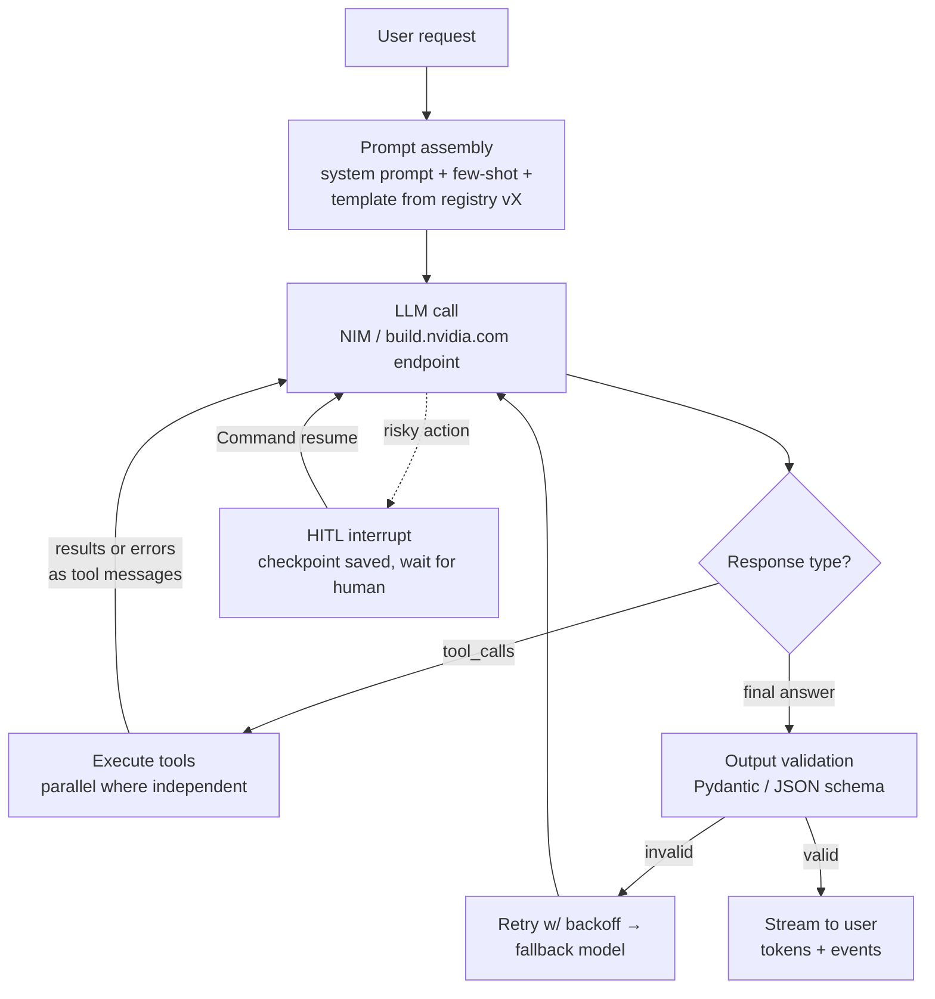

# Domain 2: Agent Development (15%)

## 1. Why this matters (exam + real agents)

This is the build domain — tied for the highest weight on the exam (~9-10 questions). It tests whether you can take a model endpoint and turn it into a *working, reliable agent*: shape its behavior with prompts, give it tools it can actually call (and survive when those calls fail), structure multi-step work as an explicit graph with pause points for humans, handle images/documents/audio, and stream results while doing all of it concurrently. Questions are heavily "which mechanism solves this?" — JSON mode vs constrained decoding, retry vs fallback, conditional edge vs interrupt, MCP tool vs bespoke function. In production, this domain is the gap between a chatbot demo and an agent you'd let touch an order database.

## 2. Mental model

**Analogy: onboarding a call-center employee.** The system prompt is the *training manual* (role, rules, escalation policy); few-shot examples are *recorded sample calls*; chain-of-thought is telling them to *work the problem out loud on scratch paper before answering*. Tools are the *systems on their desk* — CRM lookup, refund terminal — each with a labeled form (JSON schema) they must fill in correctly; MCP is the *standardized headset jack* that lets any vendor's system plug into any employee's desk. The workflow graph is the *call-script flowchart*: boxes (nodes), arrows (edges), decision diamonds (conditional edges), and a mandatory "get supervisor sign-off before issuing refunds over $500" step (HITL interrupt). Checkpoints are *saving the call state* so a dropped call resumes mid-sentence tomorrow. Streaming is *talking to the customer while the lookup runs* instead of dead air. Reliability engineering is the *contingency binder*: if the CRM times out, retry twice with growing pauses; if it's down, use the backup system (fallback model); never read an unverified account number aloud (output validation).



The loop is the point: **assemble context → call model → route on output (tool / answer / human) → validate → recover or stream → checkpoint everything** — every box is a named exam topic.

## 3. Core concepts

### 3.1 Prompt engineering

| Technique | What it is | When | Gotcha |
|---|---|---|---|
| **System prompt** | Persistent role + rules + constraints in the `system` message, separate from user turns | Always — identity, tone, tool policy, refusal rules live here | Don't bury per-request data in it; it's for *stable* instructions. Treat it as versioned code (12-factor: "own your prompts") |
| **Zero-shot** | Instruction only, no examples | Strong models, simple/common tasks | Cheapest; first thing to try |
| **Few-shot (in-context learning)** | 2-8 worked input→output examples in the prompt | Format/style/edge-case steering without training | Examples dominate instructions when they conflict; order and label balance bias outputs. Consistent gaps at scale → fine-tune (Domain 3) |
| **Chain-of-thought (CoT)** | Elicit intermediate reasoning before the answer ("think step by step", or few-shot with reasoning traces) | Math, logic, multi-constraint decisions | Costs tokens + latency; reasoning models do this internally. CoT + strict output schema = put the reasoning field *first* (§3.2) |
| **Structured output** | Force JSON / schema-conformant output | Anything parsed by code | See §3.2 — three distinct mechanisms, exam loves the difference |
| **Prompt templates** | Parameterized prompt with placeholders (`{order_id}`), filled at runtime | Any prompt used more than once | Injection risk: user data in templates should be delimited/escaped, never concatenated into instructions |
| **Prompt versioning** | Prompts stored in a registry (git, Langfuse, etc.) with versions + labels (`production`, `staging`), deployed independently of code | Production — enables rollback, A/B of prompt versions, audit | Untracked prompt edits are the classic "it broke and nothing was deployed" root cause; eval scores are meaningless without the prompt version pinned (Domain 3 link) |

**Context engineering** is the 2025+ umbrella term: prompt engineering is just one slice of deciding *everything* that fills the window each step — instructions, few-shot, retrieved docs, tool outputs, history, memory. Treat the window as a finite **attention budget**: smallest set of high-signal tokens that gets the next step right (see §11).

### 3.2 Structured output — three mechanisms, not one

| Mechanism | How it works | Guarantee | API shape |
|---|---|---|---|
| **Prompt-only** ("reply in JSON") | Model is asked nicely | None — ~90-95% at best; fails at scale | Just instructions |
| **JSON mode** | Decoder constrained to emit *syntactically valid JSON* | Valid JSON, but **any** shape — fields can be missing/extra/renamed | `response_format={"type": "json_object"}` |
| **Schema-constrained (guided) decoding** | Inference engine masks logits each step so only schema-legal tokens can be sampled (xgrammar/Outlines-style backends) | Output **must** conform to the schema — guaranteed parse | OpenAI: `response_format={"type": "json_schema", "json_schema": {"name": ..., "strict": True, "schema": ...}}`. **NIM: `extra_body={"nvext": {"guided_json": schema}}`** — plus `guided_regex`, `guided_choice`, `guided_grammar` (xgrammar is the default backend) |

On NIM, `guided_json` rides the **`nvext`** extension to the OpenAI schema and NVIDIA recommends it for reliability/perf (xgrammar is the fastest backend). The standard production pattern is **Pydantic model → `model_json_schema()` → guided decoding → `model_validate_json()`** — schema in, validated object out, with Pydantic as the final gate (validators can check things grammars can't, like `end_date > start_date`).

**The reasoning-vs-structure trap:** forcing an answer-first schema suppresses chain-of-thought (the model must commit to `"answer"` before reasoning). Fixes: put a `"reasoning"` field *before* the answer field in the schema, or generate free-form first and convert to JSON in a second cheap call. This is the heart of the "Let Me Speak Freely" vs dottxt debate (§11.4).

### 3.3 Tool / function calling

**Anatomy of a tool definition** (OpenAI-compatible, which is what NIM serves):

```json
{"type": "function", "function": {
  "name": "get_order", "description": "Fetch an order by ID. Use when the user references a specific order.",
  "parameters": {"type": "object",
    "properties": {"order_id": {"type": "string", "description": "e.g. ORD-1234"}},
    "required": ["order_id"]}}}
```

The **description is prompt engineering** — the model picks tools by reading it. The loop: send `tools=[...]` → model returns `finish_reason="tool_calls"` with an assistant message carrying a `tool_calls` list (each with an `id` and JSON-string `arguments`) → *you* execute → append one `{"role": "tool", "tool_call_id": ..., "content": result}` message **per call** → send back → repeat until the model answers in text. `tool_choice` controls the policy: `"auto"` (default), `"required"`, `"none"`, or a named function to force it.

- **Parallel tool calls:** one assistant message containing *multiple* entries in `tool_calls` — independent calls (e.g., weather in 3 cities) the runtime can execute concurrently. You must return a tool result for **every** `tool_call_id` before continuing. NIM enables parallel tool calling **per-model** — only a *subset* of models support it (the global **`parallel_tool_calls`** boolean was **deprecated in NIM 1.10** in favor of per-model support, so don't rely on it as a request flag); NIM docs cover basic, multiple-tool, named, and parallel variants.
- **Tool errors:** never crash the loop — return the error *as the tool result* ("Error: order not found; valid IDs look like ORD-NNNN") so the model can self-correct, retry with fixed args, or apologize. 12-factor Factor 9: compact errors into the context window; after N consecutive failures, escalate instead of looping.
- **Hallucinated tools/args:** validate the model's tool name + arguments against the schema *before* executing (Pydantic again); reject back as a tool-error message.

**MCP (Model Context Protocol)** is the open standard (Anthropic, Nov 2024; donated to the Linux Foundation Dec 2025) that makes tools a *deployment* concern instead of an application one — "USB-C for AI tools." A server exposes three primitives: **tools** (model-invoked actions), **resources** (app-controlled data/context), and **prompts** (user-selected templates); clients connect via **stdio** (local subprocess) or **streamable HTTP** (remote). The agent framework discovers tools at runtime (`tools/list`) instead of hard-coding them. NeMo Agent Toolkit can act as MCP *client* (consume any server's tools in a workflow) and MCP *server* (publish workflow functions as tools). Costs to know: every connected server's tool descriptions consume context (tool bloat), and third-party servers are an injection/supply-chain surface (§11.5).

### 3.4 Structured workflows: state machines and graphs

A free-running ReAct loop ("call tools until done") is maximally flexible and minimally controllable. **LangGraph** (the exam's reference framework) makes control flow explicit:

| Primitive | What | Detail |
|---|---|---|
| **State** | Shared, typed dict (TypedDict/Pydantic) flowing through the graph | Reducers (e.g., `add_messages`) define how node returns merge into state |
| **Node** | Function: `state → partial state update` | An LLM call, a tool executor, plain Python |
| **Edge** | Fixed transition `A → B` | Plus `START` / `END` sentinels |
| **Conditional edge** | `add_conditional_edges(node, router_fn, mapping)` — router inspects state, returns the next node's key | *This* is the agent's decision mechanism ("more tools or finish?") and the state-machine answer to "how does the graph branch?" |
| **Checkpointer** | Persistence plugged in at compile: `compile(checkpointer=...)` — `InMemorySaver` (dev), `SqliteSaver`/`PostgresSaver` (prod) | Saves state after every step ("super-step") per **`thread_id`** (passed in `config={"configurable": {"thread_id": ...}}`). Enables resume-after-crash, multi-turn memory, time travel |
| **HITL interrupt** | `interrupt(payload)` inside a node pauses the graph **indefinitely**, surfacing the payload to the caller; resume with `graph.invoke(Command(resume=value), config)` — the value becomes `interrupt()`'s return | **Requires a checkpointer + thread_id** — state must be persisted to wait. Static variant: `interrupt_before=["node"]` at compile time |

Know the canonical workflow patterns (Anthropic's "Building Effective Agents" taxonomy): **prompt chaining** (fixed sequence), **routing** (classify → dispatch), **parallelization** (fan-out/fan-in), **orchestrator-workers** (dynamic subtask spawning), **evaluator-optimizer** (generate → critique loop), and full **agents** (model-driven loop). Exam framing: *workflows* = predefined code paths (predictable, debuggable); *agents* = LLM directs its own steps (flexible, costly) — use the simplest pattern that works.

### 3.5 Multimodal agents

- **Vision-language models (VLMs):** image + text in, text out. NIM VLM endpoints follow the OpenAI spec — a user message whose `content` is a list of parts: `{"type": "image_url", "image_url": {"url": ...}}` where the URL is either a web URL or a **base64 data URI** (`data:image/png;base64,...`; JPG/JPEG/PNG). NVIDIA guidance: **put the image part before the text part**. Hosted build.nvidia.com endpoints cap inline base64 payloads (~180 KB); larger files go through the assets upload API. Models to recognize: `meta/llama-3.2-90b-vision-instruct`, NVIDIA's Nemotron Nano VL family (document-intelligence focused).
- **Document understanding:** two routes — (a) VLM reads page images directly (layout-aware: tables, charts, scanned forms; Nemotron Nano VL's specialty, also the basis of OCR-free "visual retrieval"), or (b) extraction pipeline (NeMo Retriever extraction NIMs parse PDFs into text/tables/images, then embed). VLM route preserves layout semantics; pipeline route scales cheaper for bulk text.
- **Audio I/O:** speech agents wrap the text agent in ASR → agent → TTS. NVIDIA's pieces are **Riva NIMs** — Parakeet/Canary for ASR (speech-to-text), Magpie/FastPitch for TTS — all on build.nvidia.com. Latency budget matters: each stage streams, so the agent can start "thinking" on partial transcripts and start speaking on first sentence.
- Multimodal output (image generation etc.) exists in the catalog but agent questions overwhelmingly mean *input* multimodality.

### 3.6 Reliability engineering

| Mechanism | Solves | Key rules |
|---|---|---|
| **Retry with exponential backoff + jitter** | Transient failures: 429 rate limits, 5xx, network timeouts | Wait grows per attempt (1s→2s→4s…), **jitter** (randomness) prevents synchronized retry stampedes (thundering herd). **Never retry 400/401/403/422** — the request is wrong; retrying burns money to fail identically. Cap attempts (3-5) |
| **Timeouts** | Hung calls eating the latency budget | Set per LLM call *and* per tool call; a timeout is retryable. Without timeouts, retries never trigger |
| **Fallback models** | The *endpoint/model itself* is down or persistently erroring after retries are exhausted | Ordered chain: primary → cheaper/secondary → (optionally) canned response. Different failure class than retry: retry = "same thing again later", fallback = "different thing now" |
| **Output validation** | Model returned parseable-but-wrong, schema-violating, or policy-violating content | Pydantic / JSON-schema validation on every parsed output; on failure, re-prompt **with the validation error included** so the model can repair (the instructor-library pattern) |
| **Guarded generation** | Unsafe/off-topic/leaking outputs | Constrained decoding for *shape*; NeMo Guardrails for *content* — programmable input/dialog/output rails (topic control, jailbreak detection, fact-check rails) wrapping the LLM. Domain overlap: Guardrails is detailed in the safety domain; here, know it's the runtime guard layer |
| **Circuit breaker / idempotency** | Cascading failures; double-charged side effects | Stop calling a failing dependency for a cooldown; make tool side effects idempotent (retried `create_refund` must not refund twice — pass an idempotency key) |

Mantra: **validate, then retry, then fall back, then degrade gracefully** — in that order, cheapest first (rhymes with Domain 3's tuning ladder).

### 3.7 Streaming and async execution

- **Token streaming:** `stream=True` on chat completions returns SSE chunks; text arrives in `chunk.choices[0].delta.content` (tool-call *arguments* also stream incrementally as string fragments — you must accumulate before parsing). Streaming does **not** reduce total generation time; it slashes *perceived* latency by optimizing **TTFT** (time to first token). Metrics: TTFT (snappiness), TPOT/inter-token latency (smoothness), total time.
- **Event streaming:** agents need more than tokens — "calling tool X", "node Y finished". LangGraph's `graph.stream(input, config, stream_mode=...)`: `"values"` (full state each step), `"updates"` (per-node deltas), `"messages"` (LLM tokens + metadata), `"custom"` (your own events); pass a list to multiplex several modes. This is how real agent UIs show progress instead of a 40-second spinner.
- **Async/concurrent execution:** LLM calls are I/O-bound → `asyncio` is the right concurrency model. `await asyncio.gather(*[...])` fans out independent calls (parallel tool executions, multi-agent fan-out, batch scoring); semaphores cap concurrency to respect rate limits. LangGraph runs parallel branches of a graph concurrently within a super-step; `ainvoke`/`astream` are the async twins of every API.
- **Partial results:** stream validated *fragments* (e.g., emit each completed item of a JSON array) rather than waiting for the full object — incremental/partial-JSON parsing is the standard trick.

### 3.8 Rapid prototyping on NVIDIA's stack

The intended flow: **build.nvidia.com (hosted, free dev credits) → same code → self-hosted NIM (prod)**. The API catalog at build.nvidia.com exposes hundreds of models (LLM, VLM, embedding, reranking, ASR/TTS) behind one OpenAI-compatible endpoint (`https://integrate.api.nvidia.com/v1`) with one `NVIDIA_API_KEY`; because a downloaded NIM container serves the *identical* API on `http://localhost:8000/v1`, promotion to self-hosted is a base-URL swap. **NVIDIA AI Workbench** is the free desktop client that makes the local side reproducible: containerized projects (code + env + data) that run on a laptop GPU and *migrate unchanged* to workstation/datacenter/cloud, with example projects (e.g., hybrid RAG) that mix local compute with catalog endpoints.

## 4. NVIDIA-specific layer

| NVIDIA piece | Role in this domain | Key facts |
|---|---|---|
| **build.nvidia.com / API catalog** | Hosted endpoints for prototyping | Browser playground + OpenAI-compatible API; free credits for developer-program members (DGX Cloud-powered); LLM + VLM + retriever + speech models in one catalog |
| **NIM (LLM)** | The serving layer all snippets target | OpenAI-compatible REST (chat/completions); bundles TensorRT-LLM/vLLM/SGLang engines; **function calling** (basic/multiple/named/parallel via `tools`/`tool_choice`; parallel tool calling is per-model — the `parallel_tool_calls` request flag was deprecated in NIM 1.10); **structured generation** via `nvext`: `guided_json` (recommended; xgrammar backend), `guided_regex`, `guided_choice`, `guided_grammar` |
| **NIM (VLM)** | Multimodal agents | OpenAI content-parts spec; image as URL or base64 data URI; image-before-text; Llama 3.2 Vision, Nemotron Nano VL on the catalog |
| **Riva NIMs** | Audio I/O | Parakeet/Canary ASR, Magpie TTS — the speech bookends of a voice agent |
| **NVIDIA AI Workbench** | Rapid prototyping environment | Free client app; containerized, GPU-aware, reproducible projects; develop locally → migrate to any infra; hybrid pattern (local embedding + cloud NIM inference) |
| **NeMo Agent Toolkit (NAT)** | Framework-agnostic agent layer | `nvidia-nat` (ex-AgentIQ/AIQ). **YAML workflow** (`llms:`/`functions:`/`function_groups:`/`workflow:`, each by `_type`) over LangGraph/LlamaIndex/CrewAI/AutoGen/Semantic Kernel; agent types incl. **`tool_calling_agent`** (native function-calling, `handle_tool_errors`, `max_iterations=15`); custom **NAT Functions** (`@register_function` + `FunctionBaseConfig`), **Function Groups**, **Per-User Functions**; **MCP client** (`_type: mcp_client`) **and server** (`nat mcp serve`, :9901/mcp); **auth providers** (`api_key`/`oauth2_auth_code_flow`/`http_basic_auth`/`mcp_oauth2`); **middleware** (cache/log/defense/red-team); **`nat optimize`** Parameter Optimizer. **See §4.1.** Plus profiling/eval from Domain 3 |
| **NeMo Guardrails** | Guarded generation | Programmable rails (input/dialog/output/execution) around any LLM; pairs with, not replaces, schema-constrained decoding |
| **LangChain NVIDIA integration** | Glue | `langchain-nvidia-ai-endpoints`: `ChatNVIDIA` (supports `bind_tools`, `with_structured_output`), `NVIDIAEmbeddings`, `NVIDIARerank` — drop NIM into LangGraph graphs |

**When NVIDIA vs generic:** the *mechanisms* (tool calling, guided decoding, streaming) are OpenAI-spec generic — NIM's value is serving them identically hosted and self-hosted (no code change, data sovereignty when local). NVIDIA-specific syntax worth memorizing: `nvext.guided_json`, `integrate.api.nvidia.com/v1`, and the Workbench/catalog prototyping story.

### 4.1 NeMo Agent Toolkit (NAT) — the build-it layer (exam-dense)

The §3 mechanisms are *what* an agent does; **NAT is how NVIDIA wants you to assemble it**. NAT (the `nvidia-nat` package, formerly *AgentIQ* then *AIQ/aiqtoolkit* — old docs and imports say `aiq.*`; the `nat.*` module landed with the v1.2 rename and the `aiq` compatibility aliases were dropped by v1.5, so current releases are `nat.*` only) is **framework-agnostic** (wraps LangChain/LangGraph, LlamaIndex, CrewAI, AutoGen, Semantic Kernel) and **declarative**: a workflow is a **YAML file** that names the LLMs, functions, and the top-level agent. The exam concentrates here because it's NVIDIA's own product surface.

**The YAML workflow config — the spine.** Every NAT app is one YAML with these top-level sections, each entity selected by a `_type` discriminator:

```yaml
llms:                                   # named model endpoints (referenced by name elsewhere)
  agent_llm:
    _type: nim                          # NIM provider; also openai, aws_bedrock, etc.
    model_name: meta/llama-3.3-70b-instruct
    temperature: 0.0
functions:                             # individual tools (custom or built-in), keyed by name
  current_datetime:
    _type: current_datetime             # a built-in tool, selected by its registered _type
  query_inventory:
    _type: query_inventory              # a CUSTOM function (see @register_function below)
    db_path: ./data/sample.db           # config fields become constructor args
workflow:                              # the TOP-LEVEL entrypoint (an agent or a single fn)
  _type: tool_calling_agent
  tool_names: [current_datetime, query_inventory]
  llm_name: agent_llm
  verbose: true
  handle_tool_errors: true              # default true: tool exceptions → ToolMessage, not a crash
  max_iterations: 15                    # default 15: cap on tool-call rounds
```

Run it with `nat run --config_file config.yml --input "..."` or serve it with `nat serve`. The mental rule: **`llms:` and `functions:` define the parts by name; `workflow:` wires the entrypoint.** Changing models, swapping tools, or re-pointing to self-hosted NIM is a YAML edit, not a code change.

**Tool Calling Agent — and structured outputs.** `_type: tool_calling_agent` is the agent type the exam centers on: it uses the model's **native function-calling** (the §3.3 OpenAI tool spec NIM serves) rather than ReAct-style text parsing, so it's the right pick when the model supports tool calls and you want **reliable, schema-true tool invocation**. Its knobs: `tool_names` (functions/function-groups it may call), `llm_name`, `verbose` (default `False`), `handle_tool_errors` (default `True` — catches a tool exception and feeds it back as a `ToolMessage` so the agent self-corrects, the §3.3 error-as-tool-result pattern built in), and `max_iterations` (default `15`). To get a **structured final answer**, you constrain the agent's output to a Pydantic/JSON schema — the Tool Calling Agent is the standard NAT path for "agent that returns a typed object," because tool-calling models emit schema-conformant JSON. (NAT also ships `react_agent`, `reasoning_agent`, and `rewoo_agent` workflow types; Tool Calling is the default for function-capable models.)

**NAT Functions — custom tools.** A NAT function is registered with `@register_function`, paired with a `FunctionBaseConfig` subclass whose `name=` is the `_type` you reference in YAML. The registration coroutine receives the parsed `config` and a `Builder` (for pulling other entities, e.g. an LLM), and **yields** a `FunctionInfo`:

```python
from nat.builder.builder import Builder
from nat.builder.function_info import FunctionInfo
from nat.cli.register_workflow import register_function
from nat.data_models.function import FunctionBaseConfig

class QueryInventoryConfig(FunctionBaseConfig, name="query_inventory"):  # name == YAML _type
    db_path: str

@register_function(config_type=QueryInventoryConfig)
async def query_inventory(config: QueryInventoryConfig, builder: Builder):
    async def _run(sku: str) -> str:                 # type hints -> JSON schema the LLM sees
        """Look up current stock for a product SKU, e.g. 'PRD-12345'."""  # docstring -> tool description
        ...                                          # return a string/struct; catch errors, don't raise
    yield FunctionInfo.from_fn(_run, description="Get current stock level for a product SKU.")
```

NAT derives the tool's **JSON schema from the type hints** and its **description from the docstring + `description=`** — so the §3.3 "description is prompt engineering" rule is enforced by the toolkit. Built-in functions follow the same `_type` mechanism: `current_datetime`, `code_generation`/code-execution sandbox (local *or* remote container — remote is required for untrusted input), `wikipedia_search` and document/RAG search, GitHub tools, and a `memory` store. (The text-to-SQL **Vanna** integration that shipped through v1.6 was **removed in v1.7.0** — `nvidia-nat-vanna` is gone with no drop-in replacement; build text-to-SQL as a custom `@register_function` if you need it.)

**Function Groups — compose related tools.** A **function group** is one config entry that exposes *many* related tools under a shared `_type`, with `include`/`exclude` filters and `tool_overrides` (rename/redescribe a tool). Grouping gives the model domain context before it picks a specific tool, and lets you enable/disable a whole domain per agent role:

```yaml
function_groups:
  inventory_db:
    _type: inventory_tools              # a group registered with @register_function_group
    include: [search_products, get_stock_level]   # expose a subset
workflow:
  _type: tool_calling_agent
  tool_names: [inventory_db]            # the group name appears alongside individual functions
```

**Per-User Functions — multi-tenant tool isolation.** In NAT's **per-user workflow** pattern each user gets **isolated function instances and state**, so the tool set (and any per-user credentials) vary by authenticated identity — a finance user sees reporting tools, an engineer sees deploy tools, neither sees the other's. This is the production answer to "different tools per user from one codebase" (vs. building N agents or one over-permissioned agent). User identity flows in via `user_id` / the auth providers below.

**Authentication.** Credentials live under an `authentication:` section as named **providers**, each with a `_type`: `api_key`, `oauth2_auth_code_flow` (Authorization-Code grant — `client_id`/`client_secret`/`authorization_url`/`token_url`/`scopes`/`use_pkce`/`token_endpoint_auth_method`), and `http_basic_auth`. Credentials are loaded into memory at runtime by provider name, never logged or persisted. For protected MCP servers specifically, NAT adds the **`mcp_oauth2`** provider (Bearer-token / OAuth2 introspection):

```yaml
authentication:
  crm_oauth:                            # named provider (keyed directly under authentication:)
    _type: oauth2_auth_code_flow        # the OAuth2 Authorization-Code provider in v1.7
    client_id: ${CRM_CLIENT_ID}
    client_secret: ${CRM_CLIENT_SECRET}
    authorization_url: https://auth.crm.example/authorize
    token_url: https://auth.crm.example/token
    scopes: [read, write]
    use_pkce: false
```

**Tool registry + MCP client.** The **tool registry** (`nat registry`) is how tools are discovered/shared across three handler types: **local** (Python files in a dir), **PyPI** (tools packaged as wheels), and **REST** (a remote registry endpoint). The **MCP client** (package `nvidia-nat[mcp]`) consumes any MCP server's tools as a NAT function group — `_type: mcp_client`, a `server.transport` of **`streamable-http`** (default/recommended), **`sse`** (legacy), or **`stdio`** (local subprocess via `command`/`args`), with `include`/`exclude`/`tool_overrides`:

```yaml
function_groups:
  remote_tools:
    _type: mcp_client
    server:
      transport: streamable-http
      url: http://localhost:9901/mcp
    include: [get_weather, search_docs]
```

NAT is **also an MCP *server***: `nat mcp serve` publishes your workflow's functions as MCP tools (default `localhost:9901`, path `/mcp`, streamable-http) so other agents can consume them. `nat mcp serve` currently runs **without built-in auth** (server-side auth is roadmap); FastMCP-served workflows *can* validate Bearer tokens via OAuth2 introspection.

**Middleware — the cross-cutting wrapper layer.** NAT lets you wrap functions/agents with **middleware** that intercepts calls for: **caching** (skip repeat tool/LLM calls; the profiler even identifies common prompt prefixes worth caching), **logging/observability** (`@track_function` captures inputs/outputs/timing; OpenTelemetry-style export to Phoenix/W&B), **defense** (NeMo Guardrails middleware + PII redaction via `nvidia-nat[pii-defense]`), and **red-teaming** (adversarial probes to assess an agent's security posture — see the `retail_agent` safety example). The exam framing: middleware is *where* you bolt reliability/safety onto a workflow without editing the tools themselves.

**Parameter Optimizer.** `nat optimize` runs NAT's **config optimizer** against an eval dataset, automatically tuning a search space and reporting the best `config.yml`. Two modes: **numeric optimization** (many NIM/LLM providers ship *pre-configured optimizable parameters* like `temperature`/`top_p`, plus `max_tokens` and model selection — enable it in the `optimizer:` section with no extra wiring) and **prompt optimization** (auto-rephrase system prompts / tool descriptions). It optimizes for **accuracy, latency, cost, or a custom/weighted metric** and can render a Pareto frontier. The **Agent Hyperparameter Optimizer** is the same machinery applied to the whole config space (model + temperature + prompts, and structurally retrieval top-K, retry policy, middleware order). Exam rule: **optimization refines a working agent; it never fixes broken tool design or a missing tool** — fix design first.

## 5. Decision frameworks

**Output-shaping selection:**

| Need | Choose |
|---|---|
| Output read only by humans | Plain prompting; skip the schema tax |
| "Just give me valid JSON, shape is flexible" | JSON mode (`json_object`) |
| Code parses the output; shape must be exact | Schema-constrained decoding (`nvext.guided_json` on NIM) + Pydantic validation |
| Classification into a fixed label set | `guided_choice` (or an enum in the schema) |
| Output must match a pattern (date, ID format) | `guided_regex` |
| Complex reasoning *and* structured answer | Reasoning field first in schema, or two-pass (reason free-form → format) |
| Cross-field/business-rule validity | Pydantic validators after parse — grammars can't check semantics |

**Control-flow selection:**

| Situation | Pattern |
|---|---|
| Fixed known steps, each step's output feeds the next | Prompt chaining (sequential nodes, no branching) |
| Input falls into distinct categories handled differently | Routing (one conditional edge after a classifier node) |
| Independent subtasks, latency matters | Parallelization (fan-out branches, `asyncio.gather` / parallel graph branches) |
| Subtasks unknown until runtime | Orchestrator-workers |
| Quality bar needs iteration | Evaluator-optimizer loop (conditional edge: "good enough?" → END or revise) |
| Open-ended task, steps can't be predefined | Tool-loop agent — but bound iterations + HITL gates |
| Irreversible/costly action in the flow | `interrupt()` before the action; checkpointer mandatory |
| Conversation must survive restarts / span sessions | Checkpointer with durable backend (Postgres) + stable `thread_id` |

**Reliability selection:**

| Failure | Mechanism |
|---|---|
| 429 / 503 / timeout | Retry, exponential backoff + jitter |
| 400 / 422 schema error from your request | Fix the request — never retry |
| Model returns invalid/unparseable output | Validate → re-prompt with the error message |
| Endpoint persistently down after retries | Fallback model chain |
| Tool raises mid-loop | Feed error back as tool message; escalate after N failures |
| Dependency flapping, retries amplifying load | Circuit breaker |
| Retried tool would duplicate a side effect | Idempotency keys |

**Hosted vs self-hosted NIM:** prototype + spiky/low volume + no data constraints → build.nvidia.com; production + data sovereignty/compliance + steady volume + latency control → self-hosted NIM container (same code, new base URL).

## 6. Exam traps & gotchas

1. **JSON mode ≠ JSON schema enforcement** — `json_object` guarantees only *syntactically valid JSON of any shape*; field guarantees require schema-constrained decoding (`guided_json` / `json_schema`). "Must always contain field X" → constrained decoding, not JSON mode.
2. **`guided_json` lives in `nvext`** — on NIM it's `extra_body={"nvext": {"guided_json": schema}}`, an NVIDIA extension to the OpenAI schema; siblings are `guided_regex`, `guided_choice`, `guided_grammar`.
3. **Schema-first kills CoT** — an answer-first schema makes the model commit before reasoning; fix with a reasoning field *ordered first* or a two-pass generate-then-format.
4. **Parallel tool calls = one assistant message, many `tool_calls`** — and you must append a separate `role:"tool"` message with the matching `tool_call_id` for *each* before the next model call. Missing one → API error.
5. **Tool errors go back to the model, not up the stack** — returning the error text as the tool result lets the model self-correct; raising kills the agent. (And compact repeated errors — don't let ten stack traces flood the window.)
6. **Retry vs fallback are different failure classes** — retry = transient, same target, with backoff; fallback = persistent, different target. "After 3 retries the endpoint still 503s" → fallback model, not retry #4.
7. **Never retry 4xx client errors** (400/401/403/422) — the request itself is wrong; retrying is pure waste. Retry 429 and 5xx/timeouts only. And backoff without **jitter** synchronizes clients into retry stampedes.
8. **`interrupt()` requires a checkpointer + `thread_id`** — the graph pauses *indefinitely* by persisting state; no persistence, no pause. Resume is `graph.invoke(Command(resume=value), config)` — same thread_id, and the value becomes the `interrupt()` return inside the node.
9. **Conditional edge vs interrupt** — conditional edge = *the graph* decides the route from state; interrupt = *a human* decides. "Route based on classification" → conditional edge; "approval before executing" → interrupt.
10. **Checkpointer ≠ chat memory feature** — it persists *full graph state per thread* (enabling resume, time travel, HITL); conversation memory is just one consequence.
11. **Streaming improves perceived latency only** — total generation time is unchanged; TTFT is the metric it optimizes. Also: streamed tool-call arguments arrive as string *fragments* — accumulate before `json.loads`.
12. **`temperature=0` ≠ fully deterministic** — greedy decoding still varies across batching, hardware, and engine versions; design validation, don't assume reproducibility.
13. **MCP primitives** — *tools* are model-controlled actions, *resources* are app-controlled context, *prompts* are user-controlled templates. Transports: stdio (local) and streamable HTTP (remote). It standardizes the tool *interface*; it does not vet servers (security/tool-bloat costs are yours).
14. **VLM payload shape** — content is a *list of parts*; image as `image_url` (web URL or base64 **data URI**), image part **before** text; hosted catalog caps inline base64 (~180 KB) — bigger images via the assets API.
15. **Few-shot vs fine-tune boundary** — a handful of examples fixing format/style → few-shot (free, instant); consistent skill gap surviving good examples at scale → Domain 3's fine-tuning. Exam answers prefer the cheapest sufficient fix.
16. **NAT entities are selected by `_type`, not by class import** — in YAML, a function/agent/LLM/auth-provider is chosen by its registered `_type` discriminator (e.g. `_type: tool_calling_agent`, `_type: mcp_client`, `_type: api_key`). The custom function's `_type` *is* the `name=` you gave its `FunctionBaseConfig`. "How do I swap the model/tool/agent?" → edit YAML, not Python.
17. **`handle_tool_errors` defaults to True** — NAT's Tool Calling Agent already converts a tool exception into a `ToolMessage` the agent can recover from (the §3.3 pattern, built in). The trap: assuming a raised tool exception kills a NAT agent — by default it doesn't. (And `max_iterations` defaults to **15**, capping tool-call rounds.)
18. **Function Groups & Per-User Functions are different "scoping" answers** — *Function Group* = compose related tools under one `_type` for the model's benefit + bulk enable/disable per role; *Per-User Functions* = isolate tool set **and state per authenticated user** (multi-tenant). "Different departments, one codebase" → both, but the per-*user* isolation answer is Per-User Functions.
19. **NAT is both MCP client and server** — `_type: mcp_client` *consumes* remote tools (transport `streamable-http`/`sse`/`stdio`); `nat mcp serve` *publishes* your functions on `:9901/mcp`. Don't confuse the direction. `nat mcp serve` ships **without built-in auth** today (protect it yourself / use FastMCP OAuth2 introspection).
20. **Optimizer refines, never repairs** — `nat optimize` (numeric: temperature/top_p/max_tokens/model; prompt: rephrasing; objectives accuracy/latency/cost) tunes a *working* agent. A wrong/missing tool or a vague tool description is a *design* bug optimization can't fix; over-fitting to a tiny eval set is the classic failure. Fix design, then optimize on ≥100 diverse examples.

## 7. Scenario drills

1. **An extraction service must emit `{"name", "date", "amount"}` for 50k invoices/day. Prompt says "reply in JSON"; 3% of outputs have missing fields or prose preambles. Cheapest robust fix?**
   → **Schema-constrained decoding** — Pydantic model → `model_json_schema()` → `nvext.guided_json` on the NIM call, then `model_validate_json`. JSON mode alone still permits missing fields; fine-tuning is overkill for a decoding-layer problem.

2. **Your agent calls `search_flights` and the API throws a 500. The current code lets the exception propagate and the session dies. Better design?**
   → **Catch and return the error as the tool-result message** (with guidance, e.g. "transient server error — retry or try different dates"), wrap the call in bounded retry-with-backoff for 5xx, and escalate/fallback after N failures. The model can often route around a failed tool.

3. **A procurement agent must get manager approval before issuing POs over $10k, and the approval may take days. Which mechanism?**
   → **LangGraph `interrupt()` in the PO node + durable checkpointer (Postgres) + per-request `thread_id`** — state persists while paused indefinitely; manager's decision resumes via `Command(resume=...)`. A conditional edge can't wait; an in-memory saver dies with the process.

4. **Users abandon your research agent during its 45-second runs. Total compute can't shrink. What do you change?**
   → **Stream** — tokens (`stream=True` / `stream_mode="messages"`) plus progress events (`stream_mode="updates"`: "searching…", "reading source 3/5"). TTFT and visible progress fix abandonment; total latency is unchanged and that's fine.

5. **Primary endpoint rate-limits hard during traffic spikes (429s). Current code retries instantly in a tight loop, making it worse. Fix?**
   → **Exponential backoff with jitter** on 429 (honor `Retry-After` if present), cap attempts, then **fall back** to a secondary model; add a client-side concurrency semaphore so you stop provoking the limiter. The tight loop is the textbook stampede anti-pattern.

6. **Team hard-codes prompts in Python; a prompt tweak shipped in a hotfix regressed production and nobody can say what changed. What practice was missing?**
   → **Prompt versioning/management** — prompts in a registry (git or Langfuse-style) with versions and `production`/`staging` labels, fetched at runtime, rolled back independently of code, and pinned to eval runs so every change is diffable and gated (Domain 3 CI gates).

7. **(NAT) You built a NAT agent and need to add a tool the model picks automatically, swap the model from Llama 70B to Nemotron, and connect a third-party weather tool already exposed over MCP. Where do those changes live?**
   → **All in the YAML.** Register the custom tool with `@register_function` + a `FunctionBaseConfig(name="...")`, add it under `functions:` by its `_type` and list it in the agent's `tool_names`. Swap the model by editing the `llms:` entry's `model_name`. Add the remote tool as a `function_groups:` entry of `_type: mcp_client` (`server.transport: streamable-http`, `url: ...`) and reference the group name in `tool_names`. No Python edits to the agent itself — `_type` selection + name references are the whole point of the declarative spine.

8. **(NAT) A single agent serves finance, engineering, and support users; each must only see and act with their own tools, and one user's session state must never leak into another's. Which NAT feature, and how do tool errors get handled?**
   → **Per-User Functions** — NAT's per-user workflow pattern gives each authenticated user isolated function *instances and state*, with the tool set resolved from identity (via the `authentication:` providers — `api_key`/`oauth2_auth_code_flow`/`http_basic_auth`). A Function Group alone scopes tools for the model but doesn't isolate per-user state. Tool failures are already handled by the Tool Calling Agent's `handle_tool_errors: true` (default) — exceptions return as a `ToolMessage` the agent can recover from, bounded by `max_iterations` (default 15).

9. **(NAT) Your NAT agent works but is slow and sometimes over-spends tokens; a teammate wants to "just crank temperature to 0 and add more tools." Better move?**
   → **Run `nat optimize`** against an eval set (≥100 diverse cases): numeric optimization tunes temperature/top_p/max_tokens and model selection, prompt optimization rephrases the system prompt and tool descriptions, optimizing for your chosen objective (latency/cost/accuracy or a weighted blend). Adding tools usually *hurts* (more wrong-tool selection). And remember optimization **refines a working agent** — if a tool is missing or mis-described, fix that first; no temperature value rescues bad tool design.

## 8. Builder's corner

- **Pydantic at every boundary.** Define one model per structured surface — tool args (validate *before* executing the model's call), tool results, final outputs — and feed `ValidationError` text back to the model for self-repair. The schema is simultaneously your prompt (via guided decoding), your parser, and your test oracle.
- **Make the graph boring and the prompts smart.** Explicit nodes/conditional edges for everything you *know* about the process; reserve the free tool-loop for the genuinely open-ended middle. Every conditional edge is a place you can log, test, and gate — a ReAct loop is none of those.
- **Wire reliability in on day one, in order:** timeout on every call → tenacity retry (429/5xx only, jitter) → fallback chain → validation-with-repair. Retrofitting this after the demo is how agents stay demos.
- **Stream events before you stream tokens.** Users forgive latency they can see; `stream_mode="updates"` costs nothing and turns a spinner into a narrative. Then add token streaming for the final answer.
- **Prototype on build.nvidia.com, ship the same file.** Keep `base_url` and model name in config; the hosted-to-local NIM swap should be a one-line env change. Workbench keeps the local env reproducible; the catalog keeps the iteration loop free.
- **Treat MCP servers like dependencies, not magic.** Pin/audit them, count their token cost in your context budget, and never combine private-data access + untrusted content + external comms (the lethal trifecta) in one agent without isolation.

## 9. Sources

- NIM structured generation (`nvext`, guided_json/regex/choice/grammar, xgrammar): https://docs.nvidia.com/nim/large-language-models/latest/structured-generation.html
- NIM function calling (basic/multiple/named/parallel): https://docs.nvidia.com/nim/large-language-models/latest/function-calling.html
- NIM VLM image input spec: https://docs.nvidia.com/nim/vision-language-models/latest/index.html ; https://docs.api.nvidia.com/nim/reference/meta-llama-3_2-90b-vision-instruct
- build.nvidia.com API catalog & NIM developer program: https://build.nvidia.com/ ; https://developer.nvidia.com/nim
- NVIDIA AI Workbench: https://www.nvidia.com/en-us/deep-learning-ai/solutions/data-science/workbench/
- LangGraph interrupts / HITL: https://docs.langchain.com/oss/python/langgraph/interrupts
- LangGraph persistence (checkpointers, threads): https://docs.langchain.com/oss/python/langgraph/persistence
- LangGraph streaming modes: https://docs.langchain.com/oss/python/langgraph/streaming
- MCP specification & primitives: https://modelcontextprotocol.io/specification/2025-06-18 ; Linux Foundation donation: https://www.linuxfoundation.org/press/model-context-protocol-joins-linux-foundation
- Anthropic — Building Effective Agents (workflow taxonomy): https://www.anthropic.com/research/building-effective-agents
- Anthropic — Effective Context Engineering for AI Agents: https://www.anthropic.com/engineering/effective-context-engineering-for-ai-agents
- 12-Factor Agents (Dex Horthy / HumanLayer): https://github.com/humanlayer/12-factor-agents
- Structured-output debate: https://arxiv.org/abs/2408.02442 (Let Me Speak Freely) ; https://blog.dottxt.ai/say-what-you-mean.html (rebuttal)
- Simon Willison — the lethal trifecta: https://simonwillison.net/2025/Jun/16/the-lethal-trifecta/
- Tenacity (retry/backoff/jitter): https://tenacity.readthedocs.io/
- Langfuse prompt management (versions, labels, compile): https://langfuse.com/docs/prompt-management/get-started
- LangChain NVIDIA endpoints (`ChatNVIDIA`): https://python.langchain.com/docs/integrations/chat/nvidia_ai_endpoints/
- NAT workflow configuration (llms/functions/workflow YAML): https://docs.nvidia.com/nemo/agent-toolkit/latest/build-workflows/workflow-configuration.html
- NAT Tool Calling Agent (tool_names, handle_tool_errors, max_iterations=15): https://docs.nvidia.com/nemo/agent-toolkit/latest/components/agents/tool-calling-agent/tool-calling-agent.html
- NAT custom functions (`@register_function`, `FunctionBaseConfig`, `FunctionInfo.from_fn`): https://docs.nvidia.com/nemo/agent-toolkit/latest/extend/functions.html
- NAT Function Groups: https://docs.nvidia.com/nemo/agent-toolkit/latest/build-workflows/functions-and-function-groups/function-groups.html
- NAT MCP client (`_type: mcp_client`, transports) & server (`nat mcp serve`, :9901/mcp): https://docs.nvidia.com/nemo/agent-toolkit/latest/build-workflows/mcp-client.html ; https://docs.nvidia.com/nemo/agent-toolkit/latest/run-workflows/mcp-server.html
- NAT authentication providers (`api_key`/`oauth2_auth_code_flow`/`http_basic_auth`/`mcp_oauth2`): https://docs.nvidia.com/nemo/agent-toolkit/latest/components/auth/api-authentication.html
- NAT Optimizer (`nat optimize`, numeric + prompt, accuracy/latency/cost): https://docs.nvidia.com/nemo/agent-toolkit/latest/improve-workflows/optimizer.html
- NAT GitHub (package `nvidia-nat`, examples incl. retail_agent defense middleware): https://github.com/NVIDIA/NeMo-Agent-Toolkit
- NCP-AAI exam framing: https://www.nvidia.com/en-us/learn/certification/agentic-ai-professional/

## 10. Code Companion

**1) Structured output: Pydantic schema → `nvext.guided_json` on a NIM endpoint → validated object**

```python
import os
from openai import OpenAI
from pydantic import BaseModel, Field

class Invoice(BaseModel):
    reasoning: str = Field(description="Brief extraction rationale")  # FIRST: preserves CoT
    vendor: str
    total_usd: float
    line_item_count: int

client = OpenAI(base_url="https://integrate.api.nvidia.com/v1",
                api_key=os.environ["NVIDIA_API_KEY"])
resp = client.chat.completions.create(
    model="meta/llama-3.3-70b-instruct",
    messages=[{"role": "user", "content": f"Extract the invoice fields:\n{invoice_text}"}],
    extra_body={"nvext": {"guided_json": Invoice.model_json_schema()}},  # NVIDIA extension
)
invoice = Invoice.model_validate_json(resp.choices[0].message.content)  # guaranteed to parse
```

*What to notice:* the schema does triple duty — it constrains decoding (xgrammar masks illegal tokens, so the output *cannot* violate it), documents intent, and validates the parse. The `reasoning` field is deliberately first in the model definition (trap #3): the model reasons before committing to numbers.

**2) Tool definitions + parallel tool calls + errors returned as tool messages**

```python
import json

TOOLS = [{"type": "function", "function": {
    "name": "get_weather", "description": "Current weather for a city.",
    "parameters": {"type": "object", "properties": {"city": {"type": "string"}},
                   "required": ["city"]}}}]

def run_agent(messages):
    while True:
        r = client.chat.completions.create(model="meta/llama-3.3-70b-instruct",
                                           messages=messages, tools=TOOLS, tool_choice="auto")
        msg = r.choices[0].message
        if not msg.tool_calls:
            return msg.content                      # final text answer
        messages.append(msg)                        # ONE assistant msg, possibly MANY tool_calls
        for tc in msg.tool_calls:                   # parallel calls: execute each, answer each
            try:
                result = get_weather(**json.loads(tc.function.arguments))
            except Exception as e:                  # error goes BACK TO THE MODEL, not up the stack
                result = f"Error: {e}. Check the city name and try again."
            messages.append({"role": "tool", "tool_call_id": tc.id, "content": str(result)})
```

*What to notice:* "What's the weather in Paris and Tokyo?" yields one assistant message with two `tool_calls`, and the loop appends one `role:"tool"` reply *per* `tool_call_id` (trap #4) — skip one and the next API call 400s. The except branch is trap #5 made concrete: the error string becomes context the model can act on.

**3) LangGraph: conditional edge + checkpointer + HITL interrupt**

```python
from typing import TypedDict
from langgraph.graph import StateGraph, START, END
from langgraph.checkpoint.memory import InMemorySaver   # prod: PostgresSaver
from langgraph.types import interrupt, Command

class State(TypedDict):
    amount: float; status: str

def review(state: State) -> State:
    decision = interrupt({"question": f"Approve PO for ${state['amount']}?"})  # pauses HERE
    return {"status": "approved" if decision == "yes" else "rejected"}

def route(state: State) -> str:                      # conditional-edge router reads state
    return "review" if state["amount"] > 10_000 else "auto_ok"

builder = StateGraph(State)
builder.add_node("review", review)
builder.add_node("auto_ok", lambda s: {"status": "approved"})
builder.add_conditional_edges(START, route, {"review": "review", "auto_ok": "auto_ok"})
builder.add_edge("review", END); builder.add_edge("auto_ok", END)
graph = builder.compile(checkpointer=InMemorySaver())  # interrupt REQUIRES a checkpointer

cfg = {"configurable": {"thread_id": "po-42"}}
graph.invoke({"amount": 25_000, "status": "pending"}, cfg)        # pauses at interrupt
graph.invoke(Command(resume="yes"), cfg)                          # days later: same thread_id
```

*What to notice:* the router function *is* the state machine's branching (small POs never see a human), and the second `invoke` with `Command(resume=...)` re-enters the paused node — the resume value becomes `interrupt()`'s return. Remove the checkpointer and this throws: persistence is what makes indefinite pausing possible (trap #8).

**4) Streaming tokens (raw client) and streaming events (LangGraph)**

```python
# (a) Token streaming straight off the NIM endpoint — optimizes TTFT
stream = client.chat.completions.create(model="meta/llama-3.3-70b-instruct",
                                        messages=msgs, stream=True)
for chunk in stream:
    if chunk.choices and chunk.choices[0].delta.content:
        print(chunk.choices[0].delta.content, end="", flush=True)

# (b) Event + token streaming from a compiled LangGraph agent
for mode, payload in graph.stream({"messages": msgs}, cfg,
                                  stream_mode=["updates", "messages"]):
    if mode == "updates":              # per-node progress: {"review": {...}} → "running review…"
        print(f"[{list(payload)[0]} done]")
    else:                              # (token_chunk, metadata) — the LLM tokens themselves
        token, meta = payload
        print(token.content, end="", flush=True)
```

*What to notice:* (a) is SSE deltas — accumulate `delta` fragments (tool-call args stream the same way, as string pieces; trap #11). (b) multiplexes two stream modes in one pass: `updates` powers the "agent is doing X" UI, `messages` powers the typing effect — the §3.7 distinction between token streaming and event streaming in eight lines.

**5) Retry with backoff + jitter, then fallback model chain**

```python
from openai import APITimeoutError, InternalServerError, RateLimitError
from tenacity import retry, retry_if_exception_type, stop_after_attempt, wait_exponential_jitter

@retry(retry=retry_if_exception_type((RateLimitError, APITimeoutError, InternalServerError)),
       wait=wait_exponential_jitter(initial=1, max=20),   # 1s, ~2s, ~4s… + jitter
       stop=stop_after_attempt(4))
def call(model: str, messages: list):
    return client.chat.completions.create(model=model, messages=messages, timeout=30)

def call_with_fallback(messages, chain=("meta/llama-3.3-70b-instruct",
                                        "meta/llama-3.1-8b-instruct")):
    for model in chain:
        try:
            return call(model, messages)        # retries exhaust → try next model
        except Exception as e:
            last = e
    raise last
```

*What to notice:* the `retry_if_exception_type` whitelist encodes trap #7 — 429/5xx/timeout retry, while a 400 `BadRequestError` fails immediately (it would fail identically forever). Retry and fallback are layered, not merged (trap #6): backoff handles *transient* faults on the same model; the chain handles *persistent* ones by changing models. `timeout=30` is what makes hangs retryable at all.

**6) Vision-language call with a local image on build.nvidia.com**

```python
import base64

with open("invoice_scan.png", "rb") as f:
    b64 = base64.b64encode(f.read()).decode()      # hosted catalog: keep inline b64 small (~<180KB)

resp = client.chat.completions.create(
    model="meta/llama-3.2-90b-vision-instruct",
    messages=[{"role": "user", "content": [
        {"type": "image_url",                      # image part FIRST (NVIDIA guidance)
         "image_url": {"url": f"data:image/png;base64,{b64}"}},
        {"type": "text", "text": "What is the total amount due and the due date?"},
    ]}],
    max_tokens=256,
)
print(resp.choices[0].message.content)
```

*What to notice:* same client, same endpoint — multimodality is just a content-parts list instead of a string (trap #14): `image_url` accepts a web URL or a base64 *data URI*, and the image part precedes the text part. Swap the model name for a Nemotron Nano VL when the task is dense document layout.

**7) Prompt template versioning — Langfuse, and the 12-factor minimal registry**

```python
# (a) Langfuse prompt management: versions + deploy labels, fetched at runtime
from langfuse import Langfuse
langfuse = Langfuse()  # reads LANGFUSE_* env keys

prompt = langfuse.get_prompt("support-agent")            # version labeled "production"
# prompt = langfuse.get_prompt("support-agent", label="staging")  # or pin: version=7
system_text = prompt.compile(tone="concise", product="NIM")       # fills {{tone}}, {{product}}
print(prompt.version, prompt.labels)                     # auditable: which version answered?

# (b) Own-your-prompts minimal registry: versioned files in git, loaded explicitly
from pathlib import Path
PROMPTS = Path("prompts")                                # prompts/support-agent/v3.txt in git
def get_prompt(name: str, version: str = "v3") -> str:
    return (PROMPTS / name / f"{version}.txt").read_text(encoding="utf-8")
```

*What to notice:* both implement the same contract — prompts live *outside* application code, addressed by name + version/label, so a prompt rollback never requires a code deploy and every trace/eval can record exactly which version ran (scenario 6). Langfuse adds UI editing, `production`/`staging` label promotion, and caching; the git registry is 12-factor Factor 2 ("own your prompts") with zero dependencies.

**8) NeMo Agent Toolkit — a custom function + the YAML that assembles a Tool Calling Agent**

```python
# tools.py — register a custom NAT function (the name= becomes its YAML _type)
from nat.builder.builder import Builder
from nat.builder.function_info import FunctionInfo
from nat.cli.register_workflow import register_function
from nat.data_models.function import FunctionBaseConfig

class StockConfig(FunctionBaseConfig, name="get_stock_level"):   # _type the YAML will reference
    db_path: str

@register_function(config_type=StockConfig)
async def get_stock_level(config: StockConfig, builder: Builder):
    async def _run(sku: str) -> str:                  # type hint -> JSON schema the LLM sees
        """Return current stock for a product SKU, e.g. 'PRD-12345'."""  # -> tool description
        try:
            return query_db(config.db_path, sku)      # catch + return errors; never raise into the agent
        except Exception as e:
            return f"Error: {e}. Check the SKU format (PRD-NNNNN)."
    yield FunctionInfo.from_fn(_run, description="Get current stock level for a product SKU.")
```

```yaml
# config.yml — llms/functions/function_groups define parts by name; workflow wires the entrypoint
llms:
  agent_llm:
    _type: nim
    model_name: meta/llama-3.3-70b-instruct
    temperature: 0.0
functions:
  get_stock_level:
    _type: get_stock_level            # == the FunctionBaseConfig name= above
    db_path: ./data/inventory.db
function_groups:
  remote_tools:
    _type: mcp_client                 # consume a third-party MCP server's tools (nvidia-nat[mcp])
    server: {transport: streamable-http, url: http://localhost:9901/mcp}
    include: [get_weather]
workflow:
  _type: tool_calling_agent           # native function-calling agent
  tool_names: [get_stock_level, remote_tools]
  llm_name: agent_llm
  handle_tool_errors: true            # default: tool exception -> ToolMessage, agent self-corrects
  max_iterations: 15                  # default cap on tool-call rounds
```

Run: `nat run --config_file config.yml --input "How many PRD-12345 are in stock and what's the weather in Tokyo?"`. Tune later: `nat optimize --config_file config.yml ...`. Publish these tools to other agents: `nat mcp serve --config_file config.yml` (→ `localhost:9901/mcp`).

*What to notice:* the Python file only *registers* a tool; the **YAML assembles the agent**. The custom tool, the model choice, and the remote MCP tools are all selected by `_type` and referenced by name — swapping any of them (trap #16) never touches the agent code. `handle_tool_errors`/`max_iterations` (trap #17) give you the §3.3 error-as-tool-result loop and iteration cap for free.

## 11. What top engineers are saying (2025-26)

1. **Tobi Lütke & Andrej Karpathy — the "context engineering" rename (June 2025)** — Lütke: context engineering is "the art of providing all the context for the task to be plausibly solvable by the LLM"; Karpathy endorsed days later: "the delicate art and science of filling the context window with just the right information for the next step." The framing demoted prompt engineering to a *subset* — in production agents the instruction text is a sliver next to history, tool outputs, and retrieved docs. Exam-relevant because every §3 mechanism (few-shot, tool schemas, MCP descriptions) is a context-budget line item. https://x.com/tobi/status/1935533422589399127 ; https://x.com/karpathy/status/1937902205765607626

2. **Anthropic Engineering — "Effective Context Engineering for AI Agents" (Sept 2025)** — Codifies the *attention budget*: every token depletes it, so good context engineering finds "the smallest possible set of high-signal tokens that maximize the likelihood of the desired outcome." Concrete agent-dev guidance: system prompts at the "right altitude" (not micro-scripted, not vague), few always-loaded tools with dynamic discovery beyond that, compaction and just-in-time retrieval over kitchen-sink stuffing. The strongest official statement that most production agent failures are context failures, not model failures. https://www.anthropic.com/engineering/effective-context-engineering-for-ai-agents

3. **Dex Horthy (HumanLayer) — "12-Factor Agents"** — The manifesto for this whole domain: Factor 2 *own your prompts* (prompts are first-class, version-controlled code — never hidden inside a framework), Factor 3 *own your context window* (deliberately format what the model sees), Factor 4 *tools are just structured outputs* (a tool call is JSON the model emits and *your* code executes — demystifying function calling), Factor 8 *own your control flow* and Factor 9 *compact errors into the context window* (the error-as-tool-result pattern in snippet 2). Widely cited as the reason production teams write explicit graphs instead of trusting framework magic. https://github.com/humanlayer/12-factor-agents

4. **The structured-output reliability fight — "Let Me Speak Freely?" vs dottxt's "Say What You Mean" (2024-25, still cited)** — The paper claimed format restrictions degrade reasoning; dottxt's rebuttal showed the comparison used different prompts per condition and conflated JSON mode with constrained decoding — with matched prompts, structured generation equaled or beat free-form. The durable practitioner takeaway (echoed by Dylan Castillo's independent runs): constrained decoding is safe *if you design the schema to let the model think first* — key order matters, which is exactly snippet 1's reasoning-first field. https://arxiv.org/abs/2408.02442 ; https://blog.dottxt.ai/say-what-you-mean.html ; https://dylancastillo.co/posts/say-what-you-mean-sometimes.html

5. **Simon Willison — "The Lethal Trifecta" (June 2025)** — The most-quoted security take in agent development: an agent combining (1) access to private data, (2) exposure to untrusted content, and (3) external communication can be prompt-injected into exfiltrating data — and "MCP encourages users to mix and match tools" into exactly this combination (the GitHub MCP private-repo leak being exhibit A). His sober verdict: guardrails catching "95% of attacks" is a failing grade in security; the real fix is *not combining all three capabilities* in one agent. Directly motivates §8's MCP-as-dependency discipline. https://simonwillison.net/2025/Jun/16/the-lethal-trifecta/

6. **MCP's institutionalization vs the skeptics (Dec 2025 →)** — MCP was donated to the Linux Foundation in December 2025 and hit ~97M monthly SDK downloads by early 2026, with every major provider on board — the "USB-C of tools" bet effectively won the protocol war. The counter-discourse hasn't quieted: practitioners flag tool-description bloat eating context budgets (Anthropic's own guidance: keep 3-5 tools loaded, discover the rest dynamically), unvetted-server supply-chain risk, and the argument that for code-capable agents, a script or CLI beats a tool catalog. The mature 2026 position: MCP for *integration breadth*, curated native tools for the *hot path*. https://www.linuxfoundation.org/press/model-context-protocol-joins-linux-foundation ; https://www.thoughtworks.com/en-us/insights/blog/generative-ai/model-context-protocol-mcp-impact-2025

7. **Streaming UX consensus — TTFT is the metric users feel** — The practitioner literature converged on a three-number model: TTFT (perceived snappiness), TPOT/inter-token latency (smoothness), total time — and on the finding that users tolerate long total generation *if the first token lands fast and progress is visible*, which is why agent frameworks all grew event-stream APIs (LangGraph stream modes, SSE everywhere — both MCP and Google's A2A standardized on SSE-based transports). The design corollary engineers repeat: stream *what the agent is doing*, not just what it's saying. https://redis.io/blog/api-latency-llm-apps/ ; https://latitude.so/blog/real-time-llms-optimizing-latency-streaming
