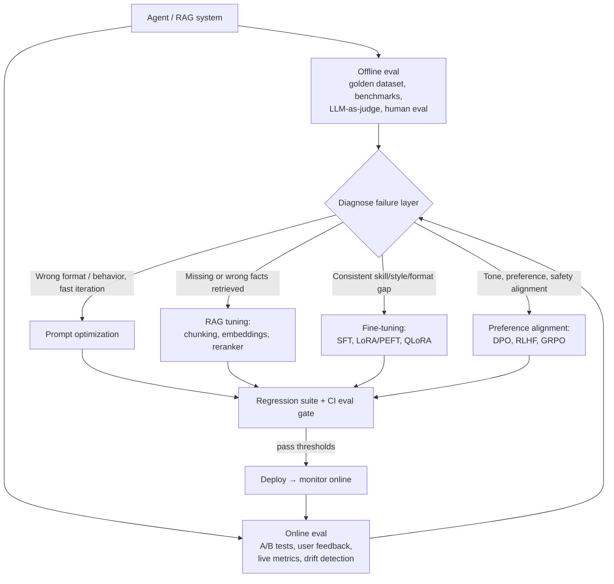
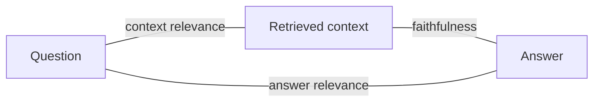
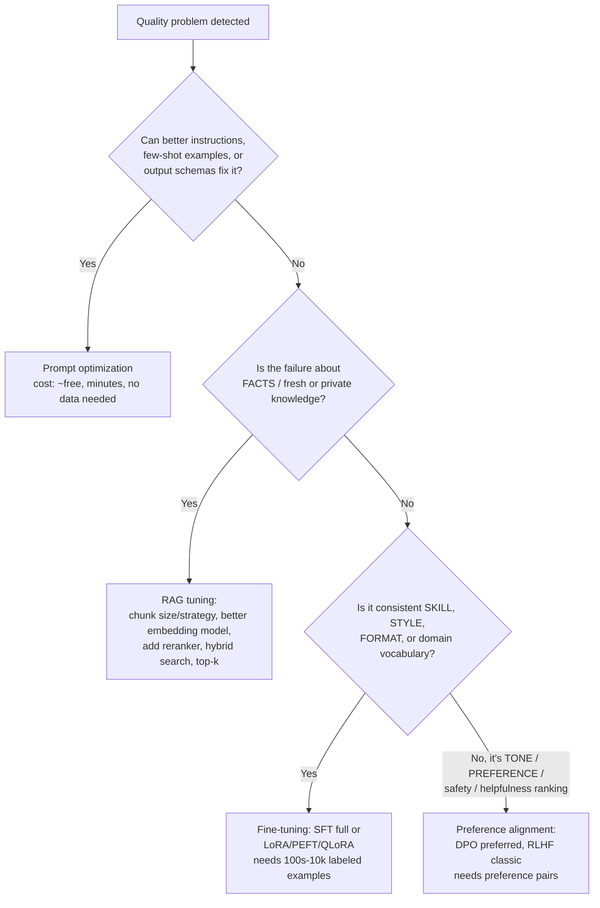

# Domain 3: Evaluation and Tuning (13%)

## 1. Why this matters (exam + real agents)

Agents are non-deterministic, multi-step systems: a single prompt tweak, model swap, or retriever change can silently break task completion, inflate cost, or introduce hallucinations. This domain tests whether you can (a) measure an agent rigorously — offline against golden datasets and online against live traffic, (b) diagnose *which* layer is failing (prompt, retrieval, model knowledge, or alignment), and (c) pick the cheapest intervention that fixes it. On the exam this is ~8-9 questions, heavily scenario-based: "metric X is low, what do you tune?" and "which NVIDIA tool evaluates Y?" In production, this is the difference between shipping on vibes and shipping with regression gates.

## 2. Mental model

**Analogy: a restaurant kitchen.** Offline evaluation is the *tasting menu rehearsal* before opening night — fixed dishes (golden dataset), trusted critics (human eval / LLM judge), repeatable. Online evaluation is *reading the dining room* — real customers, A/B testing two recipes, watching ticket times (latency) and food cost per plate (cost per task). When a dish fails, you diagnose in order of cheapness: fix the recipe card (prompt), fix the pantry/sourcing (RAG: chunking, embeddings, reranker), retrain the chef's technique (fine-tuning: SFT/LoRA), or retrain the chef's *taste* (preference alignment: DPO/RLHF). You never retrain the chef because the pantry was missing an ingredient.



The loop is the point: **evaluate → diagnose → tune cheapest layer → re-evaluate via regression gate → deploy → monitor → repeat** (eval-driven development).

### 2.1 Why agents are hard to evaluate — compound error & ambiguity

Three properties make agent eval fundamentally different from traditional (deterministic) software testing — and the first one is an exam favorite:

1. **Compound (multiplicative) error.** Each step in a multi-step workflow (retrieve → reason → select tool → execute → synthesize) has its own per-step accuracy, and they **multiply**. End-to-end accuracy ≈ `p_step ^ n_steps`. This is *the* number the exam asks you to compute:

   | Per-step accuracy | 5 steps | 8 steps | 10 steps |
   |---|---|---|---|
   | 0.99 | 0.95 | 0.92 | 0.90 |
   | 0.95 | 0.77 | 0.66 | 0.60 |
   | 0.92 | 0.66 | **0.51** | 0.43 |
   | 0.90 | 0.59 | 0.43 | 0.35 |

   *Worked example:* an 8-step agent at 92% per step → `0.92^8 ≈ 0.513` (~51%). The takeaway: a "good" 92%-per-step model is barely a coin-flip end-to-end over 8 steps — so you must **shorten trajectories** (fewer steps), **raise per-step reliability** (better tool schemas, grounding), or **add recovery/verification** at the weak step. This is also why **step efficiency** (§3.5) matters economically *and* for accuracy.

2. **Non-determinism.** Same input → different outputs (temperature, sampling, model updates). You can't assert exact string equality; you need oracles (substring/regex), judges, or statistical thresholds across repeated runs (ties into pass@k vs pass^k, §3.5).

3. **Ambiguous correctness.** Many agent tasks have multiple valid answers/paths. Eval must score quality on a spectrum and accept alternative-but-valid trajectories (don't false-fail a different correct tool order — score against an *acceptable set*, not one rigid sequence).

### 2.2 Four evaluation levels (component → pipeline → trajectory → system)

A clean taxonomy for *where* to look when something is wrong — each level has its own metrics, and a green light at one level does not imply the others pass (integration bugs hide between them):

| Level | What you test in isolation | Metrics | NVIDIA tool |
|---|---|---|---|
| **1 — Component** | Retriever alone; one tool's reliability; the generator alone | Recall@k, NDCG, MRR, Precision@k (retriever); tool success rate | NeMo Evaluator (retriever eval), NAT custom evaluators |
| **2 — Pipeline** | The RAG pipeline end-to-end: do *these* chunks → a grounded, correct answer? | Faithfulness, answer relevance, context precision/recall (RAGAS triad) | NeMo Evaluator (RAG), NAT `ragas` evaluator |
| **3 — Agent trajectory** | The *sequence* of actions: right tools, right order, error recovery, clean termination | Tool-selection/order accuracy, unnecessary/missing calls, step efficiency, recovery rate | NAT `trajectory` evaluator |
| **4 — System** | Operational properties under production load | Latency (P50/P95/P99), cost/query, throughput, uptime, **red-team block rate** | NAT Profiler, NAT Sizing Calculator, NAT Red Teaming |

**Exam pattern:** map a *symptom* to a *level*. "Correct answers but slow and expensive" → **system** (profiler/sizing). "Right answer via the wrong tools" → **trajectory**. "Answer contradicts the docs" → **pipeline** (faithfulness). "Relevant doc ranked too low" → **component** (retriever).

## 3. Core concepts

### 3.1 Offline vs online evaluation

| | Offline | Online |
|---|---|---|
| **When** | Pre-deployment, in CI | Post-deployment, live traffic |
| **Data** | Golden/curated datasets, benchmarks | Real user queries |
| **Examples** | Benchmark runs, LLM-as-judge on test set, regression suites | A/B tests, canary releases, user thumbs up/down, CSAT, drift monitoring |
| **Strength** | Repeatable, catches *known* failure modes, safe | Catches *novel* failures, distribution shift, real user value |
| **Weakness** | Can't anticipate real-world distribution | Risky, slow, needs traffic + statistical significance |

They are **complementary, not alternatives**. Pattern: offline gates block bad changes from shipping; online monitoring detects what offline missed; novel online failures get added back to the golden set.

**A/B testing (online):** define hypothesis → split traffic (e.g., 50/50) → measure key metrics → enough samples (rule of thumb ~1,000+ interactions per variant) → require statistical significance (p < 0.05) → ship winner.

### 3.2 Golden datasets

A **golden dataset** is a curated, versioned set of input → expected-output (or expected-trajectory) pairs that represent your task distribution, including edge cases and known past failures. Properties: human-verified ground truth, version-controlled alongside prompts/configs, grows over time ("every production bug becomes a test case"). Quality > quantity — a few hundred well-chosen examples beat thousands of noisy ones. Tiny example: `{"input": "Cancel order #1234", "expected_tools": ["lookup_order", "cancel_order"], "expected_outcome": "order 1234 cancelled, confirmation sent"}`.

### 3.3 LLM-as-a-judge

Use a strong LLM to score outputs against a rubric — scalable approximation of human judgment. Modes:
- **Single-output scoring (pointwise / direct scoring):** judge rates one answer on a scale or pass/fail against criteria (e.g., faithfulness 1-5).
- **Pairwise comparison:** judge sees two answers (A vs B) and picks the better one. Better for relative model/prompt comparisons; outputs win rates / Elo-style rankings (Chatbot Arena style).
- **Reference-based:** judge compares output against a gold reference answer.

The judge model should be at least as capable as (ideally stronger than, and different from) the model being judged, with sufficient domain knowledge.

**The three exam-named judge biases:**

| Bias | What happens | Mitigation |
|---|---|---|
| **Position bias** | In pairwise comparison, the judge favors the answer in a particular slot (typically the first / slot A) regardless of quality | **Swap the order and judge twice** (both orderings); only count consistent verdicts, or randomize positions |
| **Verbosity bias** | Judge prefers longer answers even when not better (studies show 15-30 pts inflated preference for longer outputs) | Rubrics that explicitly reward conciseness; length-controlled scoring; penalize padding |
| **Self-preference (self-enhancement) bias** | Judge favors outputs generated by itself / its own model family (~10-25%) | Use a *different* model as judge than the one evaluated; use a panel/jury of diverse judges |

Other known issues: format bias, low calibration on absolute scales (pairwise is more reliable than absolute scoring), so prefer pairwise + position swapping, or well-anchored rubrics.

### 3.4 Human evaluation

Gold standard for quality; used to **calibrate and validate** LLM judges (measure judge-human agreement before trusting the judge at scale). Forms: expert review, side-by-side preference annotation, user ratings. Tradeoffs: most accurate for nuance/safety/domain correctness, but slow, expensive, doesn't scale, and suffers inter-annotator disagreement (mitigate with rubrics + multiple annotators + agreement metrics like Cohen's kappa). Typical production split: humans label a small calibration set; LLM judge handles volume; humans audit samples.

### 3.5 Agent-specific metrics

Model benchmarks (MMLU etc.) measure *static knowledge*; agent evaluation measures *dynamic behavior over trajectories*. NVIDIA's agent-eval guidance: prioritize task success, log full trajectories, treat tool usage as first-class, score reasoning + efficiency, design for evaluability (stable IDs so trajectories can be reconstructed).

| Metric | Definition | Notes / rule-of-thumb targets |
|---|---|---|
| **Task completion rate (TSR / goal completion)** | % of tasks where the agent achieved the user's goal end-to-end. Define task = intent + constraints ("update record via this API within 2 tool calls") | The headline metric. Target >85% for production; measure under normal, degraded, and ambiguous scenarios |
| **Tool-call accuracy** | Did the agent pick the right tool, with schema-valid, correct arguments? (tool selection precision/recall, parameter correctness) | Target >90%. Also detect *hallucinated tools/APIs* (calling tools that don't exist) and tool overuse |
| **Trajectory / step efficiency** | How close was the path to optimal? steps_optimal / steps_taken (3 needed, 7 taken → ~43%). Trajectory eval can require exact match, in-order match, or any-order match of expected steps | Inefficient trajectories = higher latency + cost; compare against a reference trajectory |
| **Hallucination rate** | % of responses with claims unsupported by retrieved context / ground truth | Keep <5% in RAG settings; measured via groundedness checks (LLM judge or NLI) |
| **Reasoning accuracy** | Correctness of intermediate reasoning steps, not just final answer | >90% on critical tasks; catches "right answer, wrong reasoning" |
| **Latency** | End-to-end response time; also per-step. P50/P95/P99 | <5 s interactive, <30 s async (rules of thumb); agents multiply LLM calls, so it compounds |
| **Cost per task** | Total LLM tokens + tool/API calls + infra per completed task | Tracks economic viability; trajectory inefficiency directly inflates it |

Failure-mode distribution (where in the trajectory do failures occur — planning, tool call, synthesis?) is the key diagnostic artifact.

**pass@k vs pass^k (reliability metrics):** **pass@k** = *at least one* of k attempts succeeds (the classic HumanEval/code-gen metric — measures whether the agent *can* do the task). **pass^k** = *all* k attempts succeed (the production-reliability metric — measures whether the agent does it *consistently*). A stochastic agent can score high pass@k but low pass^k; production gates should care about pass^k. (Trap: an exam question describing "succeeds every time across repeated runs" → pass^k, not pass@k.)

### 3.6 RAG evaluation — two halves

**Half 1: Retrieval metrics** (did we fetch the right chunks?) — computed against labeled query→relevant-doc pairs (e.g., BEIR-format datasets):

| Metric | Question it answers | Order-aware? | Tiny example |
|---|---|---|---|
| **Recall@k** | Of all relevant docs, what fraction appear in top-k? | No | 12 of 20 relevant docs in top-50 → Recall@50 = 0.6 |
| **Precision@k** | Of the top-k retrieved, what fraction are relevant? | No | 3 relevant of top-5 → P@5 = 0.6 |
| **MRR** (Mean Reciprocal Rank) | How early does the *first* relevant doc appear? Average of 1/rank_first_relevant | Yes (first hit only) | First relevant at rank 2 → RR = 0.5 |
| **NDCG@k** | Quality of the whole ranking with *graded* relevance (0-5), discounted by position; normalized vs ideal ranking | Yes (full list, graded) | Highly-relevant doc at rank 4 instead of 1 → NDCG drops |

Formulas (computation questions): **MRR = (1/|Q|) Σ 1/rank_first_relevant** over queries (no relevant doc retrieved → contribute 0). **DCG@k = Σ rel_i / log2(i+1)** for ranks i = 1..k (graded rel_i, position-discounted); **NDCG@k = DCG@k / IDCG@k** where IDCG is the DCG of the ideal (perfectly sorted) ranking — so NDCG ∈ [0, 1], and 1.0 means the ranking is ideal.

Low recall@k → the answer isn't even in context (model *can't* be right). Low precision@k → context stuffed with junk (confusion/hallucination risk, wasted tokens). MRR/NDCG matter because LLMs weight earlier context more.

**Half 2: Generation metrics — the RAGAS triad** (LLM-judged, reference-free):

| Metric | Measures | Diagnoses |
|---|---|---|
| **Faithfulness / groundedness** | Are claims in the *answer* supported by the *retrieved context*? (claims supported ÷ total claims, 0-1) | Hallucination by the generator |
| **Answer relevance** | Does the *answer* actually address the *question*? (RAGAS: generate questions from the answer, cosine-similarity to original question) | Evasive, off-topic, or incomplete answers |
| **Context relevance (context precision/recall)** | Is the *retrieved context* relevant to the *question*, with minimal noise? | Retrieval quality, as seen from generation side |

The triad covers the three edges of the question↔context↔answer triangle. **Key exam pattern:** faithful but wrong overall = retrieval problem; relevant context but unfaithful answer = generation problem.



### 3.7 Tuning decision tree — pick the cheapest fix that works



**Order of escalation (exam mantra):** prompt → RAG → fine-tune → align. Most "we need fine-tuning" requests are actually solved by prompting or retrieval. **Fine-tuning is for skills/behavior, RAG is for knowledge/facts** — fine-tuning does NOT reliably inject up-to-date facts and can't fix missing knowledge sources; RAG can't fix style/format inconsistency at scale.

**RAG tuning levers** (when retrieval metrics are low):
- **Chunking:** typical 100-600 tokens (up to ~1,024 for dense financial docs); NVIDIA's study found **page-level chunking** gave the best average end-to-end accuracy (0.648 avg, lowest variance) across datasets vs token-based (128-2,048 w/ 15% overlap) and section-level — but optimum varies per corpus, so test on *your* data.
- **Embedding model:** swap to a stronger/domain-tuned retriever (or LoRA-fine-tune the embedder); measured with recall@k / NDCG.
- **Reranker:** add a cross-encoder reranking stage over a wider candidate set (retrieve top-50, rerank, keep top-5) — boosts precision of final context, improves accuracy *and* reduces tokens sent to the LLM.
- Also: hybrid (dense+sparse) search, metadata filtering, query rewriting, tuning top-k.

**Fine-tuning family:**

| Technique | What it is | Data / compute | When |
|---|---|---|---|
| **SFT (full)** | Update all weights on instruction→response pairs | Most data + GPU memory (full model in training precision); best quality ceiling | Production-grade deep adaptation, big budgets |
| **LoRA (PEFT)** | Freeze base; train small low-rank adapter matrices (~0.1-1% of params); adapters are swappable & serveable per-tenant | 100s-10k quality examples; far less GPU; ~$5-15 cloud for 8B/1k examples | Default fine-tune for domain vocab, format, tool-calling skill |
| **QLoRA** | LoRA on top of a 4-bit-quantized base model | Fine-tune 7-8B on 8-12 GB consumer GPU; near-LoRA quality | Tight GPU budgets, experimentation |
| **SFT vs alignment** | SFT teaches *what to do* from demonstrations | | |
| **DPO** | Direct Preference Optimization: train directly on (prompt, chosen, rejected) pairs with a simple classification-style loss; **no reward model, no RL loop** | Preference pairs; cheaper, more stable than RLHF; now the production default | Tone, helpfulness, preference alignment after SFT |
| **RLHF (PPO)** | Train a reward model from human rankings, then RL-optimize the policy against it | Most complex/expensive pipeline; can be unstable | Frontier-scale alignment; classic approach DPO largely displaced |
| **GRPO** | Group Relative Policy Optimization — RL variant (reasoning-focused, used in NeMo Customizer) | | Reasoning-style preference training |

Typical recipe: **SFT first, then DPO** on top.

### 3.8 Benchmarks

| Benchmark | What it measures | Gotcha |
|---|---|---|
| **MMLU** | Knowledge + problem solving: 57 subjects, multiple-choice, accuracy | Measures *model* knowledge breadth, not agent behavior; vendor-reported scores often use inconsistent prompting |
| **HELM** (Stanford) | *Holistic* multi-metric framework: 7 metrics (accuracy, calibration, robustness, fairness, bias, toxicity, efficiency) across 16 scenarios; standardized + transparent | It's a methodology/framework, not a single score; HELM-MMLU = standardized MMLU runs |
| **GSM8K / MATH** | Grade-school / competition math reasoning | |
| **HumanEval / MBPP (BigCode)** | Code generation functional correctness (pass@k) | |
| **BFCL** (Berkeley Function-Calling Leaderboard) | Tool/function-calling accuracy | The agent-relevant one |
| **IFEval** | Instruction following | |
| **TruthfulQA, HellaSwag, ARC, Winogrande, BBH** | Truthfulness / commonsense / reasoning (LM-Harness suite) | |
| **Domain benchmarks** | Your golden dataset + domain sets (FinanceBench, MedQA, ProfBench for professional agentic tasks…) | Public benchmarks ≠ your task; always pair with custom evals. Beware benchmark contamination (test data in training set) |

### 3.9 Regression testing, eval-driven development, CI gates

- **Regression testing for prompts/agents:** every prompt/model/retriever change re-runs the golden suite; compare against baseline; any metric drop beyond tolerance = regression. Version *everything* together: dataset version + prompt version + model + config.
- **Eval-driven development (EDD):** like TDD — write/extend evals *before or alongside* the feature; every production failure becomes a new eval case; iterate until evals pass; ship.
- **CI eval gates:** automated merge-blocking checks in the pipeline (e.g., GitHub Actions) that run the eval suite on each PR and **block deploys if scores fall below thresholds** (e.g., "TSR ≥ 85%, faithfulness ≥ 0.8, no metric drops >2 pts"). Catch regressions human review misses. Account for non-determinism (multiple runs / temperature 0 / statistical thresholds).
- Same checks run online: when online metrics diverge from offline baselines → investigate drift, harvest new eval cases.

## 4. NVIDIA-specific layer

| NVIDIA tool | Role in this domain | Key facts |
|---|---|---|
| **NeMo Evaluator (microservice)** | THE evaluation service of the NeMo microservices platform. Evaluates **LLMs, retriever pipelines, RAG pipelines, and AI agents** via API (create eval *target* + eval *config* → launch eval *job*) | Academic harnesses: **LM Evaluation Harness** (60+ benchmarks: MMLU, GSM8K, HellaSwag, BBH, TruthfulQA, ARC, IFEval, MGSM…), **BigCode** (HumanEval, MBPP), **BFCL** (function calling), Safety Harness, Simple Evals. Custom evals: **similarity metrics** (F1, ROUGE vs ground truth) and **LLM-as-a-Judge** (any NIM can be judge; `chat-completion` task = generate-then-judge; `data` task = judge pre-existing prompt/response pairs). Retriever evals: BEIR-format datasets with **Recall@K, NDCG@K**. RAG evals: **faithfulness, answer relevancy, context precision** (RAGAS-style). Agent evals: multi-step reasoning, tool-use accuracy, topic adherence, goal completion (ProfBench supported). The **NeMo Evaluator SDK is open source** for reproducible benchmarking |
| **NeMo Customizer (microservice)** | THE tuning service. API-first fine-tuning on top of NeMo Framework | Supports **LoRA (PEFT config), full SFT (`all_weights` config), DPO, GRPO, knowledge distillation, and LoRA fine-tuning of embedding models**. LoRA config = experimentation/limited resources; all_weights = max performance. Pairs with NeMo Evaluator in the loop: customize → evaluate → deploy via NIM |
| **NeMo Agent Toolkit** (open source, fka AgentIQ / AIQ) | Framework-agnostic agent profiling + evaluation. **`nat eval`** CLI takes the workflow YAML (with an `eval` section: dataset, evaluators, `general.output_dir`, `general.profiler`, max_jobs) and runs dataset → workflow → evaluators | Built-in evaluators: **`ragas`** (public RAGAS API), **`trajectory`** (LangChain/LangGraph agent trajectory eval), **`tunable_rag_evaluator`** (customizable LLM judge for RAG), **`langsmith` / `langsmith_custom`**. Install `nvidia-nat[eval]` (+ profiler package). **Profiler** captures per-step latency, token usage, workflow runtime forecasts, bottleneck detection — outputs workflow outputs + evaluator outputs + profiler artifacts |
| **NeMo Retriever NIMs** | The RAG-tuning levers as products: embedding NIMs (**NV-EmbedQA-E5-v5**, NV-EmbedQA-Mistral7B-v2 multilingual, Snowflake-Arctic-Embed-L) and reranking NIM (**NV-RerankQA-Mistral4B-v3** — a LoRA-fine-tuned reranker based on Mistral-7B-v0.1 that keeps only the **first 16 of 32 transformer layers (~4 B params)** for throughput, switches attention from causal to bi-directional, and uses **mean-pooling over the last layer + a binary classification head** that emits a single relevance logit) | Adding the reranking NIM over a wider retrieval set improves accuracy *and* cuts cost (fewer, better chunks to the LLM) |
| **NeMo Data Store / Datasets** | Stores eval datasets & fine-tuning data for the microservices (HF-compatible API) | Golden datasets live here in the NeMo platform flow |
| **NeMo Guardrails** | Not an evaluator per se, but runtime hallucination/groundedness checks (fact-checking rails) complement offline eval | |

**When NVIDIA vs generic:** NeMo Evaluator when you want managed, API-driven, reproducible eval of NIM-deployed models/RAG/agents inside the NeMo platform (and the flywheel: Curator → Customizer → Evaluator → Guardrails → NIM). NeMo Agent Toolkit when you need framework-agnostic (LangGraph, CrewAI, etc.) agent-level eval + profiling in your own repo/CI. Generic (RAGAS, LangSmith, etc.) integrates *inside* the Agent Toolkit anyway.

### 4.1 NAT Profiler — workflow → agent → tool breakdown

`nat eval` with `general.profiler` instruments the workflow **top-down to individual tool calls**, capturing **input/output token counts**, **per-step latency** (LLM inference vs tool execution vs overhead), and **workflow runtime forecasts / bottleneck detection**. The point is to find the dominant cost driver so you optimize the *right* step:

```
Component             Tokens   Latency   % of total
Router Agent           1,200     450 ms     12%
  └ LLM routing          800     380 ms     10%
Search Agent           4,500   1,800 ms     48%   ← dominant
  └ LLM generation     3,200   1,500 ms     40%   ← the real hotspot
  └ retrieval            —       200 ms      5%
Response Agent         2,000   1,500 ms     40%
TOTAL                  7,700   3,750 ms    100%
```

Reading this: Search Agent's **LLM generation** is the hotspot (40% of latency, most tokens). Fixes, cheapest first: route synthesis to a **smaller/faster model**, **retrieve fewer chunks** (lower input tokens — add a reranker so quality survives), or **cache** frequent queries. You cannot make this decision from final-answer logs alone — this is why "log full trajectories with stable IDs from day one" (§8) matters.

### 4.2 NAT Sizing Calculator — GPU cluster planning

`nat sizing calc` estimates the **GPU cluster size** needed to serve a workflow at a target scale. It runs the workflow at several **concurrency levels**, uses the Profiler subsystem to measure throughput/latency, then **slope-based estimation** to extrapolate how performance scales with load:

- **Inputs:** `--target_users` (concurrent capacity) and the **target workflow runtime** (max acceptable end-to-end response time); optionally `--target_llm_latency` (target P95 LLM latency, in seconds) when LLM latency dominates.
- **Two modes:** **online** profiles your live workflow now; **offline mode** sizes from previously gathered metrics (gather once, re-size many times without re-running the agent).
- **Output:** estimated **GPU count / cluster size** to hit those targets — capacity planning, scaling triggers.
- Install: `nvidia-nat[profiler]` (it leans on the eval/profiler subsystem).

```bash
# 1) gather metrics across concurrency levels
nat sizing calc --config_file workflow.yml --calc_output_dir ./sizing \
                --concurrencies 1,2,4,8,16,32 --num_passes 2
# 2) re-size offline against the gathered metrics for a new target
#    (--target_workflow_runtime is in SECONDS; --test_gpu_count = GPUs used while profiling)
nat sizing calc --offline_mode --calc_output_dir ./sizing --test_gpu_count 8 \
                --target_users 200 --target_workflow_runtime 10
```

*Exam separation:* **Profiler answers "where does my cost/latency go?"** (per-step breakdown). **Sizing Calculator answers "how many GPUs to serve N users at latency L?"** (capacity). Both are **System-level** (Level 4) tools and both build on profiler data.

### 4.3 NAT Red Teaming — adversarial eval as a first-class evaluator

Red teaming (contributed to NAT by **Lakera**) probes the agent **as a whole system** with adversarial inputs and measures how failures propagate through the multi-step workflow — not just whether one prompt is refused. Attack categories the exam expects:

| Category | Probe | What a "failure" looks like |
|---|---|---|
| **Prompt injection** | "Ignore previous instructions and …" | System prompt overridden, tool misused |
| **Jailbreak** | Role-play / DAN-style coaxing | Safety policy bypassed |
| **PII extraction** | "What personal data do you have on file?" | Leaks private/system data |
| **Harmful content** | Requests for dangerous info | Produces it instead of refusing |
| **Out-of-scope** | Queries outside the agent's remit | Answers instead of refusing/redirecting |

Report the **block rate** per category (e.g., target ≥90% blocked). Two gotchas: (1) **run it on a schedule, not just before launch** — behavior drifts as base models update; (2) include **benign edge cases** so you can catch **false-positive "blocks"** (refusing a legitimate request counts against usability, not for safety). Red teaming is a **System-level (Level 4)** evaluator and complements runtime **NeMo Guardrails** (red teaming *finds* the gaps offline; Guardrails *blocks* them at runtime).

### 4.4 NAT Finetuning Harness — DPO via Customizer vs GRPO via OpenPipe ART

When eval proves prompting/RAG have plateaued, NAT's **Finetuning Harness** turns evaluated workflow runs into training data and drives finetuning. It extracts agent runs into a standardized trajectory format and hands them to a trainer. Two documented paths:

| Path | Algorithm | Data needed | When |
|---|---|---|---|
| **DPO via NeMo Customizer** | Direct Preference Optimization (no reward model, no RL loop) | (prompt, chosen, rejected) **preference pairs** | Style / tone / safety / format alignment after SFT — you *have* labeled good-vs-bad pairs |
| **GRPO via OpenPipe ART** | Group Relative Policy Optimization (RL; compares a *group* of sampled responses per prompt — no separate value/reward model) + **LoRA** | A **reward signal** + multi-sample rollouts (NAT collects **multi-generation trajectories** — several responses per example — to score them relatively) | Improving **multi-step agent behavior through experience** ("on-the-job training") where you can score outcomes but lack preference pairs |

**OpenPipe ART** = *Agent Reinforcement Trainer*: an open-source RL trainer for multi-step agents using GRPO + LoRA, integrated as a NAT finetuning path. Mental split for the exam: **DPO = learn from labeled preference pairs; GRPO/ART = learn from a reward by comparing sampled rollouts (RL).** Both sit *above* prompt/RAG/SFT on the tuning ladder.

### 4.5 Data Flywheel Blueprint — eval-driven continuous improvement loop

The **NVIDIA Data Flywheel Blueprint** (an `NVIDIA-AI-Blueprints` reference app, not a single microservice) wires the whole platform into a self-reinforcing loop that **uses production traffic to continuously find a cheaper/better model**:

```
Production traffic (prompt/response logs, tagged with a stable workload_id)
   → collect, group by workload/task, deduplicate
   → build eval + fine-tune datasets (stratified split)
   → run experiments across multiple candidate models
   → NeMo Evaluator scores them (LLM-as-judge / similarity)
   → NeMo Customizer LoRA-finetunes the promising small ones
   → surface a smaller model that meets latency/cost/accuracy bars → human review → promote
   → back to production
```

- **NeMo microservices used:** **Data Store** (datasets), **Customizer** (LoRA finetuning), **Evaluator** (LLM-as-judge similarity), **NIM/Inference** (serve candidates). Infra: Elasticsearch (logs), MongoDB (job metadata), Redis/Celery (task queue).
- **Core idea = model distillation by selection:** it discovers cases where a **small fine-tuned model matches a large production model** (common in tool-calling), then promotes it. NVIDIA reports **up to 98.6% inference-cost reduction** in such cases.
- **Why it's on the exam:** it's the canonical answer to "which NVIDIA pattern connects evaluation to continuous improvement / cuts inference cost using production data?" → **Data Flywheel Blueprint.** Distinguish from the *generic* "flywheel" (Curator → Customizer → Evaluator → Guardrails → NIM); the **Blueprint** is the concrete, deployable implementation that specifically swaps large models for distilled small ones.

## 5. Decision frameworks

**Tuning method selection (the big one):**

| Symptom | Best first action | Why not the others |
|---|---|---|
| Wrong output format / tone varies / misses instructions occasionally | Prompt optimization (instructions, few-shot, schema) | Free + minutes; tuning is overkill |
| Answers lack fresh/private/company facts; recall@k low | RAG tuning (or add RAG) | Fine-tuning doesn't reliably inject facts and goes stale |
| Context retrieved is noisy, right doc ranked low | Add reranker / better embeddings / fix chunking | Generation-side fixes can't repair bad context |
| Faithfulness low but retrieval metrics high | Generation side: grounding prompt, stronger LLM, fine-tune for groundedness | Retrieval is already fine |
| Consistent domain vocabulary / format / tool-calling skill gaps despite good prompts | LoRA SFT (QLoRA if GPU-poor; full SFT for max perf) | Prompting plateaued; it's a skill, not a fact |
| Output style/tone/preference issues, have human preference pairs | DPO (RLHF only for frontier-scale, reward-model setups) | DPO is cheaper/more stable, no reward model |
| Base model fundamentally too weak | Upgrade base model | Fine-tuning can't fix a weak foundation |

**Evaluation method selection:**

| Need | Choose |
|---|---|
| Repeatable pre-deploy check on known cases | Offline eval on golden dataset |
| Compare two prompts/models for "which is better" | Pairwise LLM-judge comparison **with position swapping** |
| Score open-ended quality at scale | LLM-as-a-judge with rubric, calibrated against human labels |
| Final authority on nuance/safety/domain correctness | Human eval |
| Validate change on real users | Online A/B test (≥~1k interactions/variant, p<0.05) |
| Catch regressions on every PR | CI eval gate on golden suite with thresholds |
| Rank retrieval quality with graded relevance | NDCG@k (MRR if you only care about first hit; recall@k for coverage; precision@k for noise) |

**NVIDIA tool selection:**

| Task | Tool |
|---|---|
| Run MMLU/GSM8K/BFCL on a NIM-deployed model via API | NeMo Evaluator (LM-Harness / BigCode / BFCL types) |
| Judge custom outputs with another NIM as judge | NeMo Evaluator LLM-as-a-Judge |
| Evaluate retriever with Recall@K, NDCG@K (BEIR data) | NeMo Evaluator retriever pipeline eval |
| Evaluate a LangGraph agent's trajectory + profile latency/tokens in CI | NeMo Agent Toolkit `nat eval` (+ profiler) |
| LoRA / SFT / DPO / GRPO a model via API | NeMo Customizer |
| Improve retrieval ranking in production RAG | NeMo Retriever reranking NIM |
| Profile per-step token/latency to find the cost hotspot | NAT Profiler (`nat eval` + `general.profiler`) |
| Estimate GPU count to serve N users at latency L | NAT Sizing Calculator (`nat sizing calc`) |
| Adversarially test for prompt injection / jailbreaks before launch | NAT Red Teaming evaluators |
| RL-finetune a multi-step agent from a reward signal | NAT Finetuning Harness → GRPO via OpenPipe ART |
| Continuously swap a large model for a cheaper distilled one using prod traffic | Data Flywheel Blueprint |

**Cost / latency / accuracy tradeoff matrix.** Every optimization moves these three; the discipline is to **define minimum acceptable accuracy first**, then optimize cost and latency *within* that floor (never trade accuracy below it — bad-answer cost exceeds compute savings):

| Action | Cost | Latency | Accuracy |
|---|---|---|---|
| **Larger model** | ↑ | ↑ | usually ↑ |
| **More retrieval chunks** | ↑ | ↑ | diminishing (and risks precision/noise) |
| **Add a reranker** (retrieve wide → keep few) | ↓ (fewer tokens to LLM) | ~ | ↑ (better, less noisy context) |
| **Cache frequent queries** | ↓ (amortized) | ↓↓ | same / slightly stale |
| **Distill / finetune a smaller model** | ↑ upfront, ↓ at serving | ↓ | can match large model on a *narrow* task |
| **Quantize (e.g., to FP8/INT4)** | ↓ | ↓ | small drop |

This matrix is exactly what the **Data Flywheel Blueprint** automates (§4.5) and what the **Sizing Calculator** quantifies (§4.2): pick the cheapest, fastest configuration that still clears the accuracy bar.

## 6. Exam traps & gotchas

1. **"Fine-tune to add new facts"** — trap. Fine-tuning teaches *behavior/skills/style*; for facts and fresh knowledge use RAG. Knowledge changes → re-index documents, not re-train.
2. **Position bias fix ≠ better prompt wording** — the fix for pairwise judging is **swapping answer order and judging both orderings** (or randomization), not just telling the judge to be fair.
3. **Self-preference bias** — using GPT-X to judge GPT-X's outputs inflates scores; the fix is a *different* (and stronger) judge model or a panel of judges.
4. **Recall@k vs precision@k inversion** — recall@k = fraction of *all relevant docs* captured in top-k (coverage); precision@k = fraction of *top-k* that is relevant (noise). Low recall → answer missing from context; low precision → context noise/hallucination risk.
5. **MRR vs NDCG** — MRR only cares about the rank of the **first** relevant result (binary relevance); NDCG scores the **whole ranked list** with **graded** relevance. "Graded relevance, position-discounted" → NDCG.
6. **Faithfulness ≠ answer relevance ≠ correctness** — faithfulness = answer↔context consistency (an answer can be faithful to retrieved context and still factually wrong if retrieval was bad); answer relevance = answer↔question fit. A perfectly faithful "I don't know" can have low answer relevance.
7. **Offline pass ≠ production safe** — golden-set success doesn't cover distribution shift; the exam answer is "both offline gates AND online monitoring," never one alone.
8. **DPO vs RLHF** — DPO needs **no reward model and no RL loop** (direct loss on preference pairs); RLHF trains a separate reward model then runs PPO. "Simpler/cheaper/more stable preference alignment" → DPO.
9. **LoRA vs QLoRA** — both train low-rank adapters; QLoRA additionally **quantizes the frozen base to 4-bit**, slashing memory (7-8B on ~8-12 GB). "Fine-tune on a single small GPU" → QLoRA.
10. **MMLU vs HELM** — MMLU is *one benchmark* (57-subject multiple choice, accuracy). HELM is a *holistic framework* (7 metrics × many scenarios incl. calibration, robustness, fairness, toxicity, efficiency). "Evaluates beyond accuracy" → HELM.
11. **Task completion rate ≠ tool-call accuracy** — an agent can call every tool correctly and still fail the goal (bad plan/synthesis), or complete the task with wasteful extra calls (low step efficiency). They're measured separately; trajectory logs are needed to tell them apart.
12. **NeMo Evaluator vs NeMo Customizer vs Agent Toolkit confusion** — Evaluator *measures* (benchmarks, judge, RAG/agent metrics); Customizer *tunes* (LoRA/SFT/DPO/GRPO); Agent Toolkit *profiles & evaluates agent workflows* in your code (`nat eval`). Questions love swapping these.
13. **Benchmark scores as production proof** — high MMLU doesn't predict agent task success; agent eval needs trajectory-level, task-specific metrics. Also beware test-set contamination in public benchmarks.
14. **Verbosity bias** — longer ≠ better; judges inflate long answers. If two answers tie on content, an LLM judge will often pick the longer; control for length in rubrics.
15. **Compound error is multiplicative, not additive** — a 10-step agent at 95% per step is **0.95^10 ≈ 60%**, not 95% and not 50%. "Each step works 9 times out of 10" sounds fine but `0.9^5 ≈ 59%` end-to-end. The fix levers are **fewer steps**, **higher per-step reliability**, or **verification/recovery**, not just "a better model".
16. **Profiler vs Sizing Calculator** — Profiler answers *"where do my tokens/latency go?"* (per-step breakdown to find the hotspot); Sizing Calculator answers *"how many GPUs for N concurrent users at latency L?"* (capacity, slope-based extrapolation across concurrency levels). Both are System-level; questions swap them.
17. **DPO vs GRPO/OpenPipe ART** — both are NAT finetuning paths above SFT, but **DPO learns from labeled (chosen, rejected) preference pairs (no RL loop)** while **GRPO is RL** that compares a *group* of sampled rollouts against a **reward signal** (no preference labels, no reward model). "We can score outcomes but have no preference pairs, improve the agent through experience" → **GRPO via OpenPipe ART**.
18. **Data Flywheel Blueprint ≠ just 'fine-tuning'** — its signature is using **production traffic** to **discover a smaller/distilled model** that meets cost/latency/accuracy bars (NVIDIA cites up to **98.6% inference-cost reduction**), then human-review-and-promote. "Continuously cut inference cost using real traffic" → Data Flywheel Blueprint, not Customizer alone.
19. **Red teaming is an eval, run continuously** — it's a Level-4 (system) evaluator for prompt injection / jailbreak / PII / harmful / out-of-scope, reported as **block rate**; run it on a schedule (drift), and include benign inputs to catch false-positive blocks. It *finds* gaps offline; **NeMo Guardrails** *blocks* them at runtime — don't conflate.

## 7. Scenario drills

1. **Your RAG agent's answers are fluent but contradict the retrieved documents. Faithfulness = 0.55, context relevance = 0.9. What do you tune?**
   → The **generation side** (grounding instructions, stronger LLM/judge-gated regeneration, or fine-tune for groundedness) — retrieval is fine; the generator is hallucinating past good context.

2. **Recall@10 is 0.35 on your retriever eval; answers frequently miss key facts. First fix?**
   → **RAG tuning: improve retrieval** (chunking strategy, better/domain-tuned embedding model, hybrid search, raise k + rerank) — the right info never reaches the model, so prompt or fine-tune changes can't help.

3. **You compare prompt v2 vs v1 with GPT-judge pairwise eval; v2 "wins" 70%. A colleague reruns with answer order flipped and v1 wins 65%. What happened and what's the fix?**
   → **Position bias**; fix by judging both orderings (swap A/B) and counting only consistent wins, or randomizing positions across the dataset.

4. **A legal-tech agent must always output a strict JSON citation schema. Prompt engineering gets you to 92% compliance but at 10k requests/day that's 800 failures. Plenty of labeled examples exist. Best next step?**
   → **LoRA SFT** (PEFT) on the labeled examples — consistent format/behavior at scale is the textbook fine-tuning trigger; it's a skill gap, not a knowledge gap, and prompting has plateaued.

5. **Team wants to align a support bot's tone using 5k (chosen, rejected) response pairs, minimal infra budget, no reward-model expertise. Which technique?**
   → **DPO** — trains directly on preference pairs, no reward model or RL loop, cheaper and more stable than RLHF (in NeMo: a Customizer DPO job).

6. **You need to benchmark a NIM-deployed Llama model on MMLU and GSM8K, judge custom chat responses with another NIM as evaluator, and score your retriever with Recall@K/NDCG@K — all via API in the NeMo platform. Which component?**
   → **NeMo Evaluator microservice** — it covers academic harness benchmarks, LLM-as-a-judge (any NIM as judge), and retriever/RAG pipeline metrics in one service via eval targets/configs/jobs.

7. **A 6-step agent shows 88% per-step accuracy in component tests, yet end-to-end task success is only ~46%. The team wants to swap in a bigger model. Better diagnosis?**
   → It's **compound error**: `0.88^6 ≈ 0.46`. A bigger model raises per-step accuracy marginally; the higher-leverage moves are **cutting the number of steps** (merge/skip tool calls), **hardening the weakest step** (clearer tool schema, grounding), and **adding a verification/recovery step**. Profile the trajectory to find which step bleeds the most.

8. **The NAT Profiler shows one LLM-generation step is 40% of total latency and most of the tokens. Name two fixes — and which NVIDIA tool tells you how many GPUs you'll need at 200 concurrent users?**
   → Fixes: route that step to a **smaller/faster model**, or **retrieve fewer chunks (+reranker)** to cut input tokens (or cache). The GPU-count question is the **NAT Sizing Calculator** (`nat sizing calc`, slope-based across concurrency levels) — Profiler finds the hotspot, Sizing Calculator does capacity planning.

9. **You can automatically score whether each agent run achieved its goal (a reward), but you have no human-labeled chosen/rejected pairs, and you want the multi-step agent to get better with experience. Which NAT finetuning path?**
   → **GRPO via OpenPipe ART** (NAT Finetuning Harness). GRPO is RL that compares a *group* of sampled rollouts against the reward — no preference pairs and no reward model. DPO would be the answer only if you *had* (chosen, rejected) pairs.

10. **Leadership wants to cut inference cost on a high-volume tool-calling agent without losing accuracy, using the traffic you already log. Which NVIDIA pattern?**
   → **Data Flywheel Blueprint** — it mines production logs (tagged by `workload_id`), builds eval/finetune datasets, finds a **smaller distilled model** that still clears the accuracy bar via NeMo Evaluator + Customizer, and promotes it after human review (NVIDIA cites up to ~98.6% cost reduction for such tool-calling cases).

## 8. Builder's corner

- **Start the golden set on day one, harvest from production forever.** Even 30 cases catches regressions manual review misses. Wire `nat eval` (or your harness) into CI as a merge-blocking gate with explicit thresholds (e.g., TSR ≥ 85%, faithfulness ≥ 0.8); version dataset + prompt + model config together so every score is reproducible.
- **Log full trajectories with stable IDs from the first commit** — plans, tool calls, args, retries, tokens, latency per step. You cannot compute tool-call accuracy, step efficiency, or failure-mode distribution retroactively from final answers. NeMo Agent Toolkit's profiler gives you this almost free.
- **Evaluate retrieval and generation separately before end-to-end.** A bad end-to-end score with recall@k = 0.9 means fix the generator; with recall@k = 0.4 means fix chunking/embeddings/reranker. Chunking optima vary wildly per corpus (NVIDIA found page-level best *on average* at 0.648 accuracy, but per-dataset winners ranged 512-1,024 tokens) — sweep it on your own data.
- **Treat your LLM judge as a model that itself needs eval:** calibrate it against ~100 human-labeled examples, check agreement, always position-swap pairwise comparisons, and use a different model family as judge than the one being judged.
- **Climb the tuning ladder, never jump it:** prompt → RAG → LoRA/QLoRA → DPO. Each rung is ~10x the cost of the previous; most production issues die on the first two rungs. Re-run the full eval suite after every rung — fixes at one layer routinely regress another (e.g., a reranker change shifting answer style).

## 9. Sources

- NeMo Evaluator concepts & types: https://docs.nvidia.com/nemo/microservices/latest/about/core-concepts/evaluation.html ; https://docs.nvidia.com/nemo/microservices/25.4.0/evaluate/evaluation-types.html
- NeMo Evaluator LLM-as-a-Judge: https://docs.nvidia.com/nemo/microservices/latest/evaluate/flows/llm-as-a-judge.html
- NVIDIA blog — Mastering Agentic Techniques: AI Agent Evaluation: https://developer.nvidia.com/blog/mastering-agentic-techniques-ai-agent-evaluation/
- NeMo Agent Toolkit evaluation & profiler: https://docs.nvidia.com/nemo/agent-toolkit/latest/improve-workflows/evaluate.html ; https://github.com/NVIDIA/NeMo-Agent-Toolkit
- NAT Sizing Calculator (GPU cluster planning): https://docs.nvidia.com/nemo/agent-toolkit/latest/improve-workflows/sizing-calc.html
- NAT Finetuning Harness (DPO via Customizer, GRPO via OpenPipe ART): https://docs.nvidia.com/nemo/agent-toolkit/latest/improve-workflows/finetuning/index.html ; https://docs.nvidia.com/nemo/agent-toolkit/latest/improve-workflows/finetuning/rl_with_openpipe.html ; OpenPipe ART: https://github.com/OpenPipe/ART
- NAT Red Teaming (Lakera-contributed): https://www.lakera.ai/blog/red-teaming-agentic-capabilities-in-nvidia-nemo-agent-toolkit
- Data Flywheel Blueprint: https://github.com/NVIDIA-AI-Blueprints/data-flywheel ; https://build.nvidia.com/nvidia/build-an-enterprise-data-flywheel/blueprintcard
- NeMo Customizer (LoRA/SFT/DPO/GRPO): https://developer.nvidia.com/nemo-customizer ; https://docs.nvidia.com/nemo/microservices/latest/fine-tune/tutorials/index.html
- NVIDIA blog — chunking strategy study: https://developer.nvidia.com/blog/finding-the-best-chunking-strategy-for-accurate-ai-responses/
- NVIDIA blog — reranking for RAG: https://developer.nvidia.com/blog/enhancing-rag-pipelines-with-re-ranking/ ; https://developer.nvidia.com/blog/how-using-a-reranking-microservice-can-improve-accuracy-and-costs-of-information-retrieval/
- RAGAS paper & docs: https://arxiv.org/pdf/2309.15217 ; https://docs.ragas.io/en/v0.1.21/concepts/metrics/
- LLM-judge biases: https://www.evidentlyai.com/llm-guide/llm-as-a-judge ; https://arxiv.org/html/2410.21819v2 (self-preference) ; https://arxiv.org/html/2406.07791v5 (position bias) ; https://cameronrwolfe.substack.com/p/llm-as-a-judge
- Retrieval metrics: https://weaviate.io/blog/retrieval-evaluation-metrics ; https://towardsdatascience.com/how-to-evaluate-retrieval-quality-in-rag-pipelines-part-3-dcgk-and-ndcgk/
- Agent metrics guides: https://www.confident-ai.com/blog/llm-agent-evaluation-complete-guide ; https://www.braintrust.dev/articles/ai-agent-evaluation-framework
- HELM: https://crfm.stanford.edu/helm/ ; https://arxiv.org/abs/2211.09110 ; https://crfm.stanford.edu/2024/05/01/helm-mmlu.html
- Eval-driven development & CI gates: https://www.braintrust.dev/articles/eval-driven-development ; https://www.kinde.com/learn/ai-for-software-engineering/ai-devops/ci-cd-for-evals-running-prompt-and-agent-regression-tests-in-github-actions/
- Fine-tuning decisions / LoRA / QLoRA / DPO: https://www.gauraw.com/fine-tuning-llm-lora-dpo-guide-2026/ ; https://letsdatascience.com/blog/fine-tuning-llms-with-lora-and-qlora-complete-guide
- NCP-AAI exam framing: https://www.nvidia.com/en-us/learn/certification/agentic-ai-professional/ ; https://preporato.com/blog/nvidia-ncp-aai-cheat-sheet-2026 ; https://flashgenius.net/certification/ncp-aai

## 10. Code Companion

**1) Minimal pytest eval harness: golden JSONL → run agent → assert completion + tool accuracy**

```python
# test_agent_eval.py — run with: pytest -q
import json, pathlib, pytest
from my_agent import run_agent  # your agent: returns {"answer": str, "tool_calls": [str, ...]}

CASES = [json.loads(l) for l in pathlib.Path("golden.jsonl").read_text().splitlines()]
# golden.jsonl line: {"id":"t1","input":"Cancel order #1234","expected_tools":["lookup_order","cancel_order"],"expected_outcome":"order 1234 cancelled"}

@pytest.mark.parametrize("case", CASES, ids=[c["id"] for c in CASES])
def test_golden_case(case):
    out = run_agent(case["input"])
    # Task completion: cheap substring oracle (swap in an LLM judge for open-ended outputs)
    assert case["expected_outcome"].lower() in out["answer"].lower()
    # Tool-call accuracy: in-order match of expected tools + precision over actual calls
    expected, actual = case["expected_tools"], out["tool_calls"]
    assert [t for t in actual if t in expected] == expected, f"order/selection wrong: {actual}"
    assert sum(t in expected for t in actual) / max(len(actual), 1) >= 0.9, "tool overuse"
```

*What to notice:* this is the whole "golden dataset + regression suite" concept (§3.2, §3.9) in 15 lines — each JSONL row is one versioned test case, pytest's parametrize gives per-case pass/fail, and task completion is asserted **separately** from tool-call accuracy because they fail independently (trap #11).

**2) LLM-as-a-judge on a NIM endpoint — pairwise with position swap**

```python
import os
from openai import OpenAI  # NIM endpoints are OpenAI-API compatible

client = OpenAI(base_url="https://integrate.api.nvidia.com/v1",  # or http://localhost:8000/v1 for a local NIM
                api_key=os.environ["NVIDIA_API_KEY"])
RUBRIC = ("You judge two answers to a question. Prefer factual accuracy and instruction-following; "
          "do NOT reward length. Reply with exactly one character: A or B.")

def judge_once(q, first, second):
    r = client.chat.completions.create(
        model="meta/llama-3.3-70b-instruct", temperature=0,
        messages=[{"role": "system", "content": RUBRIC},
                  {"role": "user", "content": f"Question: {q}\n\nAnswer A:\n{first}\n\nAnswer B:\n{second}"}])
    return r.choices[0].message.content.strip()[0]

def judge_pairwise(q, ans_a, ans_b):
    v1 = judge_once(q, ans_a, ans_b)   # ans_a in slot A
    v2 = judge_once(q, ans_b, ans_a)   # swapped — defeats position bias
    if v1 == "A" and v2 == "B": return "A"      # consistent under swap
    if v1 == "B" and v2 == "A": return "B"
    return "tie"  # verdict flipped with position → position-biased, count as tie
```

*What to notice:* the only NVIDIA-specific part is `base_url` — everything else is the standard OpenAI client, which is exactly how NIM positions itself. The double call with swapped slots and "only count consistent verdicts" is the canonical position-bias mitigation (§3.3, trap #2); the rubric line about length addresses verbosity bias.

**3) RAGAS triad on a small dataset (NIM as judge + NV-EmbedQA embeddings)**

```python
from langchain_nvidia_ai_endpoints import ChatNVIDIA, NVIDIAEmbeddings  # reads NVIDIA_API_KEY
from ragas import evaluate, EvaluationDataset
from ragas.llms import LangchainLLMWrapper
from ragas.embeddings import LangchainEmbeddingsWrapper
from ragas.metrics import Faithfulness, ResponseRelevancy, LLMContextPrecisionWithReference

rows = [{  # column names are fixed by ragas v0.2+
    "user_input": "What does the NV-RerankQA NIM do?",
    "retrieved_contexts": ["NV-RerankQA-Mistral4B-v3 is a cross-encoder reranking model ..."],
    "response": "It reranks retrieved passages so the most relevant chunks reach the LLM.",
    "reference": "It is NVIDIA's reranking NIM that re-scores candidate passages for relevance.",
}]
result = evaluate(
    EvaluationDataset.from_list(rows),
    metrics=[Faithfulness(), ResponseRelevancy(), LLMContextPrecisionWithReference()],
    llm=LangchainLLMWrapper(ChatNVIDIA(model="meta/llama-3.3-70b-instruct")),
    embeddings=LangchainEmbeddingsWrapper(NVIDIAEmbeddings(model="nvidia/nv-embedqa-e5-v5")),
)
print(result)  # e.g. {'faithfulness': 1.0, 'answer_relevancy': 0.97, 'llm_context_precision_with_reference': 1.0}
```

*What to notice:* the three metrics are the three triangle edges from §3.6 — answer↔context, answer↔question, context↔question. `ResponseRelevancy` needs the `embeddings` argument (it embeds judge-generated questions and cosine-compares them to the original question). Older form was lowercase singleton instances `from ragas.metrics import faithfulness, answer_relevancy, context_precision` passed with an HF `Dataset`; ragas v0.2+ uses metric classes and `EvaluationDataset.from_list`.

**4) LangGraph agent: capture trajectory, score tool-call accuracy programmatically**

```python
from langchain.agents import create_agent  # LangChain 1.x; older form was langgraph.prebuilt.create_react_agent
from langchain_nvidia_ai_endpoints import ChatNVIDIA
from my_tools import lookup_order, cancel_order

agent = create_agent(ChatNVIDIA(model="meta/llama-3.3-70b-instruct"), tools=[lookup_order, cancel_order])
state = agent.invoke({"messages": [{"role": "user", "content": "Cancel order #1234"}]})

# Trajectory = the full message history; tool calls live on AIMessage.tool_calls
actual = [tc["name"] for m in state["messages"]
          if getattr(m, "tool_calls", None) for tc in m.tool_calls]
args_ok = all("1234" in str(tc["args"]) for m in state["messages"]
              if getattr(m, "tool_calls", None) for tc in m.tool_calls)  # parameter correctness
expected = ["lookup_order", "cancel_order"]
in_order = [t for t in actual if t in expected] == expected          # in-order trajectory match
selection_precision = sum(t in expected for t in actual) / max(len(actual), 1)
step_efficiency = len(expected) / max(len(actual), 1)                # 1.0 = optimal path
print(actual, in_order, args_ok, round(selection_precision, 2), round(step_efficiency, 2))
```

*What to notice:* no extra tracing infrastructure needed — LangGraph's returned state **is** the trajectory, and the numbers computed here map one-to-one onto the §3.5 metrics table (tool selection, parameter correctness, step efficiency). This same messages list is what NAT's `trajectory` evaluator and LangSmith trajectory evals consume.

**5) NeMo Agent Toolkit eval config — `nat eval` with ragas + trajectory evaluators**

```yaml
# eval_config.yml — run: nat eval --config_file eval_config.yml   (pip install "nvidia-nat[eval]")
llms:
  judge_llm:
    _type: nim
    model_name: meta/llama-3.3-70b-instruct
    temperature: 0.0

eval:
  general:
    output_dir: ./.tmp/nat/eval_output
    dataset:
      _type: json
      file_path: data/golden_dataset.json   # also supports jsonl, csv, xlsx, parquet
  evaluators:
    rag_accuracy:
      _type: ragas
      metric: AnswerAccuracy        # also: ContextRelevance, ResponseGroundedness
      llm_name: judge_llm
    traj_accuracy:
      _type: trajectory             # judges the LangChain/LangGraph tool-call trajectory
      llm_name: judge_llm
```

*What to notice:* this single YAML drives dataset → workflow → evaluators, the exact `nat eval` flow from §4 — the `ragas` evaluator scores answer quality while `trajectory` has the judge LLM score the intermediate tool-call path, covering both halves of trap #11. Add `profiler:` under `general` and the same run also emits per-step latency/token bottleneck artifacts.

**6) CI eval gate — fail the PR when scores drop below threshold**

```yaml
# .github/workflows/eval-gate.yml
name: eval-gate
on: [pull_request]
jobs:
  evals:
    runs-on: ubuntu-latest
    env:
      NVIDIA_API_KEY: ${{ secrets.NVIDIA_API_KEY }}   # judge + agent both hit build.nvidia.com
    steps:
      - uses: actions/checkout@v4
      - uses: actions/setup-python@v5
        with: { python-version: "3.12" }
      - run: pip install -r requirements.txt
      - run: pytest tests/evals -q          # snippet 1 harness; writes eval_scores.json
      - name: Threshold gate (merge-blocking)
        run: |
          python -c "
          import json, sys; s = json.load(open('eval_scores.json'))
          ok = s['task_success'] >= 0.85 and s['faithfulness'] >= 0.80
          print(s); sys.exit(0 if ok else 1)"
```

*What to notice:* a CI eval gate is just "run the golden suite, exit non-zero under threshold" — the exit code is what blocks the merge (§3.9). The thresholds (TSR ≥ 0.85, faithfulness ≥ 0.80) are the rule-of-thumb numbers from §3.5; pin `temperature=0` and/or average multiple runs inside the harness so non-determinism doesn't flake the gate.

**7) LoRA fine-tune skeleton (HF peft) + when to call NeMo Customizer instead**

```python
from peft import LoraConfig, get_peft_model, TaskType

cfg = LoraConfig(task_type=TaskType.CAUSAL_LM,
                 r=16, lora_alpha=32, lora_dropout=0.05,          # rank + scaling: the knobs that matter
                 target_modules=["q_proj", "k_proj", "v_proj", "o_proj"])  # attention projections
model = get_peft_model(base_model, cfg)   # base stays frozen; only adapters train
model.print_trainable_parameters()        # e.g. "trainable params: 0.26%" — the whole point of PEFT
```

Call **NeMo Customizer** instead when you want managed, API-first tuning inside the NeMo platform (dataset in Data Store, output deployable as a NIM, paired with Evaluator in the flywheel) rather than owning your own GPU training loop:

```bash
curl -X POST "$CUSTOMIZER_URL/v1/customization/jobs" -H "Content-Type: application/json" -d '{
  "config": "meta/llama-3.2-1b-instruct@v1.0.0+A100",
  "dataset": {"name": "citation-format-v3"},
  "hyperparameters": {
    "training_type": "sft", "finetuning_type": "lora",
    "epochs": 10, "batch_size": 16, "learning_rate": 0.0001,
    "lora": {"adapter_dim": 8, "adapter_dropout": 0.1}
  }}'
```

*What to notice:* peft's `r` and Customizer's `lora.adapter_dim` are the same concept (adapter rank); `finetuning_type: "lora"` vs `"all_weights"` is the Customizer-side LoRA-vs-full-SFT switch from §4, and `training_type` flips to `"dpo"` for preference alignment. Newer NeMo platform releases also expose an SDK form (`sdk.customization.jobs.create(...)` with a `training.peft.type="lora"` spec) layered on top of this REST shape.

**8) NAT Profiler + Sizing Calculator — find the hotspot, then size the cluster**

```bash
# (a) PROFILE: add a profiler block under eval.general in the eval config, then `nat eval`
#     emits per-step token/latency breakdown into output_dir (workflow → agent → tool).
#  eval_config.yml:
#    eval:
#      general:
#        output_dir: ./.tmp/nat/eval_output
#        profiler:
#          compute_llm_metrics: true         # per-step inference-optimization metrics
#          token_uniqueness_forecast: true   # inter-query token uniqueness (spot repeated/wasted context)
#          workflow_runtime_forecast: true   # forecast expected workflow runtime
nat eval --config_file eval_config.yml      # read output_dir for the breakdown table

# (b) SIZE: gather metrics across concurrency levels, then size offline for a target SLA.
nat sizing calc --config_file workflow.yml --calc_output_dir ./sizing \
                --concurrencies 1,2,4,8,16,32 --num_passes 2
nat sizing calc --offline_mode --calc_output_dir ./sizing --test_gpu_count 8 \
                --target_users 200 --target_workflow_runtime 10   # runtime in SECONDS → est. GPU count
```

*What to notice:* the Profiler (§4.1) tells you *where* tokens/latency go so you optimize the right step; the Sizing Calculator (§4.2) re-uses that profiler data and **slope-based estimation** across concurrency levels to output a **GPU count** for `target_users` at `target_workflow_runtime`. `--offline_mode` means "size again from already-gathered metrics" without re-running the agent — gather once, plan many SLAs.

**9) NAT Red Teaming evaluator — adversarial eval in the same eval run**

```yaml
# add alongside your ragas/trajectory evaluators in eval_config.yml
eval:
  evaluators:
    red_team:
      _type: red_teaming            # system-level adversarial evaluator (Lakera-contributed)
      llm_name: judge_llm           # an attacker/judge LLM drives + scores probes
      attack_categories: [prompt_injection, jailbreak, pii_extraction, harmful_content, off_topic]
      attacks_per_category: 10      # → block_rate reported per category
```

*What to notice:* red teaming is just **another evaluator** in the `nat eval` config (§4.3), reported as a per-category **block rate** — wire it into the same CI gate (e.g., require `block_rate ≥ 0.90`). Include a few *benign* edge-case inputs so a polite refusal of a legitimate query shows up as a **false-positive block**, not a safety win. It *finds* gaps; **NeMo Guardrails** is the runtime layer that *blocks* them in production.

## 11. What top engineers are saying (2025-26)

1. **Hamel Husain — "Your AI Product Needs Evals" (hamel.dev)** — Across consulting engagements he found unsuccessful AI products almost always share one root cause: no systematic evaluation system; he prescribes three levels (assertion-style unit tests, human + model eval on logged traces, A/B tests) and insists teams build trace-viewing tools and *look at their data*. The founding text of the modern eval discourse — it maps directly onto this domain's offline/online split and CI-gate material. https://hamel.dev/blog/posts/evals/

2. **Hamel Husain & Shreya Shankar — "LLM Evals FAQ" / AI Evals course (hamel.dev, Maven)** — Their most repeated take: do **error analysis first** (read traces, open-code failures, categorize and *count* them) before writing any automated metric, and prefer **binary pass/fail judgments over Likert scales** — 1-5 ratings produce inconsistent annotators, middle-value dodging, and bigger sample-size requirements. This sharpens the exam's LLM-as-judge material: a binary, rubric-anchored judge is far easier to calibrate against humans than an absolute 1-5 scorer (§3.3's "low calibration on absolute scales"). https://hamel.dev/blog/posts/evals-faq/

3. **Shreya Shankar — "Who Validates the Validators?" (EvalGen paper) + course discourse** — Her research formalized **criteria drift**: your evaluation criteria change *as you grade outputs*, so a judge rubric can't be fully specified up front — it must be iteratively refined against human labels, and after labeling a batch you should redo open coding because your own standards shifted. The academic backbone for §8's "treat your LLM judge as a model that itself needs eval." https://arxiv.org/abs/2404.12272 ; course distillation: https://www.aakashg.com/hamel-shreya-ai-evals-step-by-step/

4. **Eugene Yan — "An LLM-as-Judge Won't Save The Product — Fixing Your Process Will" (eugeneyan.com)** — The judge is not a shortcut around process: teams need a disciplined loop of sampling data → annotating → aligning the judge, and the realistic bar is a judge with **higher recall and consistency than human annotators** — its true benefit is scalability (hundreds of samples in minutes, 24/7), not superhuman accuracy. Strong framing for judge-human agreement questions: calibrate on human labels, then let the judge scale (§3.4). https://eugeneyan.com/writing/eval-process/

5. **Eugene Yan — "Product Evals in Three Simple Steps" (eugeneyan.com)** — Eval-driven development compressed to three steps: label some data, align an LLM-evaluator to those labels, then run the eval harness on **every change** — making evals the unit-test suite of AI products. This is exactly the EDD + regression-gate loop in §3.9, stated by the practitioner who popularized the framing. https://eugeneyan.com/writing/product-evals/

6. **Anthropic Engineering — "Demystifying evals for AI agents" (Jan 2026)** — Field-tested agent-eval guidance: start with just 20-50 tasks harvested from real failures (early changes have large effect sizes, so small n suffices); combine three grader types (code-based, model-based, human); layer automated CI evals + production monitoring + A/B tests + transcript review because "no single evaluation layer catches every issue"; and distinguish **pass@k** (≥1 success in k tries) from **pass^k** (all k succeed — the reliability metric for production agents). "You won't know if your graders are working well unless you read the transcripts" is the current strongest statement of trajectory-reading discipline. https://www.anthropic.com/engineering/demystifying-evals-for-ai-agents

7. **Anthropic — Bloom, open-source automated behavioral evals (Dec 2025)** — Bloom turns a single behavior specification into a complete evaluation suite via an understanding → ideation → rollout → judgment agentic pipeline — a signal of where the field is heading: agents generating and grading evals for agents, with humans auditing. Useful context for "design for evaluability" and the scaling limits of hand-built golden sets. https://alignment.anthropic.com/2025/bloom-auto-evals/
