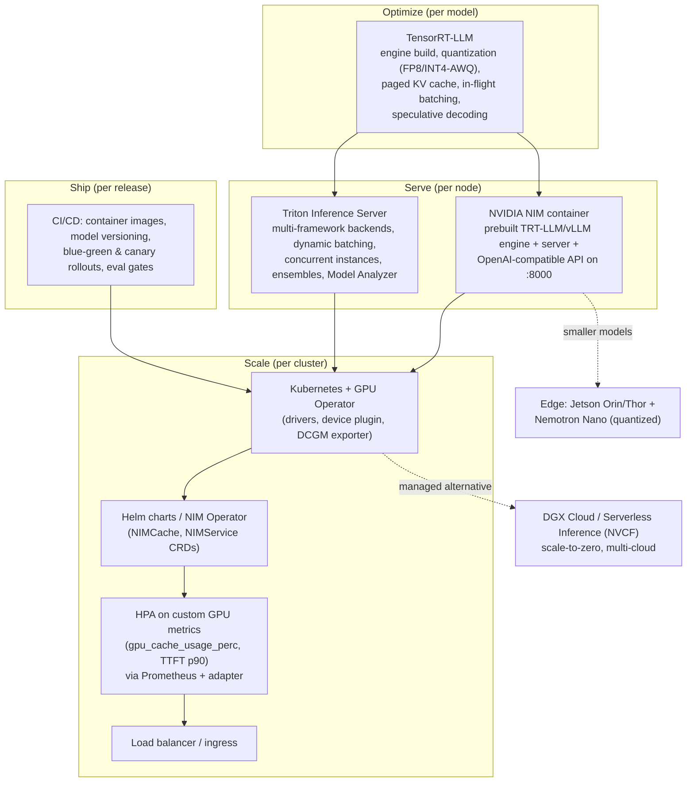

# Domain 4: Deployment and Scaling (13%)

> NCP-AAI (NVIDIA-Certified Professional: Agentic AI) — ~8-9 of 60-70 questions. Blueprint: NIM microservices, Triton Inference Server, TensorRT-LLM, scaling (HPA, multi-GPU parallelism, load balancing, throughput/latency tuning), edge deployment (Jetson/Nemotron Nano), DGX Cloud, CI/CD for agents.

## 1. Why this matters (exam + real agents)

An agent that works in a notebook dies in production without this domain: agents fire many LLM calls per user task (planning, tool selection, reflection), so inference cost and latency multiply, and a deployment that can't batch, autoscale, or roll back safely becomes the bottleneck of the whole system. The exam tests whether you can pick the right serving layer (NIM vs Triton vs raw TensorRT-LLM), the right parallelism (TP vs PP), the right scaling signal (KV-cache usage, not CPU), and the right rollout strategy (blue-green vs canary) for a given scenario — almost every question in this domain is a "best choice under constraints" question.

## 2. Mental model

**Analogy — a restaurant chain.** TensorRT-LLM is the industrial kitchen equipment: it makes one kitchen as fast as physically possible (quantization = pre-prepped ingredients, in-flight batching = cooks starting a new dish the instant a burner frees up, paged KV cache = labeled storage bins so no shelf space is wasted). Triton is the kitchen manager: it runs many menus (frameworks) at once, groups similar orders onto one pan (dynamic batching), and chains stations into a production line (ensembles). NIM is the franchise-in-a-box: a sealed container with the equipment, manager, menu, and a standard order window (OpenAI-compatible API) pre-installed — you just plug in power (a GPU) and open. Kubernetes + GPU Operator + HPA is corporate operations: it opens more branches when queues grow (horizontal scaling) and the load balancer is the host directing customers to the shortest line. Blue-green/canary is how you trial a new menu without poisoning every customer at once. Jetson is the food truck (small, local, offline-capable); DGX Cloud is renting fully staffed restaurants by the hour.



## 3. Core concepts

### 3.1 NVIDIA NIM microservices

**What:** NIM (NVIDIA Inference Microservice) = a prebuilt, versioned Docker container that bundles an optimized inference engine (TensorRT-LLM where possible, vLLM/SGLang fallback), the model weights/engine profile, a server runtime, and industry-standard APIs. **Why:** removes weeks of engine building/serving plumbing; "download a container, get optimized inference with an OpenAI-compatible API."

**Key facts the exam expects:**
- **OpenAI-compatible API** on port **8000**: `/v1/chat/completions`, `/v1/completions`, `/v1/models`; plus health (`/v1/health/ready`, `/v1/health/live`) and a **Prometheus `/v1/metrics`** endpoint. Existing OpenAI SDK code works by changing `base_url` + model name.
- **Run anywhere with NVIDIA GPUs:** cloud, on-prem data center, workstation. Typical launch: `docker run --gpus all -e NGC_API_KEY ... -p 8000:8000 nvcr.io/nim/meta/llama-3.1-8b-instruct`. Auth to the **NGC registry** (`nvcr.io`) via `NGC_API_KEY`. Cache models with `NIM_CACHE_PATH` (mount a volume so weights are not re-downloaded each restart).
- **Model profiles:** each NIM ships a manifest of profiles (engine × precision × TP/PP × optimization target). At startup NIM **auto-selects** the best compatible profile by *first* filtering to profiles runnable on your detected GPUs (number/type/VRAM — the memory-aware selector), then ranking the survivors by this tiebreak order (current LLM-NIM docs): (1) a cached **fine-tuned/custom** profile if present, (2) **hardware specificity** — prefer a profile whose `gpu` tag matches your exact device, (3) **backend** preference **tensorrt_llm > vllm > sglang**, (4) **precision** preference **MXFP4 > FP8 > INT8 > FP16 > BF16 > INT8WO > NVFP4 > INT4_AWQ**, (5) **latency-optimized over throughput-optimized**, (6) **highest tensor parallelism** supported by your GPU count. (NIM 1.x used a different, simpler chain — memory → precision → latency → TP → backend — which older study material and earlier exams reflect; the modern docs put **backend before precision**.) Override with `NIM_MODEL_PROFILE` (a profile ID/hash, or `default` to force re-selection). "Optimized" profiles = prebuilt TensorRT-LLM engines for specific GPUs; "generic" profiles = vLLM/SGLang running on any supported GPU.
- **Kubernetes deployment:** official **Helm charts hosted on NGC** (configure GPU count, resources, persistence, autoscaling via `values.yaml`). For fleet-scale management use the **NIM Operator** (`k8s-nim-operator`): CRDs **NIMCache** (pre-download/cache model to PVC so pods start fast), **NIMService** (deploy + autoscale a NIM), **NIMPipeline** (group of services). Pre-caching matters because model pulls are huge and otherwise add cold-start latency; default `emptyDir` storage re-downloads on every pod restart → use persistent storage in production.
- **NVIDIA GPU Operator:** the Kubernetes operator that makes GPU nodes usable — installs/lifecycle-manages the **GPU driver, container toolkit, Kubernetes device plugin (exposes `nvidia.com/gpu` resource), DCGM exporter (GPU metrics), MIG manager, node feature discovery**. It is a prerequisite layer, not an inference server. NIM/Triton pods request GPUs via `resources.limits: nvidia.com/gpu: 1`.

**Tiny example:** RAG agent on EKS → install GPU Operator → `helm install` the Llama-3.1-70B NIM with `tensorParallelism`/profile for 4×H100 → point the agent framework's OpenAI client at `http://nim-svc:8000/v1`.

### 3.2 Triton Inference Server

**What:** open-source, production inference server that serves **many models from many frameworks concurrently** on GPU/CPU. **Why:** one standardized serving layer (HTTP/gRPC + metrics) instead of one bespoke server per model. Agentic systems often serve LLM + embedder + reranker + classifier together — Triton's sweet spot.

| Feature | What it does | Key config |
|---|---|---|
| **Multi-framework backends** | TensorRT, **TensorRT-LLM**, ONNX Runtime, PyTorch (LibTorch), TensorFlow, OpenVINO, **vLLM**, Python (custom logic), FIL | `backend:` in `config.pbtxt` |
| **Model repository** | Filesystem layout: `model_repo/<model>/<version#>/model.x` + `config.pbtxt`; numeric version subdirectories | `version_policy { latest / all / specific }` |
| **Dynamic batching** | Server-side: queues individual requests and merges them into one batch before execution → big throughput gains for stateless models | `dynamic_batching { max_queue_delay_microseconds: 100, preferred_batch_size: [...] }` |
| **Concurrent model execution** | Multiple execution instances of the same (or different) models run in parallel on one or more GPUs | `instance_group [{ count: 2, kind: KIND_GPU, gpus: [0,1] }]` |
| **Model ensembles** | A DAG pipeline of models (e.g., preprocess → embed → rerank) executed inside Triton; avoids client round-trips; steps can mix frameworks and CPU/GPU; for dynamic control flow use **BLS (Business Logic Scripting)** in a Python backend instead | `platform: "ensemble"` + `ensemble_scheduling { step [...] }` |
| **Model Analyzer** | Offline tool that **sweeps configurations** (batch sizes, instance counts, dynamic-batching settings) under your constraints (latency SLO, memory budget) and recommends the optimal `config.pbtxt` | uses `perf_analyzer` under the hood |

**Concrete numbers (Triton conceptual guide, text-recognition model, 16 concurrent clients):** no batching ≈ 975 infer/s @ p95 34 ms → dynamic batching ≈ 3,187 infer/s @ 10.6 ms → dynamic batching + 2 instances ≈ 4,134 infer/s @ 8.2 ms. Moral: dynamic batching is the single biggest lever; instance count adds more; **always measure** (features are not always additive wins).

Client-side benchmarking tools: **perf_analyzer** (generic) and **GenAI-Perf** (LLM-focused: TTFT, ITL, TPS, RPS).

### 3.3 TensorRT-LLM

**What:** NVIDIA's open-source library for optimized LLM inference on NVIDIA GPUs — custom attention kernels, kernel fusion, quantization, and an optimized runtime. Historically: convert checkpoint → `trtllm-build` a **compiled engine per GPU type/precision/TP config** (engines are not portable across GPU architectures). Newer releases are **PyTorch-architecture-based** with a high-level **`LLM` API**; integrates with Triton (TRT-LLM backend), NIM (under the hood), and NVIDIA Dynamo.

**Engine building (classic flow):** (1) convert/quantize the checkpoint (quantization via **TensorRT Model Optimizer** / `quantize.py`, which produces calibrated quantized checkpoints), (2) `trtllm-build` compiles it into a serialized engine, (3) run it under the TRT-LLM runtime (Triton TRT-LLM backend or `trtllm-serve`). Build-time flags **bake limits into the engine**: `--max_batch_size`, `--max_input_len`, `--max_seq_len`, `--max_num_tokens`, plus TP/PP size — changing any of these (or the GPU architecture, or the precision) requires a **rebuild**. This is why NIM ships per-GPU "optimized" profiles, and why the PyTorch-backend path (no ahead-of-time engine compile) trades a little peak perf for flexibility.

**Quantization** — shrink weights (and sometimes activations) to cheaper datatypes: less VRAM, more KV-cache room, higher throughput, lower latency.

| Format | Bits | Where | Notes |
|---|---|---|---|
| FP16/BF16 | 16 | all | baseline |
| **FP8** | 8 | Hopper (H100) + Ada and later | ~2× perf, ~½ memory vs FP16, minimal accuracy loss; the "default good choice" on H100+ |
| **INT8 SmoothQuant** | 8 | broad | quantizes weights **and activations**; needs calibration |
| **INT4 AWQ** (Activation-aware Weight Quantization) | 4 | broad | **weight-only**; protects the most activation-salient weights; best for memory-constrained / edge; GPTQ is the other common 4-bit weight-only method |
| **FP4 / NVFP4** | 4 | Blackwell (B200/GB200) | hardware-native 4-bit floating point |

**KV cache & paged KV cache:** Autoregressive decoding re-uses attention keys/values of all previous tokens; caching them avoids quadratic recomputation but consumes huge VRAM that grows with batch × sequence length. Naive allocators reserve max-sequence-length contiguous buffers → fragmentation and waste. **Paged KV cache** (the PagedAttention idea) splits the cache into fixed-size **blocks** allocated on demand with an index table — near-zero waste, larger effective batch sizes, and enables **KV block reuse / prefix caching** (shared system prompts across agent calls reuse cached blocks — very relevant for agents that resend long system prompts). Related: **chunked prefill** splits long prompts into chunks so prefill doesn't stall ongoing decodes. Also distinguish **KV-cache quantization** (e.g., FP8 or INT8 KV cache, set independently of weight precision) — halves/quarters cache memory per token, so more concurrent sequences fit, at small accuracy cost; and tune `kv_cache_free_gpu_mem_fraction` (how much free VRAM the runtime reserves for KV blocks, default ~0.9).

**In-flight (continuous) batching:** classic static/dynamic batching waits for the whole batch to finish; because LLM outputs vary in length, finished sequences leave GPU slots idle. In-flight batching operates **at iteration granularity**: as soon as one request finishes, it is **evicted and a new request is injected immediately**, and context-phase (prefill) and generation-phase requests are interleaved in the same batch. Result: higher GPU utilization, lower queue wait. This is the LLM-specific evolution of dynamic batching (Triton dynamic batching = request-level, for stateless models; in-flight batching = token/iteration-level, inside TRT-LLM/vLLM).

**Speculative decoding:** generation is memory-bandwidth-bound (one token per heavy forward pass). A cheap **draft** mechanism proposes several tokens; the **target** model verifies them in a single parallel pass, accepting the longest correct prefix — same output distribution, fewer target passes. Techniques: **draft-target (separate small model), EAGLE / EAGLE-3, Medusa (extra decoding heads), MTP (multi-token prediction), NGram lookup**. Measured: up to **~3.55× throughput** on Llama 3.3 70B with draft models on HGX H200. Best when batch sizes are small/latency-bound; gains shrink at very high batch occupancy.

### 3.4 Scaling

**Horizontal pod autoscaling on GPU metrics.** CPU/memory utilization is *meaningless* for GPU inference pods — you scale on inference-specific signals. Pipeline: NIM/Triton expose Prometheus metrics → **Prometheus** scrapes → **prometheus-adapter** publishes them via the Kubernetes **custom metrics API** → **HPA** consumes them. Cluster GPU hardware metrics come from the **DCGM exporter** (installed by GPU Operator; e.g., `DCGM_FI_DEV_GPU_UTIL`). Good scaling signals from NVIDIA's blogs:
- `gpu_cache_usage_perc` — KV-cache utilization (the canonical NIM HPA metric; e.g., target AverageValue `100m` = 10%)
- `num_requests_running` / queue depth (concurrency)
- `time_to_first_token_p90` (latency SLO-driven scaling)

Caveats: set sensible **downscale stabilization** (default 5 min) to avoid flapping; GPU pods have **slow cold starts** (model load — mitigate with NIMCache/PVCs); scale-up needs free GPU nodes (pair HPA with cluster autoscaler); KEDA is the common alternative for event/queue-driven scaling.

**Multi-GPU / multi-node parallelism:**

| | **Tensor Parallelism (TP)** | **Pipeline Parallelism (PP)** |
|---|---|---|
| Split | Each layer's weight matrices **sharded across GPUs** (all GPUs work on every token) | **Contiguous groups of layers** assigned to different GPUs/nodes (stages) |
| Communication | All-reduce **every layer** → needs **NVLink/NVSwitch**-class bandwidth | Activations passed **between stages only** → tolerates PCIe / inter-node links |
| Effect | **Lowers per-request latency** (TTFT and ITL); splits weights *and* KV cache | **Raises throughput / enables bigger models**, but adds latency (pipeline bubbles) |
| Typical use | 2-8 GPUs within one NVLink island | across nodes, or PCIe-only boxes |
| Rule of thumb | `TP = GPUs per node`, `PP = number of nodes` for models too big for one node | combine TP×PP for multi-node (e.g., 405B: TP8 × PP2) |

(Also exists: **expert parallelism** for MoE models; **data parallelism** = just more replicas behind a load balancer — that's horizontal scaling, not model splitting.)

**MIG (Multi-Instance GPU) — the *opposite* of multi-GPU parallelism.** On A100/H100/H200/B200, MIG hardware-partitions **one** GPU into up to **7 isolated instances**, each with its own slice of compute, memory, and memory-bandwidth (hardware QoS isolation, not just time-slicing). Use it to *pack many small models onto one GPU* — right-sizing (a 7B embedder doesn't need a whole H100), guaranteeing isolation between tenants/agents, and raising utilization. The GPU Operator's **MIG manager** configures the partition profiles; each MIG instance is exposed to Kubernetes as its own `nvidia.com/mig-<profile>` (e.g. `nvidia.com/mig-1g.10gb`) schedulable resource, so a pod requests a slice instead of a whole GPU. Exam contrast: **TP/PP = spread one big model across many GPUs; MIG = split one GPU among many small models/pods.** A model that needs TP across GPUs **cannot** run inside a single MIG slice.

**Load balancing:** replicas behind a K8s Service/ingress or gateway. Round-robin is naive for LLMs because request costs vary wildly (prompt/output lengths) — prefer **least-outstanding-requests** or KV-cache/prefix-aware routing (e.g., NVIDIA Dynamo's KV-aware router, gateway-API inference extensions). Sticky/affinity routing improves prefix-cache hit rates for agents reusing long system prompts. Multi-node TP/PP groups must be treated as one logical replica (LeaderWorkerSet pattern).

**Throughput vs latency & batch size tuning:** bigger batches = better GPU utilization = higher **tokens/sec per GPU** (cheaper per token) but each request waits longer → worse TTFT/ITL. Key metrics: **TTFT** (time to first token — prefill + queue; what users perceive as responsiveness), **ITL/TPOT** (inter-token latency — streaming smoothness), **end-to-end request latency**, **TPS** (tokens/sec, system throughput), **RPS**. `max_batch_size` caps simultaneous in-flight requests; if concurrency > max_batch_size × replicas, requests queue and TTFT explodes. Method: use **GenAI-Perf** to sweep concurrency, plot throughput-vs-latency curves, pick the knee that meets your SLO ("goodput" = throughput while meeting latency SLO). Interactive chat → latency-optimized profile, small batches, maybe speculative decoding. Offline/batch agent jobs (summarize 1M docs) → throughput-optimized profile, large batches.

### 3.45 NAT (NeMo Agent Toolkit) deployment layer — the agent-serving tier

Everything above (NIM, Triton, TRT-LLM) serves the **model**. NAT serves the **agent** — the orchestration tier that holds the agent graph, tool routing, memory, and guardrails, and calls the model tier over HTTP. The exam's deployment domain is increasingly NAT-specific, and the single most-tested idea is **separation of concerns: NAT orchestrates (CPU), NIM infers (GPU); NAT calls NIM.** They are different containers, scale on different signals, and have different cold-start behavior.

**NAT deployment servers (front ends).** A built NAT workflow is exposed through a *front end* configured under `general.front_end` in the workflow YAML; the CLI launches it. You pick the front end by **who/what consumes the agent**:

| Front end | CLI | Protocol / port | Use when |
|---|---|---|---|
| **FastAPI server** | `nat serve --config_file wf.yml` (alias for `nat start fastapi`) | REST + WebSocket, default **:8000** | **Default production choice** — clients call the agent over HTTP/WS |
| **MCP server** | `nat mcp serve` | Model Context Protocol (MCP SDK runtime) | Agent must be **discoverable/callable as a tool** by other MCP-compatible agents/orchestrators (e.g. a "DB-query agent" other agents invoke) |
| **FastMCP server** | `nat fastmcp server run` | MCP over streamable-HTTP, default **:9902**, tools at `/mcp` | Lightweight MCP — simpler/lower-overhead MCP scenarios, dev/test of MCP integrations |
| **A2A server** | `nat a2a serve` (pkg `nvidia-nat[a2a]`), default **:10000** | **Agent-to-Agent** protocol (Linux Foundation open standard) | **Distributed multi-agent**: each agent runs as an independent service, discovers peers via **Agent Cards**, delegates tasks. Independent scaling/deployment per agent |
| **Console front end** | `nat run` (console) | Terminal/interactive | **Dev & debugging only** — never production |

**FastAPI front-end surface (verified against NAT 1.7 docs):** `POST /generate` and `POST /generate/stream`, `POST /chat` and `POST /chat/stream`, an **OpenAI-compatible** `POST /v1/chat/completions`, a `/websocket` endpoint for bidirectional streaming, `GET /health`, and `POST /evaluate`. So a NAT agent is reachable by *the same* OpenAI client pattern you point at a NIM — except `:8000` here serves the *agent*, not the raw model.

> **Selection decision tree (memorize the shape):** dev/debug → **Console**. Else, is the agent consumed by other agents? → no → **FastAPI** (default). → yes → do agents run as separate services? → yes → **A2A**. → no → need full MCP? → yes → **MCP** → no → **FastMCP**.

**NAT async job management (Dask).** Agent runs take seconds to minutes; holding an HTTP connection open invites client timeouts, load-balancer disconnects, and retry storms. NAT's async pattern: client `POST`s a request → server **returns a job ID immediately** (background-queued) → Dask schedules/executes the workflow → client **polls** the job-status/result endpoint (or subscribes via WebSocket) → result is fetched when complete. NAT's `/evaluate` endpoint is the canonical Dask-backed async job (it stores the request for background processing and hands back a job ID). Config knobs: Dask scheduler type (local threads vs distributed), job TTL (how long completed results are kept), execution-history retention for debugging.

*Worked example — which front end + sync vs async?* "A user submits a complex research task that runs ~90 s; other internal agents must also be able to call this researcher as a tool." → Front end: it's consumed by other agents but they're independent services → **A2A** (or **MCP** if they just call it as a tool in one process). Invocation: 90 s exceeds safe HTTP sync limits → **async job submit → job ID → poll** (Dask-backed), *not* a synchronous REST call with a long timeout (that's the trap answer).

**NAT ↔ NIM as two tiers (the architecture the exam draws):**

```
client ─▶ NAT FastAPI/A2A server (CPU pod)   ── agent graph, tool routing, memory, guardrails
                     │  OpenAI-compatible HTTP/gRPC
                     ▼
              NIM container (GPU pod)          ── optimized model serving, batching, quantization
                     ▼
                GPU cluster (H100/A100)
```

The two tiers **scale independently**: the NAT pod is CPU-bound and cheap → scale **horizontally** (more replicas behind an LB) on RPS/concurrency with a vanilla HPA; the NIM pod is GPU-bound and the real bottleneck → scale **vertically first** (bigger GPUs / TP) then horizontally, on `gpu_cache_usage_perc` / queue depth (§3.4). One agent request **fans out into many LLM calls** (planning, tool selection, reflection), so the two tiers have *different load curves* — over-provisioning the cheap NAT tier won't help when NIM is saturated, and autoscaling the NAT pod on **CPU** is a classic wrong answer (the bottleneck is downstream GPU inference).

### 3.46 Containerization & GPU resource planning for agent stacks

A production agent system is **multi-container by nature** — collapsing it into one image makes independent scaling impossible. Typical stack: **NAT server** (orchestration, CPU) + **NIM** (inference, GPU) + **vector DB** (Milvus/pgvector, stateful) + **cache/job broker** (Redis) + **observability** (Phoenix/Grafana).

**Docker Compose for dev / single node.** GPU is requested via the Compose `deploy.resources.reservations.devices` block (`driver: nvidia`, `count`, `capabilities: [gpu]`); mount a volume on `/opt/nim/.cache` so NIM weights aren't re-pulled each restart; use `depends_on … condition: service_healthy` so the agent waits for Milvus/Redis. A CPU-only laptop can still run the agent by pointing it at a **hosted NIM** on `build.nvidia.com` (`integrate.api.nvidia.com/v1`) instead of a local GPU NIM.

```yaml
# docker-compose.yml (excerpt) — local NIM with 2 GPUs for a 70B model
services:
  nim-llm:
    image: nvcr.io/nim/meta/llama-3.1-70b-instruct:latest
    ports: ["8000:8000"]
    environment: [ "NGC_API_KEY=${NGC_API_KEY}" ]
    deploy:
      resources:
        reservations:
          devices:
            - { driver: nvidia, count: 2, capabilities: [gpu] }   # TP across 2 GPUs
    volumes: [ "nim-cache:/opt/nim/.cache" ]                       # persist weights
  agent:                                                          # NAT FastAPI server — CPU only
    build: { context: .. }
    ports: ["8080:8080"]
    environment: [ "NIM_BASE_URL=http://nim-llm:8000/v1" ]         # decouple tiers via env var
    depends_on: { nim-llm: { condition: service_started } }
```

**Helm for production.** Structure the chart so each tier is independently versioned/scaled: `nat-deployment.yaml` + `nat-service.yaml` (orchestration), `nim-deployment.yaml` + internal `nim-service.yaml` (inference, not externally exposed), `vectordb-statefulset.yaml`, `configmap.yaml` (guardrails configs, prompts), `secrets.yaml` (NGC/API keys), `hpa.yaml`. **Anti-pattern:** one monolithic Helm chart packing NAT+NIM+DB+observability — it blocks independent scaling and versioning; use subcharts with clear interfaces.

**GPU resource planning (rules of thumb, verify per model/Blueprint):**

| Component | CPU | Memory | GPU | Notes |
|---|---|---|---|---|
| **NAT server** | ~4 cores | ~8 GB | **0** | CPU-only orchestration; scale horizontally |
| **NIM, 7-8B model** | ~4 cores | ~16 GB | **1× A100/H100** | single GPU sufficient |
| **NIM, 70B model** | ~8 cores | ~32 GB | **2× H100 80 GB** | needs tensor parallelism (TP=2) |
| **Vector DB** | ~4 cores | ~16 GB | 0 | SSD/NVMe-backed, stateful |

**GPU count is *not* fixed per model** — it depends on quantization, sequence length, **and concurrency**. A 70B serving 1 request fits on 2×H100; serving ~50 concurrent requests may need 8×H100. Always benchmark under realistic load (GenAI-Perf, §3.4) before sizing.

**AI-Q Blueprint reference numbers (current docs, exam-quotable):** the AI-Q research-agent Blueprint's **default** mode runs inference on NVIDIA's **hosted API Catalog → 0 local GPUs**. When you **self-host via NIM**, the documented Docker-Compose footprint is **2× H100 80 GB (or 3× A100 80 GB) for the RAG component**, **plus 2× H100 (or 4× A100) to self-host the Llama 3.3 70B model**, scaling toward ~5× H100 / 8× A100 for a full self-contained stack (plus ~435 GB disk). The reference courseware's "AI-Q minimum = 2× H100" maps to the **RAG-component** figure — always verify the exact number on the specific Blueprint's page/repo, as requirements vary significantly across Blueprints and versions.

**Agent-specific scaling (why request-count autoscaling under-counts).** A classification model is one fixed forward pass; an **agent** plans a multi-step run, makes a *variable* number of LLM + tool calls, and finishes after a *variable* time. A simple Q might be 1 LLM call (~2 s); a research task might be 8 LLM + 15 tool calls (~90 s). So scaling on **request count** badly underestimates real load — two requests can differ 50× in work. Scale instead on the work signals: **in-flight (active) agent executions**, **GPU inference queue depth**, and **token throughput** (tokens/sec consumed vs available). *Token-budget-aware scaling:* if each request can burn a 50K-token budget and you serve 100 concurrent, you need inference capacity for ~5M in-flight tokens — size NIM replicas on token throughput, not RPS. *Multi-model scaling:* an agent using a 70B reasoner + a small classifier + an embedder should scale each **independently** — the reasoner is the bottleneck; don't over-provision the cheap models to match it.

**Backpressure & readiness for agent endpoints.** Because a single complex request can consume 100K+ tokens, agent endpoints need **token-aware rate limiting**, not just request-count limiting, plus **backpressure**: when the inference queue is full, return **HTTP 429** (rate-limit) / **503** (overloaded) with a `Retry-After` header instead of accepting work you can't serve. Two distinct K8s probes matter: **liveness** ("is the process alive?" → restart if not) and **readiness** ("can this instance take traffic?" → pull from the LB if not). NIM readiness is special: the pod can be *running* yet not *ready* for **minutes** while it loads tens of GB into GPU memory — so set a generous `initialDelaySeconds` and gate the LB on `/v1/health/ready`, or a traffic spike routes to cold pods. **Graceful shutdown matters for agents specifically:** agent executions carry state (conversation history, intermediate tool results); killing a pod mid-run loses the whole multi-step execution — drain in-flight executions before terminating.

### 3.5 Edge deployment (Jetson, Nemotron Nano)

**Why edge:** physical-world agents (robots, inspection, kiosks) need **low latency, privacy/data locality, and offline operation** — no round-trip to a datacenter. **Platform:** NVIDIA **Jetson** modules (Orin Nano/NX/AGX → **Jetson Thor** generation) running **JetPack** (CUDA/TensorRT on aarch64). Frameworks: TensorRT-LLM/llama.cpp/Ollama on-device; some NIMs are supported on Jetson-class devices.

**Nemotron Nano** = NVIDIA's small open reasoning model family **purpose-built for edge/local agents** (e.g., Nemotron Nano 9B v2 hybrid Mamba-Transformer; Nemotron 3 Nano 4B). Designed for tool calling + reasoning at small size; runs on Jetson Orin Nano/Thor, DGX Spark, RTX PCs. Quantization is essential at the edge: FP8 build gives ~1.8× latency/throughput gain over BF16 on Jetson Thor; a Q4_K_M 4-bit build hits ~18 tok/s on an 8 GB Orin Nano. Exam pattern: "agent must run offline on a robot with 8 GB" → **quantized (INT4/Q4) Nemotron Nano on Jetson**, not a 70B NIM.

### 3.6 DGX Cloud

NVIDIA's managed AI platform: reserved clusters of NVIDIA GPUs hosted in partner clouds (AWS/Azure/OCI/GCP) with the full NVIDIA AI Enterprise software stack — train/fine-tune/serve without owning hardware. For deployment, the key piece is **DGX Cloud Serverless Inference**, built on **NVIDIA Cloud Functions (NVCF)**: deploy **NIMs, custom containers, or Helm charts** behind a single API; **auto-scales including scale-to-zero** (no charge while idle, no charge for cold-boot time); **multi-cloud/multi-cluster** — one function can burst across DGX Cloud and partner GPU capacity. Choose it when you want elastic, bursty agent inference without operating Kubernetes yourself.

### 3.7 CI/CD for agents

- **Containerization:** agent code, tool servers (MCP), and model servers ship as separate images; GPU pods request `nvidia.com/gpu`; pin image tags + model versions for reproducibility (an "agent release" = code version + prompt version + model version + engine version, e.g., Triton↔TRT-LLM container versions must match).
- **Model versioning:** Triton model repo numeric version dirs + `version_policy` (serve latest / all / specific — serving 2 versions simultaneously enables A/B); NIMs are versioned container tags on NGC; registries (NGC, MLflow, etc.) track lineage.
- **Blue-green:** two identical environments; flip 100% of traffic to green after validation; **instant rollback** (flip back); costs 2× capacity during the switch — expensive with GPUs. Best for big, risky changes needing instant rollback.
- **Canary:** route a small slice (1-10%) of live traffic to the new version, watch metrics (latency, error rate, **plus agent-quality signals: eval scores, hallucination/guardrail-violation rates, task success, token cost**), then ramp 10→25→50→100%. Lowest blast radius; slower rollout; needs good observability.
- Also know: **rolling** update (K8s default, gradual pod replacement, medium risk, no 2× cost) and **shadow/mirror** (new version gets a copy of traffic, responses discarded — zero user risk, pure evaluation).
- **Agent-specific gates:** CI runs eval suites (task success, tool-call correctness, safety) before promotion — model/prompt changes can regress behavior without any code diff.

## 4. NVIDIA-specific layer

| Product | Role in this domain | Choose it when |
|---|---|---|
| **NAT deployment server** | The agent-serving tier — exposes a NAT workflow via FastAPI / MCP / FastMCP / A2A / Console front ends; calls NIM for inference | Always for the orchestration layer; pick the front end by who consumes the agent (HTTP clients → FastAPI; agents-as-tools → MCP/FastMCP; distributed multi-agent → A2A) |
| **NVIDIA Dynamo** (agent angle) | Inference-acceleration framework *beneath* NIM (disaggregated prefill/decode, KV-aware routing) — faster tokens → lower per-step agent latency, which **compounds** over multi-step runs | Very large multi-node LLM serving feeding an agent fleet |
| **NIM** | Prebuilt optimized inference container + OpenAI API | Fastest path to production-grade LLM serving; enterprise support; standard models |
| **NIM Operator** | K8s operator (NIMCache/NIMService/NIMPipeline CRDs) | Managing many NIMs at cluster scale; pre-caching; CRD-driven autoscaling |
| **nim-deploy repo / NGC Helm charts** | Reference Helm deployments for NIM | Single-service Helm installs, customization via values.yaml |
| **GPU Operator** | Installs/manages drivers, container toolkit, device plugin, DCGM exporter, MIG on K8s nodes | Always — prerequisite for GPUs in Kubernetes |
| **Triton Inference Server** | Multi-framework serving, dynamic batching, ensembles | Serving heterogeneous/custom models (embedder+reranker+LLM), custom pipelines |
| **TensorRT-LLM** | LLM kernel/runtime optimization, quantization, in-flight batching, spec decode | Max performance, custom/fine-tuned models, full control |
| **Model Analyzer / perf_analyzer / GenAI-Perf** | Config sweeps & LLM benchmarking (TTFT/ITL/TPS) | Batch-size & instance tuning; SLO validation |
| **DCGM + DCGM exporter** | GPU telemetry → Prometheus | GPU dashboards, hardware-level scaling/alerting |
| **NVIDIA Dynamo** | Datacenter-scale distributed inference framework (disaggregated prefill/decode, KV-aware routing) — successor ecosystem to Triton for LLM fleets | Very large multi-node LLM serving |
| **DGX Cloud / NVCF Serverless Inference** | Managed GPU platform; serverless functions, scale-to-zero | No-ops elastic inference; bursty workloads |
| **Jetson + JetPack + Nemotron Nano** | Edge hardware + SDK + small agentic models | On-device, offline, low-latency physical-world agents |
| **NGC (nvcr.io)** | Registry for NIM containers, Helm charts, models | Pulling anything NVIDIA-built (needs NGC_API_KEY) |

## 5. Decision frameworks

**Serving layer:**

| Scenario | Best choice | Why |
|---|---|---|
| Standard model, fastest enterprise-supported path, OpenAI API needed | **NIM** | Prebuilt optimized engine + API, Helm/Operator deploy |
| Many heterogeneous models (ONNX classifier + PyTorch embedder + LLM) on shared GPUs | **Triton** | Multi-framework backends, concurrent execution, ensembles |
| Custom-architecture model, squeeze max perf, full control of quantization/batching | **TensorRT-LLM** directly (often behind Triton) | Engine-level control |
| Preprocess → embed → rerank pipeline with no client round-trips | **Triton ensemble** (BLS if conditional logic) | Server-side DAG |
| Zero infra ops, spiky traffic, want scale-to-zero | **DGX Cloud Serverless Inference (NVCF)** | Managed autoscaling |
| Offline robot / privacy-critical on-device agent | **Jetson + quantized Nemotron Nano** | Edge constraints |

**NAT deployment server (front end):**

| Scenario | Best choice | Why |
|---|---|---|
| Clients call the agent over HTTP/WebSocket (default production) | **FastAPI server** (`nat serve`, :8000) | REST + streaming + OpenAI-compatible `/v1/chat/completions` |
| Agent must be callable **as a tool** by other MCP agents | **MCP server** (`nat mcp serve`) | Publishes the workflow + tools as MCP tools |
| Lightweight / dev MCP integration | **FastMCP server** (`nat fastmcp server run`, :9902 `/mcp`) | Less overhead, streamable-HTTP |
| Distributed multi-agent, each agent an **independent service** | **A2A server** (`nat a2a serve`, :10000) | Agent Cards for discovery; independent scaling per agent |
| Local development / debugging only | **Console front end** (`nat run`) | Interactive terminal — never production |
| Agent run takes 30 s+ (long research task) | **Async job** (submit → job ID → poll, Dask-backed) | Avoids HTTP timeouts, LB disconnects, retry storms — **not** a long-timeout sync call |

**Parallelism & performance:**

| Question | Pick | Signal words |
|---|---|---|
| Model fits on node, want lowest latency, NVLink available | **TP** | "minimize TTFT", "NVLink", "2-8 GPUs" |
| Model spans nodes / only PCIe / throughput priority | **PP** (often TP within node × PP across nodes) | "two nodes", "PCIe only", "doesn't fit" |
| More users, model fits on one GPU | **More replicas + LB (horizontal/data parallel)** — not TP | "concurrency", "QPS" |
| Cheaper per token, batch jobs | **Bigger batch / throughput-optimized profile** | "cost per token", "offline" |
| Snappier chat | **Smaller batch / latency profile / speculative decoding** | "TTFT", "interactive" |
| Stateless small model (embedder, classifier) | **Triton dynamic batching** | request-level merge |
| Autoregressive LLM | **In-flight (continuous) batching** | variable output lengths |

**Quantization:** H100/Hopper+ and quality-sensitive → **FP8**. Severely memory-bound / edge / single small GPU → **INT4 AWQ** (weight-only). Need weight+activation INT8 on older GPUs → **INT8 SmoothQuant**. Blackwell → **NVFP4**.

**Rollouts:** instant-rollback for a major risky change, can afford double capacity → **blue-green**. Gradual, metric-gated exposure with minimal blast radius → **canary**. Zero user exposure, evaluate on real traffic → **shadow**. Routine minor stateless update → **rolling**.

**Autoscaling signal:** LLM NIM → `gpu_cache_usage_perc` or TTFT p90 (custom metrics via Prometheus adapter); queue-driven async agents → KEDA on queue depth; **never CPU utilization for GPU inference pods**.

## 6. Exam traps & gotchas

1. **HPA on CPU/memory for LLM pods** — wrong. GPU inference pods show low CPU while saturated; scale on `gpu_cache_usage_perc`, queue depth/concurrency, or TTFT p90 via Prometheus + prometheus-adapter (custom metrics API).
2. **GPU Operator vs NIM Operator vs device plugin** — GPU Operator provisions the GPU *infrastructure* (drivers, toolkit, device plugin, DCGM); NIM Operator manages *NIM microservice lifecycle* (caching, deploy, autoscale). Neither serves models itself.
3. **Dynamic batching vs in-flight batching** — Triton dynamic batching merges requests *before* execution (great for stateless models); in-flight/continuous batching swaps requests *per token iteration* inside the LLM engine (TRT-LLM/vLLM). For LLM generation, in-flight batching is the answer.
4. **TP vs PP reversed** — TP = split *within* layers, needs NVLink, lowers latency; PP = split *by* layers/stages, tolerates slow interconnects, raises throughput/capacity but adds latency (bubbles). "Lowest latency on one NVLink node" → TP. "Across two nodes" → TP in-node + PP across nodes.
5. **Horizontal scaling vs multi-GPU parallelism** — more concurrent users of a model that *fits on one GPU* → add replicas + load balancer, NOT tensor parallelism. TP/PP is for models too big or too slow on one GPU.
6. **Throughput improvements ≠ latency improvements** — increasing batch size raises tokens/sec but *worsens* TTFT/ITL. If the question's constraint is a latency SLO, "increase batch size" is a trap answer.
7. **TTFT vs ITL vs tokens/sec** — TTFT = prefill/queue (perceived responsiveness); ITL/TPOT = per-token streaming speed; TPS = system throughput. Long prompts hurt TTFT; long outputs accumulate ITL. Don't accept a tokens/sec answer to a "first response feels slow" problem.
8. **Quantization confusions** — FP8 needs Hopper(H100)/Ada or newer; AWQ is *weight-only* 4-bit (activation-aware = uses activation statistics to pick salient weights, it does NOT quantize activations); SmoothQuant is INT8 weights+activations. Quantization mainly buys memory + bandwidth → more KV cache + throughput.
9. **Paged KV cache ≠ faster math** — it eliminates memory fragmentation/over-allocation, enabling bigger batches and prefix/block reuse; it is a memory-management technique, not a kernel speedup.
10. **Speculative decoding never changes output quality** — target model verifies and accepts/rejects draft tokens, preserving the target distribution. Trap: "speculative decoding trades accuracy for speed" is false. Also it helps latency-bound/small-batch regimes most, not max-throughput ones.
11. **Blue-green vs canary cost/rollback** — blue-green = instant rollback but ~2× resources (expensive with GPUs!); canary = gradual + cheap but slower rollback/rollout. "Instant rollback required" → blue-green; "limit blast radius, validate on live traffic" → canary; "no user exposure at all" → shadow.
12. **Triton ensemble vs BLS** — ensembles are static DAGs; conditional/looping logic (agent-ish control flow) needs BLS (Python backend), not an ensemble.
13. **NIM profile auto-selection order** — filter to GPU-runnable profiles first, then rank: backend (trtllm > vllm > sglang) → precision (MXFP4 > FP8 > … > INT4_AWQ) → *latency*-optimized default → higher TP. Trap: NIM does NOT default to throughput-optimized (it defaults to **latency**-optimized). Second trap: current docs put **backend before precision** (NIM 1.x's older memory→precision→latency→TP→backend chain has been superseded — but two facts hold across both: latency-optimized is the default and trtllm is the preferred backend).
14. **Edge sizing** — Jetson Orin Nano (8 GB) cannot run a 70B model; the answer is a quantized small model (Nemotron Nano INT4/Q4), or hybrid edge-cloud where the edge handles fast/local skills.
15. **NAT vs NIM are not the same thing** — NAT is the **orchestration** tier (agent graph, tool routing, memory, guardrails, CPU); NIM is the **inference** tier (optimized model serving, GPU). **NAT calls NIM.** "Deploy the agent as a single container" is wrong — the stack is multi-container (NAT + NIM + vector DB + Redis + observability) precisely so the tiers scale independently. Autoscaling the **NAT pod on CPU** won't help when NIM is the bottleneck.
16. **NAT front-end selection** — match the front end to the *consumer*: HTTP clients → **FastAPI** (`nat serve`, :8000); agent-as-a-tool for other MCP agents → **MCP** (`nat mcp serve`) (or **FastMCP**, :9902, for lightweight); each agent an independent service in a multi-agent system → **A2A** (Agent Cards); dev/debug → **Console**. Trap: choosing A2A when the agent is just consumed as a tool by one orchestrator (that's MCP), or choosing Console for production.
17. **Long-running agent runs need async jobs, not long HTTP timeouts** — a 90 s research task over a synchronous REST call hits client timeouts, LB disconnects, and retry storms. Correct NAT pattern: submit → **return a job ID immediately** → Dask schedules execution → client **polls** status/result (or WebSocket). "Synchronous REST with a 120 s timeout" is the trap distractor.
18. **Request-count autoscaling under-counts agent load** — agent runs do a *variable* number of LLM/tool calls, so two requests can differ 50× in work. Scale on **token throughput / in-flight executions / inference queue depth**, with **token-aware** rate limiting and **HTTP 429/503 + Retry-After** backpressure — not raw request count. And **graceful-drain** in-flight executions on shutdown (agent runs carry state; a mid-run pod kill loses the whole multi-step execution).

## 7. Scenario drills

1. **A chat agent on 1×H100 feels sluggish at first response under load, though streaming is smooth once started. Best first fix?** → Investigate queueing/prefill: check concurrency vs `max_batch_size`, scale replicas or enable chunked prefill / latency-optimized profile — TTFT is the bottleneck, not ITL, so raising batch size would worsen it.
2. **Deploy Llama 3.1 405B for lowest possible latency on two 8×H100 NVLink nodes connected by InfiniBand.** → TP=8 within each node + PP=2 across nodes — TP exploits NVLink for latency; PP spans the slower inter-node link where only stage boundaries communicate.
3. **A RAG pipeline (preprocessing → embedding → reranking → LLM) suffers from client-side round-trip latency between steps.** → Serve it as a Triton model ensemble (DAG executed server-side, mixed frameworks/devices) — eliminates network hops between stages.
4. **Your NIM pods restart and take 20+ minutes to become ready because weights re-download each time.** → Use persistent storage / NIM Operator's NIMCache to pre-cache the model profile to a PVC instead of default emptyDir.
5. **You must release a new fine-tuned model for a customer-facing agent; leadership demands the ability to revert instantly if quality drops, and budget allows temporary duplicate capacity.** → Blue-green deployment — full parallel environment with instant traffic flip-back; canary would be the answer if the requirement were "minimize users exposed while validating with live metrics."
6. **An inspection robot must run a reasoning + tool-calling agent fully offline on an 8 GB Jetson Orin Nano.** → Deploy a 4-bit quantized Nemotron Nano (small agentic model) on-device via JetPack/TensorRT-LLM or llama.cpp — cloud NIMs and large models violate the offline/memory constraints.
7. **Your NAT agent must be discoverable and callable as a tool by other MCP-compatible agents.** → Serve it with the **MCP server** front end (`nat mcp serve`) — it publishes the workflow + its tools as MCP tools. (Use **FastMCP** if you only need a lightweight MCP runtime; use **A2A** if the agents are independent services collaborating peer-to-peer rather than calling one as a tool.)
8. **A user submits a research task that takes ~90 s; you keep getting 504s and duplicate executions.** → Switch from synchronous REST to **NAT async job management**: return a **job ID** immediately (Dask-backed background execution), have the client poll the status/result endpoint (or use the WebSocket). A 120 s sync timeout is the trap answer — it still breaks under LBs/proxies.
9. **An agent uses a 70B reasoner + a small classifier + an embedder; how do you scale and where do you autoscale on CPU?** → Scale each model **independently** (the 70B is the bottleneck; don't over-provision the cheap ones). Never autoscale the GPU NIM on CPU — and the **NAT orchestration pod** (CPU) scales horizontally on RPS, while the NIM tier scales on `gpu_cache_usage_perc` / token throughput. They're separate tiers with separate load curves.
10. **Plan GPU for a customer-support agent: 100 concurrent users, 70B reasoning model, self-hosted.** → NAT server = CPU-only (0 GPU), horizontally scaled; NIM 70B = **2× H100 80 GB minimum for TP**, but 100 concurrent users likely needs more (size from GenAI-Perf token-throughput curves, not the 1-request figure); vector DB stateful on NVMe. If referencing the **AI-Q Blueprint**, the documented self-hosted RAG footprint is **2× H100 (3× A100)** plus **+2× H100** to self-host the 70B — but the *default* AI-Q mode uses hosted API Catalog (0 local GPUs).

## 8. Builder's corner

- **Exploit prefix caching deliberately.** Agents resend huge system prompts + tool schemas on every step. Paged-KV block reuse (TRT-LLM/vLLM) plus cache-aware/sticky routing across replicas can cut TTFT dramatically — keep the static prompt prefix byte-identical across calls.
- **Benchmark with your real traffic shape before sizing.** Use GenAI-Perf to sweep concurrency with your actual ISL/OSL (agents = long inputs, short outputs); pick batch size and replica count from the throughput-latency knee that meets your SLO, then set HPA thresholds (e.g., `gpu_cache_usage_perc`) from those curves — never from defaults.
- **Treat model + prompt + engine as one versioned artifact.** Pin NIM container tags, TRT-LLM↔Triton versions, and prompt versions together; promote through CI only after automated eval gates (task success, tool-call validity, guardrail violations), and canary on quality metrics, not just 5xx rates.
- **Budget for cold starts.** GPU pods load tens of GB; autoscaling that looks great on paper fails if scale-up takes 15 minutes. Pre-cache models (NIMCache/PVCs), keep a warm minimum replica count, and use scale-to-zero (NVCF) only where cold latency is acceptable.
- **Right-size with quantization before adding GPUs.** FP8 (or INT4 AWQ when memory-bound) often halves the GPU bill at near-equal quality — try a lower-precision profile and a smaller/speculative-decoded model before reaching for TP across more silicon.

## 9. Sources

- NVIDIA NIM for LLMs docs — model profiles & selection: https://docs.nvidia.com/nim/large-language-models/latest/deployment/model-profiles-and-selection.html
- NVIDIA NIM Operator docs: https://docs.nvidia.com/nim-operator/latest/index.html
- NeMo Agent Toolkit (NAT) — CLI & front ends: https://docs.nvidia.com/nemo/agent-toolkit/latest/reference/cli.html
- NeMo Agent Toolkit — FastAPI API server endpoints: https://docs.nvidia.com/nemo/agent-toolkit/1.5/reference/rest-api/api-server-endpoints.html
- NeMo Agent Toolkit — FastMCP server (port 9902, /mcp): https://docs.nvidia.com/nemo/agent-toolkit/latest/run-workflows/fastmcp-server.html
- NeMo Agent Toolkit — A2A server (Agent Cards, Linux Foundation A2A): https://docs.nvidia.com/nemo/agent-toolkit/latest/run-workflows/a2a-server.html
- NeMo Agent Toolkit — Evaluate API (Dask-backed async jobs, job IDs): https://docs.nvidia.com/nemo/agent-toolkit/1.5/reference/rest-api/evaluate-api.html
- NVIDIA AI-Q Blueprint (hardware footprint; default hosted API Catalog): https://build.nvidia.com/nvidia/aiq · https://docs.nvidia.com/aiq-blueprint/latest/
- NVIDIA/nim-deploy (Helm/K8s reference implementations): https://github.com/NVIDIA/nim-deploy
- NVIDIA/k8s-nim-operator: https://github.com/NVIDIA/k8s-nim-operator
- NVIDIA Tech Blog — Horizontal Autoscaling of NIM on Kubernetes: https://developer.nvidia.com/blog/horizontal-autoscaling-of-nvidia-nim-microservices-on-kubernetes/
- NVIDIA Tech Blog — Autoscaling Enterprise RAG components on K8s: https://developer.nvidia.com/blog/enabling-horizontal-autoscaling-of-enterprise-rag-components-on-kubernetes/
- Triton tutorials — Dynamic Batching & Concurrent Model Execution: https://github.com/triton-inference-server/tutorials/blob/main/Conceptual_Guide/Part_2-improving_resource_utilization/README.md
- Triton docs — Ensemble Models: https://docs.nvidia.com/deeplearning/triton-inference-server/user-guide/docs/user_guide/ensemble_models.html
- Triton docs — TRT-LLM Autoscaling & Load Balancing on K8s: https://docs.nvidia.com/deeplearning/triton-inference-server/user-guide/docs/tutorials/Deployment/Kubernetes/TensorRT-LLM_Autoscaling_and_Load_Balancing/README.html
- TensorRT-LLM Overview: https://nvidia.github.io/TensorRT-LLM/overview.html
- NVIDIA Tech Blog — 3x Llama 3.3 70B throughput with speculative decoding: https://developer.nvidia.com/blog/boost-llama-3-3-70b-inference-throughput-3x-with-nvidia-tensorrt-llm-speculative-decoding/
- NVIDIA Tech Blog — LLM Inference Benchmarking: Fundamental Concepts (TTFT/ITL/TPS): https://developer.nvidia.com/blog/llm-benchmarking-fundamental-concepts/
- NVIDIA Tech Blog — Measuring NIM performance with GenAI-Perf: https://developer.nvidia.com/blog/llm-performance-benchmarking-measuring-nvidia-nim-performance-with-genai-perf/
- DGX Cloud Serverless Inference / NVCF: https://developer.nvidia.com/dgx-cloud/serverless-inference
- NVIDIA Blog — Jetson brings agentic AI to the physical world: https://blogs.nvidia.com/blog/jetson-agentic-ai-physical-world/
- Hugging Face / NVIDIA — Nemotron 3 Nano 4B for local/edge AI: https://huggingface.co/blog/nvidia/nemotron-3-nano-4b
- vLLM docs — Parallelism and scaling (TP vs PP guidance): https://docs.vllm.ai/en/stable/serving/parallelism_scaling/
- BentoML LLM Inference Handbook — parallelism strategies: https://bentoml.com/llm/inference-optimization/data-tensor-pipeline-expert-hybrid-parallelism
- NVIDIA NCP-AAI certification page: https://www.nvidia.com/en-us/learn/certification/agentic-ai-professional/
- Preporato — NCP-AAI cheat sheet (deployment domain framing): https://preporato.com/blog/nvidia-ncp-aai-cheat-sheet-2026
- FlashGenius — NCP-AAI exam guide: https://flashgenius.net/blog-article/your-comprehensive-guide-to-the-nvidia-agentic-ai-llm-professional-certification-ncp-aai

## 10. Code Companion

> Every snippet below was verified against current (2025-2026) docs: NVIDIA NIM LLM docs, k8s-nim-operator docs, the NVIDIA HPA-for-NIM blog, GenAI-Perf/AIPerf docs, TensorRT-LLM docs, Triton model-config docs, and langchain-nvidia. Model layer is always a NIM (local `:8000` or in-cluster) so you practice the NVIDIA stack while learning the generic skill.

**1. Run a NIM on your own GPU with Docker (NGC auth + persistent model cache), then hit the OpenAI-compatible API**

```bash
export NGC_API_KEY=nvapi-xxxx                      # from build.nvidia.com / NGC
echo "$NGC_API_KEY" | docker login nvcr.io -u '$oauthtoken' --password-stdin   # username is literally $oauthtoken
export LOCAL_NIM_CACHE=~/.cache/nim && mkdir -p "$LOCAL_NIM_CACHE"
docker run -d --name llama31-8b \
  --runtime=nvidia --gpus all --shm-size=16GB \
  -e NGC_API_KEY \
  -v "$LOCAL_NIM_CACHE:/opt/nim/.cache" -u $(id -u) \
  -p 8000:8000 \
  nvcr.io/nim/meta/llama-3.1-8b-instruct:latest

curl -s localhost:8000/v1/health/ready             # poll until ready (engine load takes minutes)
curl -s localhost:8000/v1/chat/completions -H 'Content-Type: application/json' -d '{
  "model": "meta/llama-3.1-8b-instruct",
  "messages": [{"role": "user", "content": "In-flight batching in one sentence."}],
  "max_tokens": 64}'
```

*What to notice:* the volume mount onto `/opt/nim/.cache` (the default `NIM_CACHE_PATH`) is what prevents the multi-GB weight re-download on every restart — the container-level version of the NIMCache lesson. At startup the NIM auto-selects a model profile (FP8 TRT-LLM if your GPU supports it, vLLM generic otherwise); override with `-e NIM_MODEL_PROFILE=...`. Same `/v1/chat/completions` + `/v1/metrics` + `/v1/health/*` surface the exam expects on port 8000.

**2. Python OpenAI client pointed at the local NIM (zero NVIDIA-specific code)**

```python
from openai import OpenAI

client = OpenAI(base_url="http://localhost:8000/v1", api_key="not-used")  # self-hosted NIM ignores the key
stream = client.chat.completions.create(
    model="meta/llama-3.1-8b-instruct",          # must match `curl localhost:8000/v1/models`
    messages=[{"role": "user", "content": "TTFT vs ITL, one line each."}],
    max_tokens=128, temperature=0.2, stream=True,
)
for chunk in stream:
    print(chunk.choices[0].delta.content or "", end="", flush=True)
```

*What to notice:* "OpenAI-compatible" means migration is literally `base_url` + model name — this is the single most-tested NIM fact. Streaming matters because TTFT (first chunk arrives) and ITL (gap between chunks) are only observable as a stream consumer.

**3. Kubernetes path A — NIMService CR (NIM Operator manages Deployment, Service, cache, HPA for you)**

```yaml
apiVersion: apps.nvidia.com/v1alpha1
kind: NIMService
metadata:
  name: llama-31-8b
spec:
  image: {repository: nvcr.io/nim/meta/llama-3.1-8b-instruct, tag: "1.3.3", pullPolicy: IfNotPresent}
  pullSecrets: [ngc-secret]          # image pull from nvcr.io
  authSecret: ngc-api-secret         # NGC_API_KEY for model download
  storage:
    nimCache: {name: llama-31-8b-cache, profile: ""}   # references a NIMCache CR -> PVC pre-warmed weights
  resources:
    limits: {nvidia.com/gpu: 1}
  expose:
    service: {type: ClusterIP, port: 8000}
  metrics: {enabled: true}           # creates a Prometheus ServiceMonitor
  scale:
    enabled: true
    hpa: {minReplicas: 1, maxReplicas: 4}
```

*What to notice:* one CR replaces Deployment + Service + PVC wiring + ServiceMonitor + HPA. `storage.nimCache` pointing at a NIMCache CR is the cold-start fix (drill #4); `scale.hpa` accepts the same custom-metric blocks as a raw HPA (e.g., `gpu_cache_usage_perc`).

**4. Kubernetes path B — plain Deployment + Service (what the operator generates, by hand)**

```yaml
apiVersion: apps/v1
kind: Deployment
metadata: {name: nim-llm}
spec:
  replicas: 1
  selector: {matchLabels: {app: nim-llm}}
  template:
    metadata: {labels: {app: nim-llm}}
    spec:
      containers:
      - name: nim
        image: nvcr.io/nim/meta/llama-3.1-8b-instruct:1.3.3   # pin the tag = pin model+engine version
        ports: [{containerPort: 8000}]
        env:
        - name: NGC_API_KEY
          valueFrom: {secretKeyRef: {name: ngc-api-secret, key: NGC_API_KEY}}
        resources:
          limits: {nvidia.com/gpu: 1}                          # exposed by GPU Operator's device plugin
        volumeMounts: [{name: cache, mountPath: /opt/nim/.cache}]
        readinessProbe:
          httpGet: {path: /v1/health/ready, port: 8000}
          initialDelaySeconds: 120
      volumes:
      - {name: cache, persistentVolumeClaim: {claimName: nim-cache-pvc}}
---
apiVersion: v1
kind: Service
metadata: {name: nim-llm}
spec: {selector: {app: nim-llm}, ports: [{port: 8000, targetPort: 8000}]}
```

*What to notice:* `nvidia.com/gpu` only exists as a schedulable resource because the GPU Operator installed the device plugin — GPU Operator = infrastructure, NIM = the model server (trap #2). The readiness probe on `/v1/health/ready` keeps traffic off pods still loading weights; the PVC (not `emptyDir`) is what makes restarts fast.

**5. HPA scaling on KV-cache utilization (`gpu_cache_usage_perc` via prometheus-adapter)**

```yaml
apiVersion: autoscaling/v2
kind: HorizontalPodAutoscaler
metadata: {name: nim-llm-hpa}
spec:
  scaleTargetRef: {apiVersion: apps/v1, kind: Deployment, name: nim-llm}
  minReplicas: 1
  maxReplicas: 4
  behavior:
    scaleDown: {stabilizationWindowSeconds: 300}   # don't flap on bursty agent traffic
  metrics:
  - type: Pods
    pods:
      metric: {name: gpu_cache_usage_perc}         # NIM's own /v1/metrics gauge, via prometheus-adapter
      target: {type: AverageValue, averageValue: 100m}   # 100m = scale when avg KV-cache usage > 10%
```

*What to notice:* the metric type is `Pods` and a custom metric — not `Resource: cpu` (trap #1). The full pipeline is NIM `/v1/metrics` → Prometheus scrape (ServiceMonitor) → prometheus-adapter rule republishing it on the custom-metrics API → HPA; without the adapter rule this YAML applies cleanly but never scales. Pick the `averageValue` threshold from your GenAI-Perf curves, not from defaults.

**6. GenAI-Perf: benchmark TTFT / ITL / throughput against the NIM**

```bash
pip install genai-perf
genai-perf profile \
  -m meta/llama-3.1-8b-instruct \
  --endpoint-type chat --streaming \
  -u localhost:8000 \
  --synthetic-input-tokens-mean 2048 --synthetic-input-tokens-stddev 256 \
  --output-tokens-mean 256 \
  --concurrency 32 --request-count 200 \
  --tokenizer meta-llama/Llama-3.1-8B-Instruct
```

*What to notice:* the output table gives avg/p75/p90/p99 for **Time To First Token**, **Inter Token Latency**, request latency, plus **output token throughput (tok/s)** and **request throughput (RPS)** — read p90/p99 (SLOs), never just averages. ISL 2048 / OSL 256 is the agent traffic shape (long context, short decisions); re-run while sweeping `--concurrency` (1, 8, 32, 64...) and pick the knee where throughput flattens but latency still meets SLO. Note: NVIDIA's NIM benchmarking guide now ships **AIPerf** (`aiperf profile`, near-identical flags) as GenAI-Perf's successor — older docs/exam material say GenAI-Perf.

**7. trtllm-build: limits get baked into the engine at compile time**

```bash
trtllm-build --checkpoint_dir ./llama3.1-8b-fp8-ckpt \   # produced by quantize.py / Model Optimizer
  --output_dir ./engine-h100-tp1 \
  --max_batch_size 64 --max_input_len 4096 --max_seq_len 8192 \
  --max_num_tokens 8192 \
  --gemm_plugin auto
```

*What to notice:* `--max_batch_size`, `--max_input_len`, `--max_seq_len`, `--max_num_tokens` (and TP/PP, precision, GPU arch from the checkpoint/build host) are frozen into the serialized engine — changing any of them means a rebuild, which is exactly why NIM ships per-GPU "optimized" profiles. The newer PyTorch-backend path (`trtllm-serve`, `LLM()` API) skips ahead-of-time engine compilation, trading a little peak perf for flexibility.

**8. Triton `config.pbtxt`: dynamic batching + concurrent instances (the two biggest free levers)**

```text
name: "reranker"
backend: "onnxruntime"
max_batch_size: 64
dynamic_batching {
  preferred_batch_size: [ 8, 16, 32 ]
  max_queue_delay_microseconds: 100   # wait up to 100us to merge requests into a batch
}
instance_group [
  { count: 2, kind: KIND_GPU, gpus: [ 0 ] }   # 2 copies execute concurrently on GPU 0
]
```

*What to notice:* this is request-level *dynamic* batching — right for stateless models (rerankers, embedders, classifiers), wrong answer for LLM generation, where in-flight batching inside TRT-LLM/vLLM is the lever (trap #3). The Triton conceptual-guide numbers (~975 → ~3,187 infer/s from dynamic batching alone, ~4,134 with 2 instances) come from exactly these two stanzas; Model Analyzer sweeps these values for you.

**9. Canary rollout: stable + canary Deployments with weighted ingress and an eval gate**

```yaml
# nim-llm-v1 (stable) and nim-llm-v2 (canary) are two Deployments with their own Services.
apiVersion: networking.k8s.io/v1
kind: Ingress
metadata:
  name: agent-llm-canary
  annotations:
    nginx.ingress.kubernetes.io/canary: "true"
    nginx.ingress.kubernetes.io/canary-weight: "10"   # 10% of live traffic -> v2
spec:
  rules:
  - host: llm.internal
    http:
      paths:
      - path: /
        pathType: Prefix
        backend: {service: {name: nim-llm-v2, port: {number: 8000}}}
# Eval gate (CI): run the agent eval suite (task success, tool-call validity, guardrail
# violations, p90 TTFT, token cost) against the canary endpoint; only then ramp the
# weight 10 -> 25 -> 50 -> 100. Any regression: set weight to 0 = instant-ish rollback.
```

*What to notice:* the canary gate for agents must include *quality* metrics (eval scores, hallucination/guardrail rates), not just 5xx and latency — a fine-tune or prompt change can regress behavior with zero infrastructure errors. Compare blue-green: a second full environment and a 100% traffic flip buys instant rollback at ~2x GPU cost (trap #11).

**10. Where the LangGraph agent fits: a containerized FastAPI agent that calls the NIM via env var**

```python
# agent_app.py — CPU pod; the NIM is a separate GPU pod. They scale independently.
import os
from fastapi import FastAPI
from langchain_nvidia_ai_endpoints import ChatNVIDIA   # pip install langchain-nvidia-ai-endpoints
from langgraph.prebuilt import create_react_agent

llm = ChatNVIDIA(
    base_url=os.environ["NIM_BASE_URL"],                # e.g. http://nim-llm:8000/v1 (K8s Service DNS)
    model=os.environ.get("NIM_MODEL", "meta/llama-3.1-8b-instruct"),
)
agent = create_react_agent(llm, tools=[])               # your tools here; ChatNVIDIA supports bind_tools
app = FastAPI()

@app.post("/invoke")
async def invoke(body: dict):
    result = await agent.ainvoke({"messages": [("user", body["query"])]})
    return {"answer": result["messages"][-1].content}
# Dockerfile: FROM python:3.12-slim; pip install fastapi uvicorn langgraph langchain-nvidia-ai-endpoints
# CMD ["uvicorn", "agent_app:app", "--host", "0.0.0.0", "--port", "8080"]
```

*What to notice:* the agent Deployment scales on CPU/RPS with a vanilla HPA while the NIM Deployment scales on `gpu_cache_usage_perc` — decoupling them via `NIM_BASE_URL` is the architectural point (one agent request fans out into many LLM calls, so the two tiers have different scaling curves). Swapping `NIM_BASE_URL` to `https://integrate.api.nvidia.com/v1` + an `nvapi-` key moves the same agent onto build.nvidia.com with zero code change; `ChatNVIDIA` against a local NIM needs no API key.

**11. Serve a NAT workflow as a FastAPI front end (the agent tier on :8000) — config-driven, no glue code**

```yaml
# workflow.yml — the NAT FastAPI front end is selected/configured under general.front_end.
# `nat serve --config_file workflow.yml` (alias for `nat start fastapi`) exposes:
#   POST /generate · /generate/stream · /chat · /chat/stream · /v1/chat/completions (OpenAI-compatible)
#   /websocket (streaming) · GET /health · POST /evaluate (Dask-backed async job)
general:
  front_end:
    _type: fastapi          # other choices: mcp (nat mcp serve) · fastmcp (:9902) · a2a · console
    host: 0.0.0.0
    port: 8000
llms:
  default:
    _type: nim              # the agent tier calls the NIM inference tier — separate concern
    model_name: meta/llama-3.1-70b-instruct
    base_url: http://nim-llm:8000/v1
workflow:
  _type: react_agent        # your agent graph, tools, memory, guardrails go here
```

```bash
nat serve --config_file workflow.yml          # FastAPI agent server on :8000
# point an OpenAI client at the AGENT (not the raw model):
curl -s localhost:8000/v1/chat/completions -H 'Content-Type: application/json' \
  -d '{"model":"default","messages":[{"role":"user","content":"Research NVIDIA NIM and cite sources"}]}'
```

*What to notice:* the front end is **declarative** — switching `_type` from `fastapi` to `mcp`/`fastmcp`/`a2a` re-exposes the *same* agent to a different consumer (HTTP client → other MCP agents → peer A2A agents) with no agent-logic change. `:8000` here serves the **agent**, while the NIM at `http://nim-llm:8000/v1` serves the **model** — the NAT↔NIM separation the exam tests. For a 90 s research task, prefer `POST /evaluate` (or async generation): it returns a **job ID** for background Dask execution instead of holding the HTTP connection open and timing out.

## 11. What top engineers are saying (2025-26)

1. **SqueezeBits engineering team (Yeonjoon Jung et al.) — "vLLM vs TensorRT-LLM" 13-part series, blog.squeezebits.com.** The most-cited head-to-head: with default settings TensorRT-LLM generally wins (up to ~2.7x token-generation throughput on long sequences on A100), but vLLM beat it under tight TPOT/latency constraints — and they stress that results from defaults or single-knob tweaks don't transfer, so you must benchmark your own traffic shape. This is the exam's "throughput-optimized vs latency-optimized profile" and "always measure with GenAI-Perf" doctrine playing out in public, with parts on KV-cache quantization, weight-only quant, and parallelism strategies that map 1:1 onto section 3. https://blog.squeezebits.com/vllm-vs-tensorrtllm-1-an-overall-evaluation-30703

2. **Charles Frye (Modal) — the LLM Engineer's Almanac, announced June 2025 (AI Engineer World's Fair) at modal.com/llm-almanac.** Thousands of automated benchmarks (vLLM, SGLang) distilled into GPU economics: Llama 3.1 70B FP8 served in batch mode at ~50¢ per million tokens (~20k tok/s per replica), and "sacrificing interactivity led to an 8x throughput increase" — hence his sequencing advice: *build your own batch "token factory" before you run a streaming token service*. He also splits workloads into offline / online / semi-online, naming what flat API per-token pricing hides. Directly reinforces the throughput-vs-latency tradeoff and "goodput knee" thinking the exam tests. https://modal.com/llm-almanac/summary

3. **Jack Cook (Modal) — X thread, June 2025.** Companion to the Almanac: published benchmark data comparing vLLM, SGLang, **and TensorRT-LLM** across DeepSeek, Llama, and Qwen at varying quantization and context lengths — one of the few open apples-to-apples datasets that includes the NVIDIA stack. Useful as a sanity check before you size GPUs for an agent workload. https://x.com/jackcookjack/status/1929623297131720982

4. **BentoML team — the LLM Inference Handbook (bentoml.com/llm).** The clearest articulation of the own-your-inference debate: serverless APIs have fixed per-token cost that "scales linearly with usage," while self-hosting front-loads infra cost but drops per-token cost with scale — *if* you accept the operational bill (monitoring/SLAs, failover, DevOps time). Its metrics and optimization vocabulary (TTFT, ITL, goodput, prefix caching, KV-cache offloading) is essentially the exam's section 3.3-3.4 written by a serving vendor. https://bentoml.com/llm/getting-started/serverless-vs-self-hosted-llm-inference

5. **KServe + llm-d + vLLM maintainers — "Production-Grade LLM Inference at Scale with KServe, llm-d, and vLLM" (llm-d.ai blog; KServe v0.16's LLMInferenceService).** The Kubernetes-for-LLMs crowd has concluded that a plain Deployment + Service with round-robin is obsolete for LLMs: the new pattern is the Gateway API Inference Extension with **prefix-cache-aware routing** to the replica already holding your KV blocks, plus disaggregated prefill/decode (llm-d, founded 2025 by Red Hat with CoreWeave, Google, IBM, and NVIDIA). This is the same idea as NVIDIA Dynamo's KV-aware router — expect "why is round-robin wrong for LLMs?" energy on the exam. https://llm-d.ai/blog/production-grade-llm-inference-at-scale-kserve-llm-d-vllm

6. **Microsoft KAITO maintainers — Kubernetes AI Toolchain Operator (kaito-project/kaito; AKS managed add-on).** Their take: model deployment should be a CRD, not a Helm incantation — a KAITO Workspace CR provisions the right GPU nodes and serves a preset model with production APIs, automating the same lifecycle the NIM Operator's NIMCache/NIMService CRDs automate. Knowing that the operator-CRD pattern is industry-wide (KAITO, KServe, NIM Operator) makes the exam's NIM Operator questions feel like recognition, not memorization. https://github.com/kaito-project/kaito

7. **Anyscale/Ray Serve team — "Reduce LLM Inference Latency by 60% with Custom Request Routing" (Sept 2025) and the RayTurbo batch-inference announcement (Nov 2025).** Two data points practitioners keep citing: prefix-aware custom routing cut TTFT ~60% and lifted end-to-end throughput >40% on a 32B model (routing, not hardware, was the bottleneck), and purpose-built **offline** batch inference came in up to 6x cheaper than repurposed online providers like Bedrock. Both reinforce domain themes: cache-aware load balancing beats naive LB, and the offline/online workload split drives wholly different deployment choices. https://www.anyscale.com/blog/ray-serve-faster-first-token-custom-routing

> **Synthesis for this domain:** the 2025-26 consensus is (a) framework wars are settled per-workload, not globally — benchmark your own ISL/OSL (SqueezeBits, Modal, Jack Cook); (b) self-hosting wins decisively for batch/offline tokens and stays hard for interactive serving (Frye, BentoML); (c) on Kubernetes, the action has moved up a layer from "get a GPU pod running" to KV/prefix-aware routing and operator CRDs (llm-d/KServe, KAITO, Anyscale) — exactly the NIM Operator + Dynamo direction NVIDIA is betting on.
