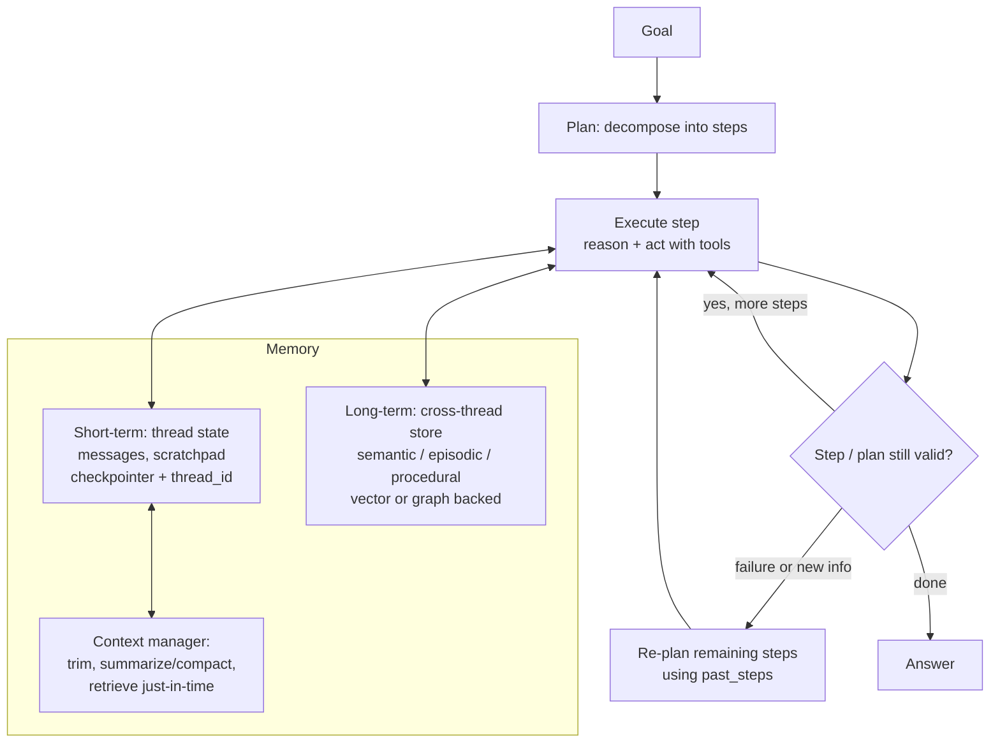

# Domain 5: Cognition, Planning, and Memory (10%)

## 1. Why this matters (exam + real agents)

An LLM is stateless and thinks in one forward pass; an *agent* has to reason over multiple steps, decompose goals into plans, recover when a step fails, and remember things — within a turn, across a conversation, and across sessions. This domain tests whether you can (a) pick the right reasoning strategy for a problem (CoT vs self-consistency vs tree-of-thoughts vs a reasoning model with test-time compute), (b) structure planning so failures trigger *re-planning* instead of cascading, and (c) architect memory correctly — short-term thread state vs long-term cross-thread stores, and episodic vs semantic vs procedural content. On the exam this is ~6-7 questions, mostly definitional-with-a-scenario: "which memory type stores X?", "agent forgets things mid-task, what's wrong?", "how do you make a workflow resumable?" In production, this is the difference between a demo that handles one chat turn and an agent that survives a 200-step task without drowning its own context window.

## 2. Mental model

**Analogy: a consultant on a long engagement.** Their *reasoning* is how they think through any single problem — quick gut call (direct answer), working it out on paper (chain-of-thought), polling three colleagues and taking the majority view (self-consistency), or whiteboarding several solution branches and pruning dead ends (tree-of-thoughts). Their *plan* is the project roadmap: decompose the engagement into workstreams, execute, and when a workstream fails, revise the remaining roadmap — don't re-litigate finished steps. Their *memory* has layers: the notepad in today's meeting (short-term / conversation buffer), the firm's knowledge base of client facts (long-term semantic memory), case files from past engagements (episodic memory), the firm's playbooks (procedural memory), and the whiteboard they scribble intermediate results on (scratchpad). When the whiteboard fills up, they write minutes and wipe it (summarization/compaction). And the engagement file itself is checkpointed so a new consultant can resume mid-project (state checkpointing/resumability).



The loop is the point: **plan → execute → validate → re-plan on failure**, with memory feeding every step and context management keeping the working set inside the model's attention budget.

## 3. Core concepts

### 3.1 Reasoning frameworks

| Technique | What it is | Cost | When |
|---|---|---|---|
| **Chain-of-thought (CoT)** | Prompt the model to produce intermediate reasoning steps before the answer (few-shot exemplars, or zero-shot "think step by step") | 1 call, more output tokens | Default for any multi-step problem; the foundation everything else builds on |
| **Self-consistency** | Sample *N* independent CoT paths at temperature > 0, then **majority-vote** the final answers | N calls | Problems with a *verifiable, discrete* answer (math, classification); big accuracy lift over single CoT |
| **Tree-of-thoughts (ToT)** | Explore a **tree** of partial "thoughts": generate several candidate next steps, **evaluate/score** each state, expand promising branches (BFS/DFS), **backtrack** from dead ends | Many calls (generate + evaluate per node) | Problems needing search, lookahead, and backtracking (puzzles, planning, design choices) — where one linear chain fails |
| **ReAct** | Interleave **Reasoning and Acting**: thought → tool action → observation → thought → … | 1 call per step | Tool-using agents; reasoning is grounded in observations (covered deeper in the agent-architecture domain) |
| **Reflexion (self-reflection)** | After a failed attempt, the agent **verbally reflects** on the feedback ("verbal reinforcement"), stores that reflection in an **episodic memory buffer**, and **retries** the whole task with the reflections prepended — learning across trials without weight updates (Shinn et al. 2023) | N attempts (each = a full task run + a reflection call) | Tasks you can attempt repeatedly with a success/failure signal (code that must pass tests, multi-hop QA, ALFWorld). The bridge between *reasoning* and *episodic memory* |
| **Reasoning models (test-time compute)** | Models post-trained (RL on verifiable rewards) to emit long internal thinking tokens before answering — o1/o3, DeepSeek-R1, **NVIDIA Llama Nemotron**. Quality scales with *inference-time* token budget, not just parameters | 1 call, lots of hidden/thinking tokens, high latency | Hard reasoning (math, code, multi-step logic) without prompt scaffolding; the model does CoT/search internally |

Key distinctions the exam loves:
- **CoT is one chain; self-consistency is many chains + vote; ToT is a branching search with state evaluation and backtracking.** "Explores alternatives and backtracks" → ToT. "Samples diverse paths and takes majority answer" → self-consistency.
- Self-consistency needs **temperature > 0** (diversity is the mechanism) and an answer you can aggregate; it does *not* work well for open-ended prose.
- **Test-time compute scaling** is the third scaling axis (after params and data): spend more inference tokens/attempts to get better answers — sequential (longer thinking), parallel (best-of-N with a verifier/reward model), or search (MCTS/ToT-style). Returns are strong on math/code, *diminishing* on commonsense tasks, and "overthinking" (huge token spend on easy questions) is a known failure mode — hence per-request **reasoning toggles**.
- **Nemotron reasoning toggle:** Llama Nemotron models switch between reasoning and chat modes via the system prompt — `"detailed thinking on"` / `"detailed thinking off"` — one model, two behaviors, chosen per request (§4).
- **Reflexion vs self-consistency vs ReAct:** all three involve multiple LLM passes, but the mechanism differs. Self-consistency samples *parallel independent* chains and votes (no memory between them). ReAct interleaves reason/act *within one* attempt. **Reflexion** is *sequential across attempts*: fail → write a verbal reflection into **episodic memory** → retry the whole task carrying those reflections forward (the canonical "agent that learns from its own mistakes within a session"). Its memory buffer is usually truncated to the last few reflections to avoid blowing the window.

### 3.2 Planning: decompose, validate, re-plan

- **Task decomposition:** break a goal into ordered sub-steps *before* acting. Two basic styles: **plan-and-execute** (explicit upfront plan, then execute steps — often with a smaller/cheaper model doing execution while a stronger model plans) vs **ReAct-style interleaved** (decide the next step one at a time). Explicit plans are cheaper (fewer big-model calls), more inspectable, and force the model to "think through" the whole task; interleaving adapts faster to surprises.
- **Hierarchical planning:** a high-level planner produces abstract milestones; lower-level planners/agents expand each into concrete actions (supervisor → workers). Keeps each context small and lets sub-plans fail/retry independently.
- **Plan validation:** check the plan *before* burning tool calls — schema-validate structured plans (Pydantic), check tool availability/preconditions, optionally LLM-judge the plan ("will these steps achieve the goal?"), or gate with a human (HITL approval on the plan node).
- **Re-planning on failure:** after each executed step, feed `past_steps` (what was tried, what came back) to a **replanner** that either (a) returns the final response if the goal is met, or (b) emits a *revised remaining plan* — never re-including already-completed steps. In LangGraph's canonical plan-and-execute tutorial this is a structured output `Act = Union[Response, Plan]` and a conditional edge that loops agent ↔ replan until `Response` is produced.
- **ReWOO variant:** plan all steps upfront *with variable placeholders* (`#E1`, `#E2`) so evidence from step 1 substitutes into step 3 without re-calling the planner LLM each step — cuts token cost vs ReAct.

### 3.3 Memory types — the taxonomy

**Axis 1 — scope (the architectural one):**

| | Short-term memory | Long-term memory |
|---|---|---|
| **Scope** | One thread/session/conversation | Across threads, sessions, users |
| **Contents** | Message history, scratchpad fields, current plan, tool results | Extracted facts, preferences, past experiences, learned rules |
| **Mechanism** | Agent state persisted by a **checkpointer**, addressed by `thread_id` | A **store** (key-value + vector/semantic search), addressed by namespace + key, e.g. `("memories", user_id)` |
| **Failure mode** | Context overflow → trim/summarize | Stale/contradictory memories → consolidation, temporal invalidation |
| **LangGraph names** | `InMemorySaver` / `SqliteSaver` / `PostgresSaver` (checkpointer) | `InMemoryStore` / `PostgresStore` (Store API) |

**Axis 2 — content (the cognitive-science one, used by LangMem/CoALA and the exam):**

| Memory type | Stores | Human analogy | Agent example |
|---|---|---|---|
| **Semantic** | Facts and knowledge about the world/user | "Paris is the capital of France" | "User's deploy target is AWS us-east-1"; profile or fact-collection documents |
| **Episodic** | Specific past *experiences/events*, with context of what happened | Remembering your last vacation | Saved successful interaction traces, reused as few-shot examples; "last time the user asked for X, doing Y worked" |
| **Procedural** | *How* to do things — rules, skills, behaviors | Riding a bike | The agent's evolving system-prompt instructions ("always answer in bullet points"); learned tool-use policies |
| **Entity memory** | Facts organized *per entity* (person, org, product) extracted from conversation | A CRM in your head | "Acme Corp: enterprise tier, renewal in March, contact = Dana" — keyed/structured per entity |

Episodic = "what happened" (specific event); semantic = "what is true" (decontextualized fact); procedural = "how to act" (internalized rule). A fact distilled *from* many episodes becomes semantic; a behavior distilled from feedback becomes procedural (often implemented as **prompt rewriting** — LangMem's "save learned procedures as updated instructions in the agent's prompt").

**Write paths:** "in the hot path" (the agent explicitly calls a `manage_memory`-style tool during the turn — transparent but adds latency/decisions) vs **background consolidation** (a subconscious post-turn job extracts/updates memories — Mem0's extract-then-update pipeline, LangMem's background manager). Long-term stores are typically **vector-backed** (embed → similarity search at recall time) or **graph-backed** (Zep/Graphiti temporal knowledge graphs tracking when facts were true and when they were invalidated).

### 3.4 Context management — budgeting the attention window

Context is a **finite attention budget**, not free storage. **Context rot** (Chroma, 2025): across 18 frontier models, output quality degrades *monotonically* as input length grows — long before the window limit — with lost-in-the-middle effects and distractor interference. So treat "what goes in the window this turn" as an engineered decision:

| Technique | What it does | Tradeoff |
|---|---|---|
| **Trimming / windowing** | Keep only last N messages/tokens (sliding window); drop or filter the rest | Cheap, deterministic; silently loses early constraints |
| **Summarization / compaction** | When history nears a threshold, replace older messages with an LLM-written **running summary**, keep recent messages verbatim | Preserves gist at low token cost; lossy — bad summaries lose decisions/constraints |
| **Scratchpad** | A dedicated place for intermediate results: a **state field** (in-graph) or a **file** (`todo.md`, notes file) the agent writes/reads with tools | Persistent working memory outside the message list; agent must be prompted to use it |
| **Retrieval-augmented memory** | Don't carry everything — store it (vector store/Store API) and **retrieve just-in-time** by semantic search when relevant | Keeps context lean; recall quality depends on embeddings/query |
| **Context offloading (filesystem-as-memory)** | Write large tool outputs to files, keep only a path + preview in context; re-read on demand (deep-agents pattern: auto-offload results > ~20k tokens) | Unlimited "memory"; costs an extra read when needed |
| **Sub-agent isolation** | Spawn a sub-agent with a *clean* context for a deep dive; only its condensed summary returns to the parent | Strong isolation; orchestration complexity |

Compaction discipline (Anthropic's context-engineering guidance): keep the **smallest possible set of high-signal tokens**; when compacting, preserve decisions, constraints, and unresolved questions, discard redundant raw tool output; prefer **lightweight identifiers** (paths, IDs, queries) over inlining bulk data.

### 3.5 State, checkpointing, and resumability

- **State** = the typed data a graph/agent carries between nodes (messages + your custom fields: `plan`, `past_steps`, `scratchpad`…). Reducers (e.g., `add_messages`) define how node outputs merge into state.
- **Checkpointing** = persisting a snapshot of state at every superstep to a backing store. In LangGraph, compile with a **checkpointer**; every invocation under a `thread_id` appends checkpoints to that thread.
- What checkpointing buys you (the exam list): **multi-turn memory** (same `thread_id` → prior state auto-loaded), **resumability/fault tolerance** (crash mid-task → resume from last checkpoint, don't re-run finished steps), **human-in-the-loop** (interrupt, wait for approval — possibly days — then resume), and **time travel** (fork from any past checkpoint, replay with modified state).
- **Across sessions:** same `thread_id` + durable checkpointer (Postgres/SQLite, not in-memory) = the conversation continues next week. *Different* threads share nothing through the checkpointer — cross-session knowledge must go through the long-term **store**. In-memory checkpointers are dev-only: process dies, memory dies.
- **Durable execution** framing: checkpoint granularity determines replay cost; idempotent tool calls (or recording tool results in state) prevent double-execution on resume.

## 4. NVIDIA-specific layer

| NVIDIA piece | Role in this domain | Key facts |
|---|---|---|
| **Llama Nemotron reasoning models (LN-Nano 8B / LN-Super 49B / LN-Ultra 253B)** | NVIDIA's reasoning-model family with a **runtime reasoning toggle** | Post-trained with two system prompts so one checkpoint serves both modes: system prompt **`"detailed thinking on"`** → long chain-of-thought with thinking tokens; **`"detailed thinking off"`** → concise chat answers. Recommended sampling: **temperature 0.6 / top_p 0.95 with thinking on; greedy (temp 0) with thinking off**. Newer Nemotron Super 49B **v1.5** flips the convention: reasoning is on by default, disable with **`/no_think`** in the system prompt |
| **NIM reasoning-model support** | Serving the toggle | The system prompt must be the **first message**; standard OpenAI-compatible chat API otherwise — no special endpoint. Budget `max_tokens` generously (e.g., 32k) in thinking mode |
| **NeMo Agent Toolkit memory module** | Framework-level long-term memory plumbing | Built around the **`MemoryEditor`** interface and **`MemoryItem`** model; providers plug in via YAML `_type` config. Shipped plugins: **Mem0** (`nvidia-nat-mem0ai`, `_type: mem0_memory`), **Zep Cloud** (`nvidia-nat-zep-cloud`, `_type: zep_memory`), **Redis** (`nvidia-nat-redis`, `_type: redis_memory`), **MemMachine** (`nvidia-nat-memmachine`, `_type: memmachine_memory`). Memory is exposed to agents as add/get memory *tools*, or wrapped with **`auto_memory_agent`** for automatic capture/recall without explicit tool calls. **Full NAT product names, `_type` strings and config shapes in §4.1.** |
| **NAT agent types & TTC** | The exam's named NVIDIA pieces for this domain | **Reasoning Agent** (`reasoning_agent` — plan upfront, delegate to `augmented_fn`), **ReWOO Agent** (`rewoo_agent` — planner/worker/solver, ~2 LLM calls), **Test Time Compute** (`nat.experimental.test_time_compute` — generate→score→select), **Object Stores** (`in_memory`/`redis`/`mysql`/`s3` blob backends), **Automatic Memory Wrapper** (`auto_memory_agent`). See §4.1. |
| **NeMo Retriever embedding NIMs** | The recall half of vector-store memory | The same embedding NIMs from the RAG stack (NV-EmbedQA-E5-v5 etc.) embed memories for semantic search — long-term memory *is* a retrieval pipeline over your own past |
| **NeMo Evaluator system-prompt configs** | Evaluating reasoning modes | Eval configs can pass the reasoning system prompt, so you can benchmark a Nemotron NIM with thinking on vs off |

**When NVIDIA vs generic:** the toggle and NIM serving are NVIDIA-specific exam bait; the memory *architecture* (checkpointer vs store, memory taxonomy) is framework-generic — NeMo Agent Toolkit deliberately delegates memory backends to Mem0/Zep/Redis rather than reinventing them.

### 4.1 NAT (NeMo Agent Toolkit) — the exam-dense product names

The exam blueprint names six NAT pieces for this domain explicitly: **Reasoning Agent, ReWOO Agent, Test Time Compute, Memory systems, Object Stores, Automatic Memory Wrapper**. Our generic LangGraph treatment above covers the *concepts*; here are the NAT *product names and config shapes* you must recognize. Every NAT component is selected by a string `_type` in a YAML config file — memorize the exact strings.

**NAT Reasoning Agent** (`_type: reasoning_agent`) — a **wrapper** that bolts a reasoning/planning step on top of *another* agent. It does **not** reason between steps like ReAct; instead the configured `llm_name` (which **must emit thinking tags** — e.g. a Llama Nemotron NIM with thinking on) **generates a complete plan upfront**, then hands that plan to the wrapped `augmented_fn` (typically a `react_agent` or `tool_calling_agent`) which executes it. So it's "plan-ahead, then execute," not "interleave." Requires the `nvidia-nat[langchain]` plugin.

```yaml
workflow:
  _type: reasoning_agent
  llm_name: nemotron_model        # must support thinking tags (reasoning model)
  augmented_fn: my_react_agent    # the agent that EXECUTES the plan; defined in functions:
  verbose: true
  # reasoning_prompt_template:    # optional — customize the upfront planning prompt
  # instruction_prompt_template:  # optional — how the plan is handed to augmented_fn
```

Exam framing: "wrap an existing ReAct agent so it plans the whole task before acting" → Reasoning Agent with `augmented_fn`. The reasoning LLM must be a thinking-capable model (Nemotron), tying §4's toggle directly to this agent type.

**NAT ReWOO Agent** (`_type: rewoo_agent`) — NAT's implementation of *Reasoning WithOut Observation*: the generic ReWOO/`#E` pattern from §3.2 as a first-class agent type. Three phases: **Planner** (one LLM call writes the full plan with evidence placeholders `#E1`, `#E2`, …), **Worker/Executor** (runs the tool calls, substituting evidence into placeholders — *no LLM call per step*), **Solver** (one LLM call turns gathered evidence into the final answer). So a ReWOO run is roughly **2 LLM calls** (planner + solver) regardless of step count, vs ReAct's *N* calls — cheaper and fewer tokens, but the plan is fixed (no re-planning mid-run; failure recovery is poor). Key config fields: `tool_names`, `llm_name`, `planner_prompt`, `solver_prompt`, `max_history` (default 15), `tool_call_max_retries` (default 3), `use_tool_schema`.

```yaml
workflow:
  _type: rewoo_agent
  tool_names: [wikipedia_search, current_datetime, math_agent]
  llm_name: nim_llm
  use_tool_schema: true
  verbose: true
  # planner_prompt:  # optional — must instruct the LLM to emit the #E placeholder plan format
  # solver_prompt:   # optional — must reference {plan} and {task}
```

Exam framing: "steps feed each other's outputs, token cost matters, plan is predictable" → `rewoo_agent`. "Environment is unpredictable, need to adapt each step" → `react_agent` instead. *Known limitation (from the lab):* an under-prompted ReWOO planner can write a step that references "Step 1 result" as a literal string instead of substituting the real `#E1` value — the planner prompt must enforce concrete placeholder syntax.

**NAT Test Time Compute (TTC)** — an **experimental** module (`nat.experimental.test_time_compute`) under "Improve Workflows," distinct from the Reasoning Agent. This is NAT's machinery for "spend more inference compute for a better answer" (§3.1's third scaling axis), built as a pipeline of pluggable **strategies** in three stages:

1. **Search / generation** — produce *multiple* candidates (e.g. `single_shot_multi_plan_planner` generates several candidate plans; multi-LLM generation produces several candidate answers).
2. **Scoring** — evaluate the candidates (e.g. `motivation_aware_scorer`, `LLMBasedPlanScoringConfig`, `LLMBasedAgentScoringConfig`).
3. **Selection / editing** — pick or merge the best (e.g. `llm_based_plan_selector`, `llm_based_agent_output_selector`, `llm_based_output_merging_selector`, `multi_llm_judge_function`); editing strategies (`LLMAsAJudgeEditorConfig`) iteratively refine.

NAT ships orchestration functions that wire these together: `execute_score_select_function`, `plan_select_execute_function`, and `ttc_tool_orchestration_function` (with knobs like `num_executions: 3`). The big exam caveat: **NAT documents TTC at the feature/strategy level but does not publish the internal scoring/selection algorithm** — describe it as "generate multiple candidates → score → select/merge," not a specific named algorithm. Use TTC selectively (high-stakes/hard queries); applying it to every trivial request multiplies cost for no gain (§6 overthinking).

> **Don't confuse the two reasoning features.** Reasoning Agent = a *wrapper* that plans upfront then delegates to one inner agent (single trajectory). Test Time Compute = *parallel* candidate generation + scoring + selection across multiple trajectories/LLMs. A question describing "generate 3 candidate answers and pick the best with a judge LLM" → **TTC**; "plan the whole task, then run my ReAct agent on that plan" → **Reasoning Agent**.

**NAT Object Stores** — a pluggable **key-value blob store** for binary data + metadata (files, documents, large tool outputs), configured under an `object_stores:` section. Interface: `put_object()`, `upsert_object()`, `get_object()`, `delete_object()`. Four backends, each its own `_type` and plugin package:

| `_type` | Backend | Plugin package | Key config fields | Use case |
|---|---|---|---|---|
| `in_memory` | Python dict in-process | built-in (no install) | `bucket_name` | Dev/test; lost on restart |
| `redis` | Redis key-value | `nvidia-nat-redis` | `host`, `port`, `db`, `bucket_name` | Fast shared session/blob state |
| `mysql` | MySQL relational | `nvidia-nat-mysql` | `host`, `port`, `username`, `password`, `bucket_name` | Persistent, queryable, durable |
| `s3` | S3 / S3-compatible (MinIO) | `nvidia-nat-s3` | `endpoint_url`, `access_key`, `secret_key`, `bucket_name` | Large archival objects, logs |

```yaml
object_stores:
  my_store:
    _type: redis            # swap to in_memory / mysql / s3
    host: localhost
    port: 6379
    db: 0
    bucket_name: my-bucket
```

> **Object Store ≠ the cognitive memory taxonomy.** Object Stores are byte/blob backends (the *where data physically lives*), not "episodic/semantic" memory types. A common exam distractor maps "episodic → Redis, semantic → S3" — that mapping is an *architectural choice you could make*, not something NAT prescribes (NAT does not label stores "episodic" or "semantic"). What the backends actually differ on is **persistence and access pattern**: in-memory (volatile, dev), Redis (fast, TTL-able, shared), MySQL (durable, queryable), S3 (cheap, large, high-latency). Pick by *durability + latency + size*, not by cognitive label.

**NAT Memory systems** — separate from Object Stores: the **`MemoryEditor`** long-term-memory interface (abstract methods `add_items(items)`, `search(query, top_k)`, `remove_items(...)`; a richer `MemoryManager` adds `summarize / reflect / forget / merge`). Memories are **`MemoryItem`** Pydantic models — fields: `conversation` (list of role/content dicts), `user_id`, `tags`, `metadata`, `memory` (a distilled string), and `similarity_score` (set on search results). Providers plug in by `_type`: **`mem0_memory`** (`nvidia-nat-mem0ai`), **`zep_memory`** / `zep_cloud` (`nvidia-nat-zep-cloud`), **`redis_memory`** (`nvidia-nat-redis`), **`memmachine_memory`** (`nvidia-nat-memmachine`). Tools `add_memory` / `get_memory` reference a backend by the `memory` field (the `auto_memory_agent` wrapper, by contrast, uses `memory_name`). Multi-tenant isolation is by `user_id` (and optional `conversation_id`) — the NAT equivalent of namespacing a store by user.

```yaml
memory:
  saas_memory:
    _type: mem0_memory      # or zep_memory / redis_memory
functions:
  store_fact:
    _type: add_memory       # write tool — field is `memory:` (NOT memory_name)
    memory: saas_memory
  recall_fact:
    _type: get_memory       # search tool
    memory: saas_memory
```

**NAT Automatic Memory Wrapper** (`_type: auto_memory_agent`) — wraps *any* inner agent (ReAct, ReWOO, Tool Calling, Reasoning) and **automatically captures and recalls memory on every turn**, so the LLM never has to remember to call `add_memory`/`get_memory`. This is the reliability win: tool-based memory fails when the model *forgets* to invoke the tool; the wrapper guarantees the operation. Config: `inner_agent_name` (the agent to wrap), `memory_name` (the backend), `llm_name`.

```yaml
memory:
  zep_memory:
    _type: zep_memory
functions:
  my_react_agent:
    _type: react_agent
    llm_name: nim_llm
    tool_names: [calculator]
workflow:
  _type: auto_memory_agent
  inner_agent_name: my_react_agent
  memory_name: zep_memory
  llm_name: nim_llm
```

Caveat (matches the LangGraph distinction in §3.3): the Automatic Memory Wrapper manages **conversation history / sequential turns** transparently — semantic similarity *recall* still depends on the backend (Mem0/Zep do extraction + vector recall; a plain Redis object store does not). It is the NAT cousin of the "hot path vs background" write-path choice: the wrapper makes capture automatic rather than a model-issued tool call.

## 5. Decision frameworks

**Reasoning technique selection:**

| Symptom / need | Choose | Why not the others |
|---|---|---|
| Multi-step problem, single answer, budget for 1 call | CoT prompting | Sampling/search are overkill |
| Math/logic with verifiable answer; wrong ~30% of the time on one chain | Self-consistency (N samples, majority vote, temp > 0) | ToT's search machinery unneeded when chains are independent |
| Needs exploration, lookahead, backtracking (puzzle, multi-constraint design) | Tree-of-thoughts | Linear CoT can't recover from an early wrong branch |
| Hard reasoning, no prompt scaffolding wanted, latency tolerable | Reasoning model (thinking on) | Prompt-level tricks underperform trained test-time compute |
| Same deployment must also serve fast/cheap chitchat | Nemotron-style toggle: thinking off for easy traffic | Running thinking mode on everything = overthinking tax |
| Open-ended prose quality | None of the voting schemes (no discrete answer to vote on) — use judge/rubric loops | Self-consistency needs aggregatable answers |

**Memory architecture selection:**

| Need | Choose |
|---|---|
| "Remember what the user said 3 messages ago" | Short-term: checkpointer + same `thread_id` (no store needed) |
| "Remember user's preferences next week, new conversation" | Long-term store, namespace by user; recall via semantic search |
| "Remember facts about each customer/account" | Entity memory (structured per-entity records in the store) |
| "Learn from past successful runs as examples" | Episodic memory (save trajectories, few-shot retrieve) |
| "Agent should stop repeating a mistake / follow new house rules" | Procedural memory (update instructions/system prompt) |
| "Facts change over time; need to know what was true when" | Temporal knowledge graph memory (Zep/Graphiti, bi-temporal edges) |
| "History is blowing the context window" | Summarization/compaction node + trimming; offload bulk to files/store |
| "Workflow must survive a crash / pause for approval" | Durable checkpointer (Postgres) + interrupts; resume by `thread_id` |

**Planning pattern selection:**

| Situation | Pattern |
|---|---|
| Predictable multi-step task, want cheap execution | Plan-and-execute (big model plans, small model executes) |
| Environment surprises you constantly | ReAct interleaved (re-decide every step) |
| Steps feed each other's inputs, token cost matters | ReWOO (plan once with `#E` placeholders) |
| Long-horizon, many workstreams | Hierarchical: supervisor plans milestones, sub-agents expand |
| Step failed mid-plan | Replanner over `past_steps` → revised remaining plan (never restart from scratch blindly) |

## 6. Exam traps & gotchas

1. **Self-consistency ≠ ToT** — self-consistency samples *independent complete chains* and votes; ToT *branches within* one search tree with state evaluation and backtracking. "Majority vote" → self-consistency; "evaluate intermediate states / backtrack" → ToT.
2. **Self-consistency at temperature 0 is pointless** — all samples identical; diversity is the mechanism. It also requires a discrete final answer to vote on.
3. **Short-term vs long-term is about *scope*, not duration** — a checkpointer persisting to Postgres can hold a thread for a year and it's still *short-term* (thread-scoped) memory. Cross-thread = long-term = store. "New session, agent forgot user prefs despite checkpointer" → you needed a store.
4. **Episodic vs semantic** — episodic = specific experienced *events* with context ("the time the user rejected the long email"); semantic = decontextualized *facts* ("user prefers short emails"). Distilling episodes into facts is consolidation, and the result lives in semantic memory.
5. **Procedural memory is *how to behave*, not facts** — its canonical implementation is updating the agent's own instructions/system prompt, not writing rows to a vector store.
6. **`thread_id` confusion** — same `thread_id` = continue that conversation's state; new `thread_id` = blank short-term slate even with the same checkpointer. Cross-user leakage questions: namespace the *store* by `user_id`; the checkpointer is per-thread anyway.
7. **Checkpointer ≠ Store** — checkpointer saves *graph state per thread* (enables resume/HITL/time-travel); Store is *application key-value/semantic memory across threads*. LangGraph compiles with both: `compile(checkpointer=..., store=...)`. Questions love swapping them.
8. **Bigger context window ≠ solved memory** — context rot: quality degrades monotonically with input length on all tested frontier models, well below the window limit. Long-context models do not obsolete summarization, retrieval, or offloading.
9. **Summarization is lossy** — a compaction step that drops constraints/decisions causes "goal drift" in long tasks. Mitigate: keep recent messages verbatim, summarize only the tail, pin critical constraints in a scratchpad/state field that never gets compacted.
10. **Re-planning ≠ retrying** — retry repeats the same failed step; re-planning feeds `past_steps` + the failure back to the planner and revises the *remaining* plan. The replanner must be told what's already done or it loops.
11. **Reasoning toggle direction** — Llama Nemotron v1: `"detailed thinking on"`/`"off"` in the **system prompt** (first message). Super 49B **v1.5 inverts it**: reasoning on by default, `/no_think` disables. Also: thinking-on wants temp 0.6/top_p 0.95, thinking-off wants greedy — backwards from intuition ("more deterministic for reasoning") and a likely distractor.
12. **More thinking isn't free or always better** — test-time compute shows diminishing returns outside math/code and an overthinking failure mode (huge token bills on trivial queries). "Enable maximum reasoning on all traffic" is the wrong answer; route/toggle by difficulty.
13. **Scratchpad ≠ memory store** — the scratchpad is *working* memory for the current task (state field or file, discarded or archived at the end); long-term memory is curated knowledge that survives the task. Conflating them stuffs the store with junk.
14. **In-memory checkpointer in production** — `InMemorySaver` dies with the process; resumability claims require a durable backend (SQLite/Postgres). "Agent loses all conversations on restart" → wrong checkpointer backend.
15. **NAT Reasoning Agent ≠ Test Time Compute** — the Reasoning Agent (`reasoning_agent`) is a *single-trajectory wrapper* that plans upfront then delegates to one `augmented_fn`; Test Time Compute is the *multi-candidate* generate→score→select machinery (`nat.experimental.test_time_compute`). "Plan the whole task then run my ReAct agent" → Reasoning Agent. "Generate N candidates and pick the best with a judge" → TTC.
16. **NAT Reasoning Agent does NOT reason between steps** — unlike ReAct, it plans *ahead of time* and hands the finished plan to the inner agent. The `llm_name` it uses must be a thinking-capable model (Nemotron with thinking on). "Reasons after each observation" → that's ReAct, not the Reasoning Agent.
17. **NAT Object Store ≠ cognitive memory type** — Object Stores (`in_memory`/`redis`/`mysql`/`s3`) are byte/blob backends distinguished by *persistence and latency*, not "episodic/semantic." NAT does not label a store "episodic." Choosing Redis for session state and S3 for archival is a *durability* decision, not a taxonomy mapping.
18. **TTC algorithm is not published** — NAT documents Test Time Compute at the strategy level (search/score/select/edit, with named functions like `execute_score_select_function`) but not the internal scoring/selection algorithm. On the exam, describe it generically ("generate candidates → score → select/merge"); do not assert a specific algorithm.
19. **Automatic Memory Wrapper vs add_memory tool** — `auto_memory_agent` captures/recalls on *every* turn automatically (the LLM can't forget to call it); the `add_memory`/`get_memory` tools are model-invoked (the model may skip them). "Memory is unreliable because the agent forgets to save" → switch to the Automatic Memory Wrapper. The wrapper handles sequential history; semantic recall still depends on a Mem0/Zep backend, not a plain object store.

## 7. Scenario drills

1. **A math-tutor agent gets multi-step problems right ~70% of the time with CoT. Latency budget allows several parallel calls; answers are numeric. Cheapest accuracy lift?**
   → **Self-consistency** — sample 5-10 CoT paths at temperature ~0.7, majority-vote the numeric answer. No retraining, no search scaffolding; ToT is overkill for problems that don't need backtracking.

2. **Your support agent greets returning users by name in the same chat, but next day (new conversation) it remembers nothing, even though you compiled the graph with a Postgres checkpointer. Why, and fix?**
   → Checkpointers are **thread-scoped**; a new conversation = new `thread_id` = fresh state. Add **long-term memory**: a Store (e.g., `PostgresStore`) namespaced by `user_id`, write profile facts during/after turns, semantically retrieve them at session start.

3. **A 50-step research agent starts ignoring instructions from the beginning of the task around step 30; token count is ~150k of a 200k window. What's happening and what do you add?**
   → **Context rot / lost-in-the-middle** — degradation begins well below the hard limit. Add a **compaction node** (summarize older history, keep recent verbatim), offload bulky tool outputs to files/store with just-in-time retrieval, and pin the task brief + constraints in a protected scratchpad/state field.

4. **An agent plans 6 steps; step 3's API returns "permission denied." It keeps retrying step 3 forever. What's the architectural fix?**
   → A **replanner node**: route failures (with `past_steps` and the error) to a planner that emits a *revised remaining plan* (alternate tool, ask the user, skip-with-caveat) or a final `Response` — the LangGraph plan-and-execute pattern with `Act = Union[Response, Plan]` and a conditional edge.

5. **Same Nemotron NIM must answer quick FAQs cheaply AND solve hard derivations. One deployment. How?**
   → Use the **reasoning toggle**: route easy traffic with system prompt `"detailed thinking off"` (greedy decoding), hard traffic with `"detailed thinking on"` (temp 0.6/top_p 0.95, large max_tokens). One model, per-request behavior — no second deployment.

6. **An agent learned (from user feedback) to always include a risk-disclaimer paragraph. Which memory type is this, and the standard implementation?**
   → **Procedural memory** — a learned behavior, not a fact or event. Standard implementation: persist it as an updated instruction in the agent's **system prompt** (prompt-rewriting à la LangMem), not as a vector-store document it might fail to retrieve.

7. **Compliance asks: "If the orchestrator pod dies at step 40 of 60, do we re-run the first 39 steps (some are payments)?" What's your answer with a properly built graph?**
   → No — with a **durable checkpointer**, state is snapshotted every superstep; resume the same `thread_id` from the last checkpoint. Keep tool calls idempotent (or record results in state) so the resumed step doesn't double-charge.

8. **In NAT, you want an agent that decomposes a financial report task into all steps before any tool runs, with minimum LLM calls because steps just feed each other. Which agent `_type`, and why not ReAct?**
   → **`rewoo_agent`** — Planner writes the whole `#E1…#En` plan in one LLM call, Worker substitutes evidence with no per-step LLM call, Solver emits the answer in one more call (~2 calls total vs ReAct's N). ReAct re-reasons every step (more tokens) and is only worth it when the environment is unpredictable. Trade-off: ReWOO's plan is fixed, so failure recovery is poor — if a step's data invalidates the plan, ReWOO can't re-plan mid-run.

9. **A NAT agent keeps forgetting to call its `add_memory` tool, so user facts are saved inconsistently. Smallest fix?**
   → Wrap the inner agent with the **Automatic Memory Wrapper** (`_type: auto_memory_agent`, set `inner_agent_name` + `memory_name`). Capture/recall then happens on every turn automatically — the LLM can no longer skip it. For semantic recall (not just last-N turns), back it with a `mem0_memory` or `zep_memory` provider, not a plain object store.

10. **You must persist large conversation logs cheaply for 90 days, and separately keep fast-access session blobs. Which NAT Object Store `_type` for each?**
   → Logs → **`s3`** (`nvidia-nat-s3`; cheap, large, high-latency-OK, lifecycle policy for 90-day retention). Session blobs → **`redis`** (`nvidia-nat-redis`; fast, TTL-able). Note these are *storage* choices by durability/latency — not "episodic vs semantic" labels.

## 8. Builder's corner

- **Compile with both persistence layers from day one:** `checkpointer` (durable: Postgres/SQLite) for thread state + `store` for cross-thread memory, namespaced `(org, user, category)`. Retro-fitting memory after launch means losing everything users already told you.
- **Budget context like money.** Instrument tokens-per-turn; set a compaction trigger (~60-80% of window or a fixed token count), keep the last N messages verbatim, summarize the rest into a `RunningSummary`, and *never* compact the task brief or hard constraints — pin those in dedicated state fields.
- **Make memory writes deliberate, not vibes.** Decide hot-path tool (`manage_memory`) vs background consolidation per use case; dedupe/update instead of append-only (contradictory memories are worse than none); add temporal metadata so stale facts can be invalidated rather than deleted.
- **Plans are data — type them.** Pydantic-validate planner output (`Plan: steps list`, `Act: Response | Plan`), store `past_steps` in state, and route every step failure through the replanner. An untyped free-text plan can't be validated, diffed, or resumed.
- **Default thinking off, escalate on.** With toggle-able reasoning models, route by difficulty (heuristic or classifier): concise mode for the long tail of easy queries, detailed thinking for the hard few. Watch tokens-per-answer as the overthinking metric.
- **Use the filesystem as overflow memory for long-horizon agents:** write large tool outputs and a `todo.md`-style plan to files, keep only paths + previews in context, re-read on demand — and have the agent *recite* its objectives into the end of context periodically to fight goal drift.

## 9. Sources

- LangGraph persistence (checkpointers, threads, Store): https://docs.langchain.com/oss/python/langgraph/persistence
- LangGraph/LangChain memory concepts & long-term memory: https://docs.langchain.com/oss/python/langchain/long-term-memory ; https://langchain-ai.github.io/langgraph/concepts/memory/
- LangMem SDK (semantic/episodic/procedural, summarization): https://www.langchain.com/blog/langmem-sdk-launch ; https://langchain-ai.github.io/langmem/
- LangGraph plan-and-execute tutorial: https://langchain-ai.github.io/langgraph/tutorials/plan-and-execute/plan-and-execute/
- Anthropic — Effective context engineering for AI agents: https://www.anthropic.com/engineering/effective-context-engineering-for-ai-agents
- Chroma — Context Rot research: https://research.trychroma.com/context-rot
- NVIDIA NIM reasoning models (detailed thinking toggle): https://docs.nvidia.com/nim/large-language-models/latest/reasoning-model.html
- Llama-Nemotron: Efficient Reasoning Models (paper): https://arxiv.org/abs/2505.00949
- NeMo Agent Toolkit memory module: https://docs.nvidia.com/nemo/agent-toolkit/latest/build-workflows/memory.html
- NAT Reasoning Agent: https://docs.nvidia.com/nemo/agent-toolkit/latest/components/agents/reasoning-agent/reasoning-agent.html ; NAT ReWOO Agent: https://docs.nvidia.com/nemo/agent-toolkit/latest/components/agents/rewoo-agent/index.html
- NAT Object Stores: https://docs.nvidia.com/nemo/agent-toolkit/latest/build-workflows/object-store.html ; NAT Automatic Memory Wrapper: https://docs.nvidia.com/nemo/agent-toolkit/latest/components/agents/auto-memory-wrapper/index.html
- NAT Test Time Compute (Improve Workflows): https://docs.nvidia.com/nemo/agent-toolkit/latest/improve-workflows/about-improving-workflows.html
- Mem0 paper: https://arxiv.org/abs/2504.19413 ; Zep/Graphiti paper: https://arxiv.org/abs/2501.13956
- CoT: https://arxiv.org/abs/2201.11903 ; Self-consistency: https://arxiv.org/abs/2203.11171 ; Tree of Thoughts: https://arxiv.org/abs/2305.10601
- Test-time scaling limits: https://arxiv.org/abs/2505.20522 (scaling plateau) ; https://arxiv.org/pdf/2502.12215 (do o1-like models truly scale?)
- Deep agents context management: https://www.langchain.com/blog/context-management-for-deepagents ; https://docs.langchain.com/oss/python/deepagents/overview
- Manus — context engineering lessons: https://manus.im/blog/Context-Engineering-for-AI-Agents-Lessons-from-Building-Manus
- NCP-AAI exam framing: https://www.nvidia.com/en-us/learn/certification/agentic-ai-professional/

## 10. Code Companion

**1) Short-term memory: checkpointer + `thread_id` (thread-scoped persistence)**

```python
from langgraph.checkpoint.memory import InMemorySaver  # dev; prod: langgraph.checkpoint.postgres.PostgresSaver

checkpointer = InMemorySaver()
graph = builder.compile(checkpointer=checkpointer)     # state now snapshots every superstep

cfg = {"configurable": {"thread_id": "thread-1"}}
graph.invoke({"messages": [{"role": "user", "content": "Hi, my name is Bob."}]}, cfg)
out = graph.invoke({"messages": [{"role": "user", "content": "What's my name?"}]}, cfg)
# → "Bob" — prior state auto-loaded because the thread_id matched

graph.get_state(cfg)            # inspect the latest checkpoint (also: time travel via checkpoint history)
```

*What to notice:* memory here is a side effect of **persistence** — same `thread_id` = same conversation, new `thread_id` = blank slate (trap #6). The identical mechanism powers crash resume, human-in-the-loop interrupts, and time travel (§3.5); swap `InMemorySaver` for `PostgresSaver` before claiming resumability in prod (trap #14).

**2) Long-term memory: Store API with semantic index (cross-thread)**

```python
from langgraph.store.memory import InMemoryStore       # prod: langgraph.store.postgres.PostgresStore

store = InMemoryStore(index={"embed": embed_fn, "dims": 1536})   # embed_fn: list[str] -> list[vector]
graph = builder.compile(checkpointer=checkpointer, store=store)  # both layers together

ns = ("memories", "user-123")                          # namespace tuple — scope by user!
store.put(ns, "pref-style", {"text": "Prefers short, bullet-point answers"})
store.put(ns, "fact-deploy", {"text": "Deploys to AWS us-east-1 via Terraform"})

hits = store.search(ns, query="how does this user like responses formatted?", limit=2)
print(hits[0].value["text"])    # semantic recall across ANY thread for user-123
```

*What to notice:* the Store is addressed by **namespace + key** and searched **semantically** — this is the checkpointer's complement (trap #7): checkpointer = one thread's state, store = knowledge across threads. Namespacing by user is also the cross-user-leakage answer.

**3) Compaction: summarization node in the message pipeline**

```python
from langmem.short_term import SummarizationNode, RunningSummary

summarize = SummarizationNode(
    model=summarization_model,                 # a small/cheap LLM is fine here
    token_counter=model.get_num_tokens_from_messages,
    max_tokens=384,                            # budget for messages handed to the main LLM
    max_tokens_before_summary=512,             # threshold that triggers compaction
    max_summary_tokens=128,                    # cap on the summary itself
)
# graph: START → summarize → agent → ...   State carries a RunningSummary so already-
# summarized messages are never re-summarized; recent messages pass through verbatim.
```

*What to notice:* compaction replaces the *older* history with a maintained `RunningSummary` while recent turns stay verbatim — the §3.4 pattern. The thresholds are the engineering knobs: trigger well below the model's window (context rot starts early, trap #8), and keep summaries short or they become the new bloat.

**4) Vector-store memory: write/recall cycle inside an agent turn**

```python
from langchain.tools import tool, ToolRuntime

@tool
def recall_memories(query: str, runtime: ToolRuntime) -> str:
    """Search long-term memories relevant to the current request."""
    hits = runtime.store.search(("memories", runtime.context.user_id), query=query, limit=3)
    return "\n".join(h.value["text"] for h in hits) or "no relevant memories"

@tool
def save_memory(fact: str, runtime: ToolRuntime) -> str:
    """Persist a durable fact about the user (use sparingly, for stable facts)."""
    import uuid
    runtime.store.put(("memories", runtime.context.user_id), str(uuid.uuid4()), {"text": fact})
    return "saved"

agent = create_agent(model, tools=[recall_memories, save_memory], store=store)
```

*What to notice:* this is **hot-path** memory (§3.3) — the agent decides when to read/write, which is transparent but spends a tool call and a decision per memory op. The alternative is a background consolidation job after the turn (Mem0/LangMem style). The docstrings are load-bearing: they're the only thing telling the model *when* memory is worth writing (scratchpad junk ≠ memory, trap #13).

**5) Plan-and-execute with re-planning on failure**

```python
from pydantic import BaseModel
from typing import Union
from langgraph.graph import StateGraph, START, END

class Plan(BaseModel):     steps: list[str]                 # ordered remaining steps
class Response(BaseModel): response: str                    # final answer to user
class Act(BaseModel):      action: Union[Response, Plan]    # replanner's structured choice

def plan_step(state):                                       # planner LLM with structured output
    return {"plan": planner.invoke({"objective": state["input"]}).steps}

def execute_step(state):                                    # ReAct sub-agent runs ONLY step 1
    result = executor.invoke({"task": state["plan"][0]})
    return {"past_steps": [(state["plan"][0], result)]}     # accumulate what happened (incl. errors)

def replan_step(state):                                     # sees objective + plan + past_steps
    act = replanner.invoke(state)
    return {"response": act.action.response} if isinstance(act.action, Response) \
        else {"plan": act.action.steps}                     # revised REMAINING steps only

g = StateGraph(PlanExecState)
g.add_node("planner", plan_step); g.add_node("agent", execute_step); g.add_node("replan", replan_step)
g.add_edge(START, "planner"); g.add_edge("planner", "agent"); g.add_edge("agent", "replan")
g.add_conditional_edges("replan", lambda s: END if s.get("response") else "agent")
```

*What to notice:* the replanner returns `Act = Response | Plan` — a typed fork between "done" and "here's the *revised remaining* plan," driven by `past_steps` (so failures and results inform the next plan, trap #10). Executing only `plan[0]` per loop is what makes every step re-plannable.

**6) Self-consistency vote + tree-of-thoughts sketch**

```python
from collections import Counter

def self_consistency(question, n=7):
    answers = [extract_final(llm.invoke(COT_PROMPT + question, temperature=0.7)) for _ in range(n)]
    return Counter(answers).most_common(1)[0][0]            # majority vote over final answers

def tree_of_thoughts(problem, breadth=3, depth=3):
    frontier = [""]                                          # partial solution states
    for _ in range(depth):
        candidates = [s + "\n" + t for s in frontier
                      for t in propose_thoughts(problem, s, k=breadth)]   # LLM: next-step proposals
        scored = [(evaluate_state(problem, c), c) for c in candidates]    # LLM judge: sure/maybe/dead
        frontier = [c for _, c in sorted(scored, reverse=True)[:breadth]] # prune → implicit backtrack
    return frontier[0]
```

*What to notice:* self-consistency is *independent* chains + vote (needs temperature > 0 and a discrete `extract_final` answer — trap #2); ToT keeps a **frontier of partial states** with an explicit *evaluate-and-prune* step, which is where lookahead and backtracking come from (trap #1). Cost: n calls vs breadth×depth×2 calls.

**7) Nemotron reasoning toggle on a NIM endpoint**

```python
from openai import OpenAI
client = OpenAI(base_url="http://0.0.0.0:8000/v1", api_key="not-used")   # local NIM

def ask(question, thinking: bool):
    return client.chat.completions.create(
        model="nvidia/llama-3.3-nemotron-super-49b-v1",
        messages=[{"role": "system", "content": f"detailed thinking {'on' if thinking else 'off'}"},
                  {"role": "user", "content": question}],                 # system msg MUST be first
        temperature=0.6 if thinking else 0.0,                             # recommended pairs
        top_p=0.95 if thinking else 1.0,
        max_tokens=32768 if thinking else 1024,                           # thinking eats tokens
    )

ask("Solve x*(sin(x)+2)=0", thinking=True)      # long CoT with thinking tokens
ask("What's your return policy?", thinking=False)  # concise chat answer, same deployment
```

*What to notice:* the toggle is *just a system prompt* — one checkpoint, two behaviors, standard OpenAI client (§4). Memorize the sampling pairs (0.6/0.95 on, greedy off) and the v1.5 inversion (`/no_think` to disable, reasoning on by default) — both are exam-grade distractors (trap #11).

**8) Scratchpad pattern: protected state field for long-horizon tasks**

```python
from typing import Annotated, TypedDict
import operator

class AgentState(TypedDict):
    messages: Annotated[list, add_messages]       # compactable — summarizer may rewrite this
    scratchpad: Annotated[list[str], operator.add]  # append-only working notes — NEVER compacted
    task_brief: str                               # pinned constraints — survives all compaction

def take_note(state):                             # any node can persist a finding out-of-band
    return {"scratchpad": [f"step-{len(state['scratchpad'])}: API v2 rejects bulk deletes"]}
# Filesystem variant (deep-agents style): give the agent write_file/read_file tools and prompt it
# to keep todo.md + findings.md, keeping only paths in context and re-reading on demand.
```

*What to notice:* the scratchpad lives in **state, outside the message list**, so summarization can compress chat history without destroying intermediate findings (trap #9). The filesystem variant is the same idea at unlimited scale — context holds *pointers* (paths), not payloads — which is exactly the deep-agents/Manus offloading pattern (§3.4).

**9) NAT in YAML — the five named pieces, side by side (the exam shape)**

```yaml
# ── Object Store: a blob backend (swap _type for in_memory / mysql / s3) ──
object_stores:
  logs:
    _type: s3                         # nvidia-nat-s3
    endpoint_url: http://localhost:9000
    access_key: minioadmin
    secret_key: minioadmin
    bucket_name: agent-logs

# ── Long-term Memory: MemoryEditor provider (mem0_memory / zep_memory / redis_memory) ──
memory:
  user_memory:
    _type: mem0_memory                # nvidia-nat-mem0ai; items are MemoryItem(user_id, conversation, tags, metadata, memory)

functions:
  worker:
    _type: react_agent                # the agent that does the work
    llm_name: nim_llm
    tool_names: [search, calculator]

  planner_then_execute:               # ── NAT Reasoning Agent: plan upfront, delegate ──
    _type: reasoning_agent
    llm_name: nemotron_model          # MUST support thinking tags (Nemotron, thinking on)
    augmented_fn: worker              # executes the plan; no re-reasoning between steps

  cheap_planner:                      # ── NAT ReWOO Agent: planner → worker → solver, ~2 LLM calls ──
    _type: rewoo_agent
    llm_name: nim_llm
    tool_names: [search, calculator]
    use_tool_schema: true

# ── Automatic Memory Wrapper: capture/recall every turn, LLM can't forget ──
workflow:
  _type: auto_memory_agent
  inner_agent_name: worker
  memory_name: user_memory
  llm_name: nim_llm
```

*What to notice:* every NAT component is a string `_type` in YAML — recognizing `reasoning_agent` (plan-ahead wrapper), `rewoo_agent` (planner/worker/solver), `auto_memory_agent` (transparent memory), the four Object Store types, and the four Memory providers is exactly what the exam tests (§4.1, traps #15–19). **Object Stores** (byte blobs, `object_stores:`) and **Memory** (`MemoryEditor`/`MemoryItem`, `memory:`) are *different subsystems* — don't conflate them. **Test Time Compute** (`nat.experimental.test_time_compute`: generate→score→select) is the separate "multiple candidates" path, distinct from the single-trajectory Reasoning Agent above.

## 11. What top engineers are saying (2025-26)

1. **Anthropic Engineering — "Effective context engineering for AI agents" (Sep 2025)** — The post that reframed the discipline: context is a **finite attention budget**, and the job is finding "the smallest possible set of high-signal tokens" per turn. Its three long-horizon techniques — **compaction** (summarize and reinitialize near the window limit), **structured note-taking** (persistent memory outside the window at minimal overhead), and **sub-agent architectures** (clean contexts returning condensed summaries) — are §3.4 verbatim, plus "just-in-time retrieval" via lightweight identifiers instead of preloading. https://www.anthropic.com/engineering/effective-context-engineering-for-ai-agents

2. **Chroma Research — "Context Rot: How Increasing Input Tokens Impacts LLM Performance" (Jul 2025)** — Tested 18 frontier models (GPT-4.1, Claude 4, Gemini 2.5…) and found performance degrades **non-uniformly and monotonically** as input grows — models "do not use their context uniformly," and degradation appears on even trivially simple tasks long before the window limit. The empirical kill-shot for "just use a bigger context window" (trap #8) and the reason compaction/retrieval survive the long-context era. https://research.trychroma.com/context-rot

3. **LangChain — LangMem SDK launch (Feb 2025)** — Productized the **semantic / episodic / procedural** taxonomy for agent memory, with the sharpest framing of procedural memory in the discourse: save learned procedures *as updated instructions in the agent's prompt*, not as retrievable documents. Also pushed "memory tools in the hot path vs background consolidation" as the core write-path design choice (§3.3). https://www.langchain.com/blog/langmem-sdk-launch

4. **Mem0 (Chhikara et al.) — "Building Production-Ready AI Agents with Scalable Long-Term Memory" (Apr 2025)** — The production-memory pipeline paper: dynamically **extract, consolidate, and retrieve** salient facts instead of replaying full history; on LOCOMO it reports ~26% relative accuracy gain over OpenAI's memory feature with ~91% lower p95 latency and ~90% token savings vs full-context — the quantitative case that curated memory beats brute-force context. The Mem0g variant adds graph memory for relational queries. https://arxiv.org/abs/2504.19413

5. **Zep (Rasmussen et al.) — "A Temporal Knowledge Graph Architecture for Agent Memory" (Jan 2025)** — Argues flat vector recall fails when *facts change*: its Graphiti engine builds a **bi-temporal knowledge graph** (when a fact was true vs when it was ingested, edges carrying validity intervals) so outdated knowledge is invalidated, not overwritten. Reports 94.8% vs MemGPT's 93.4% on DMR and up to 18.5% accuracy gains with ~90% latency reduction on LongMemEval. The "memory with a sense of time" position in the memory-layer wars. https://arxiv.org/abs/2501.13956

6. **Manus — "Context Engineering for AI Agents: Lessons from Building Manus" (Jul 2025)** — The practitioner's manifesto for filesystem-as-memory: treat the **file system as the ultimate context** — unlimited, persistent, agent-operated — keep only paths/references in the window, and make compression *restorable* rather than destructive. Also coined "recitation": the agent constantly rewrites a `todo.md` to recite objectives into recent attention, fighting lost-in-the-middle goal drift on ~50-tool-call tasks. LangChain's deep-agents runtime (auto-offloading tool results >20k tokens to a virtual filesystem, summarizing at 85% window) turned this pattern into library defaults. https://manus.im/blog/Context-Engineering-for-AI-Agents-Lessons-from-Building-Manus ; https://www.langchain.com/blog/context-management-for-deepagents

7. **The test-time-compute debate (2025)** — NVIDIA's **Llama-Nemotron** paper made per-request reasoning a product feature (one model post-trained on both `detailed thinking on/off` modes), while a counter-literature emerged on limits: "Scaling over Scaling" measures a **test-time scaling plateau** where extra reasoning tokens stop buying accuracy, and follow-ups document **overthinking** — reasoning models burning thousands of tokens on trivial arithmetic for near-zero gain. Field consensus circa 2026: test-time compute is real but must be *routed* — spend it on hard problems, toggle it off for the easy long tail (§5). https://arxiv.org/abs/2505.00949 ; https://arxiv.org/abs/2505.20522 ; https://arxiv.org/pdf/2502.12215
