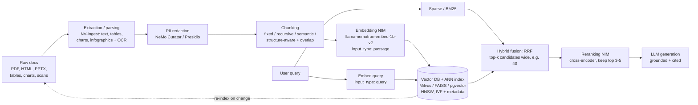

# Domain 6: Knowledge Integration and Data Handling (10%)

## 1. Why this matters (exam + real agents)

Agents are only as good as the knowledge they can reach. This domain tests whether you can build and operate the *knowledge plumbing*: a RAG pipeline end-to-end (ingestion → chunking → embedding → indexing → retrieval → reranking → generation), choose the right index and search mode for a workload, handle messy real-world data (PDFs with tables and charts, PII, stale documents), and know when plain vector RAG isn't enough (multi-hop questions → GraphRAG / knowledge graphs). On the exam this is ~6-7 questions, mostly "pick the right component/strategy for this scenario": which chunking strategy, which ANN index, dense vs hybrid, when to add a reranker, which NVIDIA NIM does X. In production, this is the layer where most RAG quality problems actually live — recall from Domain 3 that low retrieval metrics make everything downstream unfixable.

## 2. Mental model

**Analogy: a research library.** Ingestion is *acquisitions* — books arrive in every format (PDFs, scans, spreadsheets) and a cataloger (NV-Ingest) extracts the usable content, including the tables and figures a lazy cataloger would skip. Chunking is deciding *what a catalog card covers* — one card per book is useless (too coarse), one per sentence is noise (too fine); cards that follow chapter boundaries work best. Embedding + indexing is the *card catalog itself* — organized so a librarian can jump to the right shelf without scanning every card (ANN). Dense retrieval is the librarian who understands what you *mean*; sparse/BM25 is the one who matches the exact *words* you said (product codes, error IDs, names); hybrid search asks both and merges their lists (RRF). The reranker is the *subject expert* who takes the 40 candidate books, actually skims each against your question, and hands you the best 5 — too slow to read the whole library, perfect for a shortlist. GraphRAG is the *reference librarian who knows how books relate* — "the author of X was funded by Y, which was acquired by Z" — answering questions no single shelf contains. And data handling is *collection maintenance*: redact the donor records (PII) before shelving, and re-catalog when new editions arrive (freshness), because a catalog of last year's library answers last year's questions.



**The two-stage retrieval mantra: retrieve wide and cheap (bi-encoder ANN), then rank narrow and expensive (cross-encoder).** Almost every "improve precision" question resolves to adding the second stage; almost every "answer is missing entirely" question resolves to fixing the first.

## 3. Core concepts

### 3.1 The RAG pipeline, stage by stage

| Stage | What happens | Failure mode if done badly |
|---|---|---|
| **Ingestion / extraction** | Parse source formats into clean text + structured artifacts (tables→markdown, charts→descriptions, OCR for scans) | Garbage in: tables flattened to word soup, figures silently dropped — the answer never enters the corpus |
| **Chunking** | Split documents into retrieval units, usually with overlap | Too big → diluted embeddings, noise in context; too small → fragments without enough meaning to match or answer |
| **Embedding** | Bi-encoder maps each chunk to a dense vector (one-time, offline for the corpus) | Weak/wrong-domain embedder → low recall@k no matter what else you tune |
| **Indexing** | Store vectors in an ANN index (+ scalar/metadata fields) for sub-linear search | Wrong index/params → slow queries or low recall at scale |
| **Retrieval** | Embed the query, find top-k nearest chunks (dense), optionally + BM25 (sparse) | k too small or dense-only on keyword-heavy queries → relevant chunks missed |
| **Reranking** | Cross-encoder re-scores query+chunk *pairs*; keep the best few | Skipped → noisy context, hallucination risk, wasted tokens (Domain 3: low precision@k) |
| **Generation** | LLM answers grounded in the final context, ideally with citations | Even perfect retrieval can't fix an ungrounded prompt — but that's a generation-side fix |

The stages are independently tunable and independently measurable — evaluate retrieval (recall@k, NDCG) separately from generation (faithfulness), per Domain 3 §3.6.

### 3.2 Chunking strategies

| Strategy | How it splits | Pros | Cons | When |
|---|---|---|---|---|
| **Fixed-size** | Every N tokens/chars (e.g., 512 tokens, 10-15% overlap) | Trivial, predictable, fast | Cuts mid-sentence/mid-thought; ignores structure | Baseline; homogeneous prose |
| **Recursive** | Try separators in order (`\n\n` → `\n` → `. ` → ` `) until pieces fit the size limit | Respects natural boundaries while honoring a size budget; the production default | Still structure-blind for tables/headers | Default starting point (e.g., 512 tokens) |
| **Semantic** | Embed sentences; split where adjacent-sentence similarity drops below a threshold | Chunks are topically coherent | Expensive (embeds during ingestion); can emit tiny fragments; benchmark gains inconsistent | Topic-drifting docs; only if measured to help |
| **Document-structure-aware** | Split on real structure: markdown headers, sections, **pages** | Preserves semantic units; NVIDIA's study found **page-level** chunking best *on average* (0.648 accuracy, lowest variance) | Needs structured input; unit sizes vary | Structured docs (manuals, filings, wikis) |

**Overlap trade-off:** overlap (typically 10-20%) prevents answers from being severed at chunk boundaries, at the cost of index size and duplicate-ish results. **No universal winner exists** — the NVIDIA chunking study and 2025-26 benchmarks disagree on specifics (page-level vs recursive-512) but agree on the meta-lesson: *sweep chunking on your own corpus with retrieval metrics*. Hierarchical/parent-child chunking (retrieve small, hand the LLM the bigger parent) is the common production resolution of the precision-vs-context tension.

### 3.3 Embeddings and vector databases

**Embeddings:** a bi-encoder encodes query and passage *independently* into vectors; similarity (cosine/dot) ≈ relevance. Key properties: dimension (storage/speed vs quality; Matryoshka embeddings let you truncate dimensions for cheaper search), max input tokens (chunks must fit), domain/language coverage, and **asymmetry** — retrieval embedders like NVIDIA's are trained with distinct `input_type="query"` vs `input_type="passage"` modes. Using the same mode for both silently degrades retrieval (classic exam trap; LangChain's `embed_query` vs `embed_documents` handles it for you).

**Distance metric:** match the index metric to how the embedder was trained. **Cosine** (angle, magnitude-invariant) is the safe default for text retrieval; **dot/inner product (IP)** is equivalent to cosine *when vectors are L2-normalized* — normalizing forces every vector to length 1, so the only thing left to compare is *direction*, which is exactly what cosine measures — and IP is what many embedders actually optimize; **L2/Euclidean** is rarely the right choice for normalized text embeddings. Mismatching the metric quietly tanks recall — concretely, a model trained for cosine but indexed with raw **L2** will rank a long, generic chunk (large vector magnitude) above a short, on-topic one, because Euclidean distance is fooled by vector length while cosine ignores it. The metric is a property of the model, not a free knob. (Milvus: `metric_type="COSINE"/"IP"/"L2"`; pgvector ops: `vector_cosine_ops` / `vector_ip_ops` / `vector_l2_ops`.)

**NeMo Retriever text embedding NIMs:** `llama-nemotron-embed-1b-v2` (current flagship — **renamed in NeMo Retriever NIM 1.13.0** from `llama-3.2-nv-embedqa-1b-v2`, which exam materials may still use; multilingual, 26 languages, **8192-token max input**, Matryoshka-configurable to 384/512/768/1024/2048 dims), plus the 300M variant `llama-nemotron-embed-300m-v2` (was `llama-3.2-nemoretriever-300m-embed-v2`) and a vision-language `llama-nemotron-embed-vl-1b-v2`; older `nv-embedqa-e5-v5` (English QA) and `nv-embedqa-mistral-7b-v2` (multilingual) remain. All served as NIM containers with an OpenAI-compatible `/v1/embeddings` API. **2026 branding note:** NVIDIA now markets this embed/rerank/extract collection as **"Nemotron RAG"** (the Hugging Face collection label), while **NeMo Retriever** stays the platform name (NeMo Retriever Library + Nemotron Retriever open models + NIM microservices) — same family, recognize the label.

**Vector stores:**

| Store | What it is | When |
|---|---|---|
| **Milvus** | Purpose-built distributed vector DB; dense + sparse + hybrid search, metadata filtering, partitions; **GPU-accelerated indexes (CAGRA)** — NVIDIA's default in RAG blueprints | Production scale, hybrid search, GPU acceleration |
| **FAISS** | A *library* (in-process index), not a database — no server, persistence/CRUD/filtering are DIY | Prototypes, embedded/offline search, research |
| **pgvector** | Postgres extension: `vector` column type + HNSW/IVFFlat indexes, queried in SQL | You already run Postgres; transactional joins of vectors + relational data |

**ANN indexes** (the reason vector search is sub-linear):

| Index | Mechanism | Trade-offs | Key params |
|---|---|---|---|
| **Flat (brute force)** | Compare query to every vector — exact, 100% recall | O(N) per query; fine to ~100k vectors | — |
| **HNSW** | Multi-layer navigable graph; greedy search from top layer down | High recall + low latency; **memory-heavy**; handles incremental inserts well; slower builds | `m` (links/node, ~16), `ef_construction` (~200, build quality), `ef_search` (query-time recall/speed knob) |
| **IVF (IVFFlat)** | k-means partitions vectors into `lists` (Voronoi cells); search only the `nprobe` nearest cells | Faster build, lower memory; recall drops if the right cell isn't probed; **needs training data first** — degrades if data distribution shifts after build | `lists` (≈ √rows), `nprobe` (cells probed at query time) |

Rule of thumb: **HNSW = quality-first default** (recall, incremental data); **IVF = scale/memory-constrained, bulk-loaded data**; quantization (PQ/SQ, e.g., IVF_PQ) trades recall for big memory cuts.

**GPU-accelerated indexes — cuVS and the Milvus GPU index family.** NVIDIA's GPU vector-search library is **cuVS (CUDA Vector Search)**, part of **RAPIDS** — this is the library Milvus calls when you pick a GPU index (and it also accelerates FAISS's GPU path). The GPU index types in Milvus are **`GPU_CAGRA`**, **`GPU_IVF_FLAT`**, **`GPU_IVF_PQ`**, and **`GPU_BRUTE_FORCE`**. **CAGRA** (CUDA-Accelerated Graph index for vector Retrieval) is the flagship GPU-native *graph* index — conceptually the GPU answer to HNSW — and the one the AI-Q/RAG Blueprints use. Verified numbers: CAGRA builds ~**12× faster** and searches ~**4.7× faster** than CPU HNSW, with batched throughput up to ~**100× CPU** under heavy load.

Two non-obvious facts the exam likes:
1. **GPU indexes win on throughput, not necessarily latency.** They shine when you have **high QPS / large query batches** or need fast index *builds*; for a single low-traffic query a tuned CPU HNSW can match or beat them. So "1M+ vectors at high throughput" → GPU; "occasional queries, latency-sensitive" → GPU isn't automatic. (Misconception trap: GPU search ≠ "only for massive datasets" — the trigger is QPS, not just corpus size.)
2. **GPU indexes must fit (largely) in GPU memory** and have weaker OOM protection — oversubscribing GPU memory can crash the query node. A practical pattern is **hybrid: build the graph on GPU with CAGRA, then serve searches on CPU as HNSW** (CAGRA-built graphs even beat native HNSW latency at high dimensionality, >512D), reserving the GPU for index building in cost-sensitive deployments.

### 3.4 Hybrid search: dense + sparse with RRF

Dense vectors capture *meaning* but fumble exact tokens (part numbers, error codes, names, acronyms). Sparse/lexical scoring (**BM25**: term-frequency × inverse-document-frequency with length normalization) nails exact matches but has zero notion of synonyms. **Hybrid search runs both and fuses the ranked lists**, typically with **Reciprocal Rank Fusion**:

> RRF score(d) = Σ over result lists 1/(k + rank_i(d)), with smoothing constant k = 60 by default.

RRF only uses *ranks*, never raw scores — so it needs no score normalization across incomparable scoring scales (cosine vs BM25), which is exactly why it's the default fuser (Milvus `RRFRanker`). The alternative, **weighted scoring** (`WeightedRanker`), normalizes and linearly combines scores when you want to bias toward one channel.

**Metadata filtering** is the third leg: scalar predicates (`source == "2025_10K" and year >= 2024`) applied to the vector search. Modern engines **pre-filter** (constrain the ANN search to matching vectors) rather than post-filter (which can return fewer than k results after discarding). Filters are also your tenancy/ACL enforcement point — security by filter, not by hoping the LLM ignores other tenants' chunks.

### 3.5 Reranking: cross-encoders for precision

A **cross-encoder** feeds the query and a candidate passage through the model *together*, letting attention compare them token-by-token — far more accurate relevance than bi-encoder cosine similarity, but it must run per query-passage pair at query time, so it can never scan the whole corpus. Hence the two-stage pattern: **retrieve wide (top 40-100, cheap ANN) → rerank → keep top 3-5**. Effects: higher answer accuracy *and* lower generation cost (fewer, better chunks → fewer prompt tokens), plus it's the natural merge point when retrieving from multiple sources. NVIDIA's reranking NIM: `llama-nemotron-rerank-1b-v2` (current — **renamed in NeMo Retriever NIM 1.13.0** from `llama-3.2-nv-rerankqa-1b-v2`, plus a VL variant `llama-nemotron-rerank-vl-1b-v2`; multilingual companion to the embedding NIM; predecessor `nv-rerankqa-mistral-4b-v3` — a truncated, LoRA-tuned Mistral with a binary relevance head). Latency is the price: budget reranking only over the shortlist.

### 3.6 Data handling: parsing, PII, freshness

**Document parsing / multimodal extraction.** Enterprise knowledge lives in PDFs full of tables, charts, and scanned pages — naive text extraction destroys it. **NV-Ingest (NeMo Retriever extraction)** is NVIDIA's answer: a microservice pipeline that splits documents into pages, classifies page elements, and uses specialized NIMs to extract **text, tables (as markdown), charts, and infographics** into a uniform JSON/DataFrame schema — then optionally chunks, embeds, and uploads to Milvus in the same fluent pipeline. The named NIMs the exam may reference: **`nemoretriever-page-elements-v2`** (detects which boxes are text/table/chart), **`nemoretriever-table-structure-v1`** (recovers row/column structure → markdown), **`nemoretriever-graphic-elements-v1`** (chart/figure elements), and **PaddleOCR** as the OCR text-recognition engine for scanned/image content (NV-Ingest also offers a Nemotron OCR NIM; PaddleOCR is the open, Apache-2.0 default and the name the course/AI-Q Blueprint uses). Tables extracted as *structured markdown* embed and retrieve dramatically better than tables flattened to whitespace soup.

> **Exam framing for PaddleOCR:** if a question lists the AI-Q/RAG Blueprint's ingestion stack, **PaddleOCR is the document-OCR component** (text extraction from scanned pages/images); the page-element / table-structure / graphic-element detector NIMs handle *layout*, OCR handles *characters*. "Retrieval over scanned-PDF tables is near-zero" → the fix lives in this extraction layer (detectors + OCR), not in chunking.

**PII redaction.** Redact **at ingestion time, before indexing** — once PII is embedded and stored, every retrieval can leak it, and embeddings themselves can be inverted. Tooling: **NeMo Curator's `PiiModifier`** (built on Microsoft **Presidio**) for pattern/NER-based detection of names, emails, SSNs, etc., and `LLMPiiModifier` / `AsyncLLMPiiModifier` for LLM-based detection via a NIM. Defense in depth adds a runtime check (NeMo Guardrails) on inputs/outputs, but ingestion-time redaction is the load-bearing control.

**NeMo Curator is more than PII — it's the GPU data-prep stage.** PII redaction is one *modifier* inside a broader **GPU-accelerated curation toolkit** that runs on RAPIDS **cuDF** + **Dask** (so it scales to millions of docs, with reported ~10–100× speedups over CPU pipelines, and ~16× on fuzzy dedup specifically). Its core operations — each a stage you compose into a pipeline — are:
- **Deduplication** in three flavors: **exact** (MD5 hashing), **fuzzy** (**MinHash + LSH** for near-duplicates — reformatting, typos, small edits), and **semantic** (embedding-cluster dedup). Dedup matters for RAG because embedding the *same* content many times wastes index space and biases retrieval toward over-represented chunks.
- **Language identification** — filter/route documents by language before embedding.
- **Quality filtering** — heuristic and classifier-based removal of low-quality text (boilerplate, garbled OCR, spam).
- **Domain classification** and other transforms (used end-to-end to build NVIDIA's own Nemotron pre-training datasets).
- **PII redaction** (`PiiModifier` / `LLMPiiModifier`) as above.

The exam point: **NeMo Curator = data preparation/cleaning (dedup, language ID, quality filter, PII) at GPU scale**, sitting *between* raw extraction and chunking — distinct from NeMo Retriever (embed/rerank/extract) and from Milvus (storage/search). Don't conflate "Curator" (prep the data) with "Retriever" (serve embeddings/retrieval).

**Freshness and re-indexing.** A vector index is a *snapshot*; RAG's whole advantage over fine-tuning is cheap knowledge updates — but only if you actually update. Patterns:
- **Incremental upsert:** track a content hash + `last_modified` per source doc; on change, delete that doc's chunks and re-embed only it. Stable chunk IDs (`doc_id#chunk_n`) make deletes targeted.
- **Scheduled sync:** cron/scheduler diffs the source-of-truth against the index; event-driven (webhook on doc save) where latency matters.
- **Full re-embed** is reserved for the expensive cases: changing the **embedding model** (vectors from different models are incomparable — mixed-model indexes are silently broken), changing chunking strategy, or dimension changes. Version the embedding model in index metadata so this is detectable.
- Stale-data symptoms: confidently outdated answers with citations to superseded docs — filterable by `effective_date` metadata until re-ingestion lands.

### 3.7 GraphRAG and structured knowledge

Vector RAG retrieves *isolated chunks by similarity* — it fails on **multi-hop questions** ("Which suppliers of our acquired subsidiaries are affected by the new regulation?") where no single chunk contains the answer and the connecting facts live in *relationships across documents*, and on **global/aggregate questions** ("What are the main themes across this corpus?") where the answer is a synthesis, not a passage.

**GraphRAG (Microsoft's reference design):** at indexing time, an LLM extracts **entities and relationships** from chunks into a knowledge graph; community detection (Leiden algorithm) clusters the graph hierarchically; an LLM writes **community summaries** at each level. At query time: **global search** maps over community summaries (corpus-wide themes), **local search** expands from matched entities to their neighbors and source chunks (entity-centric multi-hop). The catch is **cost**: LLM-extracting a graph over a large corpus is expensive (an oft-cited early-2024 figure: ~$33k to index one dataset) and the graph must be maintained as documents change. **LazyGraphRAG** (Microsoft, late 2024) defers the expensive work to query time — indexing cost comparable to plain vector RAG (~0.1% of full GraphRAG's) with comparable global-search quality — and is the pragmatic default when graph queries are occasional. Knowledge graphs also serve agents directly as **structured tools** (Cypher/SPARQL queries over Neo4j etc.) — text2query instead of, or alongside, similarity search.

Decision: **vector RAG for "find the passage"; GraphRAG/KG for "connect the facts"; hybrid (graph + vector) in production systems that need both.**

## 4. NVIDIA-specific layer

| NVIDIA tool | Role in this domain | Key facts |
|---|---|---|
| **NeMo Retriever embedding NIMs** | The embedding stage as a container with an OpenAI-compatible API | **`llama-nemotron-embed-1b-v2`** (renamed in NIM 1.13.0 from `llama-3.2-nv-embedqa-1b-v2`) — multilingual (26 languages), 8192-token max input, Matryoshka dims 384–2048, asymmetric `input_type` query/passage; also `llama-nemotron-embed-300m-v2`, vision-language `llama-nemotron-embed-vl-1b-v2`, older `nv-embedqa-e5-v5` (English) / `nv-embedqa-mistral-7b-v2` (multilingual). In LangChain: `NVIDIAEmbeddings` from `langchain-nvidia-ai-endpoints` |
| **NeMo Retriever reranking NIM** | The precision stage: cross-encoder reranking as a service | **`llama-nemotron-rerank-1b-v2`** (current — renamed in NIM 1.13.0 from `llama-3.2-nv-rerankqa-1b-v2`; VL variant `llama-nemotron-rerank-vl-1b-v2`), `nv-rerankqa-mistral-4b-v3` (prior gen). In LangChain: `NVIDIARerank` (`compress_documents`), wraps as a `ContextualCompressionRetriever` |
| **NV-Ingest / NeMo Retriever extraction** | Ingestion stage: scalable multimodal document extraction | Fluent Python `Ingestor` pipeline: `.files().extract(extract_text/tables/charts/infographics).embed().vdb_upload().ingest()`; named NIMs: `nemoretriever-page-elements-v2`, `nemoretriever-table-structure-v1`, `nemoretriever-graphic-elements-v1`, **PaddleOCR** (OCR); outputs uniform metadata schema; newest releases ship as the `nemo-retriever` library (`create_ingestor`) — same chain |
| **PaddleOCR** | The OCR text-recognition engine inside NV-Ingest / the Blueprints | Extracts characters from scanned pages & images (Apache-2.0); pairs with the page-element/table/graphic detector NIMs that handle layout. The exam's named "document-processing OCR" component |
| **Milvus (+ cuVS / GPU CAGRA)** | NVIDIA's default vector DB in RAG blueprints | Dense + sparse(BM25) + `hybrid_search` with `RRFRanker`/`WeightedRanker`; metadata filter expressions; GPU indexes via **cuVS** (`GPU_CAGRA`/`GPU_IVF_FLAT`/`GPU_IVF_PQ`/`GPU_BRUTE_FORCE`); CAGRA ≈ GPU-native HNSW, ~12× faster build / ~4.7× faster search, throughput-oriented |
| **NeMo Curator** | GPU data-prep stage (dedup, language ID, quality filter, PII) | RAPIDS cuDF + Dask, ~10–100× CPU speedup; **dedup** exact(MD5)/fuzzy(MinHash+LSH)/semantic; language ID; quality filtering; domain classification; PII via `PiiModifier` (Presidio) / `LLMPiiModifier` (NIM). *Curator = prep the data; Retriever = serve retrieval — don't conflate* |
| **NeMo Guardrails** | Runtime complement: input/output PII checks, grounding rails | Defense in depth on top of ingestion-time redaction |
| **NVIDIA RAG Blueprint** | The foundational RAG reference workflow | NIM LLM + NeMo Retriever embed/rerank + vector DB (Milvus/Elasticsearch) + NV-Ingest extraction + reflection; the exam's mental picture of "NVIDIA's RAG stack" |
| **AI-Q Research Assistant Blueprint** | Agentic *deep-research* layer **on top of** the RAG Blueprint | Orchestrated by **NeMo Agent Toolkit (NAT)**; plans a report → searches (RAG corpus **+ web via Tavily**) → writes → reflects on gaps → re-queries → finishes with cited sources. The exam's "agentic RAG architecture" reference |
| **NeMo Evaluator** | Measures this domain's output | Retriever evals (Recall@K, NDCG@K on BEIR-format data) and RAG evals (RAGAS-style) — Domain 3 crossover |

**When NVIDIA vs generic:** the NIM/Retriever stack buys you GPU-optimized, containerized, OpenAI-API-compatible pieces that slot into LangChain/LlamaIndex unchanged — the *concepts* (bi-encoder, cross-encoder, ANN, RRF) are identical to open-source equivalents, and exam questions mostly test that you can map concept → NVIDIA product name.

### 4.1 AI-Q Blueprint RAG architecture (the NVIDIA reference picture)

The exam expects you to recognize **NVIDIA's reference RAG stack as a layered Blueprint**, and to distinguish the two tiers:

- **NVIDIA RAG Blueprint (foundation):** the production-ready retrieve→rerank→generate pipeline. Components by stage: **NV-Ingest** (multimodal extraction: page-element / table-structure / graphic-element detectors + **PaddleOCR**) → optional **NeMo Curator** prep → **NeMo Retriever embedding NIM** (`llama-nemotron-embed-1b-v2`) → **vector DB** (Milvus with **cuVS** GPU acceleration, or Elasticsearch) → hybrid retrieval → **NeMo Retriever reranking NIM** (`llama-nemotron-rerank-1b-v2`) → **NIM LLM** for generation. The embed+rerank pair is tuned together for high BEIR/TechQA accuracy with multilingual + cross-lingual support.
- **AI-Q Research Assistant Blueprint (agentic layer on top):** *extends* the RAG Blueprint into a deep-research agent. Orchestrated by **NeMo Agent Toolkit (NAT)**, it: (1) drafts a **report plan**, (2) **searches** both the internal RAG corpus and the **web (Tavily)**, (3) **writes** a draft, (4) **reflects on gaps** and issues follow-up queries, (5) **finalizes** with a source list. This is the canonical "agentic RAG / retrieval-in-the-reasoning-loop" reference for the exam.

> **Version-dependent (don't memorize the exact SKUs):** the Blueprints' *generation* LLMs and embedding SKUs are refreshed frequently (the course-era lineup cites Llama 3.3 Nemotron Super 49B / Llama 3.3 70B for generation, Llama 3.2 NV EmbedQA 1B + RerankQA 1B for retrieval, on a ~2×H100 80GB self-hosted footprint; current builds have moved to Nemotron-3 / Nemotron embed-VL models and default to API-Catalog hosting with *no local GPU requirement*). **Memorize the architecture and component *roles*, not the model version string** — and always verify hardware on the specific Blueprint page, since requirements vary widely across Blueprints.

**NIM endpoint config shapes (the asymmetric embedding + the ranking API).** NeMo Retriever NIMs are OpenAI-style HTTP services. The two shapes worth recognizing:

```python
# Embedding NIM — note the asymmetric input_type (passage at index, query at search)
POST {base_url}/v1/embeddings
{ "model": "nvidia/llama-nemotron-embed-1b-v2",   # renamed in NIM 1.13.0 (was llama-3.2-nv-embedqa-1b-v2)
  "input": ["...chunk text..."],
  "input_type": "passage",          # use "query" when embedding a search query
  "encoding_format": "float" }      # -> {"data":[{"embedding":[...]}]}

# Reranking NIM — a DIFFERENT route and payload than embeddings
POST {base_url}/v1/ranking
{ "model": "nvidia/llama-nemotron-rerank-1b-v2",  # renamed in NIM 1.13.0 (was llama-3.2-nv-rerankqa-1b-v2)
  "query":    {"text": "warranty period for model X?"},
  "passages": [ {"text": "..."}, {"text": "..."} ] }
# -> {"rankings":[{"index": 2, "logit": 8.1}, ...]}  # sort by logit desc, keep top_n
```

The exam-relevant details: reranking lives at **`/v1/ranking`** (not `/v1/embeddings`), takes a `query` + a list of `passages`, and returns `rankings` scored by **`logit`** (sort descending, keep the top-N). And the embedding endpoint's **`input_type`** is the asymmetry knob (trap #5) — `"passage"` for documents, `"query"` for queries. (Model strings shown are the post-1.13.0 Nemotron names; the older `llama-3.2-nv-*` strings still appear in pre-2026 course material and may show up on the exam — recognize both.)

**NAT retriever/embedder config (NeMo Agent Toolkit v1.7).** In NAT you declare a named **`embedder`** in the top-level `embedders:` block, then a named **`retriever`** in the `retrievers:` block that references that embedder by name (`embedding_model`) and points at the vector store. Components use the `_type:` discriminator; the vector-store choice *is* the retriever `_type` (`milvus_retriever` or `nemo_retriever`). `top_k` sets the wide first-stage candidate count (the `nemo_retriever` NIM provider caps it at `gt 0, le 50`; `milvus_retriever` has no documented cap):

```yaml
# v1.4 used dotted/nested inline blocks; v1.7 uses named components + _type
embedders:
  nim_embedder:
    _type: nim
    model_name: nvidia/llama-nemotron-embed-1b-v2   # NIM-1.13.0 name (was llama-3.2-nv-embedqa-1b-v2)
    base_url: ${NIM_URL}

retrievers:
  kb_retriever:
    _type: milvus_retriever            # or nemo_retriever; vector store = the retriever _type
    uri: ${MILVUS_URI}                 # http://localhost:19530 (faiss-style local dev: nemo_retriever)
    collection_name: docs
    embedding_model: nim_embedder      # references the named embedder above (milvus_retriever field)
    top_k: 40                          # stage 1: retrieve wide & cheap (nemo_retriever caps top_k at gt 0, le 50)
```

Reranking is **not** a field of the NAT retriever config — wire the rerank/precision stage as a separate function (e.g. a `ContextualCompressionRetriever`-style tool) and keep the narrow top-N there. The two-stage mantra (wide `top_k` → narrow rerank) is the concept; in NAT only the wide retrieval stage lives in `retrievers:`.

## 5. Decision frameworks

**Chunking selection:**

| Situation | Choose |
|---|---|
| No information about the corpus, need a baseline | Recursive splitting, ~512 tokens, 10-15% overlap |
| Structured docs (manuals, wikis, filings) with meaningful sections/pages | Structure-aware (header/section/page-level) |
| Long docs that drift across topics; ingestion compute is cheap | Semantic chunking — *if* eval shows it wins |
| Answers keep getting cut at boundaries | Increase overlap, or parent-child (retrieve small, return parent) |
| Dense tables/figures in PDFs | Don't chunk harder — fix *extraction* first (NV-Ingest) |

**Index selection:**

| Need | Choose |
|---|---|
| <~100k vectors, exact results, simplicity | Flat (brute force) |
| High recall + low latency, data arrives incrementally, RAM available | HNSW |
| Memory-constrained / huge bulk-loaded corpus, fastest builds | IVF (+ PQ quantization if needed) |
| GPU-accelerated high-throughput search on NVIDIA infra | Milvus GPU index (CAGRA) |
| Vectors must live beside relational data with SQL joins/transactions | pgvector |
| Embedded in-process, no server, prototyping | FAISS |

**Retrieval architecture:**

| Symptom / need | Choose |
|---|---|
| Queries full of IDs, part numbers, exact names missed by dense search | Hybrid (dense + BM25) with RRF |
| Top-k contains the answer but buried in noise (precision low, recall fine) | Add cross-encoder reranking NIM over a wider candidate set |
| Answer not in top-k at all (recall low) | Fix upstream: chunking, embedder, hybrid, raise k — reranking can't recover what wasn't retrieved |
| Per-tenant / per-source / time-scoped retrieval | Metadata filtering (pre-filter) |
| Multi-hop relationship questions, corpus-wide themes | GraphRAG / knowledge graph (LazyGraphRAG if indexing budget is tight) |
| Sources change daily | Incremental upsert + stable chunk IDs + scheduled sync |
| Swapped embedding model | Full re-embed of the corpus — no exceptions |

## 6. Exam traps & gotchas

1. **"Bigger chunks = more context = better"** — trap. Oversized chunks dilute the embedding (many topics → mushy vector) and stuff noise into the prompt. Chunk size is a *retrieval* parameter tuned by recall/precision, not a context-window maximization game.
2. **Overlap is for boundary loss, not quality in general** — overlap prevents an answer span from being split across chunks; it does not fix bad chunk sizing and it inflates index size/cost.
3. **Reranker can't fix recall** — a cross-encoder only reorders what retrieval returned. Answer missing from top-50 → fix embeddings/chunking/hybrid/k. Answer present but buried → reranker. Map symptom → stage.
4. **Bi-encoder vs cross-encoder inversion** — bi-encoder: encode query and doc *separately*, compare vectors, scalable, used for first-stage retrieval. Cross-encoder: encode the *pair jointly*, accurate but per-pair expensive, used to rerank a shortlist. "Why not cross-encode the whole corpus?" → it would run per query-document pair at query time; can't precompute.
5. **`input_type` asymmetry** — NeMo Retriever embedders are asymmetric: passages embedded with `input_type="passage"`, queries with `input_type="query"`. Embedding both the same way silently hurts retrieval. (LangChain's `embed_documents`/`embed_query` split handles it.)
6. **RRF uses ranks, not scores** — that's the point: BM25 scores and cosine similarities live on incomparable scales; RRF sidesteps normalization entirely (k=60 default). "Fusion without score normalization" → RRF; "weighted bias toward one channel" → weighted scoring.
7. **BM25/sparse isn't obsolete** — dense embeddings whiff on exact identifiers, acronyms, and rare terms. "Users search by error code/SKU and dense retrieval misses" → add hybrid, not a bigger embedding model.
8. **HNSW vs IVF** — HNSW: graph, best recall/latency, memory-hungry, incremental-insert friendly. IVF: clustered lists, cheaper build/memory, needs representative training data, recall depends on `nprobe`. "Streaming inserts + high recall" → HNSW; "huge static corpus, tight memory" → IVF(+PQ).
9. **FAISS is a library, not a database** — no server, no replication, no built-in CRUD/metadata filtering at DB grade. "Production multi-tenant vector store" → Milvus/pgvector-class systems, not raw FAISS.
10. **Changing the embedding model without re-embedding** — vectors from different models (or different dims) are not comparable; a mixed index returns garbage quietly. Model swap = full corpus re-embed + re-index, versioned.
11. **Fine-tuning for fresh facts** (Domain 3 crossover, still tested here) — knowledge updates are a *re-indexing* operation in RAG; that's the whole economic argument for RAG over fine-tuning.
12. **PII redaction at generation time only** — too late: the PII is already in the index and in every retrieved context. Redact during *ingestion* (NeMo Curator/Presidio), enforce access via *metadata filters*, and use runtime rails as defense in depth.
13. **Vector RAG for multi-hop** — similarity search retrieves chunks that look like the question; multi-hop answers live in chains of facts that individually don't resemble the question. "Question requires joining facts across documents" → GraphRAG/knowledge graph (local search for entity-hops, global for themes).
14. **GraphRAG everywhere** — also a trap: full GraphRAG indexing is LLM-expensive and high-maintenance. Single-hop factual QA → plain vector RAG; occasional graph-style queries → LazyGraphRAG-style deferred approaches.
15. **Pre- vs post-filtering** — post-filtering (search, then discard non-matching) can leave you with fewer than k results and wasted compute; production engines pre-filter the ANN search. Also: metadata filters are your ACL boundary, not the LLM's discretion.
16. **NeMo Curator vs NeMo Retriever confusion** — they sit in different stages. **Curator = GPU data *preparation*** (dedup, language ID, quality filtering, PII) *before* chunking/embedding; **Retriever = embedding + reranking + extraction NIMs** that *serve* retrieval. "Which NVIDIA tool deduplicates / quality-filters the corpus at scale?" → **Curator**. "Which serves the embedding/rerank models?" → **Retriever**. Also: NeMo Curator does far more than PII — PII is just one modifier.
17. **GPU vector search = "only for huge datasets"** — the trigger is **QPS/throughput**, not raw corpus size. cuVS/CAGRA helps at 1M+ vectors under *high query pressure*; at low traffic a tuned CPU HNSW can match it on latency. And GPU indexes need to fit in GPU memory (weak OOM protection). "Sub-10ms at very high QPS over millions of vectors" → GPU (cuVS/CAGRA); "occasional queries, latency-sensitive, tight GPU budget" → CPU HNSW (optionally CAGRA-built, HNSW-served).
18. **"PaddleOCR / a detector NIM is the whole extraction story"** — extraction is a *team*: **detector NIMs** (`page-elements`, `table-structure`, `graphic-elements`) find *where* the content is and recover *structure*; **PaddleOCR** reads the *characters*. A scanned table needs both — layout detection to find the table and OCR to read its cells. Naming PaddleOCR as "the document-processing component" is correct for OCR specifically, not for table-structure recovery.

## 7. Scenario drills

1. **Support-bot users query by product SKU and error code; dense retrieval returns related-but-wrong articles. Recall on keyword-heavy queries is poor; recall on natural-language queries is fine. Fix?**
   → **Hybrid search: add a sparse/BM25 channel and fuse with RRF.** Exact identifiers are lexical signals dense embeddings can't represent; a bigger embedder won't fix it.

2. **Recall@50 is 0.92 but answers are mediocre; the right chunk is usually around rank 20-40, and the LLM receives 50 chunks. Cheapest fix?**
   → **Add the reranking NIM** (cross-encoder, e.g., `llama-nemotron-rerank-1b-v2`, formerly `llama-3.2-nv-rerankqa-1b-v2`) over the 50 candidates, keep top-5. This is the precision-stage textbook case — improves accuracy *and* cuts prompt tokens.

3. **A financial-analyst agent must answer "How did supplier risks discussed in the 2023 10-K evolve through the 2025 filings?" spanning entities and relationships across many documents. Vector RAG keeps returning isolated, similar-sounding paragraphs. Architecture change?**
   → **GraphRAG / knowledge-graph retrieval**: extract entities/relations at indexing, use local (entity-expansion) search for the multi-hop chain — with LazyGraphRAG-style deferred indexing if cost is a concern.

4. **Your corpus is scanned PDFs with dense tables and charts. Text extraction "works" but retrieval over table content is near-zero. First fix?**
   → **Fix extraction, not chunking: run ingestion through NV-Ingest / NeMo Retriever extraction** so tables become structured markdown and charts become described elements before chunking/embedding.

5. **Compliance flags that customer SSNs appear in retrieved contexts shown to agents. The team proposes a prompt instructing the LLM to omit PII. Correct response?**
   → Reject prompt-level mitigation as primary control; **redact PII at ingestion** (NeMo Curator `PiiModifier`/Presidio) and re-index the affected collection, enforce scope via **metadata filters**, keep Guardrails-style output checks as a secondary layer.

6. **You upgrade from `nv-embedqa-e5-v5` to `llama-nemotron-embed-1b-v2` and only embed *new* documents with the new model into the same collection. Retrieval quality craters. Why?**
   → **Mixed embedding spaces**: vectors from different models aren't comparable, so nearest-neighbor results are meaningless across the boundary. Re-embed the entire corpus with the new model into a fresh (versioned) index, then cut over.

7. **Docs change daily; nightly full re-embedding of 10M chunks is blowing the GPU budget. Better pattern?**
   → **Incremental upsert**: hash each source doc, on change delete its chunks by stable ID prefix and re-embed only that doc; schedule a periodic diff sync. Reserve full re-embeds for model/chunking changes.

8. **Your corpus is a 5M-document Common-Crawl-style dump: heavy near-duplicates (reposts, boilerplate variants), mixed languages, lots of low-quality pages. Retrieval surfaces the same content five times and confidence is low. Which NVIDIA tool, and what operations?**
   → **NeMo Curator** (the GPU data-prep stage, *before* chunking/embedding). Run **fuzzy dedup (MinHash + LSH)** to collapse near-duplicates, **language ID** to keep only target languages, and **quality filtering** to drop boilerplate/garbled text — all on GPU via RAPIDS cuDF/Dask. This is a *data-preparation* fix, not a retrieval-architecture fix; reranking or hybrid won't undo a corpus that's 5× duplicated. (Don't answer "NeMo Retriever" — that serves embeddings/reranking, it doesn't dedup.)

9. **You must serve a vector search at very high QPS over 8M vectors with strict throughput SLOs, and you have spare H100 capacity. What index / library?**
   → **Milvus GPU index via cuVS — `GPU_CAGRA`** (the GPU-native graph index). It's built for batched, high-throughput search (~12× faster build, ~4.7× faster search than CPU HNSW, up to ~100× throughput under load). Watch GPU memory (the index must fit). If queries were *occasional* and latency-sensitive instead, a tuned CPU **HNSW** (optionally CAGRA-built, HNSW-served) would be the more economical pick — GPU's edge is throughput, not single-query latency.

10. **A team needs an agent that produces a sourced research report: plan the report, pull from the internal RAG corpus *and* the live web, then revise based on gaps. Which NVIDIA blueprint, and what orchestrates it?**
   → **AI-Q Research Assistant Blueprint**, which extends the foundational **RAG Blueprint** with a deep-research loop — plan → search (RAG corpus **+ Tavily web**) → write → reflect-on-gaps → re-query → finalize with citations — all orchestrated by **NeMo Agent Toolkit (NAT)**. The plain RAG Blueprint answers a single grounded question; AI-Q adds the agentic multi-step report workflow on top.

## 8. Builder's corner

- **Measure retrieval before you architect.** Build the BEIR-style query→relevant-chunk eval set first (even 50 queries), get baseline recall@k/NDCG, *then* decide between chunking tweaks, hybrid, reranking, or GraphRAG. Teams routinely add expensive components to fix problems the metrics would have localized in an afternoon — and the fix order is almost always: extraction → chunking → hybrid → reranker → exotic.
- **Treat extraction as the highest-leverage stage.** If tables, charts, and scanned pages dominate your corpus, NV-Ingest-grade extraction will beat any amount of downstream tuning; you cannot retrieve what was destroyed at parse time. Spot-check extracted chunks by eye early.
- **Design the index schema for operations on day one:** stable chunk IDs (`doc_id#n`), `source`, `last_modified`, content hash, ACL/tenant tags, and `embedding_model_version` as metadata. Upserts, deletes, freshness syncs, tenancy filters, and model migrations all hang off these fields and none can be retrofitted cheaply.
- **Default stack that covers 90% of cases:** recursive 512-token chunks (15% overlap) → `llama-nemotron-embed-1b-v2` → Milvus HNSW + metadata filters → hybrid with BM25 + RRF → `llama-nemotron-rerank-1b-v2` over top-40, keep top-5. Deviate only when your eval says so.
- **Budget freshness like a feature.** Decide the staleness SLA per source (minutes? days?), wire incremental upserts + a scheduled diff job, and alert on index-vs-source drift. The most common production RAG complaint isn't hallucination — it's confidently citing the superseded policy.

## 9. Sources

- NeMo Retriever overview & models (note the NIM 1.13.0 Nemotron rename): https://docs.nvidia.com/nim/#nemo-retriever ; https://docs.nvidia.com/nim/nemo-retriever/text-embedding/1.13.0/release-notes.html ; https://huggingface.co/nvidia/llama-nemotron-embed-1b-v2 ; https://huggingface.co/nvidia/llama-nemotron-rerank-1b-v2 (older slugs: build.nvidia.com/nvidia/llama-3_2-nv-embedqa-1b-v2/modelcard, .../llama-3_2-nv-rerankqa-1b-v2/modelcard)
- NV-Ingest / NeMo Retriever extraction (incl. PaddleOCR + detector NIMs): https://github.com/NVIDIA/nv-ingest ; https://docs.nvidia.com/nemo/retriever/latest/extraction/overview/
- NVIDIA RAG Blueprint & AI-Q Research Assistant Blueprint: https://github.com/NVIDIA-AI-Blueprints/rag ; https://github.com/NVIDIA-AI-Blueprints/aiq-research-assistant ; https://build.nvidia.com/nvidia/aiq
- Milvus GPU indexes & cuVS (CAGRA / GPU_IVF_FLAT / GPU_IVF_PQ): https://milvus.io/docs/gpu_index.md ; https://milvus.io/docs/gpu-cagra.md ; https://zilliz.com/blog/milvus-on-gpu-with-nvidia-rapids-cuvs
- NeMo Curator (dedup / language ID / quality / PII on GPU): https://docs.nvidia.com/nemo/curator/ ; https://github.com/NVIDIA-NeMo/Curator
- NVIDIA reranking blogs: https://developer.nvidia.com/blog/enhancing-rag-pipelines-with-re-ranking/ ; https://developer.nvidia.com/blog/how-using-a-reranking-microservice-can-improve-accuracy-and-costs-of-information-retrieval/
- NVIDIA chunking study: https://developer.nvidia.com/blog/finding-the-best-chunking-strategy-for-accurate-ai-responses/
- Milvus hybrid search & RRF: https://milvus.io/docs/multi-vector-search.md ; https://milvus.io/docs/rrf-ranker.md ; https://milvus.io/blog/get-started-with-hybrid-semantic-full-text-search-with-milvus-2-5.md
- pgvector (HNSW/IVFFlat): https://github.com/pgvector/pgvector ; https://aws.amazon.com/blogs/database/optimize-generative-ai-applications-with-pgvector-indexing-a-deep-dive-into-ivfflat-and-hnsw-techniques/
- LangChain NVIDIA integration: https://github.com/langchain-ai/langchain-nvidia/blob/main/libs/ai-endpoints/README.md ; https://docs.nvidia.com/nim/nemo-retriever/text-reranking/latest/playbook.html
- Microsoft GraphRAG & LazyGraphRAG: https://github.com/microsoft/graphrag ; https://www.microsoft.com/en-us/research/blog/lazygraphrag-setting-a-new-standard-for-quality-and-cost/
- NeMo Curator PII: https://docs.nvidia.com/nemo-framework/user-guide/latest/datacuration/personalidentifiableinformationidentificationandremoval.html ; https://github.com/NVIDIA-NeMo/Curator
- RAG-vs-long-context discourse: https://lighton.ai/lighton-blogs/rag-is-dead-long-live-rag-retrieval-in-the-age-of-agents ; https://venturebeat.com/data/six-data-shifts-that-will-shape-enterprise-ai-in-2026 ; https://ragflow.io/blog/rag-review-2025-from-rag-to-context
- Chroma context-rot research: https://research.trychroma.com/context-rot
- Agentic RAG survey: https://arxiv.org/abs/2501.09136 ; Tool RAG: https://next.redhat.com/2025/11/26/tool-rag-the-next-breakthrough-in-scalable-ai-agents/
- NCP-AAI exam framing: https://www.nvidia.com/en-us/learn/certification/agentic-ai-professional/

## 10. Code Companion

**1) Minimal end-to-end RAG: NeMo Retriever embedding NIM + FAISS + reranking NIM + generation**

```python
from langchain_nvidia_ai_endpoints import ChatNVIDIA, NVIDIAEmbeddings, NVIDIARerank  # reads NVIDIA_API_KEY
from langchain_community.vectorstores import FAISS
from langchain.retrievers import ContextualCompressionRetriever
from langchain_text_splitters import RecursiveCharacterTextSplitter

chunks = RecursiveCharacterTextSplitter(chunk_size=512, chunk_overlap=64).split_documents(docs)
emb = NVIDIAEmbeddings(model="nvidia/llama-nemotron-embed-1b-v2", truncate="END")  # was llama-3.2-nv-embedqa-1b-v2
vstore = FAISS.from_documents(chunks, emb)                      # passages embedded as input_type=passage

retriever = ContextualCompressionRetriever(                     # stage 2: cross-encoder precision
    base_retriever=vstore.as_retriever(search_kwargs={"k": 40}),  # stage 1: wide & cheap
    base_compressor=NVIDIARerank(model="nvidia/llama-nemotron-rerank-1b-v2", top_n=5),  # was ...nv-rerankqa-1b-v2
)
llm = ChatNVIDIA(model="meta/llama-3.3-70b-instruct")
ctx = retriever.invoke("What is the warranty period for model X?")  # query embedded as input_type=query
answer = llm.invoke(f"Answer ONLY from context:\n{ctx}\n\nQ: What is the warranty period for model X?")
```

*What to notice:* the whole §2 pipeline in ~12 lines — retrieve wide (k=40) then rerank down to 5 is the two-stage mantra, and `NVIDIAEmbeddings`/`NVIDIARerank` are just OpenAI-compatible NIM endpoints behind LangChain classes. The embed/rerank model pair (`llama-nemotron-embed-1b-v2` + `llama-nemotron-rerank-1b-v2`, formerly the `llama-3.2-nv-embedqa/rerankqa-1b-v2` names) is NVIDIA's matched multilingual duo.

**2) Chunking comparison: recursive vs semantic in a few lines**

```python
from langchain_text_splitters import RecursiveCharacterTextSplitter
from langchain_experimental.text_splitter import SemanticChunker
from langchain_nvidia_ai_endpoints import NVIDIAEmbeddings

recursive = RecursiveCharacterTextSplitter(            # tries \n\n, \n, ". ", " " in order
    chunk_size=512, chunk_overlap=64).split_text(long_text)
semantic = SemanticChunker(                            # splits where adjacent-sentence similarity drops
    NVIDIAEmbeddings(model="nvidia/llama-nemotron-embed-1b-v2"),
    breakpoint_threshold_type="percentile").split_text(long_text)
print(len(recursive), len(semantic))                   # semantic: variable sizes, topical coherence — and embedding cost at ingest
```

*What to notice:* recursive enforces a size budget while respecting separator hierarchy (the production default); semantic spends embedding calls *during ingestion* to find topic boundaries and emits variable-size chunks. Benchmarks disagree on which wins — the exam-safe answer is "measure on your corpus" (§3.2).

**3) Milvus hybrid search: dense + BM25 sparse fused with RRF**

```python
from pymilvus import MilvusClient, AnnSearchRequest, RRFRanker

client = MilvusClient(uri="http://localhost:19530")
q_text = "RTX 5090 driver error 0x887A0006"
dense_req = AnnSearchRequest(data=[embed(q_text)], anns_field="dense_vector",
                             param={"metric_type": "COSINE"}, limit=20)
sparse_req = AnnSearchRequest(data=[q_text], anns_field="sparse_vector",   # raw text: Milvus 2.5+ computes BM25 internally
                              param={"metric_type": "BM25"}, limit=20)
hits = client.hybrid_search(collection_name="docs",
                            reqs=[dense_req, sparse_req],
                            ranker=RRFRanker(k=60),                        # rank-based fusion, k=60 default
                            limit=5, output_fields=["text", "source"])
```

*What to notice:* the error code `0x887A0006` is exactly what dense-only retrieval misses and BM25 nails. `RRFRanker` fuses by *rank* (1/(k+rank)), so the incomparable COSINE and BM25 score scales never need normalizing; swap in `WeightedRanker(0.7, 0.3)` to bias channels instead.

**4) NV-Ingest: multimodal PDF extraction → embed → vector DB in one chain**

```python
from nemo_retriever import create_ingestor   # pip install nemo-retriever (earlier releases: nv-ingest-client's Ingestor)

ingestor = (
    create_ingestor(run_mode="batch")
    .files(["data/q3_earnings_deck.pdf"])
    .extract(extract_text=True, extract_tables=True,     # tables come back as markdown
             extract_charts=True, extract_infographics=True)
    .embed()                                              # NeMo Retriever embedding NIM
    .vdb_upload()                                         # straight into Milvus
)
chunks = ingestor.ingest()                                # pandas DataFrame of extracted elements
print(chunks.iloc[0]["text"])
```

*What to notice:* one fluent chain covers ingestion → extraction → embedding → indexing, with specialized NIMs (`nemoretriever-page-elements-v2` for layout, `-table-structure-v1` for tables, `-graphic-elements-v1` for charts, **PaddleOCR** for character recognition) doing the heavy lifting per modality. The exam point: tables/charts are extracted as *structured* artifacts, not flattened text — fixing retrieval failures that no chunking tweak can.

**5) Metadata-filtered retrieval: scope, tenancy, and freshness in one expression**

```python
hits = client.search(
    collection_name="docs",
    data=[embed("What changed in the leave policy?")],
    filter='tenant_id == "acme" and doc_type == "policy" and effective_year >= 2025',
    limit=5, output_fields=["text", "source", "last_modified"],
)
```

*What to notice:* the filter is applied as a *pre-filter* constraining the ANN search (post-filtering can return fewer than k and wastes compute). The `tenant_id` clause is the access-control boundary — enforced by the database, never left to the LLM's discretion (trap #12/#15).

**6) Freshness: incremental upsert keyed on content hash + stable chunk IDs**

```python
import hashlib

def sync_doc(doc_id: str, text: str, client, emb):
    h = hashlib.sha256(text.encode()).hexdigest()
    prev = client.query("docs", filter=f'doc_id == "{doc_id}"', output_fields=["content_hash"], limit=1)
    if prev and prev[0]["content_hash"] == h:
        return "unchanged"                                        # skip: no re-embedding cost
    client.delete("docs", filter=f'doc_id == "{doc_id}"')          # targeted delete of stale chunks
    rows = [{"id": f"{doc_id}#{i}", "doc_id": doc_id, "content_hash": h,
             "text": c, "dense_vector": v, "embedding_model": "llama-nemotron-embed-1b-v2"}
            for i, (c, v) in enumerate(zip(chunk(text), emb.embed_documents(chunk(text))))]
    client.insert("docs", rows)
    return "reindexed"
# run from a nightly scheduler / on-save webhook; alert if "reindexed" rate spikes
```

*What to notice:* the hash check makes re-indexing *incremental* — only changed docs pay the embedding cost — and stable IDs (`doc_id#n`) make deletes surgical. Storing `embedding_model` per row is what makes a future model migration detectable instead of silently mixing vector spaces (trap #10).

**7) GraphRAG-style multi-hop sketch: extract triples, hop the graph, then answer**

```python
import networkx as nx

G = nx.DiGraph()
for chunk in chunks:                                      # indexing time: LLM extracts (head, relation, tail)
    for h, r, t in llm_extract_triples(chunk.text):       # e.g. ("AcmeSub", "supplied_by", "VoltCorp")
        G.add_edge(h, t, relation=r, source=chunk.id)

def multi_hop(question: str, hops: int = 2):
    seeds = llm_extract_entities(question)                # query time: link question → graph entities
    sub = nx.ego_graph(G.to_undirected(), seeds[0], radius=hops)   # expand neighborhood (local search)
    facts, chunk_ids = [], set()
    for u, v, d in sub.edges(data=True):                          # only the retrieved subgraph's edges
        facts.append(f"{u} -{d.get('relation','?')}- {v}")        # the relation, not the whole attr dict
        if d.get("source"): chunk_ids.add(d["source"])            # ground back to local source chunks
    return llm.invoke(f"Facts:\n{facts}\n\nSources:\n{fetch(chunk_ids)}\n\nQ: {question}")
```

*What to notice:* the answer is assembled from a *path of relationships* (ego-graph expansion = GraphRAG "local search"), not from chunks that merely resemble the question — that's why this works for multi-hop where vector similarity fails (§3.7). The expensive part is the indexing-time LLM triple extraction, which is exactly what LazyGraphRAG defers to query time.

**8) pgvector: HNSW index and filtered similarity search in plain SQL**

```sql
CREATE EXTENSION IF NOT EXISTS vector;
CREATE TABLE chunks (id text PRIMARY KEY, doc_id text, tenant text,
                     body text, embedding vector(2048));
CREATE INDEX ON chunks USING hnsw (embedding vector_cosine_ops)
  WITH (m = 16, ef_construction = 200);            -- HNSW defaults; IVFFlat alt: WITH (lists = 1000)

SET hnsw.ef_search = 100;                          -- query-time recall/speed knob
SELECT id, body, 1 - (embedding <=> $1) AS score   -- <=> is cosine distance
FROM chunks WHERE tenant = 'acme'
ORDER BY embedding <=> $1 LIMIT 5;
```

*What to notice:* vectors as a column type means filtering, joins, and transactions are just SQL — the pgvector pitch. The §3.3 knobs appear literally: `m`/`ef_construction` at build, `ef_search` at query; switching to IVFFlat is one index swap (`lists ≈ √rows`, bulk-load before building).

**9) NeMo Curator: GPU data-prep pipeline (dedup → language ID → quality filter → PII) before chunking**

```python
from nemo_curator import Sequential
from nemo_curator.modules import FuzzyDuplicatesRemoval     # MinHash + LSH, GPU
from nemo_curator.filters import FastTextLangId, QualityFilter
from nemo_curator.modifiers import PiiModifier

# A curation pipeline runs on RAPIDS cuDF/Dask — composes as ordered stages
curate = Sequential([
    FuzzyDuplicatesRemoval(threshold=0.8),                  # collapse near-duplicates (reposts, boilerplate)
    FastTextLangId(keep={"en"}),                            # language identification → keep target langs
    QualityFilter(),                                        # drop boilerplate / garbled-OCR / low-signal text
    PiiModifier(entities=["PERSON", "EMAIL", "US_SSN"]),    # Presidio-backed PII redaction, pre-index
])
clean_docs = curate(raw_docs)                               # -> deduped, filtered, redacted corpus
# only NOW do you chunk -> embed (llama-nemotron-embed-1b-v2) -> upsert to Milvus
```

*What to notice:* this is the stage **between raw extraction and chunking**, and it's **NeMo Curator**, not Retriever — the exam separates "prepare the data" (Curator) from "serve retrieval" (Retriever). Fuzzy dedup is **MinHash + LSH**; everything runs GPU-accelerated (cuDF/Dask) for ~10–100× CPU throughput. PII redaction here is the *load-bearing* control (trap #12); skipping dedup is what makes retrieval return the same passage five times (scenario drill #8). Class/method names are illustrative — verify against the current Curator API.

## 11. What top engineers are saying (2025-26)

1. **LightOn — "RAG is Dead, Long Live RAG: Retrieval in the Age of Agents"** — The sharpest rebuttal to the long-context-killed-RAG narrative: retrieval hasn't been replaced, it's been *promoted* into a conditional decision agents make (whether/what/where/how to retrieve), and the economics are decisive — "RAG is 8-82× cheaper than long context approaches for typical workloads, with better latency." Their meeting analogy (dumping a corpus into context = scheduling a ten-person meeting instead of consulting one expert) is the cleanest framing of why context-stuffing doesn't scale. https://lighton.ai/lighton-blogs/rag-is-dead-long-live-rag-retrieval-in-the-age-of-agents

2. **Chroma Research — "Context Rot" (July 2025)** — The empirical backbone of the RAG side of the debate: across 18 models (GPT-4.1, Claude 4, Gemini 2.5 included), performance degrades as input context grows *even on simple tasks* — million-token windows do not deliver million-token comprehension. This is why "just put everything in context" fails in practice and why curated retrieval into a *small* context remains the engineering move (it also quietly strengthens the case for reranking: fewer, better tokens). https://research.trychroma.com/context-rot

3. **RAGFlow — "From RAG to Context: A 2025 Year-End Review"** — The synthesis position: RAG is undergoing a metamorphosis from a fixed retrieve-then-generate pattern into a "context engine" whose core capability is *intelligent retrieval* feeding context engineering. Naive RAG (embed → top-k → pray) is what actually died in 2025; the retrieval discipline itself got bigger, not smaller. Useful exam-adjacent framing for why hybrid, reranking, and agentic retrieval loops are the current default rather than exotic add-ons. https://ragflow.io/blog/rag-review-2025-from-rag-to-context

4. **VentureBeat — "Six data shifts that will shape enterprise AI in 2026"** — The pro-disruption side, steelmanned: RAG won't disappear in 2026, but for *agentic* workloads it's increasingly surpassed by contextual/agentic memory — agents that accumulate task state and consult tools (including grep-style and SQL-style search) rather than running a vector pipeline per question. The practical takeaway echoed across this discourse: vector search becomes *one tool among several* an agent chooses, not the mandatory front door. https://venturebeat.com/data/six-data-shifts-that-will-shape-enterprise-ai-in-2026

5. **Microsoft Research — "LazyGraphRAG: Setting a new standard for quality and cost"** — The course correction on GraphRAG's cost problem from GraphRAG's own authors: by deferring LLM work to query time, LazyGraphRAG matches full GraphRAG's global-search answer quality at ~0.1% of its indexing cost (and showed >700× lower query cost than some global-search configurations), while beating vector RAG on both local and global queries. The take that matters: knowledge-graph-quality answers no longer *require* paying the $33k-style upfront graph build — which removes the main practical objection to graph-augmented retrieval. https://www.microsoft.com/en-us/research/blog/lazygraphrag-setting-a-new-standard-for-quality-and-cost/

6. **The agentic-RAG survey line (arXiv 2501.09136) + Red Hat's "Tool RAG" (Nov 2025)** — The survey formalizes what practitioners converged on: embed retrieval decisions *into the reasoning loop* — the agent decides when to retrieve, grades what came back, rewrites the query, and re-retrieves on failure (self-correcting retrieval). Red Hat extends the same pattern to *tool selection*: RAG over the tool registry itself, citing experiments where retrieval-based tool selection jumped accuracy from 13% to 43% on large toolsets. Retrieval techniques from this domain now apply to choosing tools, not just documents. https://arxiv.org/abs/2501.09136 ; https://next.redhat.com/2025/11/26/tool-rag-the-next-breakthrough-in-scalable-ai-agents/

7. **The chunking-wars corpus: NVIDIA's chunking study vs 2025-26 benchmarks** — NVIDIA's own evaluation crowned *page-level* chunking the best on average (0.648 accuracy, lowest variance) across datasets; Vecta's February 2026 benchmark instead put recursive 512-token splitting first (69%) with semantic chunking *underperforming* (54%, emitting ~43-token fragments); a peer-reviewed clinical study found adaptive topic-boundary chunking beating fixed-size 87% vs 13%. Read together, the field's verdict is that chunking matters a lot *and* no strategy generalizes — per-corpus evaluation is the only defensible answer, which is exactly how the exam frames it. https://developer.nvidia.com/blog/finding-the-best-chunking-strategy-for-accurate-ai-responses/ ; https://www.runvecta.com/blog/we-benchmarked-7-chunking-strategies-most-advice-was-wrong ; https://www.firecrawl.dev/blog/best-chunking-strategies-rag
