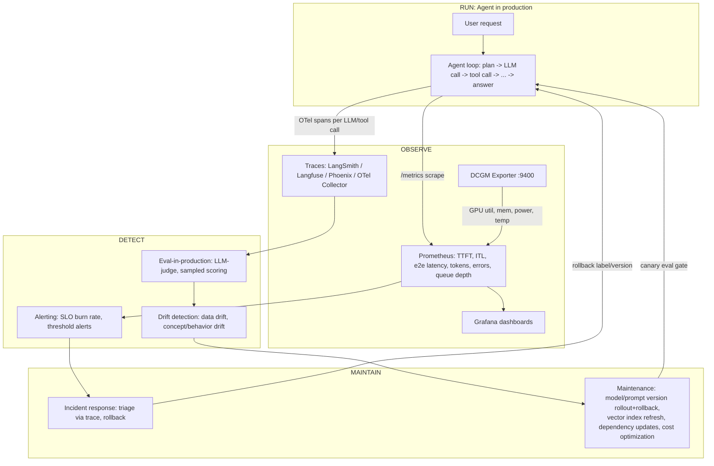
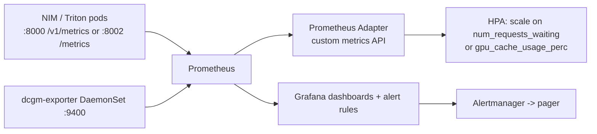

# Domain 8: Run, Monitor, and Maintain (5%)

## 1. Why this matters (exam + real agents)

Agentic systems fail differently from normal microservices: a request can "succeed" (HTTP 200, low latency) while the agent silently loops, picks the wrong tool, burns 50x the expected tokens, or hallucinates — so Day-2 operations require *semantic* observability (traces of the agent's trajectory, eval-in-production, drift detection) layered on top of classic infra observability (Prometheus/Grafana, DCGM GPU metrics, SLOs, alerting). The exam gives this domain only ~5% (≈3–4 of 60–70 questions), but the questions are scenario-style best-choice questions: "agent quality dropped, what do you check first?", "which metric do you autoscale on?", "how do you roll back a prompt?". If you internalize the three layers — **observe (traces/metrics) → detect (drift/evals/alerts) → maintain (versioned rollouts/rollbacks/refreshes)** — every question in this domain becomes mechanical.

## 2. Mental model

**Analogy: an airline operations center.** Each agent run is a *flight*: the **trace** is the flight recorder (every leg = a span: LLM call, tool call, retrieval). **Metrics dashboards** are the radar wall (latency = flight time, queue depth = planes circling, GPU utilization = runway usage, token cost = fuel burn). **Drift detection and canary evals** are routine maintenance inspections — the plane still flies (no errors!), but inspectors catch metal fatigue (quality degradation) before a crash. **SLOs and error budgets** are the on-time-arrival contract with passengers; **incident response** is the emergency checklist; and **maintenance** (model/prompt version rollouts, vector index refreshes) is the scheduled fleet overhaul — always done one plane at a time (canary), never the entire fleet at once, and always with a way to bring back the old plane (rollback).



## 3. Core concepts

### 3.1 Observability for agents: tracing trajectories

**What:** A *trace* captures one full agent run (the trajectory); it is a tree of *spans*, where each span is one timed operation — an LLM call, a tool/function call, a retrieval, a guardrail check, a sub-agent invocation. **Why:** logs alone can't reconstruct *why* an agent chose tool B over tool A or where 40 s of latency went; the span tree shows the causal path. **How:** instrument the agent framework (manually or via auto-instrumentation), emit spans with attributes (model name, prompt, tokens in/out, tool args, errors), export via OTLP to a backend.

**OpenTelemetry (OTel)** is the vendor-neutral standard. Its **GenAI semantic conventions** define standard span attributes:

| Attribute | Meaning |
|---|---|
| `gen_ai.operation.name` | operation type, e.g. `chat`, `execute_tool`, `invoke_agent` |
| `gen_ai.request.model` | requested model |
| `gen_ai.usage.input_tokens` / `gen_ai.usage.output_tokens` | token counts per call |
| `gen_ai.response.finish_reasons` | why generation stopped (stop, length, tool_calls) |
| Span name convention | `{gen_ai.operation.name} {gen_ai.request.model}`, e.g. `chat gpt-oss-120b` |

Tool executions get their own `execute_tool` spans nested under the agent span — this is exactly "spans for tool calls and LLM calls" from the blueprint.

**Tracing platforms (know the one-liners):**

| Platform | Type | Notes |
|---|---|---|
| **OpenTelemetry + OTel Collector** | open standard | vendor-neutral pipeline; collector receives OTLP spans and fans out to any backend |
| **LangSmith** | commercial (LangChain) | deepest LangChain/LangGraph integration; traces + datasets + evals + prompt hub |
| **Langfuse** | open source (self-hostable) | tracing + prompt management (versions/labels) + evals + cost tracking |
| **Phoenix (Arize)** | open source | OTel-native (OpenInference conventions); local-first debugging UI, default `localhost:6006`; Arize AX is the enterprise SaaS |
| **W&B Weave, Galileo, Dynatrace, Patronus** | various | all supported as exporters by NVIDIA's NeMo Agent Toolkit |

**Logging intermediate steps:** beyond spans, agents should log each intermediate step (thought/plan, chosen tool, tool input/output, retries) as structured events. NeMo Agent Toolkit does this with an `IntermediateStepManager` that publishes `IntermediateStep` events to a reactive stream which exporters subscribe to — meaning observability is event-driven and framework-agnostic. Always **redact PII/secrets** before export (NAT has redaction processors for this).

**Where redaction runs (exam-tested):** NAT redaction processors operate at the **OTel exporter level — *before* telemetry leaves the process** — so every downstream backend (Phoenix, Langfuse, Weave, an OTLP collector) receives already-clean data. You configure regex patterns (SSN, email, phone, credit-card) and/or field-level rules (always strip `tool.input.password`); the processor rewrites matching span attributes. Two things the exam leans on: (1) redaction is **irreversible** — over-redact and you destroy the debugging signal (redact the SSN, *keep* the query topic/intent), so it is **defense-in-depth, not a substitute for access controls** on the trace store; (2) it is **not** done at the LLM-prompt level or at the dashboard — it is at the exporter, which is why "configure redaction in the Grafana panel" or "filter PII when displaying traces" are distractor answers.

*Tiny example (regex redaction processor, conceptually):* on each finishing span, for sensitive attributes (`input.value`, `llm.input_messages`, `retrieval.documents`), substitute `\b\d{3}-\d{2}-\d{4}\b → [SSN_REDACTED]` and the email pattern → `[EMAIL_REDACTED]`, then mark `<attr>.redacted = true`. A query like *"My SSN is 123-45-6789"* must show as `[SSN_REDACTED]` in Phoenix while the surrounding question text survives.

*Tiny example:* a support agent answers in 12 s. The trace shows: root span 12 s → `chat llama-3.3-70b` 1.2 s → `execute_tool search_orders` **9.4 s** → `chat llama-3.3-70b` 1.1 s. Verdict: the tool's downstream API is slow, not the LLM. Without spans you'd have blamed the model.

### 3.2 Monitoring metrics: the numbers wall

**Latency metrics (LLM-specific — memorize these):**

| Metric | Definition | What it reflects |
|---|---|---|
| **TTFT** (time to first token) | request sent → first output token | prefill phase; perceived responsiveness in streaming UIs |
| **ITL / TPOT** (inter-token latency) | average gap between tokens after the first | decode phase; streaming smoothness |
| **e2e request latency** | request sent → last token | total user wait; for agents = sum over all LLM+tool hops |
| **TPS** (tokens/sec) | total tokens generated ÷ time | system throughput |
| **RPS** (requests/sec) | completed requests per second | request throughput |

Approximation: `e2e ≈ TTFT + ITL × (output_tokens − 1)`. NVIDIA **GenAI-Perf** (ships with the Triton client tooling) is the benchmark tool that measures TTFT/ITL/TPS/RPS against any OpenAI-compatible endpoint (NIM, Triton, vLLM).

**Token usage and cost:** track input/output tokens *per span* and aggregate per request/user/feature. Agents are multiplied-cost systems: one user request may trigger 5–20 LLM calls. A runaway loop shows up as a token-per-request spike before it shows up anywhere else. Tracing platforms (Langfuse, LangSmith) compute cost per trace from token counts × model price.

**Error rates:** layered — HTTP 5xx and timeouts (infra), tool-call failures and malformed tool args (agent layer), guardrail blocks/refusals, and *semantic* failures (wrong answer — only visible via evals). Track each separately.

**GPU utilization — DCGM exporter stack (exam favorite):**
- **DCGM** (Data Center GPU Manager) = NVIDIA's GPU monitoring/management toolkit.
- **dcgm-exporter** = exposes DCGM fields as Prometheus metrics on **port 9400** at `/metrics`; deployed as a Kubernetes **DaemonSet**, usually installed automatically by the **NVIDIA GPU Operator**.
- Key metric names: `DCGM_FI_DEV_GPU_UTIL` (GPU utilization %), `DCGM_FI_DEV_FB_USED`/`FB_FREE` (framebuffer memory), `DCGM_FI_DEV_POWER_USAGE`, `DCGM_FI_DEV_GPU_TEMP`, `DCGM_FI_DEV_SM_CLOCK`, `DCGM_FI_PROF_PIPE_TENSOR_ACTIVE` (tensor-core activity), `DCGM_FI_DEV_XID_ERRORS` (hardware errors).
- Which metrics are collected is configured via a **CSV file** (`/etc/dcgm-exporter/default-counters.csv`, override with `-f`).
- **Prometheus** scrapes it; **Grafana** visualizes it (official dashboard ID **12239**).
- Subtlety: `DCGM_FI_DEV_GPU_UTIL` high ≠ efficient — it means "some kernel was resident," not "tensor cores busy." For real efficiency look at `DCGM_FI_PROF_*` (SM activity, tensor active) metrics.

**Throughput and queue depth:** inference servers expose these natively.
- **Triton Inference Server**: Prometheus metrics on **port 8002** (`/metrics`), e.g. `nv_inference_request_success/_failure`, `nv_inference_count`, and `nv_inference_queue_duration_us` (time requests wait before batching — *the* signal for dynamic-batching tuning and saturation).
- **NIM for LLMs** (vLLM-derived metrics at `/v1/metrics`): `num_requests_running` (in-flight concurrency), `num_requests_waiting` (**queue depth**), `gpu_cache_usage_perc` (**KV-cache utilization**), TTFT and e2e latency histograms, token counters.
  - *On the wire (currency note):* NIM **passes vLLM's metrics through unmodified**, so the real Prometheus names carry a **`vllm:` prefix** — `vllm:num_requests_waiting`, `vllm:gpu_cache_usage_perc`, `vllm:num_requests_running`. In the newer **vLLM v1 engine the KV-cache gauge was renamed `vllm:gpu_cache_usage_perc` → `vllm:kv_cache_usage_perc`**. Check your NIM build's actual `/metrics` output before hard-coding metric names in PromQL / HPA / Prometheus Adapter rules. (Throughout these notes the names are shown unprefixed for readability; the conceptual answer the exam wants — "scale on queue depth / KV-cache, not CPU" — is unchanged.)
- Rising queue depth with flat GPU util = capacity exhausted → scale out. This is why **HPA/KEDA autoscaling for LLM services keys on queue depth or KV-cache usage via Prometheus Adapter, not CPU/memory** (CPU is meaningless for a GPU-bound service).

**Health probes (liveness vs. readiness — don't confuse with metrics):** separate from `/metrics`, serving containers expose *health* endpoints that Kubernetes wires to **liveness** and **readiness** probes. **Liveness** = "is the process alive?" (fail → K8s **restarts** the pod); **readiness** = "is the model loaded and ready to serve?" (fail → K8s **removes the pod from the Service load-balancer** but does *not* restart it). For a NIM/Triton pod that takes minutes to load weights, you also want a **startupProbe** so a slow cold start isn't mistaken for a liveness failure and killed in a crash-loop.
- **NIM for LLMs**: `/v1/health/live` (liveness, no backend dependency) and `/v1/health/ready` (readiness — model loaded and serving), HTTP 200 when healthy, on the service port (default 8000).
- **Triton**: `/v2/health/live` and `/v2/health/ready` (with `--strict-readiness`, "ready" only once all selected models are loaded) on the HTTP port (default 8000).
- Exam framing: a pod flapping in/out of the load balancer with no restarts → **readiness** probe failing; a pod stuck in a restart crash-loop → **liveness** probe (or startup) failing. Health probes are a *pull* check by the kubelet, distinct from Prometheus scraping `/metrics`.



### 3.3 Drift: when nothing errors but quality decays

| Drift type | What changes | Example | How to detect |
|---|---|---|---|
| **Data drift** (input/covariate) | distribution of *inputs* | new product launches → users ask about features the RAG corpus lacks; new language mix | statistical distance on **prompt-embedding distributions** (e.g., PSI/KL between reference and live windows); topic clustering of queries |
| **Concept drift** | relationship between input and *correct output* | "current tax rules" change; correct answer last month is wrong now | inputs look the same, so embedding stats stay flat — must monitor **output quality**: eval scores, user feedback, business KPIs |
| **Behavior drift** (agent/model) | the *system* changes | upstream API model silently updated; prompt edit; tool API change; degradation over long multi-turn sessions | regression eval suite on a fixed golden dataset; tool-choice distribution and trajectory-length monitoring; refusal/retry rates |

Key distinction the exam tests: **data drift = inputs changed; concept drift = the right answer changed (inputs may look identical); behavior drift = your agent/model changed.** Embedding-distance monitoring catches the first; only output evals/feedback catch the second and third.

**Eval-in-production (online evaluation):** since you have no ground-truth labels live, you sample real traffic and score it continuously — LLM-as-judge on correctness/groundedness/tone, heuristics (format compliance, citation presence), and implicit/explicit user feedback (thumbs, edits, task completion). Run it as a *continuous control loop*, not a one-off pre-launch snapshot. Trend the scores; alert on regression.

**Canary evals / canary deployment:** before fully shipping a new model, prompt, or agent version: (1) run the **offline regression eval** on a golden dataset as a gate; (2) route a small slice of live traffic (commonly 1–5%, as low as 0.1% for high-stakes) to the candidate; (3) compare canary vs. baseline on latency, cost, error rate, and judge scores; (4) progressively ramp (1% → 5% → 20% → 50% → 100%) or auto-rollback if metrics breach bounds. **Shadow mode** is the zero-risk variant: candidate processes copies of real traffic but its answers are never shown to users — great for evaluation, but it doubles inference cost and gets no user feedback.

### 3.4 Alerting, SLOs/SLIs, dashboards, incident response

- **SLI** = the measured indicator (e.g., fraction of requests with TTFT < 2 s; fraction of non-5xx responses; fraction of judged-correct sampled answers).
- **SLO** = target for the SLI over a window (e.g., "99.5% of requests succeed over 28 days"; "p95 e2e latency < 15 s").
- **Error budget** = `100% − SLO` (99.5% SLO → 0.5% budget). **Burn rate** = how fast you consume it; burn rate 1 = budget exactly exhausted at window end. **Burn-rate alerts** (e.g., fast-burn 14.4x over 1 h pages, slow-burn 6x over 6 h tickets) beat naive threshold alerts because they alert on *user-impacting trends*, not single spikes.
  - *Where `14.4×` comes from (so it isn't a magic number):* a 1 h window is `1/720` of a 30-day budget window, so burn-rate `1×` spends exactly `1/720` of the budget in that hour. The standard Google-SRE page threshold fires when you would burn **2% of the entire month's budget in 1 h**: `0.02 × 720 = 14.4×` (≈ the whole budget gone in ~2 days). The slow-burn `6×`/6 h pair catches a grinding leak the fast window misses; the dual 1 h + 5 m windows in the alert rule just confirm the fast burn is happening *right now* and suppress flaps.
- **Agent-specific twist:** agents need *multiple parallel SLOs* — availability, latency, cost-per-request, **and a quality SLO** (e.g., ≥ 92% of sampled responses pass the LLM-judge). Your latency budget can burn while your quality budget is healthy, and vice versa.
- **Alert routing & severity:** Prometheus alert rules fire into **Alertmanager**, which deduplicates, groups, silences, and routes by severity — *page* (fast-burn, user-impacting now) vs. *ticket* (slow-burn, fix this week). Every page must be **actionable with a linked runbook**; non-actionable alerts cause alert fatigue and are the classic anti-pattern answer.
- **Dashboards (Grafana):** layered — (1) infra: GPU util/memory/temp (DCGM), node health; (2) serving: TTFT/ITL/e2e percentiles, RPS, queue depth, KV-cache %, error rate; (3) agent/business: tokens & cost per request, tool-failure rate, trajectory length, eval scores, feedback rate.
- **Incident response flow for agents:** alert fires → check dashboard (which layer is unhealthy?) → pull **traces** of failing requests to localize the span (LLM? tool? retrieval?) → mitigate fast with **rollback** (prompt label, model version, or deployment) → root-cause later → add the failing cases to the regression eval set so the same incident becomes a permanent test. Mitigation-first (rollback) beats debug-in-prod. Close the loop with a **blameless postmortem**: document trigger, detection gap, mitigation time (MTTD/MTTR), and update the **runbook** so the next on-call mitigates in minutes.

### 3.5 Maintenance: keeping the agent healthy over time

| Maintenance task | What/how | Key practice |
|---|---|---|
| **Model version updates** | new NIM container tag / new checkpoint behind same API | pin versions; never `latest` in prod; gate with offline regression evals; blue-green or canary rollout; keep N−1 warm for instant rollback |
| **Prompt version rollouts/rollbacks** | prompts managed *outside code* in a registry (e.g., Langfuse: immutable **versions** + movable **labels** like `production`) | deploy = move `production` label to new version; rollback = move label back (no code redeploy); SDK caching means a few stale traces right after a switch |
| **Vector index refreshes** | re-ingest changed docs, re-embed, rebuild/upsert index | scheduled or event-driven incremental upserts; **changing the embedding model forces a full re-embed of the entire corpus** (old and new vectors aren't comparable); rebuild side-by-side, validate retrieval recall on a golden query set, then atomically swap the alias/collection |
| **Dependency updates** | framework libs, tool/MCP API schemas, guardrail configs, CUDA/driver stack | treat *everything* the agent depends on as versioned config; run the eval suite on every dependency bump — a tool's API response-shape change is a classic silent agent-breaker |
| **Cost optimization over time** | track cost/request trend; cache (semantic cache, KV-cache reuse); trim context; route easy queries to small models; distill | NVIDIA's answer = **Data Flywheel Blueprint**: continuously use logged production traffic to fine-tune/distill smaller NIMs, auto-evaluate them against the production model, and promote when accuracy holds (NVIDIA cites up to **~98% inference-cost reduction** in its example while matching teacher accuracy) |

**Everything-is-versioned rule:** model, prompt, tools, RAG corpus/index, guardrails, agent code each have versions; a production "release" is a *pinned combination*, and any change to any element goes through the same eval-gate → canary → ramp → (rollback-ready) pipeline.

**A few more maintenance moves the exam expects:**

- **Config hot-reload (no restart).** Some config — notably **NeMo Guardrails** rail configs — can be updated *without restarting* the agent: mount the config from a Kubernetes **ConfigMap** as a volume and the running process picks up file changes. This makes a guardrail tweak a config change, not a redeploy — but it still must go through the eval gate (a rail change is a behavior change).
- **RAG index freshness as a *monitored metric*.** Stale indexes silently serve outdated answers (a flavor of concept drift). Don't just re-index on a schedule — **emit index-staleness as a metric** (e.g., age of the newest document in the index) and **alert** when it exceeds a threshold. Pair scheduled/event-driven incremental upserts with the staleness alarm.
- **The change-altitude ladder — tune prompt → change config → swap model → change architecture.** When quality drops, escalate in cost/risk order, *stopping at the cheapest fix that works*:
  1. **Prompt tuning** — first response: fast, cheap, reversible (and a *label move*, §3.5).
  2. **Configuration change** (guardrails, tool params, `top_k`, max-steps) — when the issue is **behavioral boundaries**, not raw LLM quality.
  3. **Model swap** — when the current model **fundamentally cannot** do the task (e.g., a reasoning-capability gap), gated by regression evals + canary.
  4. **Architecture change** — last resort: when the **agent type, memory strategy, or tool design** is wrong. Expensive and risky; never the first answer to "latency is high" or "tokens are high."
- **Guardrail recalibration after a model swap.** A model update changes output *style/distribution*, so rails tuned for the old model can start **false-positive-blocking** good answers — block rate jumping (e.g. 2% → 15%) right after a model change is almost always **false positives**, not a wave of attacks. Recalibrate the rails against the new model rather than assuming the inputs got worse.

### 3.6 Debugging agent failures from a trace — the five named failure modes

When an agent goes wrong it almost never raises a clean HTTP 5xx; you localize the fault by reading the span tree. The exam tests a fixed taxonomy of failure shapes — learn the *trace signature* of each, not just the name:

| Failure mode | Trace signature (what you see) | Likely cause | Fix |
|---|---|---|---|
| **LLM timeout** | an LLM/`chat` span whose duration ≈ the timeout, ending with an **error status** (or no end time recorded) | NIM overloaded / queued, input too long, network blip | shorter per-call timeout + retries with backoff (not one huge 120 s timeout); reduce context; add NIM replicas / scale on queue depth |
| **Tool failure** | a `execute_tool` span with **error status**; read `error.message` / `error.type`; may show `retry_count` | API rate-limit, auth expiry, bad/invalid args, downstream 500 | retry+backoff, refresh creds, validate tool args, circuit-break a flaky tool |
| **Infinite loop** | **repeated identical** tool or LLM spans (e.g. 12 consecutive same calls); trajectory length / step count explodes | bad plan, ambiguous instructions, tool returns same unhelpful result | enforce a **max-steps / recursion limit** in the workflow config; tighten agent instructions; detect repeated-state |
| **Context overflow** | an LLM span failing with a **token-limit / max-context error** | accumulated history + RAG chunks + tool outputs exceed the model's context window | summarize/compress history, sliding window, cap RAG `top_k`, trim tool outputs |
| **Guardrail false positive** | a guardrail span with **blocked** status on a *legitimate* answer; the correlated Guardrails sub-trace shows which rail fired | rail calibrated for a different model/output style; threshold too tight | tune the rail / Colang flow, add exceptions, recalibrate after any model swap (see §3.5 / trap 14) |

**The single most testable signature: repeated identical spans = loop.** "An agent trace shows 12 consecutive identical tool calls — what is it?" → infinite loop; mitigation = a step limit, *not* a bigger timeout.

**`nat_test_llm` — deterministic replay debugging (NVIDIA-specific).** NAT ships a test/CI LLM *provider* (`_type: nat_test_llm`) that returns a fixed, scripted sequence of responses instead of calling a real model — configured with `response_seq` (the ordered list of canned replies) and `delay_ms` (to simulate latency). Swap it in for the real LLM to **reproduce an exact failure trajectory deterministically and for free** (no token cost, no non-determinism) — the standard way to turn a flaky production trace into a repeatable regression test. It is explicitly **not for production**. Pair it with the **NAT profiler** (framework-level latency/token breakdown per tool/agent) to separate "the model is slow" from "our serialization/event-loop overhead is slow."

*Example — scripting a loop bug for a regression test:*
```yaml
llms:
  scripted:
    _type: nat_test_llm
    response_seq:                 # agent will "think" these in order, deterministically
      - "I should call search_orders"
      - "I should call search_orders"   # same plan again → reproduces the loop
      - "I should call search_orders"
    delay_ms: 0
```

### 3.7 NeMo Guardrails observability — correlating safety with the agent trace

Guardrail block/violation rate is a first-class production metric (§3.4), but guardrails also emit **their own OpenTelemetry traces**, and the exam tests *how you tie them back to the agent run*.

- **Enable it in `config.yml`** with a `tracing` block. Since NeMo Guardrails **v0.16.0** the default `span_format` is `opentelemetry` (GenAI semantic conventions; the old simple-dict format is `legacy` and deprecated). `enable_content_capture` controls whether prompts/outputs are recorded in spans (off by default — privacy). Adapters fan the spans out: `OpenTelemetry` (to an OTLP collector) and/or `FileSystem` (`.jsonl` traces for local debugging).
- **Library-instrumentation pattern (key exam point):** the NeMo Guardrails library depends only on the **OTel API** — the **host application configures the SDK** (TracerProvider, span processor, OTLP exporter). Because the host owns the tracer, the guardrail spans become **children of the currently-active parent span**: guardrail checks share the **same trace ID** as the NAT/agent workflow they run inside. That shared-trace-ID is exactly how a "blocked" guardrail span lines up under the agent run that triggered it.
- **What the spans capture:** which rails fired (input / dialog / output) and pass/fail, per-rail latency, LLM calls made *inside* self-check rails, and cache status. A blocked response shows the agent-side span as `blocked` and the Guardrails sub-trace shows *which* rail and *why*.

*Example — guardrails `config.yml` tracing block:*
```yaml
tracing:
  enabled: true
  span_format: opentelemetry      # default since v0.16.0 (GenAI semconv); legacy = deprecated
  enable_content_capture: false   # keep prompts/outputs out of spans unless you need them
  adapters:
    - name: OpenTelemetry
      service_name: guardrails
      exporter: otlp              # share the host app's OTLP endpoint → same trace as the agent
    - name: FileSystem
      filepath: ./traces/traces.jsonl
```

**Anti-pattern (exam):** if the Guardrails tracer is configured *independently* of the host (its own TracerProvider) instead of via the host's SDK, guardrail spans land as **separate traces** and you can no longer tell which agent execution a given block belongs to. Fix = let the host app own the OTel SDK so context propagates (shared trace ID).

## 4. NVIDIA-specific layer

| NVIDIA product | Role in this domain |
|---|---|
| **NeMo Agent Toolkit (NAT)** (formerly Agent Intelligence Toolkit / AIQ; CLI `nat`, package `nvidia-nat`, v1.7) | The agent observability hub. Config-driven telemetry in the workflow YAML under `general.telemetry` with `logging` (console/file, levels DEBUG…CRITICAL) and `tracing` subsections; multiple exporters can run simultaneously. Built-in exporters: **Phoenix, Langfuse, LangSmith, W&B Weave, Galileo, Dynatrace, Patronus, Arize AX, OTel Collector (OTLP), file**, plus the Data Flywheel Blueprint. Event-driven `IntermediateStepManager` streams every LLM call, tool call, and intermediate step; processors handle batching, **redaction**, span tagging. Also includes a **profiler** that breaks down latency and token usage per tool/agent to find bottlenecks, and an **evaluation harness** for repeatable evals. Framework-agnostic (LangChain/LangGraph, CrewAI, Llama Index, Semantic Kernel...). |
| **DCGM + dcgm-exporter** | GPU telemetry → Prometheus (**:9400**, DaemonSet, installed by GPU Operator, CSV-configurable fields, Grafana dashboard 12239). The exam's canonical answer for "how do I monitor GPU utilization in Kubernetes." |
| **NVIDIA GPU Operator** | Installs/manages the GPU software stack on K8s (drivers, container toolkit, **dcgm-exporter**, device plugin) — the recommended way to get GPU monitoring rather than deploying dcgm-exporter by hand. |
| **NIM (NVIDIA Inference Microservices)** | Each NIM exposes Prometheus metrics (vLLM-style: `num_requests_running`, `num_requests_waiting`, `gpu_cache_usage_perc`, TTFT/e2e histograms, token counters) and supports OTel tracing/metrics via env vars (`NIM_ENABLE_OTEL=1`, `OTEL_TRACES_EXPORTER=otlp`, `OTEL_METRICS_EXPORTER=otlp`, `OTEL_EXPORTER_OTLP_ENDPOINT`, `OTEL_SERVICE_NAME`). **NIM Operator** adds ServiceMonitors and HPA on these custom metrics. |
| **Triton Inference Server** | Metrics on **:8002/metrics** — `nv_inference_count`, success/failure counters, `nv_inference_queue_duration_us` for queue/batching health. Choose Triton metrics when serving non-LLM or multi-framework models; NIM metrics for packaged LLMs. |
| **GenAI-Perf** | NVIDIA's load-testing/benchmark CLI for LLM endpoints; reports TTFT, ITL, TPS, RPS. Use it to establish the latency/throughput baselines your SLOs and capacity plans are built on. |
| **Data Flywheel Blueprint (build.nvidia.com)** | Production-traffic-driven continuous improvement: logs traffic (Elasticsearch), curates datasets, runs **NeMo Customizer** (LoRA fine-tune/distill) and **NeMo Evaluator** on candidate NIMs, and surfaces cheaper models that match accuracy — NVIDIA's flagship answer to "cost optimization over time" and "eval-in-production." |
| **NeMo Evaluator (microservice)** | API-driven evaluation jobs (academic benchmarks + LLM-as-judge + custom datasets) — the gate for model/prompt rollouts in NVIDIA's stack. |
| **NeMo Guardrails** | Operationally relevant because guardrail block/violation rates are a monitored production metric and guardrail configs are versioned artifacts that roll out/back like prompts. **Emits its own OTel traces** (config `tracing.enabled: true`, `span_format: opentelemetry` default since **v0.16.0**, adapters `OpenTelemetry`/`FileSystem`); via the **library-instrumentation pattern** the host app owns the OTel SDK so guardrail spans share the agent's **trace ID** (which rail fired, pass/fail, per-rail latency). Rail configs **hot-reload** from a ConfigMap; recalibrate rails after any model swap to avoid false-positive blocks. |
| **`nat_test_llm` + NAT profiler** | Day-2 *debugging* tooling. `nat_test_llm` (`_type: nat_test_llm`, `response_seq`, `delay_ms`) is a test/CI LLM provider returning scripted responses for **deterministic replay** of a captured failure trajectory — turn a flaky prod trace into a repeatable regression test at zero token cost (not for production). The **profiler** breaks down latency/token usage per tool/agent to separate model slowness from framework overhead. |

**When NVIDIA vs. generic:** GPU-level monitoring → always DCGM stack (there is no generic alternative with that fidelity). Agent tracing → NAT if you want config-driven multi-exporter telemetry across frameworks; plain OTel SDK or LangSmith/Langfuse if you're committed to one framework/vendor. Continuous cost optimization with fine-tuning → Data Flywheel; if you only need prompt/routing tweaks, lighter generic tooling suffices.

## 5. Decision frameworks

**Which observability tool?**

| Situation | Choose | Why |
|---|---|---|
| Vendor-neutral, multi-backend, future-proof tracing | OpenTelemetry (+ Collector) | open standard, GenAI semconv, fan-out to any backend |
| Deep LangChain/LangGraph workflow, managed SaaS, datasets+evals together | LangSmith | first-party integration |
| Self-hosted/open-source tracing **plus prompt version management** | Langfuse | OSS, prompt labels for rollout/rollback |
| Local-first, free, OTel-native debugging of traces/embeddings | Phoenix (Arize) | runs locally on :6006, OpenInference |
| NVIDIA-stack agent across mixed frameworks, one YAML for many exporters | NeMo Agent Toolkit telemetry | config-driven, simultaneous exporters, profiler included |

**Which metric for which question?**

| Symptom / goal | Metric to look at |
|---|---|
| Streaming chat feels sluggish to start | **TTFT** (prefill) |
| Tokens visibly stutter mid-answer | **ITL** (decode) |
| Batch/offline pipeline cost-efficiency | TPS / total throughput, GPU util |
| Decide when to **scale out** an LLM service | `num_requests_waiting` (queue depth), `gpu_cache_usage_perc` — NOT CPU/memory |
| Is the GPU the bottleneck? | `DCGM_FI_DEV_GPU_UTIL` + `DCGM_FI_PROF_PIPE_TENSOR_ACTIVE` + FB memory |
| Runaway agent loops / cost spike | tokens-per-request, LLM-calls-per-request from traces |
| Dynamic batching tuned right? (Triton) | `nv_inference_queue_duration_us` |

**Which detection method for which drift?**

| Signal | Method |
|---|---|
| Input topics/language changing | embedding-distribution distance on prompts (data drift) |
| Same inputs, answers now "wrong" | online evals + user feedback + KPI trend (concept drift) |
| After any model/prompt/tool change | golden-set regression evals + canary comparison (behavior drift) |

**Rollout strategy chooser:**

| Constraint | Strategy |
|---|---|
| Zero user exposure allowed during test | **Shadow/mirror mode** (costly: duplicate inference; no user feedback) |
| Limit blast radius, learn from real users | **Canary** 1–5% with auto-rollback gates |
| Instant all-or-nothing switch + instant rollback | **Blue-green** (2x capacity needed during switch) |
| Compare two variants on a business KPI | **A/B test** (needs stats horsepower + traffic) |
| Prompt-only change | move prompt-registry **label**; no redeploy at all |

## 6. Exam traps & gotchas

1. **GPU utilization ≠ efficiency.** `DCGM_FI_DEV_GPU_UTIL` only says a kernel was resident; a memory-bound decode can show 95% "util" with idle tensor cores. Profiling-class metrics (`DCGM_FI_PROF_*`) or throughput-per-GPU tell the real story.
2. **Autoscaling LLM/NIM services on CPU or memory is wrong.** Inference is GPU-bound; the exam answer is custom metrics via Prometheus Adapter — queue depth (`num_requests_waiting`) or KV-cache (`gpu_cache_usage_perc`).
3. **TTFT vs. ITL vs. e2e confusion.** TTFT = prefill/responsiveness; ITL = decode/streaming smoothness; e2e = total. "Users complain the answer takes long to *start*" → TTFT, not e2e or throughput.
4. **Data drift vs. concept drift.** If prompt-embedding distributions are *unchanged* but quality fell, it's concept (or behavior) drift — input-distribution monitors will never catch it; you need output evals/feedback.
5. **Metrics ≠ traces ≠ evals.** Latency/error dashboards can be all-green while the agent answers wrongly. "All metrics normal but answers are bad — what's missing?" → eval-in-production / trace-level quality scoring, not more Prometheus.
6. **Prompt rollback does not require redeploying code.** With prompt management (Langfuse-style versions+labels), rollback = repoint the `production` label. If an answer option says "rebuild and redeploy the container to restore the old prompt," it's the distractor. (Watch the sub-trap: SDK prompt *caching* means a brief tail of old-version traces after switching.)
7. **Changing the embedding model silently breaks RAG.** New query embeddings vs. an index built with the old model = garbage similarity scores. Correct: full re-embed + rebuild side-by-side, validate retrieval, atomic swap — not "just refresh new documents."
8. **Shadow deployment ≠ canary.** Shadow serves *no* users (zero risk, double cost, no user feedback); canary serves a *small %* of users (small real risk, real feedback). The exam swaps these definitions.
9. **Port/endpoint trivia mix-ups.** dcgm-exporter = **9400**; Triton metrics = **8002**; NIM metrics at `/v1/metrics` on the service port (default 8000); Phoenix UI defaults to **6006**. Don't confuse *metrics* endpoints with *health* endpoints: NIM `/v1/health/live` + `/v1/health/ready`, Triton `/v2/health/live` + `/v2/health/ready` (consumed by K8s liveness/readiness probes, not Prometheus). Also: Prometheus *scrapes* (pull model) — Triton/NIM never push metrics.
10. **SLO math.** 99.5% SLO ⇒ 0.5% error budget over the window. Burn rate > 1 = budget exhausted *early*. Burn-rate alerting (fast + slow windows) is preferred over single static thresholds — alerting on every p99 blip is the distractor answer.
11. **An agent retry/`finish_reason: length`/tool-error is not always an HTTP error.** Error-rate SLIs based only on 5xx undercount agent failures; tool-call failure rate and refusal rate are separate SLIs.
12. **"Eval once before launch" is never the right answer.** Production agents need *continuous* evals (sampled judge scoring, canary evals on every change) because models, data, and user behavior all drift.
13. **Redaction lives at the OTel *exporter*, before telemetry leaves the process — and it's irreversible.** Not at the prompt, not at the dashboard. So "filter PII when the trace is displayed" / "configure redaction in Grafana" are distractors, and "redaction replaces access controls on the trace store" is false (it's defense-in-depth; combine with RBAC). Over-redacting (stripping all input) destroys debuggability — keep query topic/intent, drop the SSN.
14. **Guardrail block-rate spike right after a model swap = false positives, not an attack.** A new model's output style trips rails calibrated for the old one. Recalibrate the rails; don't conclude "users got more malicious." (Contrast: a block-rate spike with no deploy *and* concentrated on one source can be a real targeted attack.)
15. **Guardrails traces must share the agent's trace ID (context propagation).** Let the **host app own the OTel SDK** so NeMo Guardrails (which depends only on the OTel API) emits its spans as children of the active agent span. If guardrails get their own TracerProvider, their spans become *separate* traces and you can't correlate a block to the run that caused it. Timestamp-matching is the distractor; shared trace ID is the answer.
16. **Repeated identical spans = infinite loop; the fix is a max-steps limit, not a longer timeout.** A token-limit error inside an LLM span = context overflow (fix: summarize/trim, cap `top_k`), not a loop. Don't confuse the two trace signatures.

## 7. Scenario drills

1. **Q:** A LangGraph customer-support agent's p95 latency jumped from 8 s to 40 s overnight. Dashboards show normal GPU util and error rates. What's the fastest way to find the cause?
   **A:** Pull distributed traces (OTel/Langfuse/Phoenix) of slow requests and compare span durations — the span tree will localize whether an LLM call, a specific tool's downstream API, or extra loop iterations added the time; aggregate metrics can't attribute latency inside a trajectory.

2. **Q:** You must autoscale a NIM LLM microservice on Kubernetes. Which signal should drive the HPA?
   **A:** A custom Prometheus metric like `num_requests_waiting` (queue depth) or `gpu_cache_usage_perc` exposed via Prometheus Adapter — CPU/memory HPA signals don't reflect GPU-bound inference load.

3. **Q:** Three weeks after launch, embedding-distribution monitoring on incoming prompts shows no shift, yet the LLM-judge pass rate on sampled production answers fell from 93% to 81%. What's happening and what do you check?
   **A:** Concept/behavior drift, not data drift — inputs are stable but correct outputs changed (or a dependency changed); check recent model/prompt/tool/corpus versions and refresh the knowledge source, guided by failing eval cases.

4. **Q:** A new system prompt looks better in offline evals. The safest production rollout?
   **A:** Publish it as a new immutable prompt version, canary it on ~1–5% of traffic with automated comparison (judge scores, latency, cost, error rate) against baseline, ramp gradually, and keep one-click rollback by re-pointing the `production` label.

5. **Q:** Finance reports agent inference cost doubled in a month with flat traffic. First diagnostic step? And NVIDIA's long-term lever?
   **A:** Inspect token-usage-per-request trends from traces to find the regression (longer contexts, retry storms, looping after a prompt/tool change); long-term, use the Data Flywheel Blueprint to distill/fine-tune smaller NIMs on production traffic and promote ones that match accuracy at far lower cost.

6. **Q:** You need GPU utilization, memory, and temperature for every GPU node of your agent cluster in Grafana. Which components?
   **A:** dcgm-exporter (DaemonSet, port 9400, typically installed by the GPU Operator) scraped by Prometheus, visualized with the NVIDIA DCGM Grafana dashboard (ID 12239) — DCGM is the NVIDIA-native GPU telemetry path.

7. **Q:** A NAT agent trace shows the same `execute_tool search_db` span twelve times in a row before the run ends. What failure mode is this and what's the fix?
   **A:** An **infinite loop** — repeated identical spans are its signature. Fix by enforcing a **max-steps / recursion limit** in the workflow config (and tightening the agent instructions). It is *not* a timeout (no error-status long span) and *not* context overflow (no token-limit error), so "increase the LLM timeout" and "enlarge the context window" are distractors.

8. **Q:** After swapping the LLM behind a NAT agent to a newer NIM, the NeMo Guardrails block rate jumped from 2% to 15%. What's the most likely cause and response?
   **A:** **False positives** — the new model's output style trips output rails calibrated for the old model; it is not a surge of harmful traffic. **Recalibrate the rails** (tune Colang flows / thresholds) against the new model, validated by reviewing a sample of blocked outputs. (Hot-reload the rail config via ConfigMap, then re-run the eval gate.)

9. **Q:** A "blocked" guardrail event needs to be matched to the exact agent run that triggered it, but your guardrail spans are showing up as their own separate traces. What's misconfigured?
   **A:** **Trace context propagation.** NeMo Guardrails depends only on the OTel API; the **host application must own the OTel SDK** (TracerProvider/exporter) so guardrail spans inherit the active parent context and share the **same trace ID** as the NAT workflow. A standalone Guardrails TracerProvider breaks correlation — fix by configuring the SDK once, in the host.

10. **Q:** You captured a flaky production failure in a trace and want a deterministic, zero-cost regression test that reproduces it in CI. What NAT feature do you use?
   **A:** The **`nat_test_llm`** provider — swap the real LLM for `_type: nat_test_llm` with a fixed `response_seq` (and optional `delay_ms`) so the exact trajectory replays deterministically with no token cost and no non-determinism. (Not for production.) Pair with the NAT profiler if you need to confirm the bottleneck is framework overhead vs. the model.

## 8. Builder's corner

- **Instrument from day one, via the standard.** Emit OTel spans with GenAI semantic-convention attributes (or turn on NAT's `general.telemetry` YAML) before launch — retrofitting tracing during an incident is miserable, and OTLP keeps you backend-portable (Phoenix locally today, Langfuse/Arize in prod tomorrow).
- **Put tokens-per-request and LLM-calls-per-request on your front dashboard.** They are the earliest leading indicators of loops, prompt regressions, and cost blowups — usually moving days before latency or error SLOs notice.
- **Make rollback a label, not a deploy.** Externalize prompts (and model endpoint choices) into a versioned registry with environment labels; your mean-time-to-mitigate drops from "CI pipeline" to "seconds." Pin every model/container version explicitly.
- **Turn incidents into evals.** Every production failure trace gets distilled into a golden-dataset case; the regression suite then gates all future model/prompt/dependency changes. This single habit compounds more than any tool choice.
- **Budget for observability cost itself.** Tracing every token of every request at scale is expensive — sample traces (keep 100% of errors/slow requests, sample successes), batch span exports, and redact payloads both for privacy and storage.

## 9. Sources

- NeMo Agent Toolkit — Observe Workflows: https://docs.nvidia.com/nemo/agent-toolkit/latest/run-workflows/observe/observe.html
- NeMo Agent Toolkit observe docs (GitHub, exporter list + YAML): https://github.com/NVIDIA/NeMo-Agent-Toolkit/blob/develop/docs/source/run-workflows/observe/observe.md
- NVIDIA NeMo Agent Toolkit repo: https://github.com/NVIDIA/NeMo-Agent-Toolkit
- NVIDIA dcgm-exporter (port 9400, CSV config, GPU Operator): https://github.com/NVIDIA/dcgm-exporter
- DCGM-Exporter docs: https://docs.nvidia.com/datacenter/dcgm/latest/gpu-telemetry/dcgm-exporter.html
- Grafana NVIDIA DCGM dashboard 12239: https://grafana.com/grafana/dashboards/12239-nvidia-dcgm-exporter-dashboard/
- NVIDIA blog — LLM Inference Benchmarking: Fundamental Concepts (TTFT/ITL/TPS/RPS): https://developer.nvidia.com/blog/llm-benchmarking-fundamental-concepts/
- NVIDIA NIM Benchmarking — Metrics: https://docs.nvidia.com/nim/benchmarking/llm/latest/metrics.html
- Observability for NVIDIA NIM for LLMs (OTel env vars, /v1/metrics): https://docs.nvidia.com/nim/large-language-models/latest/observability.html
- NVIDIA blog — Horizontal Autoscaling of NIM Microservices on Kubernetes: https://developer.nvidia.com/blog/horizontal-autoscaling-of-nvidia-nim-microservices-on-kubernetes/
- Triton Inference Server — Metrics (port 8002, queue duration): https://docs.nvidia.com/deeplearning/triton-inference-server/user-guide/docs/user_guide/metrics.html
- OpenTelemetry GenAI semantic conventions (spans): https://opentelemetry.io/docs/specs/semconv/gen-ai/gen-ai-spans/
- OpenTelemetry blog — GenAI observability: https://opentelemetry.io/blog/2026/genai-observability/
- Evidently — data drift vs concept drift: https://www.evidentlyai.com/ml-in-production/data-drift and https://www.evidentlyai.com/ml-in-production/concept-drift
- Shadow/canary/A-B rollouts for LLMs: https://tianpan.co/blog/2026-04-09-llm-gradual-rollout-shadow-canary-ab-testing
- Langfuse prompt version control (labels, rollback): https://langfuse.com/docs/prompt-management/features/prompt-version-control
- Grafana SLO docs (error budget, burn rate): https://grafana.com/docs/grafana-cloud/alerting-and-irm/slo/introduction/
- NVIDIA Data Flywheel Blueprint: https://build.nvidia.com/nvidia/build-an-enterprise-data-flywheel/blueprintcard and https://github.com/NVIDIA-AI-Blueprints/data-flywheel
- NVIDIA blog — Model distillation with Data Flywheel Blueprint (≈98% cost reduction example): https://developer.nvidia.com/blog/build-efficient-ai-agents-through-model-distillation-with-nvidias-data-flywheel-blueprint/
- NeMo Guardrails — Tracing / Observability (OTel span format v0.16.0, adapters, library-instrumentation): https://docs.nvidia.com/nemo/guardrails/latest/observability/index.html
- NeMo Agent Toolkit — LLMs (incl. `nat_test_llm` test provider, `response_seq`/`delay_ms`): https://docs.nvidia.com/nemo/agent-toolkit/latest/build-workflows/llms/index.html
- NeMo Agent Toolkit — Running Tests (`run_workflow`, pytest harness): https://docs.nvidia.com/nemo/agent-toolkit/latest/resources/running-tests.html
- FlashGenius NCP-AAI exam guide (domain weight context): https://flashgenius.net/blog-article/your-comprehensive-guide-to-the-nvidia-agentic-ai-llm-professional-certification-ncp-aai

## 10. Code Companion

**1) Langfuse tracing for a LangGraph agent — one callback handler, full span tree + cost per trace**

```python
import os
from langfuse.langchain import CallbackHandler   # SDK v3 import (older form: from langfuse.callback import CallbackHandler)
from langchain_nvidia_ai_endpoints import ChatNVIDIA

os.environ["LANGFUSE_PUBLIC_KEY"] = "pk-lf-..."
os.environ["LANGFUSE_SECRET_KEY"] = "sk-lf-..."
os.environ["LANGFUSE_BASE_URL"]  = "https://cloud.langfuse.com"  # or your self-hosted URL

llm = ChatNVIDIA(model="meta/llama-3.3-70b-instruct",            # build.nvidia.com hosted...
                 base_url="http://localhost:8000/v1")            # ...or a local NIM

langfuse_handler = CallbackHandler()  # v3: creds come from env vars, no args needed

# `graph` = any compiled LangGraph StateGraph; one invoke = one Langfuse trace
result = graph.invoke(
    {"messages": [("user", "Where is order 4711?")]},
    config={"callbacks": [langfuse_handler]},
)
```

What to notice: a single callback in `config` captures the *entire* trajectory — every LLM generation and tool call becomes a nested observation under one trace, and Langfuse multiplies the per-span token usage by model price to show **cost per trace** (the "runaway loop shows up in tokens first" metric from §3.2). No code change inside your nodes.

**2) Manual OTel span around a tool call — GenAI semconv attributes + OTLP export**

```python
# pip install opentelemetry-sdk opentelemetry-exporter-otlp-proto-http
from opentelemetry import trace
from opentelemetry.sdk.trace import TracerProvider
from opentelemetry.sdk.trace.export import BatchSpanProcessor
from opentelemetry.exporter.otlp.proto.http.trace_exporter import OTLPSpanExporter

provider = TracerProvider()
provider.add_span_processor(BatchSpanProcessor(
    OTLPSpanExporter(endpoint="http://localhost:4318/v1/traces")))  # OTel Collector / Phoenix
trace.set_tracer_provider(provider)
tracer = trace.get_tracer("support-agent")

with tracer.start_as_current_span("execute_tool search_orders") as span:  # name = "execute_tool {tool.name}"
    span.set_attribute("gen_ai.operation.name", "execute_tool")
    span.set_attribute("gen_ai.tool.name", "search_orders")
    span.set_attribute("gen_ai.tool.call.id", "call_8f2a")
    span.set_attribute("gen_ai.provider.name", "nvidia")  # older form was gen_ai.system (renamed in 2025 semconv)
    out = search_orders(order_id="4711")
    span.set_attribute("gen_ai.tool.call.result", str(out)[:512])  # truncate/redact payloads
```

What to notice: the span name convention (`execute_tool {gen_ai.tool.name}`; LLM calls use `{operation} {model}`) and the `gen_ai.*` attributes are exactly what the exam means by "spans for tool calls with standard semantic conventions" — any OTLP backend (Phoenix, Langfuse, Collector fan-out) understands them, which is the vendor-neutrality argument.

**3) LangSmith for LangGraph — tracing is literally environment variables**

```bash
export LANGSMITH_TRACING=true            # older form was LANGCHAIN_TRACING_V2=true
export LANGSMITH_API_KEY="lsv2_pt_..."
export LANGSMITH_PROJECT="support-agent-prod"   # optional; defaults to "default"
# then run your LangGraph app unchanged — every graph.invoke() is traced
python agent.py
```

What to notice: zero code change — LangGraph auto-instruments when the env vars are present, which is why LangSmith is the "deepest first-party integration" answer in the tool-chooser table (§5). Contrast with snippet 1 where Langfuse needs an explicit callback (or its OTel integration).

**4) NeMo Agent Toolkit: one YAML, two exporters at once (Phoenix + Langfuse)**

```yaml
general:
  telemetry:
    logging:
      console:
        _type: console
        level: WARN
    tracing:
      phoenix:                       # local debugging UI
        _type: phoenix
        endpoint: http://localhost:6006/v1/traces
        project: support_agent
      langfuse:                      # team backend, simultaneously
        _type: langfuse
        endpoint: https://cloud.langfuse.com/api/public/otel/v1/traces
        public_key: ${LANGFUSE_PUBLIC_KEY}
        secret_key: ${LANGFUSE_SECRET_KEY}
```

What to notice: multiple exporters under `tracing` run **simultaneously** — NAT's event-driven `IntermediateStepManager` publishes every LLM/tool step once and each exporter subscribes. This config-not-code approach is NVIDIA's flagship observability answer (§4), and it works regardless of whether the workflow underneath is LangGraph, CrewAI, or Llama Index.

**5) PromQL you would actually alert on (NIM `/v1/metrics` + DCGM :9400)**

```text
# KV-cache nearly full -> requests about to queue/preempt (NIM, vLLM-derived gauge 0-1)
avg by (model_name) (gpu_cache_usage_perc) > 0.90

# Queue depth sustained -> capacity exhausted, scale out (the HPA signal, NOT cpu/mem)
sum(num_requests_waiting) > 5            # with `for: 5m` in the alert rule

# p90 TTFT from the histogram -> user-perceived responsiveness regressing
histogram_quantile(0.90,
  sum by (le) (rate(time_to_first_token_seconds_bucket[5m]))) > 2

# Queue growing while GPUs idle -> serving-layer bug, not capacity (pair NIM + DCGM)
sum(num_requests_waiting) > 5 and avg(DCGM_FI_DEV_GPU_UTIL) < 30
```

What to notice: the first two are the canonical autoscaling signals from §3.2; `histogram_quantile` over `rate(..._bucket[5m])` is *the* PromQL idiom for latency percentiles; and the last query shows why you scrape NIM and dcgm-exporter into the same Prometheus — cross-layer queries localize the fault before you ever open a trace.

**6) Burn-rate alert + the rollback story: flip a Langfuse prompt label, no redeploy**

```yaml
# prometheus alert rule: fast-burn on a "TTFT < 2s for 99.5% of requests" SLO
groups:
- name: agent-slo
  rules:
  - alert: TTFTSLOFastBurn          # 14.4x burn over 1h AND 5m = page now
    expr: |
      (1 - sum(rate(time_to_first_token_seconds_bucket{le="2"}[1h]))
         / sum(rate(time_to_first_token_seconds_count[1h]))) > 14.4 * 0.005
      and
      (1 - sum(rate(time_to_first_token_seconds_bucket{le="2"}[5m]))
         / sum(rate(time_to_first_token_seconds_count[5m]))) > 14.4 * 0.005
    labels: { severity: page }
    annotations: { runbook: "https://wiki/runbooks/agent-rollback" }
```

```python
# the runbook's mitigation step — one API call, zero redeploys:
from langfuse import get_client
get_client().update_prompt(name="support-system-prompt", version=7,  # last known good
                           new_labels=["production"])  # label moves; clients fetching by label pick it up
```

What to notice: the dual-window (1h + 5m) burn-rate condition pages only when the error budget is burning fast *right now* — the anti-pattern answer is alerting on a single p99 blip (§3.4). The mitigation is exam trap #6 verbatim: rollback = re-point the `production` label; expect a brief tail of old-version traces due to SDK prompt caching.

**7) Tiny data-drift check: daily centroid vs baseline cosine distance**

```python
import os, numpy as np
from openai import OpenAI  # NVIDIA endpoints are OpenAI-compatible

emb = OpenAI(base_url="https://integrate.api.nvidia.com/v1", api_key=os.environ["NVIDIA_API_KEY"])

def centroid(texts: list[str]) -> np.ndarray:
    r = emb.embeddings.create(model="nvidia/nv-embedqa-e5-v5", input=texts,
                              extra_body={"input_type": "query", "truncate": "END"})
    v = np.array([d.embedding for d in r.data])
    v /= np.linalg.norm(v, axis=1, keepdims=True)          # normalize each vector
    return v.mean(axis=0)

baseline = np.load("baseline_centroid.npy")                 # built once from launch-week prompts
today = centroid(sample_todays_user_prompts(n=200))         # daily sample of live inputs
dist = 1 - float(baseline @ today) / (np.linalg.norm(baseline) * np.linalg.norm(today))
if dist > 0.15:                                             # threshold tuned on historical jitter
    page_oncall(f"Input drift: centroid cosine distance {dist:.3f} vs baseline")
```

What to notice: this catches **data drift only** — inputs moving to topics your corpus doesn't cover. If this stays flat while judge scores fall, that's concept/behavior drift (exam trap #4) and no amount of embedding monitoring will see it. Note the NV-EmbedQA `input_type` requirement via `extra_body` — asymmetric retrieval models embed queries and passages differently.

**8) Eval-in-production: nightly cron samples traces, LLM-judges them, writes scores back**

```python
# crontab: 0 6 * * *  python judge_sample.py   (sample N traces/day, score, push back)
import os, datetime
from langfuse import get_client
from openai import OpenAI

langfuse = get_client()                                     # reads LANGFUSE_* env vars
judge = OpenAI(base_url="https://integrate.api.nvidia.com/v1", api_key=os.environ["NVIDIA_API_KEY"])
JUDGE = "Question:\n{q}\n\nAnswer:\n{a}\n\nIs the answer correct, grounded, and on-tone? Reply PASS or FAIL, then one reason."

since = datetime.datetime.now() - datetime.timedelta(days=1)
for t in langfuse.api.trace.list(from_timestamp=since, limit=50).data:   # N=50/day sample
    verdict = judge.chat.completions.create(
        model="meta/llama-3.3-70b-instruct", temperature=0,
        messages=[{"role": "user", "content": JUDGE.format(q=t.input, a=t.output)}],
    ).choices[0].message.content
    langfuse.create_score(trace_id=t.id, name="llm_judge_pass",
                          value=1.0 if verdict.startswith("PASS") else 0.0, comment=verdict)
langfuse.flush()
```

What to notice: this is the continuous quality-SLO loop from §3.3/§3.4 — no ground truth in prod, so you sample, judge, and trend `llm_judge_pass` in the same UI as latency and cost; alert when the daily mean regresses. Scores attach to the *trace*, so a failing score links straight to the trajectory you need to debug, and failing cases feed the golden regression set.

**9) NeMo Guardrails tracing that shares the agent's trace ID — host owns the OTel SDK**

```python
# 1) HOST APP configures the OTel SDK once (Guardrails depends only on the OTel API).
from opentelemetry import trace
from opentelemetry.sdk.trace import TracerProvider
from opentelemetry.sdk.trace.export import BatchSpanProcessor
from opentelemetry.exporter.otlp.proto.grpc.trace_exporter import OTLPSpanExporter

provider = TracerProvider()
provider.add_span_processor(BatchSpanProcessor(
    OTLPSpanExporter(endpoint="http://localhost:4317", insecure=True)))  # same collector as the agent
trace.set_tracer_provider(provider)   # ← because the HOST sets this, guardrail spans inherit the
                                      #   active parent context → SAME trace ID as the NAT workflow
```

```yaml
# 2) guardrails config.yml — turn tracing on (v0.16.0+: opentelemetry span format is the default)
tracing:
  enabled: true
  span_format: opentelemetry        # GenAI semconv; legacy dict format is deprecated
  enable_content_capture: false     # don't put prompts/outputs in spans unless you must (privacy)
  adapters:
    - name: OpenTelemetry
      service_name: guardrails
      exporter: otlp
    - name: FileSystem
      filepath: ./traces/traces.jsonl   # local .jsonl for offline debugging
```

What to notice: the whole point is **context propagation via the host-owned SDK** — a blocked output rail then appears as a child span under the agent run that triggered it (shared trace ID), so you can answer "which execution did this block belong to?" If Guardrails set up *its own* TracerProvider, the spans would split into a separate trace (exam trap 15). `enable_content_capture: false` is the redaction-by-omission counterpart to §3.1's exporter-level redaction.

**10) Deterministic replay with `nat_test_llm` — reproduce a failure in CI, no tokens, no flakiness**

```yaml
# A NAT workflow config that swaps the real LLM for a scripted test provider.
llms:
  agent_llm:
    _type: nat_test_llm             # test/CI ONLY — never production
    response_seq:                   # exact, ordered responses the "model" will return
      - "Thought: I'll look up the order.\nAction: search_orders[4711]"
      - "Final Answer: Order 4711 ships tomorrow."
    delay_ms: 50                    # optionally simulate latency to exercise timeout handling

functions:
  search_orders:
    _type: my_search_orders_tool
workflow:
  _type: react_agent
  llm_name: agent_llm
```

What to notice: because the LLM output is **fixed**, the agent's trajectory is reproducible — feed it the response sequence pulled from a failing production trace and you get the *same* spans every run, which is what makes it a regression test rather than a coin flip. Combine with the NAT **profiler** to confirm whether remaining latency is the model (here, faked) or framework overhead. This is the NVIDIA-native answer to "how do I deterministically replay an agent failure" (the toolkit's `run_workflow` test helper drives such configs in pytest).

## 11. What top engineers are saying (2025-26)

1. **Shreya Shankar — sh-reya.com, "Data Flywheels for LLM Applications" (+ the *AI Evals for Engineers & PMs* course/book with Hamel Husain).** Her core take: production LLM systems need an *ongoing* flywheel — sample real outputs, label them cheaply, align an LLM-judge against those human labels (her "Who Validates the Validators?" research line), and feed results back into prompts and regression sets — rather than a one-time pre-launch eval. This is exactly the exam's "eval-in-production as a continuous control loop, never eval-once" doctrine, and snippet 8 above is a minimal implementation of her loop. https://www.sh-reya.com/blog/ai-engineering-flywheel/

2. **Hamel Husain — hamel.dev, "Frequently Asked Questions (And Answers) About AI Evals" (the evals FAQ).** Take: remove all friction from the process of looking at your data — error analysis on real traces beats generic dashboards and off-the-shelf metric suites; build custom annotation tools so you can read logs/traces fast, and keep reading until you stop learning new failure modes. For this domain it grounds why traces (not aggregate metrics) are the first stop in incident triage (scenario drill 1), and why every incident should mint new eval cases. https://hamel.dev/blog/posts/evals-faq/

3. **Charity Majors & Phillip Carter — Honeycomb blog, "Observability in the Age of AI."** Take: you cannot understand or improve an LLM feature in isolation — RAG is a tracing problem, LLM-as-router is a high-cardinality problem, agents are high-dimensionality — so "you can't have great observability for AI unless you start with great observability for the rest of your software," and aggregates with random exemplars are not enough; you need outlier inspection over full event chains. Maps directly to the layered dashboards + trace-first triage model in §3.4. https://www.honeycomb.io/blog/observability-age-of-ai

4. **OpenTelemetry GenAI SIG — otel blog, "AI Agent Observability: Evolving Standards and Best Practices" (Mar 2025).** Take: because GenAI observability tooling is fragmenting across vendors and frameworks, "it is important to establish standards around the shape of the telemetry generated by agent apps to avoid lock-in" — hence the `gen_ai.*` semconv push (including the 2025 `gen_ai.system` → `gen_ai.provider.name` rename) and agent-app conventions. Exam-relevant: this is the *why* behind OTel being the "vendor-neutral, future-proof" answer in the decision table, and why NIM/NAT both speak OTLP. https://opentelemetry.io/blog/2025/ai-agent-observability/ (follow-up deep dive: https://opentelemetry.io/blog/2026/genai-observability/)

5. **Greptime engineering blog — "Agent Observability: Can the Old Playbook Handle the New Game?" (Dec 2025).** Take: the classic three-pillars (metrics/logs/traces) playbook strains under agent workloads — trajectories are long, branching, high-cardinality and semantically judged — pushing the field toward wide events / "Observability 2.0" where one rich event per step carries everything needed for later slicing. Useful framing for why agent platforms (Langfuse observations, NAT IntermediateStep events) all converge on structured per-step events rather than flat logs. https://www.greptime.com/blogs/2025-12-11-agent-observability

6. **Softcery (practitioner agency) — "9 AI Observability Platforms Compared: Phoenix, LangSmith, Langfuse, Logfire..." (2025).** Take from the tooling-choice discourse: the decision is less about features (all do traces+evals now) and more about lock-in surface — LangSmith wins if you're committed to LangGraph, Langfuse if self-hosting/MIT-licensing and prompt management matter, Phoenix if you want OTel/OpenInference-native local-first debugging. Mirrors the §5 chooser table almost line for line — which is reassuring signal that the exam's framing matches field practice. https://softcery.com/lab/top-8-observability-platforms-for-ai-agents-in-2025

7. **Laminar — "Langfuse Alternatives 2026: 7 Top Picks for Agent Observability."** Take (representative of a 2026 discourse thread on observability *pricing economics*): unit-based pricing that counts traces + observations + scores "punishes" agentic workloads, because one agent run emits dozens of small spans — so observability cost itself becomes a production engineering concern, pushing teams to sample successes, keep 100% of errors, and batch exports. This validates the "budget for observability cost" point in Builder's corner §8 as a live practitioner debate, not a textbook footnote. https://laminar.sh/article/langfuse-alternatives-2026
